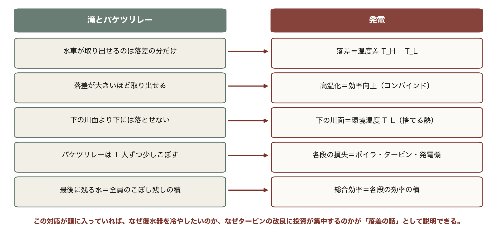
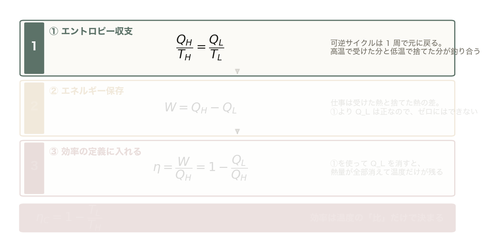
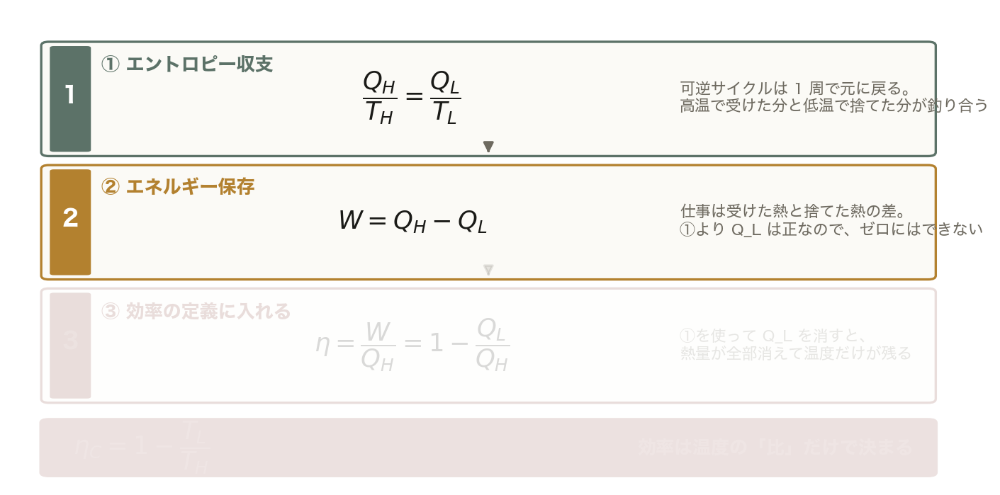
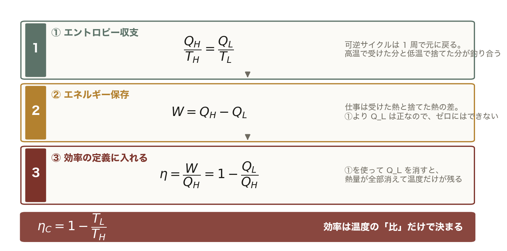
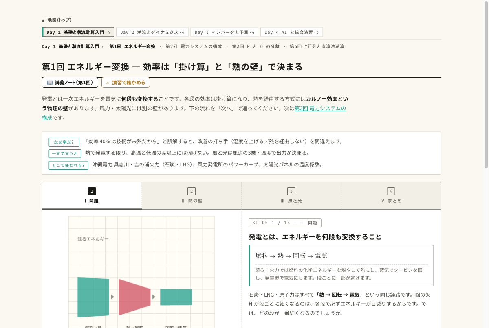
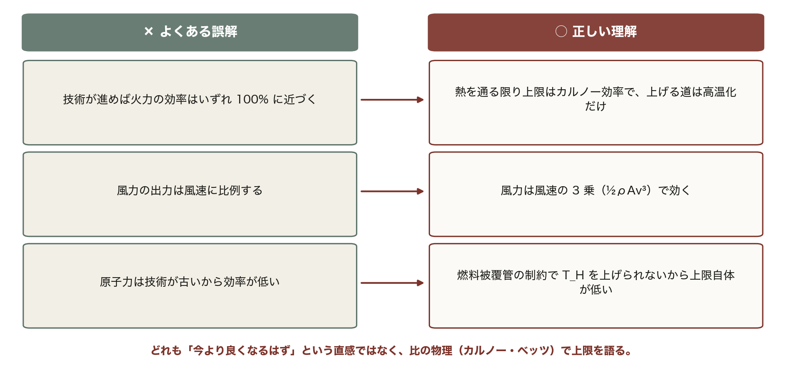

<!-- _class: title -->

# 第1回 エネルギー変換の基礎
## 電気は「作る」のではなく「変換する」— 効率の壁はどこにあるか
Day 1・コマ 1 ／ 教科書 第1章

<!-- note: 初回。目的は「発電を多段変換として見る目」と「上限は物理が決める」という感覚を持ち帰ってもらうこと。90 分で 4 章、例題 3 つ。 -->

---

<!-- _class: statement -->

発電とは多段のエネルギー変換であり、総合効率は各段の効率の積で決まる。熱を通る道には、技術では越えられない物理の壁がある。

<!-- note: この 1 文を最後にもう一度見せる。「積」と「壁」の 2 語がキーワード。 -->

---

<!-- _class: graphical-abstract -->

# この回の全体像

## 一枚で｜問い → 課題 → 道具 → 到達点

  問い
  なぜ火力発電は **40% 前後**で止まるのか。技術の限界か、物理の限界か。風力や太陽光にも同じ「壁」はあるのか。

  課題
  
  発電は 4 回の変換。効率は **積** で減り、熱→回転の段で半分以上を失う。

  道具
  
  η の積 → カルノー → ベッツ → バンドギャップ
  壁の式を ==導出== し、実機を上限と比べる。

  到達点
  6〜7割
  実機はどの方式も理論上限の 6〜7 割。上限を上げる道は「高温化」だけ、と数字で言える。

数値はすべて本資料の Python コード（コード/fig_ch01.py）で計算。T_L = 30 °C。

<!-- note: 聴衆に最初の 2 枚で全体像を渡す。右下の「6〜7 割」が今日の結論。 -->

---

<!-- _class: sections -->

# 現場で起きたこと — 効率 1% が国家予算になる

  2011年 東日本大震災の後
  原子力の停止で火力（LNG・石炭・石油）への依存が ==約9割== に上がり、燃料の輸入額が年に数兆円規模で増えた。発電効率 1 ポイントの差が、そのまま燃料費と CO₂ の差になる。

  沖縄本島の電源構成
  石炭・LNG・石油火力が中心で、他地域との連系線がない。燃料の調達と効率が電気料金に直結し、太陽光を増やすほど「回転機が減る」問題（第8回の慣性）が前に出てくる。

<!-- note: 今日の式 η_total = Π η_i と η_C = 1 − T_L/T_H で、この 2 つの話がどちらも読める。効率の話は「環境の話」である前に「お金の話」。 -->

---

<!-- _class: figure-full -->
<!-- source: コード/fig_ch01.py -->

# たとえ話 — 滝とバケツリレー

たとえ話が崩れる点も押さえておく。水は下流にそのまま残るが、捨てた熱は二度と仕事に戻らない（熱力学第二法則）。だから「熱を通る道」にだけ上限がある。

---

<!-- _class: agenda -->

# この回の地図

1. エネルギー保存則と第二法則 — 効率に上限がある理由
2. 発電方式を「変換の連鎖」として統一的に見る
3. 理論限界 — カルノー効率とベッツの限界
4. 電力品質の 3 指標と単位換算（W・Wh・J・toe）

---

<!-- _class: divider -->

# Ⅰ. エネルギー保存則と第二法則

## 効率は「積」で減り、熱を通る段には上限がある

---

<!-- _class: figure-story -->
<!-- source: コード/fig_ch01.py -->

# 4 回の変換 — 効率は掛け算で減る

## 読み方｜入力 100 が 90 → 40.5 → 39.7 になる。半分以上をタービンで失う

- **ボイラ** 0.90：排ガスに逃げる
- **タービン** 0.45：ここにカルノーの壁
- **発電機** 0.98：最も無駄が少ない
- 総合 = 0.90 × 0.45 × 0.98 = **0.397**

直列の変換は掛け算。一番弱い段が全体を決めるので、改善はタービン（熱→回転）に集中する。

<!-- note: 図の帯の太さがエネルギー。灰色が損失。なぜタービンだけ 0.45 なのかが次の 3 枚。 -->

---

<!-- _class: figure-full -->
<!-- source: コード/fig_ch01.py -->

# 導出 — なぜ熱機関の効率に上限があるのか

高温 T_H で受けた熱と、低温 T_L で捨てた熱。可逆サイクルなら 1 周でエントロピーが元に戻るので、この 2 つの比が温度の比に等しくなる。

<!-- note: まず①だけを出す。「捨てる熱はゼロにできない」をここで強調しておく。 -->

---

<!-- _class: figure-full -->
<!-- source: コード/fig_ch01.py -->

# 導出 — なぜ熱機関の効率に上限があるのか

取り出せる仕事は、受けた熱から捨てた熱を引いた残り。①より Q_L は正の値なので、捨てる熱をゼロにすることはできない。

<!-- note: ②を追加。ここで「W = Q_H にはならない」ことが確定する。 -->

---

<!-- _class: figure-full -->
<!-- source: コード/fig_ch01.py -->

# 導出 — なぜ熱機関の効率に上限があるのか

効率の定義に代入し、①で Q_L を消すと熱量が全部消えて温度だけが残る。上げるには T_H を上げるか T_L を下げるかしかなく、T_L は環境温度なので下げられない。

<!-- note: ③で結論。実機がカルノー上限の 6〜7 割しか出ないのは、この先の非可逆性の話。 -->

---

<!-- _class: figure-story -->
<!-- source: コード/fig_ch01.py -->

# T–S 図で見る — 面積が熱、差が仕事

## 読み方｜長方形の上下が T_H と T_L。上の面積を受け、下の面積を捨てる

- ① 等温膨張：Q_H = T_H ΔS
- ③ 等温圧縮：Q_L = T_L ΔS
- 赤の面積 = 仕事 W = (T_H − T_L) ΔS
- η = W/Q_H = **1 − T_L/T_H**

灰色（捨てる熱）は T_L に比例して必ず残る。これが「壁」の正体で、温度は必ず絶対温度 [K]。

<!-- note: °C のまま 1 − 30/1400 = 0.98 と計算する誤りが毎年出る。K に直してから。 -->

---

<!-- _class: figure-story -->
<!-- source: コード/fig_ch01.py -->

# 実機は上限の 6〜7 割で動いている

## 読み方｜曲線が上限、緑の点が実機。上限を上げる唯一の道は T_H

- 原子力：T_H 285 °C → 上限 46%、実機 34%
- 石炭 USC：600 °C → 65%、実機 42%
- コンバインド：1,400 °C → 82%、実機 58%
- 差はタービン以外の損失と所内動力

原子力の効率が低いのは技術が劣るからではなく、燃料被覆管の制約で T_H が低いから。CC が 60% に届くのは高温から取るから。

<!-- note: ガスタービンの入口温度が 1,600 °C を超えるまで、材料と冷却技術が進化してきた歴史がこの曲線の右端。 -->

---

<!-- _class: steps -->

# 例題 1 — コンバインドサイクルの上限を出す

  1
  絶対温度に直す
  ガスタービン入口 1,400 °C → 1,673 K。復水器側 30 °C → 303 K

  2
  カルノー上限
  η_C = 1 − 303/1673 = 0.819。理論上は 82%

  3
  石炭火力と比べる
  主蒸気 600 °C → 873 K。η_C = 1 − 303/873 = 0.653。上限 65%

  4
  実機との比
  CC 実機約 58〜63% は上限の 7 割。石炭 USC 42% は上限の 6.4 割

<!-- note: 手を動かす 3 分。学生に 2 の計算をさせる。「°C のまま計算したら？」と聞く。 -->

---

<!-- _class: kpi -->

# 結果 — 高温から取るほど壁が遠のく

  82%
  CC のカルノー上限（1,400 °C）

  65%
  石炭 USC の上限（600 °C）

  46%
  原子力の上限（285 °C）

---

<!-- _class: divider -->

# Ⅱ. 発電方式を「変換の連鎖」で見る

## 熱を通るか通らないかで、壁の種類が変わる

---

<!-- _class: figure-story -->
<!-- source: コード/fig_ch01.py -->

# 方式ごとの効率 — 壁は 2 種類ある

## 読み方｜赤は熱を経由（カルノー上限）、緑は経由しない（別の上限）

- 汽力 40〜43%、CC 55〜64%、原子力 33〜35%
- 水力 80〜90%：位置エネルギーを直接回転に
- 風力 35〜45%：ベッツの限界 59% が壁
- 太陽光 15〜22%：バンドギャップが壁

効率の数字だけを並べて優劣を言わない。「どの壁に対して何割か」で技術の成熟度を読む。

<!-- note: 水力の 90% を見て「なぜ全部水力にしないのか」と聞かれたら、資源量と立地の話（第2回）へつなぐ。 -->

---

<!-- _class: equation -->

# 水力 — 位置エネルギーの減少率がそのまま出力

$$P = \rho\,g\,Q\,H\,\eta = 1000 \times 9.8 \times Q H \eta \ [\text{W}] = 9.8\,Q H \eta \ [\text{kW}]$$

  $\rho Q$
  単位時間に落ちる水の質量 [kg/s]。ρ = 1000 kg/m³
  $g H$
  1 kg あたりの位置エネルギーの減少 [J/kg]。H は有効落差（損失水頭を引いたもの）
  $\eta$
  水車 × 発電機の総合効率。0.8〜0.9 と高い。熱を通らない
  9.8
  ρg/1000 の値。単位を kW にするための係数で、覚えるのはこれ 1 つ

<!-- note: 導出は 1 行。「単位時間に落ちる質量 × 1 kg あたりの位置エネルギー」。係数 9.8 の出どころを言えれば十分。 -->

---

<!-- _class: figure-story -->
<!-- source: コード/fig_ch01.py -->

# 例題 2 — 落差 120 m・流量 8 m³/s の水力

## 読み方｜出力は落差と流量に比例。直線の傾きが流量

- P = 9.8 × 8 × 120 × 0.85
- = **7,997 kW ≈ 8.0 MW**
- 流量 12 m³/s なら 12 MW
- 落差を 2 倍にしても 2 倍

同じ 8 MW を火力で出すには燃料 8/0.4 = 20 MW 分の熱が要る。水力の「効率 0.85」の意味はここ。

---

<!-- _class: divider -->

# Ⅲ. 風と光の上限

## 熱を通らない方式にも、流体と量子の壁がある

---

<!-- _class: figure-full -->
<!-- source: コード/fig_ch01.py -->

# 風力 — 風速の 3 乗、そしてパワーカーブ

風速が 2 倍になればパワーは 8 倍。裏を返せば、風速の予測が 10% 外れると出力は 33% 外れる。第10回で風力予測が難しいと言うのは、この 3 乗則のことである。

<!-- note: 右図の点線は「制限なし」。実機は定格でピッチ制御で頭打ち。沖縄の台風では 25 m/s で一斉停止。　図の要点：8 → 10 m/s で出力 1.95 倍（3 乗）／カットイン 3 m/s まで出ない／定格 10.4 m/s で 2 MW に頭打ち／カットアウト 25 m/s で停止（台風） -->

---

<!-- _class: sections -->
<!-- build -->

# 導出 — ベッツの限界（運動量理論）

  ① 風を減速させて取り出す｜上流 v₁ → ロータ面 v → 下流 v₂
  ロータ面の風速は上下流の平均 v = (v₁ + v₂)/2。減速の割合を a = (v₁ − v)/v₁ とおく（誘導係数）。

  ② 取り出す仕事率｜P = 力 × 速度 = ρAv(v₁ − v₂) × v
  v₂ = v₁(1 − 2a) を代入すると **P = ½ρA v₁³ · 4a(1 − a)²**。C_p(a) = 4a(1 − a)² が「取り出せる割合」。

  ③ 最大化｜dC_p/da = 0 → a = 1/3
  C_p,max = 4 · (1/3) · (2/3)² = **16/27 = 0.593**。風を止めきると（a = 1/2 で v₂ = 0）後ろに空気が流れ込めず、取れる量は減る。

<!-- note: 導出は板書でも可。ポイントは「全部取ると風が止まる」の直感と、最大が 1/3 減速という具体値。 -->

---

<!-- _class: figure-story -->
<!-- source: コード/fig_ch01.py -->

# C_p は減速 1/3 で最大 0.593

## 読み方｜横軸はどれだけ風を減速させるか。取りすぎても取らなすぎても損

- C_p(a) = 4a(1 − a)²
- a = 1/3 で **16/27 = 0.593**
- 実機 0.35〜0.45（緑の帯）
- 上限の 6〜7 割：火力と同じ到達度

カルノーは「温度の比」、ベッツは「速度の比」。どちらも比が壁を作る。

---

<!-- _class: steps -->

# 例題 3 — 風車のパワー係数を実測から逆算する

  1
  条件
  定格 2.0 MW、直径 90 m。風速 8 m/s のとき 0.85 MW を発電。ρ = 1.225 kg/m³

  2
  受風面積
  A = π × 90²/4 = 6,362 m²

  3
  風のパワー
  ½ρAv³ = 0.5 × 1.225 × 6,362 × 8³ = 1.995 MW

  4
  C_p
  C_p = 0.85/1.995 = **0.426**。ベッツ 0.593 の 72%。良い風車

<!-- note: 学生に 3 と 4 を計算させる。「風速が 10 m/s になったら？」→ 1.995 × 1.95 = 3.9 MW だが定格 2 MW で頭打ち。 -->

---

<!-- _class: figure-story -->
<!-- source: コード/fig_ch01.py -->

# 太陽光 — バンドギャップが決める上限

## 読み方｜Si は 1.12 eV。それ未満の光子は素通り、超えた分は熱になる

- 吸収されない（E &lt; E_g）：23%
- 熱になる（E − E_g）：32%
- 電気になれる分：**44%**（究極効率）
- 再結合まで入れると **33.7%**（SQ 限界）

実用セル 20% 前後、モジュール 15〜22%。上限の 6 割で、ここも火力・風力と同じ到達度。

<!-- note: 5778 K の黒体スペクトルで計算した図。多接合セルは E_g の違う層を重ねて「熱になる分」を減らす。 -->

---

<!-- _class: divider -->

# Ⅳ. 電力品質と単位

## 電気は「同じ品質で届く」前提で機器が作られている

---

<!-- _class: figure-full -->
<!-- source: コード/fig_ch01.py -->

# 電力品質の 3 指標 — 電圧・周波数・高調波

この例では電圧 101 ± 6 V、周波数 60 ± 0.2 Hz、高調波 THD 5.8%。電圧が下がったらその場所の Q が足りない（第6回）、周波数が下がったら系統全体で P が足りない（第8回）。どちらの話かを取り違えないための最初の区別である。

<!-- note: この「局所か全体か」の区別が講義全体の背骨。第6回と第8回で戻ってくる。　図の要点：電圧 101 ± 6 V：母線ごとに違う／周波数 60 ± 0.2 Hz：系統で 1 つ／高調波：5 次 5% + 7 次 3% で THD 5.8%／高圧の上限 5% を超える -->

---

<!-- _class: table-slide -->

# 品質の基準と、崩れたときに起きること

## 日本の基準値（低圧・高圧）

| 指標 | 基準 | 崩れると | 主な原因 |
|:--|:--|:--|:--|
| 電圧 | 101 ± 6 V / 202 ± 20 V | 焼損・トルク不足 | 需要変動・逆潮流 |
| 周波数 | 60 ± 0.2 Hz | 脱調・広域停電 | 需給バランスの崩れ |
| 高調波 | ひずみ率 5% 以下（高圧） | コンデンサ過熱・誤動作 | インバータ等の非線形負荷 |

**電圧は局所量、周波数は系統全体の共通量。** この違いが第6回（電圧）と第8回（周波数）の分かれ目になる。

---

<!-- _class: figure-full -->
<!-- source: コード/fig_ch01.py -->

# 単位換算 — 桁を体で覚える

効率 40% の発電所が 1 kWh を作るには 3.6 ÷ 0.4 = 9 MJ の燃料が要る。効率 60% なら 6 MJ。この差の 3 MJ が、そのまま燃料費と CO₂ の差になる。

<!-- note: 発電端と送電端の区別もここで。所内動力 3〜7% を引いたのが送電端。　図の要点：1 kWh = 3.6 MJ（W は速さ、Wh は量）／家庭 1 日 ≈ 10 kWh／1 toe ≈ 41.9 GJ ≈ 11,630 kWh／沖縄本島 1 日 ≈ 24 GWh（概算） -->

---

<!-- _class: figure -->

# 動く図で試す — viz/energy.html

動く図 カルノー効率・風速の 3 乗則・パワーカーブをブラウザ内で実計算する 13 枚のスライド。

- T_H のスライダを 600 → 1,400 °C に動かし、上限がどう伸びるか見る
- 風速を 8 → 10 m/s にして、出力が約 2 倍になるのを確かめる
- 各段の効率を掛けて、総合効率が一番弱い段に引きずられるのを見る

---

<!-- _class: blocks -->

# なぜそう考えるか — 積・絶対温度・壁の種類

  なぜ効率は「積」なのか
  変換が直列だから。前段の出力がそのまま次段の入力になる。並列なら足し算、直列なら掛け算。

  なぜ絶対温度なのか
  η_C は温度の「比」で決まる。比が意味を持つのは絶対零度を 0 とする尺度だけ。°C のまま 1 − 30/1400 と計算すると 0.98 になり、物理的に無意味。

  壁は 3 種類
  熱を通る方式はカルノー（温度の比）、流体はベッツ（速度の比）、光はバンドギャップ（光子のエネルギー）。

---

<!-- _class: figure-full -->
<!-- source: コード/fig_ch01.py -->

# よくある誤解

原子力の効率が見劣りするのは技術が劣るからではなく、燃料被覆管の制約で T_H を上げられないから。CC が 60% 台に届くのは高温から取れるから。

---

<!-- _class: takeaway -->

# 持ち帰る 3 点

効率の上限は技術ではなく物理が決める。上限に対して何割かで技術を評価する

<li>総合効率は各段の積。一番弱い段（熱→回転）が全体を決める</li>
<li>カルノー 1 − T_L/T_H、ベッツ 16/27、SQ 33.7%。実機はどれも上限の 6〜7 割</li>
<li>電圧は場所の量、周波数は系統全体の量（第6回・第8回へ）</li>

---

<!-- _class: end -->

# 次回：第2回 電力システムの構成

演習 ex/ch01.html で数値を変えて確かめる

なぜ 50 万ボルトで運ぶのか — 損失の式から答えを出す
