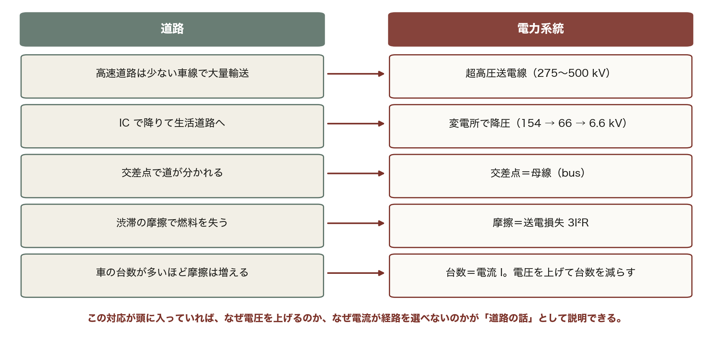
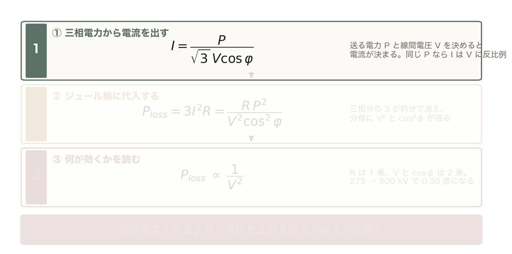
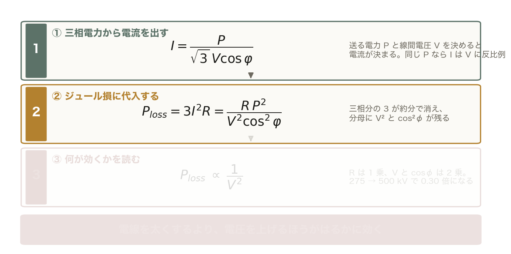
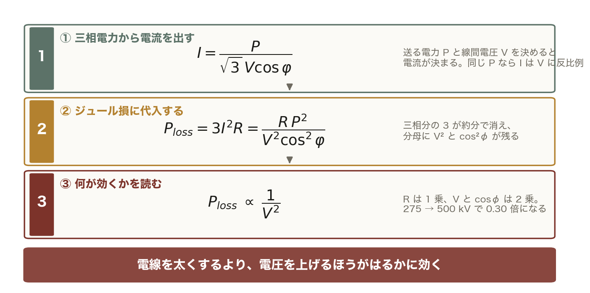
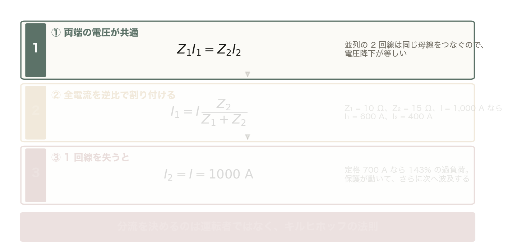
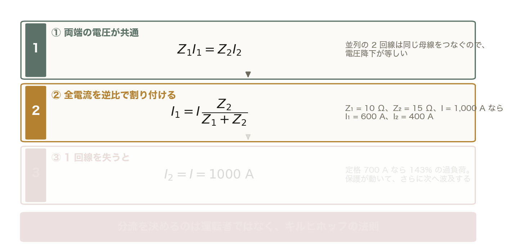
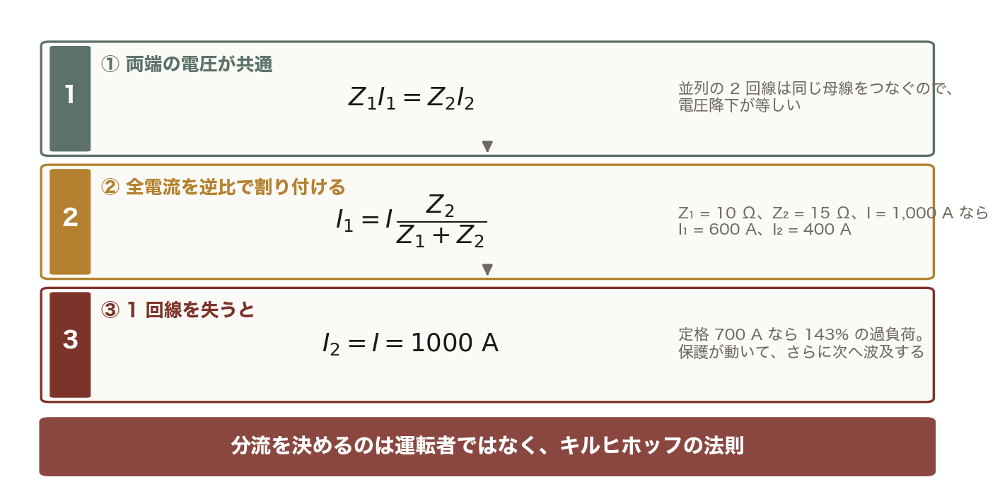
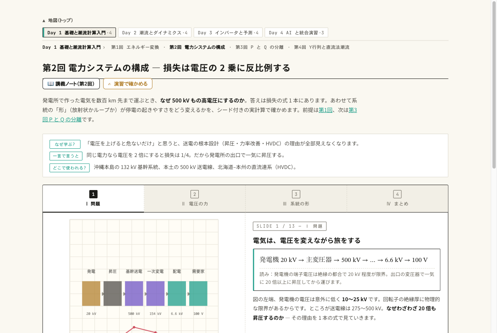
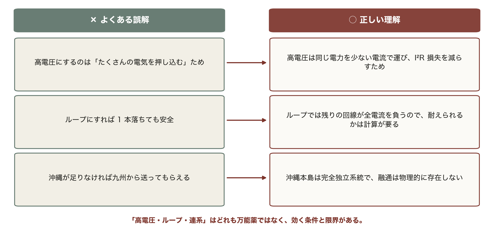

<!-- _class: title -->

# 第2回 電力システムの構成
## なぜ電気は 50 万ボルトで運ぶのか — 損失の式から系統の形まで
Day 1・コマ 2 ／ 教科書 第1章

<!-- note: 第1回は「作る」、今回は「運ぶ」。持ち帰ってほしいのは (1) 損失 ∝ 1/V² の式、(2) 単線結線図を節点と枝で読む目、(3) 沖縄は孤立系統という事実。90 分で 4 章、例題 3 つ。 -->

---

<!-- _class: statement -->

電力系統は「昇圧して運び、降圧して使う」階層構造。送電損失は電圧の 2 乗に反比例するから、高い電圧で運ぶ。母線が節点、線路が枝で、電流は経路を選ばずインピーダンスの逆比で分かれる。

<!-- note: この 3 文を最後にもう一度見せる。「2 乗」「節点と枝」「逆比」が今日のキーワード。 -->

---

<!-- _class: graphical-abstract -->

# この回の全体像

## 一枚で｜問い → 課題 → 道具 → 到達点

  問い
  発電機は 20 kV でしか作れないのに、なぜ **500 kV** に上げてから運ぶのか。上げた電圧はどこで、どう下げるのか。つながっていない沖縄は何が違うのか。

  課題
  
  100 MW を 100 km 送ると、66 kV で **28%** を失う。

  道具
  
  I = P/(√3V cosφ) ▶ 3I²R
  損失の式を ==導出== する。

  到達点
  57 倍
  66 kV と 500 kV で損失は 57 倍違う。だから昇圧して運ぶ。

数値はすべて本資料の Python コード（コード/fig_ch02.py）で計算。P = 100 MW、100 km、R = 0.1 Ω/km、力率 0.9。

<!-- note: 最初の 2 枚で全体像を渡す。右下の「57 倍」= (500/66)² が今日の結論の数字。 -->

---

<!-- _class: sections -->

# 現場で起きたこと — つながっているから広がる

  2003年8月 北米北東部大停電
  送電線が樹木に接触して停止、警報システムの不具合で運用者が気づかず、潮流が他の線路へ移って次々に過負荷停止。==約 5,000 万人== が停電した。網目状の系統では 1 本の停止が「再配分」を起こす。今日の Ⅲ で、その再配分を 2 回線の数値で追う。

  2011年 東西の周波数の壁
  日本は東 50 Hz・西 60 Hz に分かれ、間をつなぐ周波数変換設備の容量は当時約 100 万 kW。震災後、西から東へ十分に融通できなかった。現在は約 210 万 kW に増強されている。「つながっていれば助け合える」の裏返しで、つながっていない沖縄には融通そのものがない。

<!-- note: 沖縄は他地域と連系線がなく、この「融通」がそもそも存在しない。第8回で効いてくる。 -->

---

<!-- _class: figure-full -->
<!-- source: コード/fig_ch02.py -->

# たとえ話 — 高速道路と生活道路

たとえ話が崩れる点も押さえておく。車は経路を選ぶが、電流は選ばない。並列する全経路に、インピーダンスの逆比で勝手に分かれる。

---

<!-- _class: agenda -->

# この回の地図

1. 発電 → 送電 → 変電 → 配電 の階層と電圧レベル
2. 損失の式 — なぜ高電圧か、を数字で
3. 単線結線図の読み方 — 母線・線路・変圧器・遮断器と分流
4. 日本の系統（50/60 Hz、連系線）と沖縄の独自性

---

<!-- _class: divider -->

# Ⅰ. 発電から需要家までの階層

## 発電機は 20 kV で作り、500 kV で運び、100 V で使う

---

<!-- _class: figure-full -->
<!-- source: コード/fig_ch02.py -->

# 電気の旅 — 上げて運び、下げて使う

発電機の 20 kV を 25 倍に上げて運び、家庭では 5,000 分の 1 に下げて使う。この山の形を可能にしているのが変圧器で、交流が主流になった理由もここにある。

<!-- note: 「なぜ発電機は 20 kV までなのか」→ 回転子・固定子の絶縁厚の制約。「なぜ家庭は 100 V か」→ 安全と機器の絶縁。山の高さ（送電電圧）を決めるのが次の章の損失の式。　図の要点：発電機 10〜25 kV：絶縁で決まる／主変圧器で一気に 275〜500 kV／一次変電所 154/66 kV、配電 6.6 kV／柱上変圧器で 100/200 V（沖縄も同じ） -->

---

<!-- _class: table-slide -->

# 電圧階級と役割 — 6 段の階段

## 日本の代表的な電圧レベル（教科書 1.1 節）

| 区分 | 電圧 | 役割 |
|:--|:--|:--|
| 発電端 | 10〜25 kV | 発電機の端子電圧。絶縁の制約で高くできない |
| 基幹送電 | 500 / 275 kV | 大電力を長距離輸送。系統の「背骨」 |
| 地域送電 | 154 / 110 / 66 kV | 地域内の供給。二次変電所へ |
| 特別高圧配電 | 22 / 33 kV | 大口需要家（工場・鉄道） |
| 高圧配電 | 6.6 kV | 市街地の配電線。柱上変圧器まで |
| 低圧 | 100 / 200 V | 一般家庭・小規模事業所 |

**沖縄本島の基幹系統は 132 kV。** 本土の 500 kV より低いのは、系統規模（最大需要 約 1,500 MW）と送る距離が小さいから。電圧階級は「どれだけの電力をどれだけ遠くへ」で決まる。

<!-- note: 学生に「大学の受電電圧は？」と聞く（琉球大は特別高圧受電）。表の 6 段を電気の流れる順に言えれば問 2-1 は解ける。 -->

---

<!-- _class: figure-story -->
<!-- source: コード/fig_ch02.py -->

# 変圧器 — 電圧 a 倍、電流 1/a 倍

## 読み方｜275/66 kV・100 MVA。巻数比 a = 4.17 で電流は 210 A から 875 A に増える

- 巻数比 a = N₁/N₂ = V₁/V₂ = 4.17
- I₂ = a I₁：210 A → 875 A
- Z₂ は一次から見ると a² = 17.4 倍
- 単位法なら両側で 0.184（第3回）

変圧器を挟むたびに a² の換算が要る。これが面倒だから系統解析は単位法（p.u.）で書く。第3回の動機はここ。

<!-- note: 理想変圧器は容量が保存（√3 V₁ I₁ = √3 V₂ I₂）。「電圧を 4 倍にしたら電流は 1/4、損失は 1/16」が次の章の伏線。 -->

---

<!-- _class: steps -->

# 例題 1 — 変圧器の巻数比と電流

  1
  巻数比
  a = V₁/V₂ = 275/66 = 4.17。N₁/N₂ も同じ値

  2
  一次電流
  I₁ = S/(√3 V₁) = 100 × 10⁶/(√3 × 275 × 10³) = 210 A

  3
  二次電流
  I₂ = a I₁ = 4.17 × 210 = 875 A。√3 × 66 kV × 875 A = 100 MVA で容量は保存

  4
  インピーダンス換算
  Z₂ = 0.5 + j8.0 Ω を一次から見ると a² Z₂ = 17.4 × Z₂ = 8.7 + j139 Ω

<!-- note: 学生に 2, 3 を計算させる（3 分）。「電圧が 4 倍なら電流は 1/4」を体で。4 の p.u. 値 0.184 が両側で一致することは第3回で確認する。 -->

---

<!-- _class: kpi -->

# 結果 — 電圧を変えると何が変わるか

  25 倍
  発電機 20 kV → 送電 500 kV の昇圧比

  4.17
  275/66 kV 変圧器の巻数比 a

  17.4
  a²：二次インピーダンスの一次換算倍率

<!-- note: 「25 倍に上げる」ことの利益が次の章。「a² の換算」の面倒を消すのが第3回。 -->

---

<!-- _class: divider -->

# Ⅱ. 損失の式 — なぜ高電圧か

## 電圧の 2 乗と力率の 2 乗が分母にいる

---
<!-- _class: figure-full -->
<!-- source: コード/fig_ch02.py -->

# 導出 — 損失は電圧の 2 乗に反比例する

送る電力 P と線間電圧 V を決めると電流が決まる：I = P/(√3 V cosφ)。同じ P なら、電流は V に反比例する。

<!-- note: 段階開示。①で「P を固定すると I は V に反比例」を強調。②の代入は学生に板書させてもよい。③で「なぜ電線を太くする代わりに電圧を上げるのか」に答える。 -->

---

<!-- _class: figure-full -->
<!-- source: コード/fig_ch02.py -->

# 導出 — 損失は電圧の 2 乗に反比例する

3R × P²/(3 V² cos²φ) = R P²/(V² cos²φ)。3 が消えて、分母に V² と cos²φ が残る。

<!-- note: 前の 1 枚に ② を足しただけ。薄い段はまだ出していない段。 -->

---

<!-- _class: figure-full -->
<!-- source: コード/fig_ch02.py -->

# 導出 — 損失は電圧の 2 乗に反比例する

R は 1 乗（電線を太くしても効きにくい）、V と cosφ は 2 乗。275 → 500 kV で (275/500)² = 0.30 倍、力率 0.8 は 1/0.64 = 1.56 倍。

<!-- note: 前の 1 枚に ③ を足しただけ。薄い段はまだ出していない段。 -->
---

<!-- _class: figure-story -->
<!-- source: コード/fig_ch02.py -->

# 同じ電線でも 66 kV なら 28% を失う

## 読み方｜P = 100 MW、100 km、R = 10 Ω、力率 0.9。対数軸で傾き −2 の直線＝電圧の 2 乗に反比例

- 66 kV：I = 972 A、損失 28.3 MW
- 154 kV：417 A、5.2 MW（5.2%）
- 275 kV：233 A、1.63 MW（1.6%）
- 500 kV：128 A、0.49 MW（0.5%）

66 kV と 500 kV で損失は 57 倍違う（= (500/66)²）。日本の送配電損失率が約 4.5% で済むのは、高電圧で運んでいるから。

<!-- note: 図は対数軸。「1 目盛り下がる＝1/10」を確認。100% の点線より上は「送る電力より損失が大きい＝物理的に送れない」。 -->

---

<!-- _class: steps -->

# 例題 2 — 66・275・500 kV の損失を出す

  1
  条件
  P = 100 MW、R = 0.1 Ω/km × 100 km = 10 Ω、力率 0.9

  2
  66 kV
  I = 100 × 10⁶/(√3 × 66 × 10³ × 0.9) = 972 A。損失 3 × 972² × 10 = 28.3 MW（28%）

  3
  275 kV
  I = 233 A。損失 3 × 233² × 10 = 1.63 MW（1.6%）。66 kV の (66/275)² = 0.058 倍

  4
  500 kV
  I = 128 A。損失 0.49 MW（0.5%）。275 kV からさらに (275/500)² = 0.30 倍

<!-- note: 学生に 3 を計算させる。「電圧比の 2 乗で割るだけ」で 2 → 3 → 4 が出ることを確認。よくある誤り：√3 を忘れる、力率を掛け忘れる。 -->

---

<!-- _class: kpi -->

# 結果 — 同じ電線でも電圧で損失が 57 倍違う

  28%
  66 kV で送ると（972 A）

  1.6%
  275 kV（233 A）

  0.5%
  500 kV（128 A）

<!-- note: 日本全体の送配電損失は約 4.5%。この数字は「高電圧で運んでいるから」達成できている。 -->

---

<!-- _class: figure-story -->
<!-- source: コード/fig_ch02.py -->

# もう 1 つの 2 乗 — 力率 0.8 で 1.56 倍

## 読み方｜横軸は力率、縦軸は力率 1.0 のときを 1 とした損失の倍率。実系統は 0.85〜1.0 で運用

- 力率 0.8：1/0.64 = 1.56 倍
- 力率 0.9：1.23 倍（275 kV で 1.63 MW）
- 力率 0.95：1.11 倍（1.47 MW）
- 力率 1.0：1.32 MW が最小

力率改善（コンデンサで無効電力を補う）は電線を太くせずに損失を減らす。無効電力 Q の意味は第3回、電圧との関係は第6回。

<!-- note: 例題 2-2（ノート）：0.9 → 0.98 で損失 15.7% 減。「設備を増やさない省エネ」として工場で実際に行われている。 -->

---

<!-- _class: divider -->

# Ⅲ. 単線結線図と分流

## 母線が節点、線路が枝。電流は逆比で勝手に分かれる

---

<!-- _class: figure-full -->
<!-- source: コード/fig_ch02.py -->

# 単線結線図 — 三相を 1 本の線で描く

3 母線・3 線路の単線結線図。第4回以降は、この図の母線に番号を振って Y_bus を組み立てる。なお CB（遮断器）と DS（断路器）の操作順序を逆にすると重大事故につながる。

<!-- note: 平衡三相なら 1 相分で代表できる、が単線で描ける根拠。学生に「母線はいくつ、枝はいくつ」を数えさせる。L13 を外すと放射状、付けるとループ。　図の要点：母線 1〜3 が節点、線路 3 本が枝／遮断器 CB：事故電流を切れる／断路器 DS：無電流でしか開閉不可／順序は「CB を開いてから DS」 -->

---

<!-- _class: definition -->

# 母線 — 系統の「交差点」

母線（bus）

同じ電位で結ばれた接続点。発電機・負荷・線路・変圧器はすべて母線につながる。潮流計算（第4回以降）では母線が節点になり、線路がそれを結ぶ枝になる。

単線結線図は三相を 1 本の線で描いた地図。母線＝太線、遮断器＝四角、変圧器＝二重丸で読む

<!-- note: 「ノード」「バス」「母線」は同じもの。教科書は「ノード」。本講義ではスラックノードを必ず番号 1 に取る（記号表）。 -->

---
<!-- _class: figure-full -->
<!-- source: コード/fig_ch02.py -->

# 導出 — 並列線路の分流は逆比で決まる

並列の 2 回線は同じ母線 A・B をつなぐので電圧降下が等しい。よって I₁/I₂ = Z₂/Z₁。インピーダンスが小さい回線に多く流れる（逆比）。

<!-- note: 段階開示。①は「並列＝同じ電圧差」だけで出る。②で数値。③で「ループは安全か」を問い、N-1 と潮流計算の必要性へ。 -->

---

<!-- _class: figure-full -->
<!-- source: コード/fig_ch02.py -->

# 導出 — 並列線路の分流は逆比で決まる

Z₁ = 10 Ω、Z₂ = 15 Ω、I = 1,000 A なら I₁ = 1,000 × 15/25 = 600 A、I₂ = 400 A。運転者が選ぶのではなく、キルヒホッフが決める。

<!-- note: 前の 1 枚に ② を足しただけ。薄い段はまだ出していない段。 -->

---

<!-- _class: figure-full -->
<!-- source: コード/fig_ch02.py -->

# 導出 — 並列線路の分流は逆比で決まる

回線 1 が開放されると I₂ = 1,000 A。定格 700 A なら 143% の過負荷 → 保護で遮断 → さらに次へ。2003 年の北米大停電はこの連鎖。

<!-- note: 前の 1 枚に ③ を足しただけ。薄い段はまだ出していない段。 -->
---

<!-- _class: figure-full -->
<!-- source: コード/fig_ch02.py -->

# 1 本落ちると残りが全部を背負う

回線 1 を失うと、残りの回線に全電流 1,000 A（定格 700 A の 143%）が乗る。ループにすれば信頼度は上がるが、「残りが耐えられるか」は計算しないと分からない。これが N-1 基準と潮流計算（第4回）の動機である。

<!-- note: 「回線 2 の定格を 1,000 A 以上にすれば良い」= N-1 基準の考え方。設備を余らせて持つコストと信頼度のトレードオフ。　図の要点：通常：600 A / 400 A（Z の逆比）／開放後：回線 2 に 1,000 A／定格 700 A の 143% → 過負荷／保護が働けば母線 B は停電 -->

---

<!-- _class: divider -->

# Ⅳ. 系統の形と日本・沖縄の系統

## 放射状かループか、つながっているか孤立か

---

<!-- _class: figure-full -->
<!-- source: コード/fig_ch02.py -->

# 放射状は末端まで停電、ループは継続

同じ 1 区間の故障でも、末端に届く確率は放射状で 97.0%、ループなら 99.99% まで上がる。放射状は電流の向きが一意なので手計算できるが、ループは分流がインピーダンスの逆比で決まるため連立方程式＝潮流計算が要る。

<!-- note: 確率は各区間の年間故障確率 0.01 の仮定。ノート 2.3.2 のモンテカルロと同じ値。「ループにすると設備費は倍、保護は複雑」も言う。　図の要点：放射状：配電の基本形、安価／届く確率 (1 − 0.01)³ = 0.970／ループ：送電の基本形、切替可能／届く確率 1 − 0.01² = 0.9999 -->

---

<!-- _class: table-slide -->

# 日本の系統 — 東西の壁と沖縄の孤立

## 沖縄本島系統と本土（九州）の比較（教科書 1.1 節、図 1.1）

| 項目 | 沖縄本島 | 本土（九州） |
|:--|:--|:--|
| 他系統との連系 | **なし（完全独立）** | 関門連系線で中国と接続 |
| 周波数 | 60 Hz | 60 Hz |
| 最大需要 | 約 1,500 MW | 約 16,000 MW |
| 基幹電圧 | 132 kV | 500 kV |
| 主力電源 | 石炭・LNG 火力 | 原子力・LNG・石炭 |
| 慣性 | **小さい** | 大きい |

**東西は 50/60 Hz で分かれ、周波数変換所 4 か所・合計 2,100 MW でつながる。** 沖縄にはその「つながり」自体がない。同じ 250 MW の脱落でも周波数の落ち方が本土の 10 倍以上速い（第8回）。

<!-- note: 周波数変換所：佐久間 300、新信濃 600、東清水 300、飛騨信濃 900 MW。「沖縄で周波数が乱れたら誰が助けるか」→ 誰も助けない、が第8回・第15回の出発点。 -->

---

<!-- _class: figure-story -->
<!-- source: コード/fig_ch02.py -->

# 沖縄本島の 5 母線モデル — ループ 1 つ

## 読み方｜132 kV・総負荷 900 MW。矢印は直流法で概算した有効電力の向き、線の太さが大きさ

- 具志川 650 MW（スラック）+ 牧港 250
- 那覇 400・中部 350・北部 150 MW
- 牧港 → 那覇に 728 MW が集中
- 中部は 2 方向から 328 + 22 MW

ループなので中部は那覇側と北部側の両方から受ける。どちらか 1 本が落ちたときの再配分が Ⅲ の話。第6回・第15回でこのモデルに太陽光を載せる。

<!-- note: pws_common.build_okinawa と同じ母線・線路・負荷。潮流の値は直流法（第4回）の概算で、交流の厳密解は第6回で pandapower に解かせる。 -->

---

<!-- _class: figure-story -->
<!-- source: コード/fig_ch02.py -->

# 予備率 10% でも N-1 で 100 MW 足りない

## 読み方｜需要 1,500 MW に供給力 1,650 MW。最大機 250 MW が抜けると 1,400 MW で需要を下回る

- 予備率 = (1,650 − 1,500)/1,500 = 10%
- 最大機脱落後：1,400 MW → −6.7%
- N-1 を満たすには 1,750 MW（16.7%）
- 独立系統は融通で埋められない

N-1 基準＝「どの 1 設備が抜けても供給を続ける」。連系のある本土は隣から借りられるが、沖縄は自前の予備力で持つしかない。

<!-- note: 予備率の分母は需要。「最大機が大きいほど必要な予備率が高い」= 離島で大型機を入れにくい理由。 -->

---

<!-- _class: steps -->

# 例題 3 — 沖縄系統の N-1 予備率

  1
  条件
  需要 1,500 MW、供給力 1,650 MW、最大の発電機 1 台 250 MW

  2
  供給予備率
  (1,650 − 1,500)/1,500 = 0.100 → 10.0%

  3
  最大機が脱落した後
  供給力 1,650 − 250 = 1,400 MW。予備率 (1,400 − 1,500)/1,500 = −6.7%。100 MW 不足

  4
  N-1 を満たす供給力
  1,500 + 250 = 1,750 MW 以上（予備率 16.7%）。不足分は負荷遮断か蓄電池で埋める

<!-- note: 学生に 3, 4 を計算させる。「最大機の大きさ」が予備率の下限を決める。1 台が大きい離島ほど厳しい。問 2-5 の太陽光 300 MW 導入と合わせて考えさせる。 -->

---

<!-- _class: kpi -->

# 結果 — 最大機 1 台が予備率の下限を決める

  10%
  供給予備率（1,650 / 1,500 MW）

  −6.7%
  最大機 250 MW 脱落後の予備率

  1,750
  N-1 を満たす供給力 [MW]

<!-- note: 本土なら連系線からの融通で 100 MW を埋められる。沖縄は自前。第15回の連系可能量の制約の 1 つになる。 -->

---

<!-- _class: figure -->

# 動く図で試す — viz/grid.html

動く図 電圧・力率・系統の形を変えて、損失と停電範囲をブラウザ内で実計算するスライド。

- 電圧を 66 → 275 → 500 kV に変え、損失が 1/V² で落ちるのを見る
- 力率を 1.0 → 0.8 にして、同じ電力でも損失が 1.56 倍になるのを見る
- 放射状とループで、1 本の線路を落としたときの停電範囲を比べる

<!-- note: viz は 1,000 MW・200 km・0.03 Ω/km の条件。スライドの例題（100 MW・100 km・0.1 Ω/km）と数値は違うが、電圧の 2 乗の関係は同じ。 -->

---

<!-- _class: blocks -->

# なぜそう考えるか — 交流・周波数・直流

  なぜ交流が主流なのか
  変圧器で電圧を自在に上げ下げできるから。損失を下げるには高電圧、使うには低電圧。この両立は変圧器なしには成り立たない。

  なぜ 50 Hz と 60 Hz に分かれたのか
  明治期に東京はドイツ製、大阪は米国製の発電機を導入した歴史の名残。統一の費用が大きく、変換設備でつないでいる。

  直流送電（HVDC）の出番
  変圧は苦手だが、長距離（架空線 600 km・ケーブル 50 km 超）・海底ケーブル・非同期連系では有利。北海道–本州、紀伊水道はこれ。

<!-- note: 「沖縄と九州を HVDC でつなげないのか」と聞かれたら、距離（約 700 km）と費用、そして第8回の周波数の話につなぐ。 -->

---

<!-- _class: figure-full -->
<!-- source: コード/fig_ch02.py -->

# よくある誤解

3 つ目が一番多い誤解。沖縄本島は完全独立系統で、他地域からの融通は物理的に存在しない。連系線が無いことは地図で確認できる。

<!-- note: 3 つ目の誤解が一番多い。「連系線がない」ことを地図で確認させる。 -->

---

<!-- _class: takeaway -->

# 持ち帰る 3 点

高電圧は損失対策。系統は「上げて運び、下げて使う」階層で、母線がその節点

<li>損失 = RP²/(V² cos²φ)。66 → 500 kV で 57 分の 1、力率 0.8 で 1.56 倍</li>
<li>並列線路は Z の逆比で分かれ、1 本落ちれば残りが全電流を負う（→ N-1、潮流計算）</li>
<li>沖縄は完全独立・小規模。予備力も慣性も自前で持つ（第8回・第15回）</li>

<!-- note: 冒頭の一言に戻る。「2 乗」「節点と枝」「逆比」の 3 語が言えれば合格。 -->

---

<!-- _class: end -->

# 次回：第3回 基本量と等価回路

演習 ex/ch02.html で数値を変えて確かめる

P は角度で、Q は電圧で運ばれる — 本講義で最も大事な式へ
