<!-- _class: title -->

# 第3回 基本量と等価回路
## P は角度で、Q は電圧で運ばれる — 潮流計算の土台を作る
Day 1・コマ 3 ／ 教科書 第2章・第3章

<!-- note: Day 1 の 3 コマ目。目的は「無効電力は仕事をしないが本当に流れる」という感覚と、送電電力式 P = V_sV_r sinδ/X を自分で導けること。90 分で 4 章、例題 3 つ。第4〜6 回の潮流計算はすべてこの回の上に乗る。 -->

---

<!-- _class: statement -->

有効電力 P は位相差 δ で、無効電力 Q は電圧の大きさの差で決まる。この分離が、潮流・電圧・安定度のすべての出発点になる。

<!-- note: この 1 文を最後にもう一度見せる。「δ」と「電圧差」の 2 語がキーワード。 -->

---

<!-- _class: graphical-abstract -->

# この回の全体像

## 一枚で｜問い → 課題 → 道具 → 到達点

  問い
  なぜ電気料金に「力率」が出てくるのか。仕事をしない **無効電力** が、なぜ電流を増やし、電圧を動かすのか。

  課題
  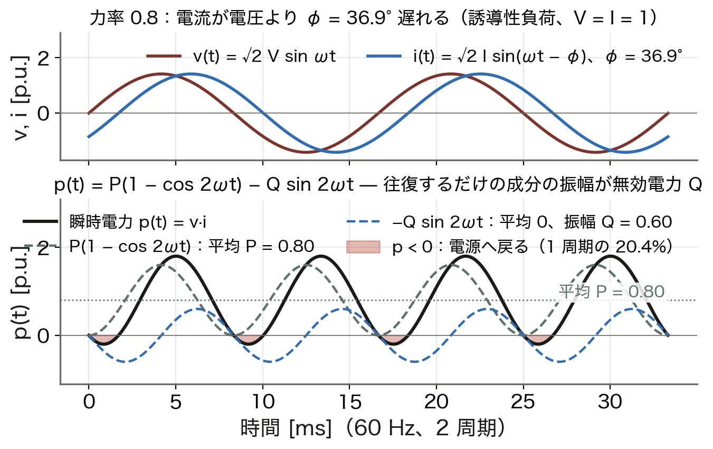
  力率 0.8 では 1 周期の **約 2 割** で電力が電源へ戻る。往復するだけの Q が電流と損失を増やす。

  道具
  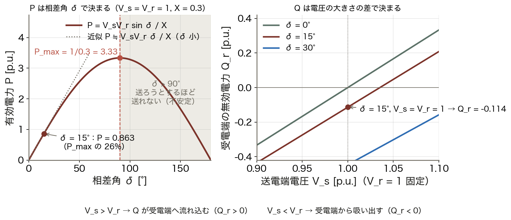
  S = VI* → π 型等価回路 → 単位法 → 送電電力式
  2 母線の式を ==導出== し、P と Q の担当を分ける。

  到達点
  δ と V
  P は相差角 δ、Q は電圧差で決まる。X = 0.3 なら δ = 15° で P = 0.863、上限は 3.33。

数値はすべて本資料の Python コード（コード/fig_ch03.py）で計算。V_s = V_r = 1 p.u.、X = 0.3 p.u.。

<!-- note: 最初の 2 枚で全体像を渡す。右下の「δ と V」が今日の結論。左下の図は瞬時電力、右の図は P–δ と Q–V。 -->

---

<!-- _class: sections -->

# 現場で起きたこと — Q は見えないコスト

  力率が電気料金を動かす
  高圧で受電する工場やビルは、力率 85% を基準に基本料金が ==割引・割増== される。同じ P でも Q が多いと電流が増え、送配電設備を余計に占有するから。工場がコンデンサを置くのは Q を現地で作るため。

  夜中に電圧が上がる（フェランチ効果）
  長い送電線やケーブルでは、負荷が軽い深夜に受電端の電圧が送電端より高くなる。線路の静電容量が Q を出し続けるため。分路リアクトルで吸い取らないと機器の絶縁を傷める。

<!-- note: どちらも「Q が電圧を決め、電流を増やす」という今日の主張の裏返し。力率の話は「環境の話」である前に「設備と料金の話」。 -->

---

<!-- _class: figure-full -->
<!-- source: コード/fig_ch03.py -->

# たとえ話 — ジョッキのビールと泡

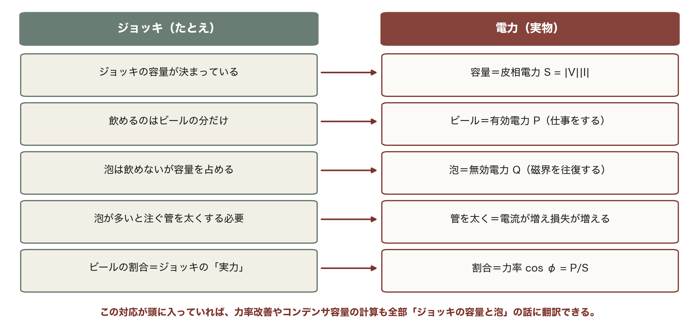

たとえ話が崩れる点も押さえておく。泡は捨ててよいが Q は捨てられない。モータや変圧器の磁界は Q が無いと立たない。「役に立たない」のではなく「仕事はしないが必要」。

---

<!-- _class: agenda -->

# この回の地図

1. 複素電力 S = P + jQ — 無効電力の物理的意味
2. 送電線の R・L・C と π 型等価回路
3. 単位法 — 変圧器を消し、数値を 1 前後に揃える
4. 2 母線の送電電力式 — P–δ と Q–V の分離

---

<!-- _class: divider -->

# Ⅰ. 複素電力 S = P + jQ

## 無効電力は仕事をしないが、電流としては本当に流れる

---

<!-- _class: figure-story -->
<!-- source: コード/fig_ch03.py -->

# 瞬時電力 — 2 割の時間は電源へ戻る

## 読み方｜黒が p(t) = v·i。緑の破線が平均 P の脈動、青が平均 0 の往復

- 力率 0.8：電流が 36.9° 遅れる
- 平均 P = 0.80、往復の振幅 Q = 0.60
- 赤：p &lt; 0 が 1 周期の 20.4%
- p の範囲は −0.20 〜 1.80

往復する成分は平均ゼロで仕事をしないが、線路には電流として流れる。この振幅が無効電力 Q [var]。

<!-- note: 上段の v と i のずれが φ。下段の赤い部分が「負荷から電源へ戻る時間」。φ = 0 なら赤は消え、φ = 90° なら半分が赤になる（p < 0 の割合は φ/π）。学生に「赤の割合が 20% になる理由」を問う。 -->

---
<!-- _class: figure-full -->
<!-- source: コード/fig_ch03.py -->

# 導出 — v·i から S = P + jQ へ

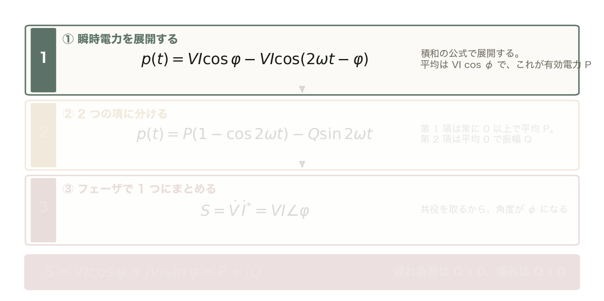

積和の公式 2 sinA sinB = cos(A − B) − cos(A + B) より p(t) = VI cos φ − VI cos(2ωt − φ)。平均は VI cos φ で、これが有効電力 P。

<!-- note: 段階開示。①で「平均が P」、②で「往復の振幅が Q」、③で「1 つの複素数に両方を入れる」。共役を付ける理由（θ_v − θ_i にするため）は必ず聞かれる。 -->

---

<!-- _class: figure-full -->
<!-- source: コード/fig_ch03.py -->

# 導出 — v·i から S = P + jQ へ

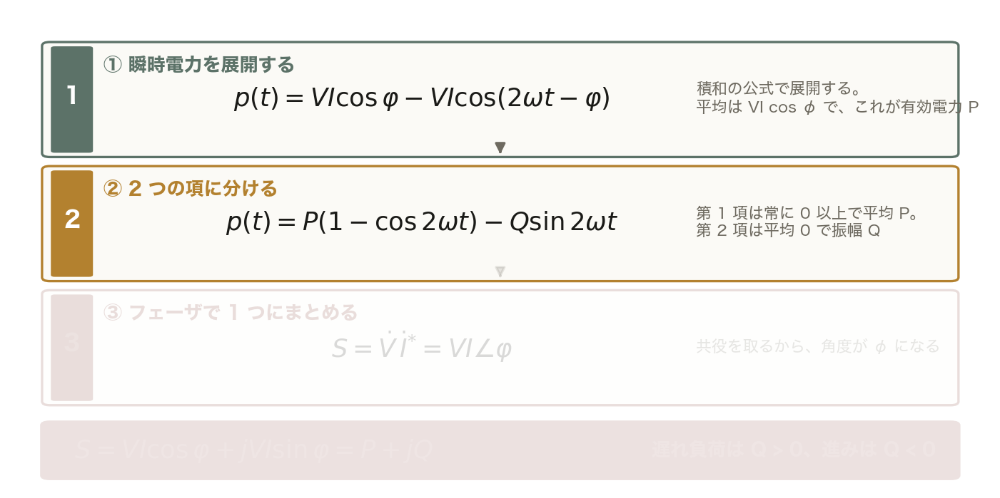

p(t) = P(1 − cos 2ωt) − Q sin 2ωt、P = VI cos φ、Q = VI sin φ。第 1 項は常に 0 以上で平均 P。第 2 項は平均 0 で振幅 Q。

<!-- note: 前の 1 枚に ② を足しただけ。薄い段はまだ出していない段。 -->

---

<!-- _class: figure-full -->
<!-- source: コード/fig_ch03.py -->

# 導出 — v·i から S = P + jQ へ

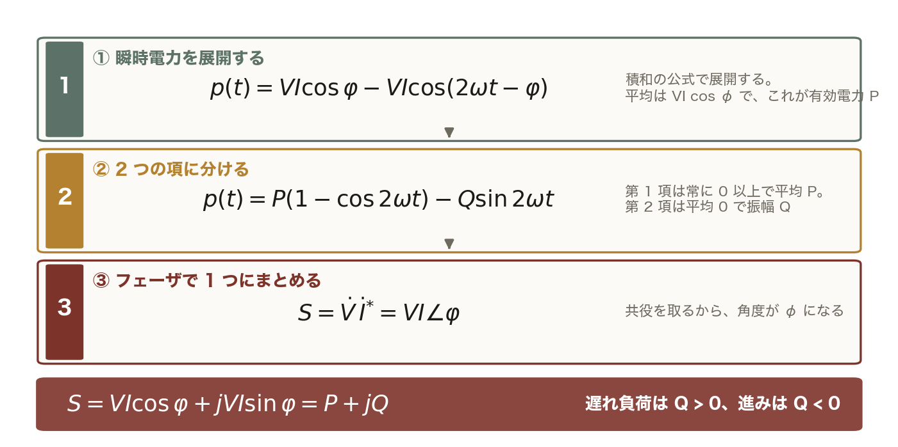

共役を取るから角度が φ になる。S = VI cos φ + j VI sin φ = P + jQ。遅れ負荷（誘導性）は Q > 0、進み（コンデンサ）は Q < 0 と約束する。

<!-- note: 前の 1 枚に ③ を足しただけ。薄い段はまだ出していない段。 -->
---

<!-- _class: figure-story -->
<!-- source: コード/fig_ch03.py -->

# 電力三角形 — S, P, Q は同じ三角形

## 読み方｜底辺が P、高さが Q、斜辺が S。角 φ の余弦が力率

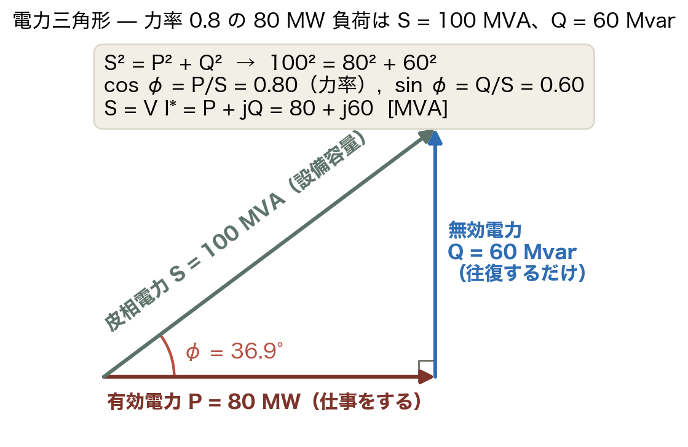

- 80 MW・力率 0.8 → S = 100 MVA
- Q = √(100² − 80²) = 60 Mvar
- φ = 36.9°、cos φ = 0.8
- 設備容量は S で決まる

変圧器・発電機の容量は kVA（S）で決まる。同じ設備で Q を運ぶほど、P に使える分が減る。

<!-- note: 単位を言い分ける：P は W、Q は var、S は VA。学生に「Q を 30% 流したとき P に使える容量は？」→ √(1 − 0.09) = 95%。 -->

---

<!-- _class: figure-story -->
<!-- source: コード/fig_ch03.py -->

# 力率が下がると損失は 1/cos²φ

## 読み方｜同じ P を送る。緑が電流比 1/cos φ、赤が損失比 1/cos²φ

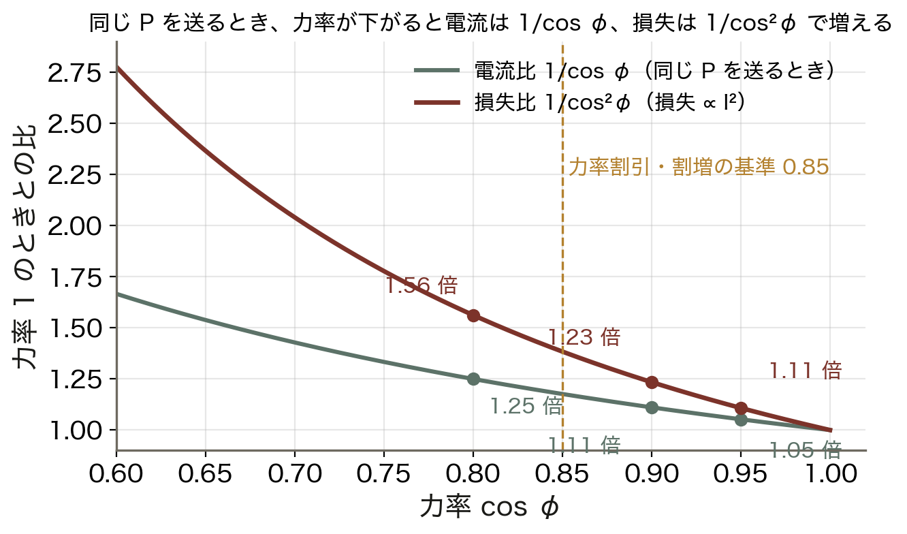

- 力率 0.95：電流 1.05 倍、損失 1.11 倍
- 力率 0.9：電流 1.11 倍、損失 1.23 倍
- 力率 0.8：電流 1.25 倍、損失 1.56 倍
- 割引・割増の基準は 0.85

Q は仕事をしないのに電流として流れ、損失を生む。第2回の損失式 RP²/(V² cos²φ) の分母にあった cos²φ の正体がこれ。

<!-- note: I = P/(V cos φ) の 1 行で出る。損失は I² に比例するので 2 乗。「力率 0.8 は損失 1.56 倍」を数字で覚えさせる。 -->

---

<!-- _class: steps -->

# 例題 1 — 力率改善に要る Q_C

  1
  条件
  80 MW、力率 0.8 遅れ。S = 80/0.8 = 100 MVA、Q = √(100² − 80²) = 60 Mvar

  2
  力率 1.0 にする
  負荷の遅れ Q をすべて打ち消す。コンデンサ Q_C = 60 Mvar

  3
  力率 0.95 なら
  残してよい Q = 80 × tan(cos⁻¹ 0.95) = 26.3 Mvar。Q_C = 60 − 26.3 = 33.7 Mvar

  4
  効果
  S は 100 → 80（84.2）MVA。電流 1.25 → 1.00（1.05）倍、損失 1.56 → 1.00（1.11）倍

<!-- note: 手を動かす 3 分。学生に 3 を計算させる。「なぜ 1.0 ではなく 0.95 で止めるのか」→ 最後の数 % のために要る Q_C が大きく、軽負荷時に進み過ぎて電圧が上がるから。 -->

---

<!-- _class: figure-full -->
<!-- source: コード/fig_ch03.py -->

# 図で見る — Q_C が S を縮める

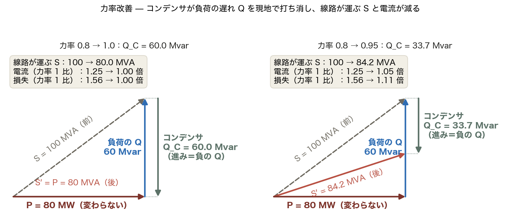

工場がコンデンサを置くのは、Q を発電所から運ぶと線路を余計に占有し損失を生むが、現地で作れば線路は P だけ運べば済むから。コンデンサの進み Q が負荷の遅れ Q を打ち消し、線路が運ぶ見かけの容量 S′ を縮める。

<!-- note: 矢印の向きに注意：負荷の遅れ Q は上向き（正）、コンデンサは下向き（負）。第6回の電圧制御では、この Q_C を「電圧を上げる道具」として使う。　図の要点：前：S = 100 MVA（灰の破線）／Q_C = 60 Mvar → S′ = 80 MVA／33.7 Mvar なら S′ = 84.2 MVA／Q は現地で作り、線路には流さない -->

---

<!-- _class: kpi -->

# 結果 — 力率 0.8 のコスト

  1.25倍
  力率 0.8 の電流（同じ P）

  1.56倍
  力率 0.8 の損失（1/cos²φ）

  60
  80 MW を力率 1.0 にする Q_C [Mvar]

<!-- note: 3 つの数字はすべて 80 MW・力率 0.8 の同じ負荷から出ている。 -->

---

<!-- _class: divider -->

# Ⅱ. 送電線の等価回路

## R・L・C の由来と π 型モデル。架空線では X ≫ R

---

<!-- _class: table-slide -->

# 線路定数 — R・L・C の由来と目安

## 275 kV 架空線の代表値（教科書 3.4 節）

| 定数 | 物理的由来 | 効果 | 目安 |
|:--|:--|:--|:--|
| R [Ω/km] | 導体の抵抗 | ジュール損失 | 0.02〜0.05 |
| L [mH/km] | 導体周囲の磁束鎖交 | 電圧降下・位相回転（X = ωL） | 1.0〜1.3 |
| C [µF/km] | 導体–大地間の静電容量 | 充電電流・電圧上昇（B = ωC） | 0.008〜0.012 |
| G [S/km] | コロナ・がいし漏れ | 通常無視 | ≈ 0 |

**架空線は X/R ≈ 5〜15 でリアクタンス支配。** この 1 事実が、Ⅳ で R を無視して送電電力式を導く根拠になり、第4回の直流法・第5回の高速デカップル法にもつながる。

ケーブルは導体間隔が狭く C が架空線の 20〜50 倍。長距離では充電電流が容量を食い潰す（第2回の HVDC の理由）。

<!-- note: 数値は覚えなくてよい。覚えるのは「X ≫ R」と「C は電圧を上げる」の 2 点。60 Hz なら X = 2π·60·1.2 mH ≈ 0.45 Ω/km。 -->

---

<!-- _class: figure-story -->
<!-- source: コード/fig_ch03.py -->

# π 型等価回路 — Z を中央、Y を両端に

## 読み方｜直列 Z = R + jX、対地アドミタンス jB を半分ずつ両端へ

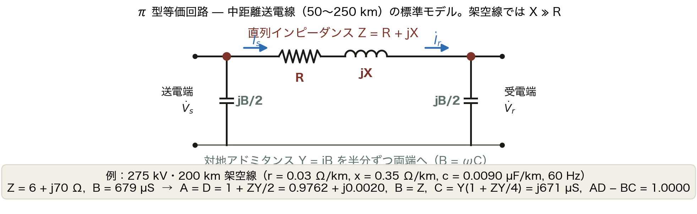

- 中距離 50〜250 km の標準モデル
- 275 kV・200 km：Z = 6 + j70 Ω
- B = ωC × l = 679 µS
- A = D = 1 + ZY/2 = 0.976

短距離（〜50 km）は Z だけ、長距離（250 km〜）は分布定数。第4回の Y_bus には、この π 型の Z と B/2 がそのまま入る。

<!-- note: 「なぜ半分ずつか」→ 分布している C を両端に集めた近似。中央に全部置く T 型もあるが、Y_bus を組むときは π 型が圧倒的に楽（母線ごとに B/2 を足すだけ）。 -->

---

<!-- _class: equation -->

# 四端子定数 — π 型の A, B, C, D

$$A = D = 1 + \frac{\dot Z\,\dot Y}{2}, \qquad B = \dot Z, \qquad C = \dot Y\left(1 + \frac{\dot Z\,\dot Y}{4}\right)$$

  $\dot V_s,\ \dot I_s$
  V_s = A V_r + B I_r、I_s = C V_r + D I_r。受電端の V・I から送電端を求める
  $A, D$
  無負荷（I_r = 0）の電圧比 V_s = A V_r。|A| &lt; 1 なら受電端が高い（フェランチ効果）
  $B, C$
  B は直列 Z そのもの。C は充電電流を作るアドミタンス（275 kV・200 km で j671 µS）
  $AD - BC$
  常に 1（相反回路）。短距離線路では A = D = 1、C = 0 に退化する

<!-- note: 導出は KVL と KCL を 2 回ずつ。時間があれば板書。無ければ「無負荷で V_s = A V_r」だけ確認して次のフェランチへ。 -->

---

<!-- _class: figure-story -->
<!-- source: コード/fig_ch03.py -->

# フェランチ効果 — 夜に電圧が上がる

## 読み方｜無負荷の受電端電圧 V_r/V_s = 1/cos βl。長いほど上がる

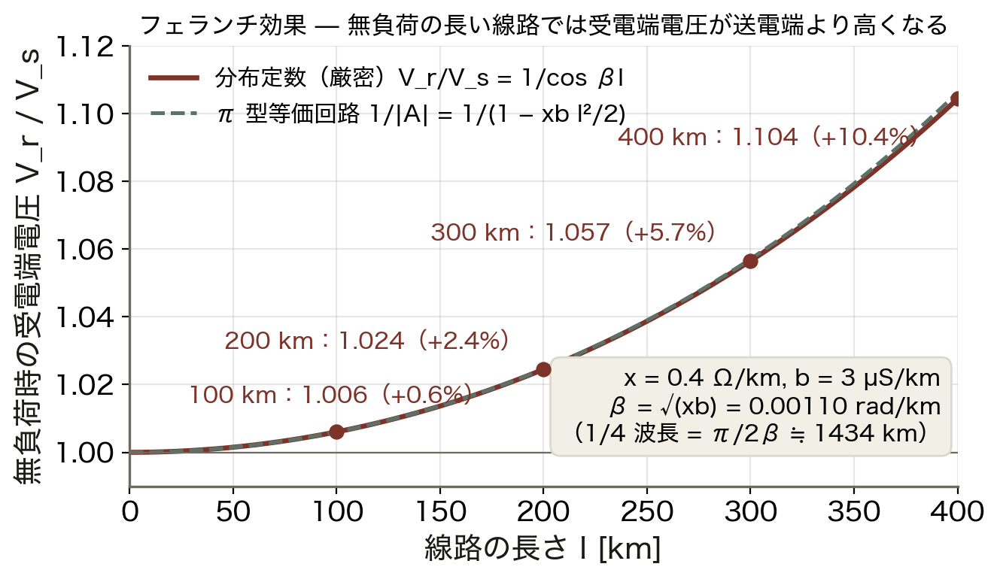

- β = √(xb) = 0.0011 rad/km
- +2.4%（200 km）、+10.4%（400 km）
- π 型（破線）は 400 km で 1.106
- 275 kV・200 km の例でも +2.4%

線路の C が出す進みの充電電流が L を流れ、電圧を持ち上げる。深夜の軽負荷で顕著。分路リアクトルで吸い取る（第6回）。

<!-- note: x = 0.4 Ω/km、b = 3 µS/km。「無負荷で V_s = A V_r、A = 1 − xbl²/2 < 1」の 1 行で π 型の破線が出る。厳密解 1/cos βl は分布定数（教科書 3.4 節の長距離線路）。 -->

---

<!-- _class: divider -->

# Ⅲ. 単位法

## 変圧器を消し、数値を 1 前後に揃える

---

<!-- _class: figure-story -->
<!-- source: コード/fig_ch03.py -->

# 単位法 — 変圧器の両側で同じ数になる

## 読み方｜上が実単位、下が p.u.。V_base を各側の定格電圧に取る

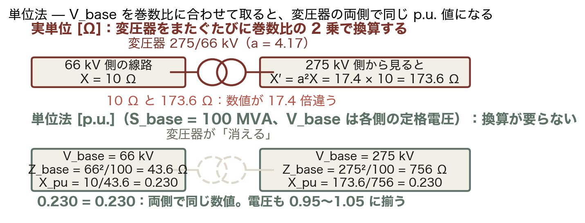

- 66 kV 側の線路 X = 10 Ω
- 275 kV 側から見ると a²X = 173.6 Ω
- Z_base = 43.6 Ω と 756 Ω で割る
- どちらも **0.230 p.u.**

巻数比の 2 乗の換算が消える。電圧は 0.95〜1.05、Z は 0.01〜0.5 に揃うので、桁の間違いに一目で気づける。

<!-- note: 教科書（3.2 節）は「単位法」、実務は「p.u.」。第2回の MATLAB 例で a² を掛けた面倒を思い出させる。S_base は系統で 1 つ（慣例 100 MVA）、V_base は電圧階級ごと。 -->

---
<!-- _class: figure-full -->
<!-- source: コード/fig_ch03.py -->

# 導出 — Z_base と基準の変換

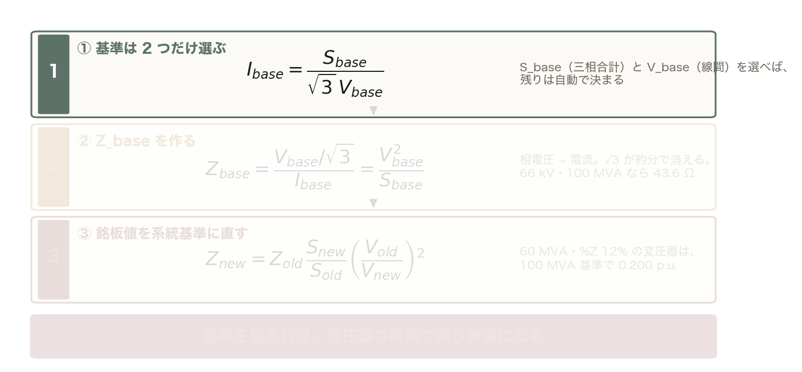

残りは自動で決まる。I_base = S_base/(√3 V_base)。三相基準と単相基準を混ぜないこと。

<!-- note: ②の √3 が消える理由を板書で 1 回やる。ここを飛ばすと「Z_base = V²/S に √3 が要るか」で毎年迷う。③は容量比が S_new/S_old（大きい基準ほど p.u. は大きい）。 -->

---

<!-- _class: figure-full -->
<!-- source: コード/fig_ch03.py -->

# 導出 — Z_base と基準の変換

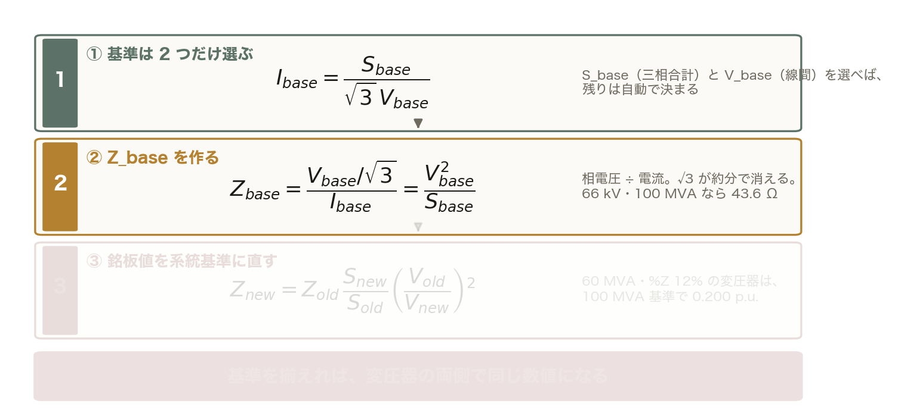

= (V_base/√3) × √3 V_base/S_base = V_base²/S_base。√3 が約分で消える。66 kV・100 MVA なら 43.6 Ω、875 A。

<!-- note: 前の 1 枚に ② を足しただけ。薄い段はまだ出していない段。 -->

---

<!-- _class: figure-full -->
<!-- source: コード/fig_ch03.py -->

# 導出 — Z_base と基準の変換

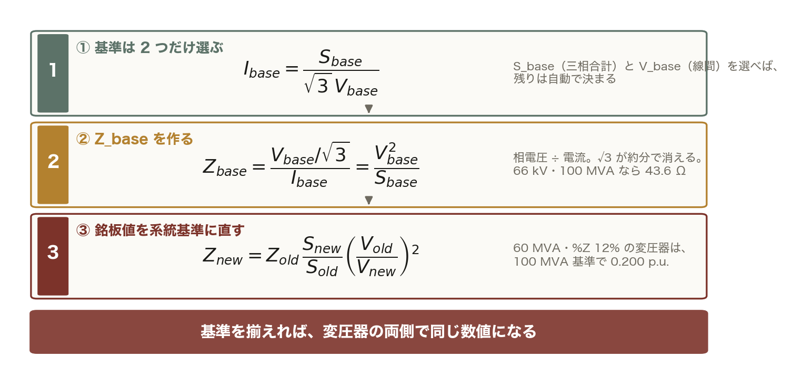

Z_new = Z_old (S_new/S_old)(V_old/V_new)²。60 MVA・%Z 12% の変圧器は 100 MVA 基準で 0.12 × 100/60 = 0.200 p.u.。

<!-- note: 前の 1 枚に ③ を足しただけ。薄い段はまだ出していない段。 -->
---

<!-- _class: steps -->

# 例題 2 — 66 kV 線路を p.u. にする

  1
  基準を決める
  S_base = 100 MVA、V_base = 66 kV。Z_base = 66²/100 = 43.56 Ω、I_base = 100/(√3 × 66) = 875 A

  2
  実量を割る
  X = 10 Ω → X_pu = 10/43.56 = **0.230 p.u.**

  3
  275 kV 側で検算
  X′ = 10 × (275/66)² = 173.6 Ω、Z_base = 275²/100 = 756 Ω → 173.6/756 = 0.230。同じ

  4
  機器基準を変換
  60 MVA・%Z 12% の変圧器 → 0.12 × 100/60 = 0.200 p.u.（電圧基準は同じ）

<!-- note: 学生に 1 と 2 を計算させる。「66 kV を 66,000 V で入れて S を 100 で割ったら？」→ 桁が 10⁶ ずれる。kV と MVA で揃えると Z_base [Ω] がそのまま出る。 -->

---

<!-- _class: kpi -->

# 結果 — 単位法で数値が揃う

  43.6 Ω
  66 kV・100 MVA の Z_base

  0.230
  10 Ω の p.u. 値（変圧器の両側で同じ）

  17.4倍
  実単位で必要だった a² の換算

<!-- note: 「0.230」が両側で同じ、が今日の単位法の要点。 -->

---

<!-- _class: divider -->

# Ⅳ. 2 母線の送電電力式

## P は相差角 δ、Q は電圧差 — 本講義で最も重要な式

---

<!-- _class: figure-full -->
<!-- source: コード/fig_ch03.py -->

# 2 母線系統 — いちばん単純な系統

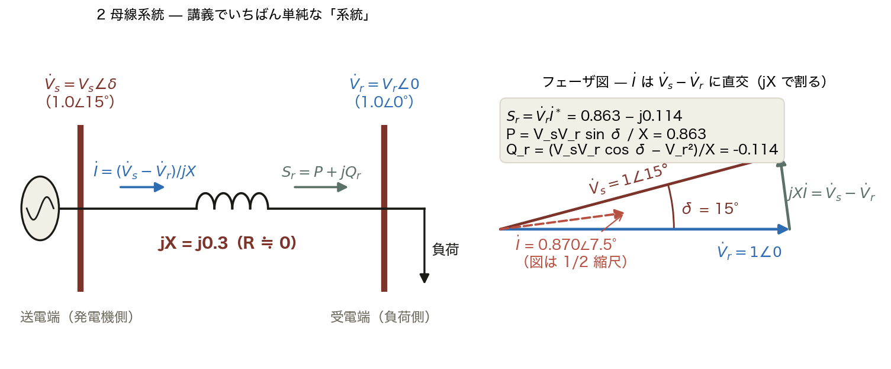

δ（位相差）が電流の向きを、電圧差が電流の大きさを決める。この関係を式にしたのが次ページの導出。

<!-- note: フェーザ図で「jX で割る＝90° 遅らせて X で割る」を確認。V_s − V_r（緑）と I（赤破線）が直交している。R ≒ 0 の近似は架空線（X/R ≈ 5〜15）で成り立つ。　図の要点：V_s = 1∠15°、V_r = 1∠0、X = 0.3／V_s − V_r は V_r より 97.5° 進む／jX で割ると I = 0.870∠7.5°／S_r = V_r I* = 0.863 − j0.114 -->

---
<!-- _class: figure-full -->
<!-- source: コード/fig_ch03.py -->

# 導出 — 送電電力式 P と Q_r

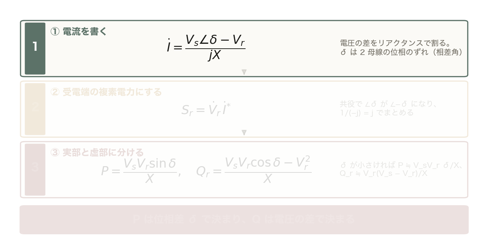

送電端 V̇_s = V_s∠δ、受電端 V̇_r = V_r∠0。電圧の差をリアクタンスで割る。δ は 2 母線の位相のずれ（相差角）。

<!-- note: 段階開示。②の共役で ∠δ が ∠−δ になる点と、1/(−j) = j を丁寧に。③の近似 2 行が「P–δ / Q–V 分離」で、第5回の高速デカップル法・第8回の周波数制御 vs 第6回の電圧制御の役割分担の根拠。この式は暗記。 -->

---

<!-- _class: figure-full -->
<!-- source: コード/fig_ch03.py -->

# 導出 — 送電電力式 P と Q_r

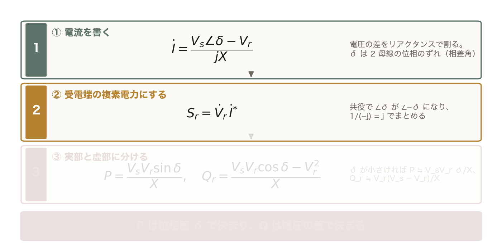

1/(−j) = j とオイラーの公式 e^{−jδ} = cos δ − j sin δ で S_r = j V_r (V_s cos δ − j V_s sin δ − V_r)/X。

<!-- note: 前の 1 枚に ② を足しただけ。薄い段はまだ出していない段。 -->

---

<!-- _class: figure-full -->
<!-- source: コード/fig_ch03.py -->

# 導出 — 送電電力式 P と Q_r

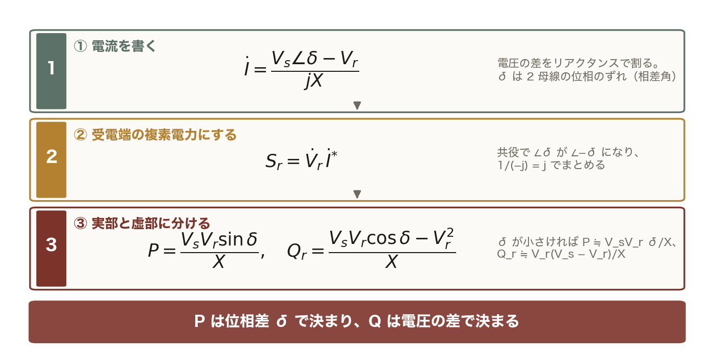

δ が小さいと sin δ ≒ δ、cos δ ≒ 1 なので P ≒ V_sV_r δ/X、Q_r ≒ V_r (V_s − V_r)/X。P は δ、Q は電圧差で決まる。

<!-- note: 前の 1 枚に ③ を足しただけ。薄い段はまだ出していない段。 -->
---

<!-- _class: figure-full -->
<!-- source: コード/fig_ch03.py -->

# P は δ で、Q は電圧差で決まる

実運用では安定余裕を確保するため δ は 30〜40° 程度に抑える。90° を超えると送れなくなる理由と余裕の定量化は第7回の定態安定限界で扱う。

<!-- note: 左：δ を動かすと P が大きく動く（ガバナ＝有効電力制御、第8回）。右：V_s を動かすと Q が符号ごと動く（AVR＝無効電力制御、第6回）。右図で δ = 0 の直線が原点を通ることを確認させる。　図の要点：δ = 15°：P = 0.863（上限の 26%）／δ = 90°：P_max = 1/0.3 = 3.33／V_s &gt; V_r なら Q_r &gt; 0（流れ込む）／δ = 15°：Q_r = −0.114 -->

---

<!-- _class: steps -->

# 例題 3 — δ = 15° の P と上限

  1
  条件
  V_s = V_r = 1.0 p.u.、X = 0.30 p.u.、δ = 15°。S_base = 100 MVA

  2
  P を出す
  P = 1 × 1 × sin 15°/0.30 = 0.2588/0.30 = **0.863 p.u. = 86.3 MW**

  3
  上限を見る
  δ = 90° で P_max = 1/0.30 = 3.33 p.u. = 333 MW。余裕率 1 − 0.863/3.33 = 74%

  4
  Q_r も出す
  Q_r = (cos 15° − 1)/0.30 = −0.0341/0.30 = −0.114 p.u.。受電端が線路の X の分を供給している

<!-- note: 学生に 2 と 3 を計算させる。「δ = 30° なら？」→ 1.667 p.u.（2 倍近い）。「P = 3.0 p.u. を送るには？」→ sin δ = 0.9 で δ = 64°、実運用では危険。 -->

---

<!-- _class: kpi -->

# 結果 — X = 0.3 の線路

  0.863
  δ = 15° の P [p.u.]（86.3 MW）

  3.33
  P_max（δ = 90°、333 MW）

  74%
  安定度の余裕 1 − P/P_max

<!-- note: 「P_max は X に反比例」→ 2 回線にすると X が半分で P_max が 2 倍（第7回の 1 回線開放の話へ）。 -->

---

<!-- _class: figure -->

# 動く図で試す — viz/acpower.html

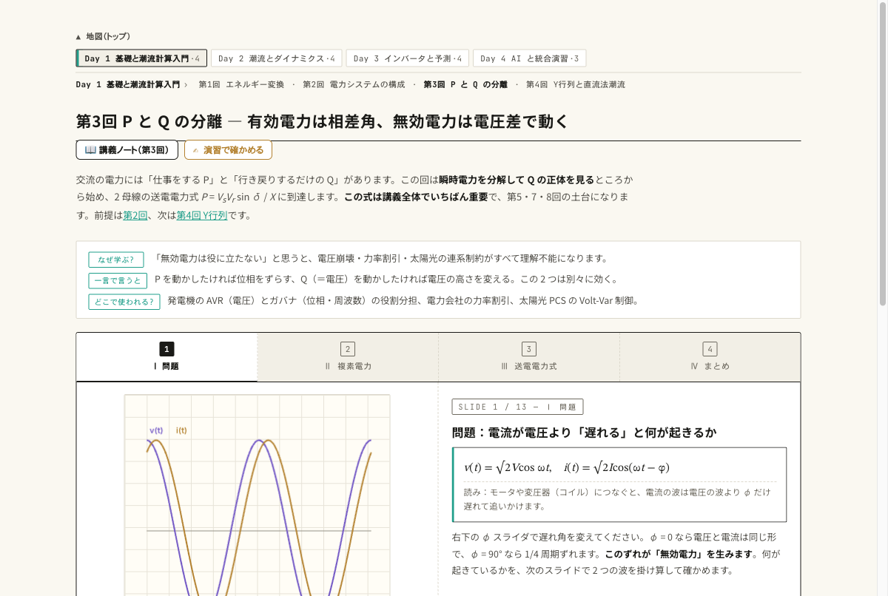

動く図 瞬時電力・フェーザ・単位法・送電電力式をブラウザ内で実計算する 13 枚のスライド。

- φ のスライダを 0 → 90° に動かし、赤（p &lt; 0）の割合が 0 → 50% に増えるのを見る
- δ を 20 → 40° にして、P だけが大きく動き Q はほとんど変わらないのを見る
- V_s を 0.95 → 1.05 にして、今度は Q が符号ごと変わるのを見る

<!-- note: 時間があれば教室で操作。無ければ宿題。演習 ex/ch03.html は学籍番号で数値が変わる。 -->

---

<!-- _class: blocks -->

# なぜそう考えるか — 単位法と P–δ/Q–V

  なぜ単位法を使うのか
  ①変圧器の一次・二次の換算が不要になる ②数値が 1 前後に揃う ③機器の定数が容量によらず似た値になり（変圧器の %Z は 5〜15%）、経験で妥当性を判断できる。

  なぜ P は δ で、Q は V なのか
  送電線は X ≫ R。X だけの線路では、位相差が電流の「向き」を、電圧差が電流の「大きさの余り」を作る。R が大きい配電線では分離が崩れる（第6回）。

  落とし穴
  三相基準（S = √3 V I）と単相基準を混ぜない。V_base は線間電圧で統一し、Z_base = V_base²/S_base で √3 が消えることを一度確かめておく。

<!-- note: この 3 つは口頭試問の定番。特に「なぜ P は δ か」を自分の言葉で言えるか。 -->

---

<!-- _class: figure-full -->
<!-- source: コード/fig_ch03.py -->

# よくある誤解

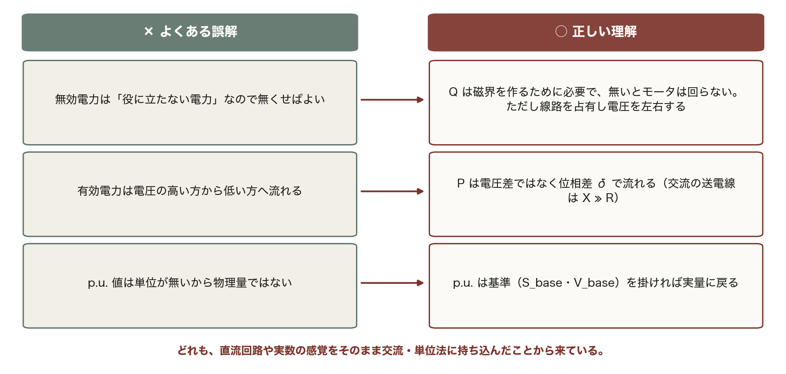

「P は電圧差で流れる」は直流回路の直感の持ち込み。交流の送電線（X ≫ R）では、電圧差ではなく位相差 δ が P を決める。

---

<!-- _class: takeaway -->

# 持ち帰る 3 点

P は δ で、Q は V で運ばれる。この 1 行が第4回から第15回までの背骨になる

<li>S = VI* = P + jQ。力率が下がると電流は 1/cos φ、損失は 1/cos²φ で増える（0.8 で 1.56 倍）</li>
<li>単位法：Z_pu = Z S_base/V_base²。変圧器が消え、10 Ω は両側で 0.230 p.u.</li>
<li>P = V_sV_r sin δ/X、Q_r = (V_sV_r cos δ − V_r²)/X。δ = 90° の P_max が定態安定限界</li>

<!-- note: 最初の statement をもう一度。次回はこの 2 母線を n 母線に一般化して Y_bus を組む。 -->

---

<!-- _class: end -->

# 次回：第4回 潮流計算の理論（1）

演習 ex/ch03.html で数値を変えて確かめる

系統の配線を 1 つの行列 Y_bus に書き、電力方程式を立てる
