<!-- _class: title -->

# 第4回 潮流計算の理論（1）
## 系統を 1 つの行列で書く — Y_bus と電力方程式
Day 1・コマ 4 ／ 教科書 第4章

<!-- note: Day 1 の最後のコマ。目的は「配線は行列に、需給は方程式に置き換わる」という見方と、「未知数を数えられる」こと。90 分で 4 章、例題 4 つ。解法（NR 法）は第5回。 -->

---

<!-- _class: statement -->

系統の配線は 1 つの行列 Y_bus に、各母線の需給は電力方程式に集約される。解くべき未知数は N_PV + 2N_PQ 個。

<!-- note: この 1 文を最後にもう一度見せる。「行列」「方程式」「未知数の数」の 3 語がキーワード。 -->

---

<!-- _class: graphical-abstract -->

# この回の全体像

## 一枚で｜問い → 課題 → 道具 → 到達点

  問い
  系統の配線と需給を、計算機に渡せる **1 組の式** にできるか。3 母線でも 1 万母線でも同じ手順で組めるか。

  課題
  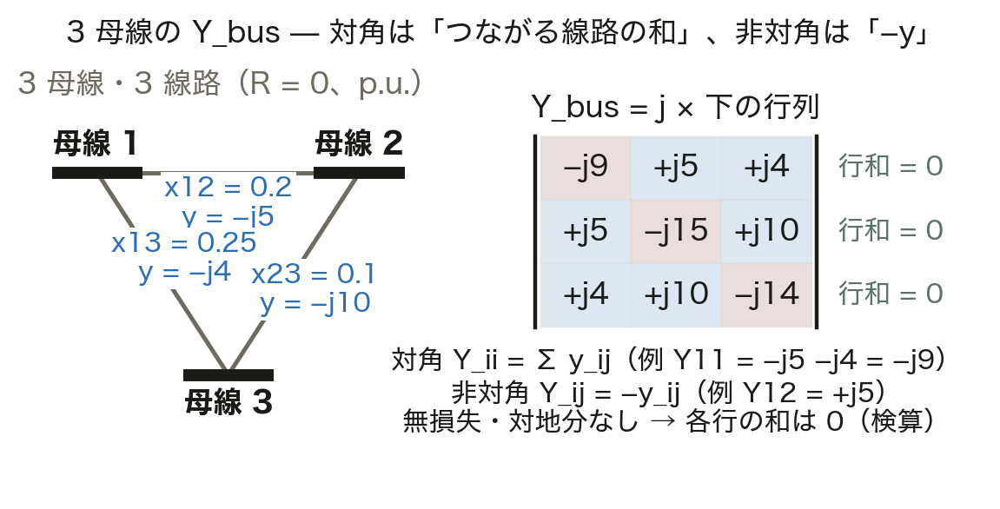
  配線は行列 Y_bus に。対角は **和**、非対角は **−y**。線路 1 本で 4 か所。

  道具
  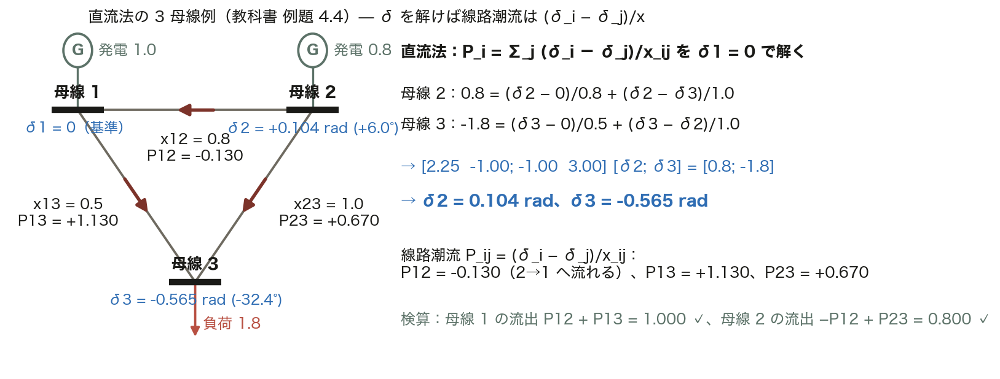
  KCL → S = VI* → 母線種別 → 直流法
  電力方程式を ==導出== し、未知数を数え、直流法で手計算する。

  到達点
  22 個
  IEEE 14 母線の未知数は 4 + 2 × 9 = 22。数えられれば、第5回の解法の設計図が描ける。

数値はすべて本資料の Python コード（コード/fig_ch04.py、pandapower の case14 / case118）で計算。

<!-- note: 最初の 2 枚で全体像を渡す。右下の「22 個」は IEEE 14 母線の未知数。第5回でこの 22 × 22 のヤコビアンを解く。 -->

---

<!-- _class: sections -->

# 現場で起きたこと — 潮流計算は毎分回っている

  数千母線の実系統と疎行列
  IEEE 118 母線でも Y_bus の非零要素は ==3.4%==、1 万母線なら推定 0.06% しかない。各母線につながる線路は数本だから。密行列で持つと 1 万母線で 1 億要素・約 1.6 GB。疎行列を使わないと、中央給電の EMS は数分ごとの潮流計算を回せない。

  電力市場を動かす直流法潮流
  地点別限界価格（第14回）や連系線の空き容量の評価は、線形で 1 回で解ける直流法潮流で回っている。IEEE 14 母線で交流法と比べると線路潮流のずれは最大 9 MW。「厳密でなくても速くて十分」な場面が実務には多い。

<!-- note: 今日の 2 つの道具（Y_bus と直流法）がそのまま現場にある、という話。3.4% と 9 MW は後の図で実際に出す。 -->

---

<!-- _class: figure-full -->
<!-- source: コード/fig_ch04.py -->

# たとえ話 — 道路網の「通りやすさ表」

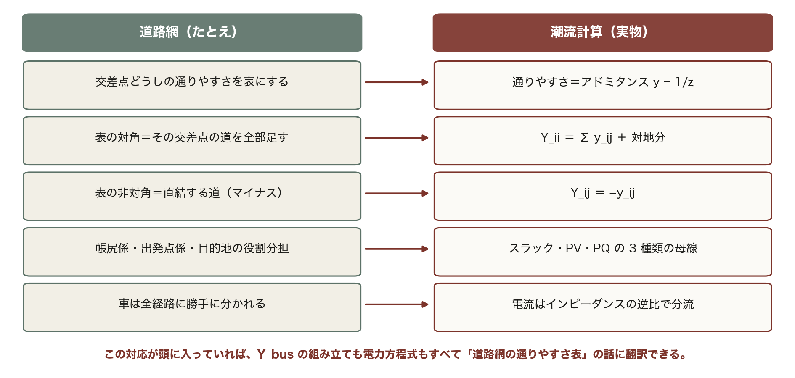

たとえ話が崩れる点も押さえておく。道は「通れる／通れない」だが、電気は位相も持つ。だから式が非線形になる。

---

<!-- _class: agenda -->

# この回の地図

1. Y_bus の組み立て — 機械的に作れる
2. 電力方程式の導出 — キルヒホッフから P, Q へ
3. 母線種別と未知数の数 — なぜ 3 種類か
4. 直流法潮流 — 手計算で概略をつかむ

---

<!-- _class: divider -->

# Ⅰ. Y_bus の組み立て

## 配線を 1 枚の表にする — 対角は和、非対角はマイナス

---

<!-- _class: figure-story -->
<!-- source: コード/fig_ch04.py -->

# 3 母線の Y_bus — 規則は 2 つだけ

## 読み方｜左が配線、右が行列。対角は「つながる線路の和」、非対角は「−y」

- y = 1/(jx)：−j5、−j4、−j10
- Y11 = −j5 − j4 = **−j9**
- Y12 = −y12 = **+j5**（符号反転）
- 各行の和 0 が検算になる

配線の情報はこの 3 × 3 に全部入る。線路が 100 本でも規則は同じ 2 つで、プログラムなら 10 行。

<!-- note: 学生に Y22 と Y33 を暗算させる（−j15、−j14）。「行の和が 0」は対地要素がないときだけ。充電容量があると虚部に対地分が残る（ノート 4.2.2）。 -->

---

<!-- _class: sections -->
<!-- build -->

# 導出 — キルヒホッフの電流則から I = Y_bus V

  ① 線路の電流｜母線 i から j へ I_ij = y_ij (V_i − V_j)
  線路は直列アドミタンス y_ij = 1/z_ij。両端の電圧差に比例した電流が流れる（オームの法則）。

  ② 母線の収支｜注入電流 I_i = Σ_j I_ij（電流則）
  外から注入した電流は、つながる線路に全部分かれる。I_i = (Σ_j y_ij) V_i − Σ_j y_ij V_j。**V_i の係数が対角、V_j の係数が非対角**。

  ③ 並べる｜Y_ii = Σ_j y_ij + 対地分、Y_ij = −y_ij → I = Y_bus V
  全母線分を縦に並べると行列の式になる。対称（Y_ij = Y_ji）で、線路のない i–j は 0。**疎** で **対称** はここから来る。

<!-- note: 段階開示。②で「V_i の係数」と「V_j の係数」を色分けして板書すると、対角と非対角の由来が見える。移相器があると対称が崩れる（本講義では扱わない）。 -->

---

<!-- _class: steps -->

# 例題 1 — 3 母線の Y_bus を手で組む

  1
  線路データ
  1–2: x = 0.2、1–3: x = 0.25、2–3: x = 0.1（p.u.、R は無視）

  2
  アドミタンス
  y = 1/(jx) = −j/x：y12 = −j5、y13 = −j4、y23 = −j10

  3
  対角と非対角
  Y11 = −j9、Y22 = −j15、Y33 = −j14。Y12 = +j5、Y13 = +j4、Y23 = +j10

  4
  検算
  行 1：−9 + 5 + 4 = 0、行 2：5 − 15 + 10 = 0、行 3：4 + 10 − 14 = 0

<!-- note: 手を動かす 3 分。学生に 3 と 4 をやらせる。「1/(jx) の符号はなぜマイナスか」→ 1/j = −j。よくある間違いは非対角の符号を忘れること。 -->

---

<!-- _class: figure-full -->
<!-- source: コード/fig_ch04.py -->

# 線路を 1 本足すと 4 か所だけ変わる

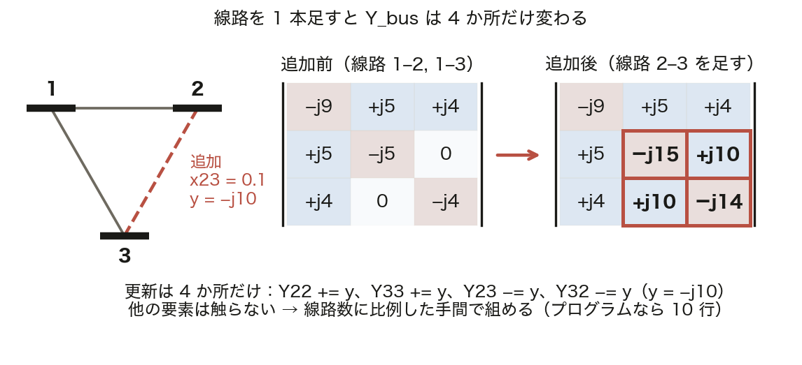

更新の手間は線路数に比例し、母線数の 2 乗では増えない。線路を外す N-1 解析でも同じ 4 か所を引くだけでよい。

<!-- note: 動く図 viz/ybus.html でこの操作をやって見せる。「線路を切る」は N-1 解析（第15回）でそのまま使う。　図の要点：Y22：−j5 → −j15（y を足す）／Y33：−j4 → −j14（y を足す）／Y23 = Y32：0 → +j10（−y）／他の 5 セルはそのまま -->

---

<!-- _class: figure-story -->
<!-- source: コード/fig_ch04.py -->

# 実系統の Y_bus は疎 — 非零は数 %

## 読み方｜黒い点が非零要素。母線が増えるほど対角線の近くしか埋まらない

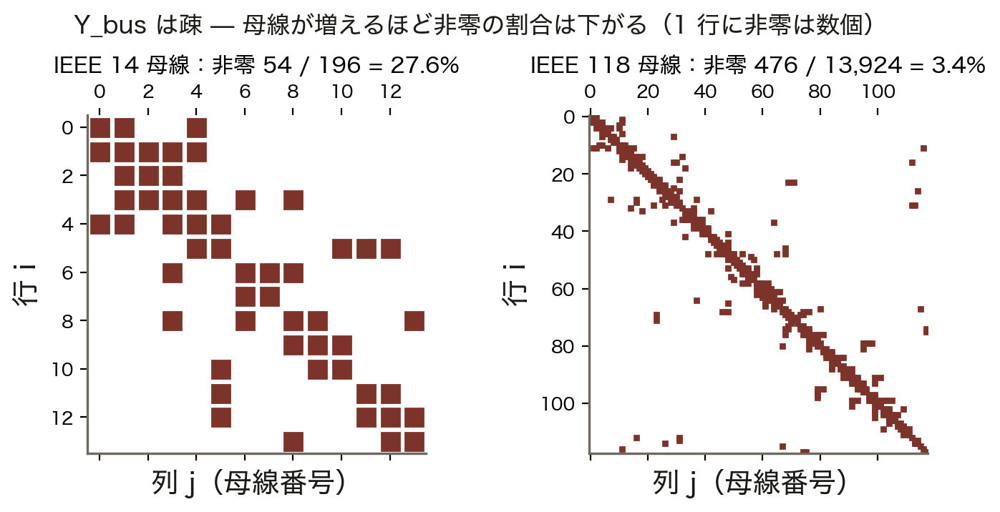

- IEEE 14：54 / 196 = **27.6%**
- IEEE 118：476 / 13,924 = **3.4%**
- 1 万母線なら推定 0.06%
- 1 行の非零 = つながる線路数 + 1

密行列で 1 万母線を持つと 1 億要素。疎行列なら 6 万。この差が「解けるか解けないか」を分ける（第5回・第6回）。

<!-- note: 118 母線の図で、対角から離れた点は「番号が離れた母線どうしの線路」。番号の付け方で見た目は変わるが非零の数は変わらない。 -->

---

<!-- _class: kpi -->

# 結果 — 母線が増えるほど Y_bus は空になる

  27.6%
  IEEE 14 母線の非零割合

  3.4%
  IEEE 118 母線

  0.06%
  1 万母線の推定（線路 2.5 本/母線）

<!-- note: 密度はおよそ 6/n。母線数 n が 10 倍になると密度は 1/10。 -->

---

<!-- _class: divider -->

# Ⅱ. 電力方程式の導出

## 電流ではなく電力が与えられる — だから非線形になる

---

<!-- _class: sections -->
<!-- build -->

# 導出 — S_i = V_i I_i* から P_i と Q_i へ

  ① 複素電力｜S_i = P_i + jQ_i = V_i I_i*（第3回）
  母線 i に注入する電力。I_i は Ⅰ章の I_i = Σ_j Y_ij V_j で電圧に置き換わる。

  ② 代入｜S_i = V_i Σ_j Y_ij* V_j*
  極形式 V_i = V_i e^{jθ_i}、Y_ij = G_ij + jB_ij を入れると S_i = Σ_j V_i V_j (G_ij − jB_ij) e^{j(θ_i − θ_j)}。**電圧の積 V_i V_j** がここで生まれる。

  ③ オイラー｜e^{jθ_ij} = cos θ_ij + j sin θ_ij で実部と虚部に分ける
  P_i = V_i Σ_j V_j (G_ij cos θ_ij + B_ij sin θ_ij)、Q_i = V_i Σ_j V_j (G_ij sin θ_ij − B_ij cos θ_ij)。母線ごとに **P の式と Q の式が 1 本ずつ**。

<!-- note: 段階開示。②の共役で Y_ij* = G − jB になる符号に注意。③は板書で 1 行ずつ。2 母線・無損失にすると第3回の P = V_sV_r sinδ/X に戻ることを確認させる。 -->

---

<!-- _class: equation -->

# 電力方程式 — 母線ごとに P と Q が 1 本ずつ

$$P_i = V_i \sum_{j} V_j\,(G_{ij}\cos\theta_{ij} + B_{ij}\sin\theta_{ij}), \quad Q_i = V_i \sum_{j} V_j\,(G_{ij}\sin\theta_{ij} - B_{ij}\cos\theta_{ij})$$

  $G_{ij} + jB_{ij}$
  Y_bus の要素。配線の情報はここに全部入っている
  $\theta_{ij}$
  θ_i − θ_j。母線間の位相差。P を運ぶのはこれ（第3回）
  $V_i V_j$
  電圧の積。ここと cos/sin が非線形の正体
  $P_i, Q_i$
  左辺は与えられる注入電力（発電 − 負荷）。式の数は母線数 × 2

<!-- note: 2 母線・G = 0・B12 = −1/X で P1 = −V1V2 sin(θ1 − θ2)/X。符号の向き（注入か流出か）を除けば第3回の式。「一般式が特殊ケースを含む」を必ず確かめさせる。 -->

---

<!-- _class: figure-full -->
<!-- source: コード/fig_ch04.py -->

# なぜ非線形か — sin と積

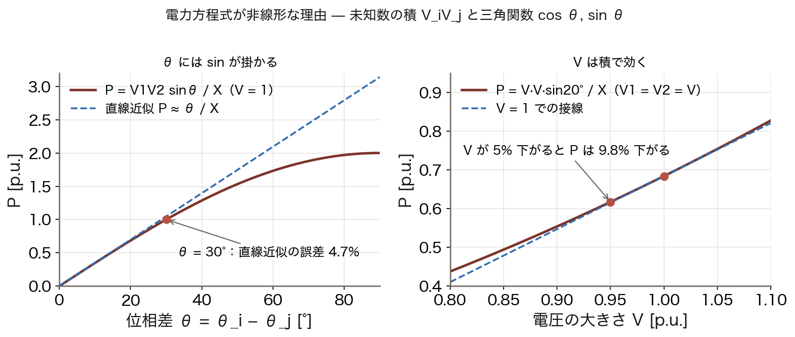

電流を未知数にすれば I = Y_bus V は線形だが、現場で与えられるのは「この工場は 50 MW」という電力。S = VI* の形が非線形を持ち込む。

<!-- note: 「なぜ電流で解かないのか」という質問は毎年出る。答え：負荷は電力で指定されるから。電流で指定できるなら潮流計算は要らない。　図の要点：θ = 30° で直線近似の誤差 4.7%／θ = 90° で P は頭打ち（第7回）／V が 5% 下がると P は 9.8% 減／未知数の積と三角関数が非線形の源 -->

---

<!-- _class: figure-story -->
<!-- source: コード/fig_ch04.py -->

# 電圧を与えれば P, Q は計算できる（順問題）

## 読み方｜V と θ を仮に与えて式に入れた結果。和が 0 にならない分が損失

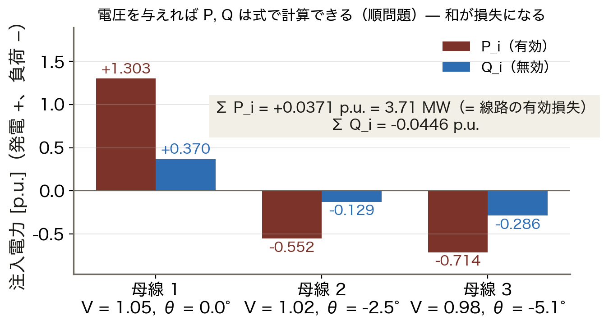

- 母線 1：P = +1.303（発電）
- 母線 2, 3：P = −0.552、−0.714（負荷）
- Σ P_i = **+0.0371 p.u. = 3.71 MW**
- これが線路の有効損失

潮流計算はこの逆問題。P, Q を与えて V, θ を探す。損失は解くまで分からないから、誰かが帳尻を引き受ける必要がある（Ⅲ章のスラック）。

<!-- note: 順問題は式に入れるだけで一発。逆問題（潮流計算）は反復が要る。「ΣP = 損失」がスラック母線の必要性への伏線。 -->

---

<!-- _class: steps -->

# 例題 2 — 3 母線で P_2 を手計算する

  1
  条件
  例題 1 の系統（G = 0）。V1 = 1.00∠0°、V2 = 0.98∠−3°、V3 = 0.96∠−5°

  2
  残る項
  G = 0 なので P2 = V2 Σ_j V_j B_2j sin θ_2j。j = 2 は sin 0 = 0 で消える

  3
  代入
  B21 = 5、B23 = 10。P2 = 0.98 [1.00 × 5 × sin(−3°) + 0.96 × 10 × sin(2°)]

  4
  結果
  = −0.256 + 0.328 = **+0.072 p.u. = 7.2 MW**（100 MVA 基準）。母線 2 はわずかに発電側

<!-- note: 学生に 3 を計算させる（3 分）。θ_23 = −3 − (−5) = +2° の符号を間違えやすい。「位相が進んでいる側から遅れている側へ P が流れる」で検算。 -->

---

<!-- _class: divider -->

# Ⅲ. 母線種別と未知数の数

## 4 量のうち 2 つを与える — スラックは 1 つだけ

---

<!-- _class: figure-full -->
<!-- source: コード/fig_ch04.py -->

# 母線種別 — 4 量のうち 2 つを与える

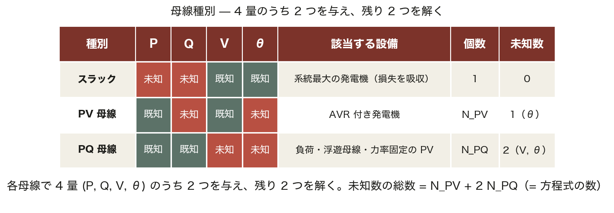

PV 母線では Q の式は求解には使わず、θ と V が求まった後に Q を計算するために使う。

<!-- note: 「発電機があるから PV」ではない。電圧を制御しているかで決まる。力率 1 固定のインバータは Q = 0 が既知なので PQ。第9回で電圧制御付きインバータの話につながる。　図の要点：スラック：V, θ 既知（P, Q は事後）／PV：P, V 既知（AVR）。未知は θ／PQ：P, Q 既知。未知は V と θ／力率固定の太陽光は PQ -->

---

<!-- _class: sections -->

# なぜスラックは 1 つ必要で、1 つで足りるのか

  理由 1｜損失は解くまで分からない
  全母線で P を指定すると Σ P_i = 損失 を事前に満たさなければならないが、損失は解いて初めて出る（前の図の 3.71 MW）。1 つの母線だけ P を自由にして **帳尻（slack = たるみ）** を吸わせる。

  理由 2｜位相の基準が要る
  式には θ_i − θ_j の **差** しか現れない。全部に同じ定数を足しても式は変わらず、解が定まらない。1 つの母線で θ = 0 と決める。本講義ではスラックを母線 1 に取る。

  PV → PQ の切り替え｜Q の限界に当たったとき
  AVR には無効電力の限界 Q_min ≤ Q ≤ Q_max がある。超えたら Q を限界値に固定して **PQ 母線に変える**（第5回）。だから N_PV は反復の途中で減ることがある。

<!-- note: 2 つのスラックを置くと損失の分担が決まらず解が一意でない。教科書はスラックノードと基準ノードを区別するが、通常は同じノード。 -->

---

<!-- _class: steps -->

# 例題 3 — 未知数を数える

  1
  12 母線系統
  スラック 1、PV 3、PQ 8。未知数 = 3 × 1 + 8 × 2 = **19**。ヤコビアンは 19 × 19

  2
  5 母線（判定つき）
  大型火力＝スラック、AVR 付き水力＝PV、負荷 2 母線＝PQ、力率 1 固定の太陽光＝**PQ**

  3
  数える
  N_PV = 1、N_PQ = 3。未知数 = 1 + 2 × 3 = **7**

  4
  IEEE 14 / 118
  14 母線：PV 4、PQ 9 → 22。118 母線：PV 53、PQ 64 → 181（pandapower で確認）

<!-- note: 学生に 2 と 3 をやらせる。太陽光の判定が要注意。「発電機があるから PV」と答えたら、電圧を制御しているかを問い返す。 -->

---

<!-- _class: figure-story -->
<!-- source: コード/fig_ch04.py -->

# 未知数は母線数のほぼ 2 倍で増える

## 読み方｜横軸が母線数、縦軸が未知数。PV の割合が高いほど傾きは 2 から下がる

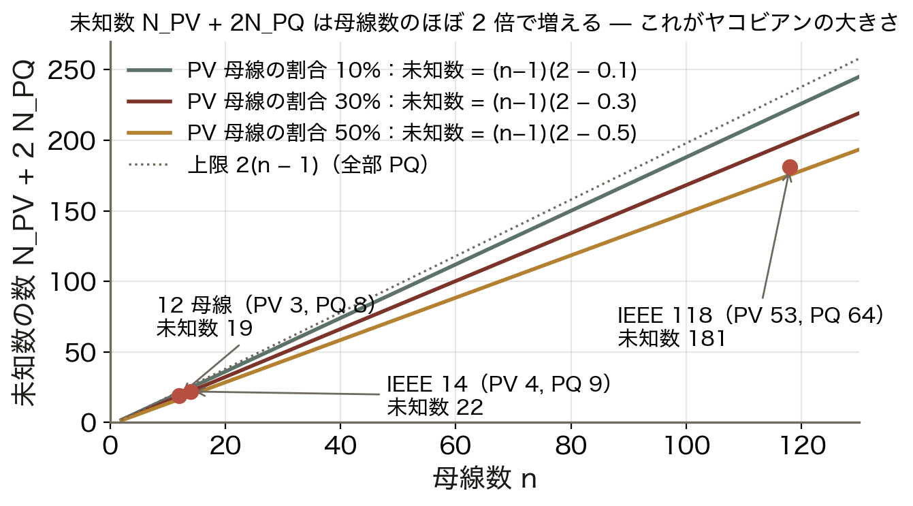

- 12 母線（PV 3, PQ 8）：**19**
- IEEE 14（PV 4, PQ 9）：**22**
- IEEE 118（PV 53, PQ 64）：**181**
- 上限は 2(n − 1)（全部 PQ）

この数がヤコビアン行列の 1 辺。1 万母線なら 2 万近い未知数を反復ごとに解く。疎性（Ⅰ章）がなければ不可能。

<!-- note: IEEE 118 の PV 割合が 45% と高いのは発電機母線が多いから。実系統では PQ が圧倒的に多く、傾きは 2 に近づく。 -->

---

<!-- _class: kpi -->

# 結果 — 未知数 = N_PV + 2N_PQ

  19
  12 母線（PV 3、PQ 8）

  22
  IEEE 14 母線（PV 4、PQ 9）

  181
  IEEE 118 母線（PV 53、PQ 64）

<!-- note: 3 つの数は第5回でそのままヤコビアンの大きさとして再登場する。 -->

---

<!-- _class: divider -->

# Ⅳ. 直流法潮流

## 3 つの近似で線形にする — 1 回解けば終わり

---

<!-- _class: sections -->
<!-- build -->

# 導出 — 3 つの近似で P = B′θ

  近似 1｜R ≈ 0、対地アドミタンスも無視 → G = 0
  架空送電線は X/R ≈ 5〜15（第3回）。Y_bus = jB となり、P_i = V_i Σ_j V_j B_ij sin θ_ij。**cos の項（Q 側）が消える**。

  近似 2｜V_i ≈ 1.0 p.u.（正常時は 0.95〜1.05）
  電圧の積 V_i V_j が 1 になり、P_i = Σ_j B_ij sin θ_ij。**未知数は θ だけ**になる。

  近似 3｜sin θ_ij ≈ θ_ij（位相差が小さい、30° で誤差 4.7%）
  P_i = Σ_j (θ_i − θ_j)/x_ij、つまり **P = B′θ**（B′_ii = Σ 1/x_ij、B′_ij = −1/x_ij）。線形なので反復不要。直流回路の I = V/R と同じ形。

<!-- note: 段階開示。「直流法」は直流送電の話ではなく、V ↔ δ、I ↔ P、R ↔ X の対応で直流回路と同じ式になるから。Q・電圧・損失は出ない。 -->

---

<!-- _class: figure-full -->
<!-- source: コード/fig_ch04.py -->

# 直流法の 3 母線例 — δ を解けば潮流が出る

P_ij = (δ_i − δ_j)/x_ij は、位相が進んでいる母線から遅れている母線へ電力が流れることを表している。

<!-- note: δ3 = −32° は近似 3 の限界に近い。教科書の題材なのでそのまま使うが、実系統では 30° 以内が普通。P12 の負号の意味を必ず聞く。　図の要点：2 元連立：[2.25 −1; −1 3][δ2; δ3]／δ2 = +0.104、δ3 = −0.565 rad／P12 = −0.130（2 → 1 へ逆流）／P13 = 1.130、P23 = 0.670 -->

---

<!-- _class: steps -->

# 例題 4 — 直流法を手で解く

  1
  条件
  x12 = 0.8、x13 = 0.5、x23 = 1.0。注入 P1 = 1.0、P2 = 0.8、P3 = −1.8。δ1 = 0

  2
  母線 2, 3 の収支
  0.8 = δ2/0.8 + (δ2 − δ3)/1.0、−1.8 = δ3/0.5 + (δ3 − δ2)/1.0

  3
  解く
  2.25δ2 − δ3 = 0.8、−δ2 + 3δ3 = −1.8 → δ2 = 0.104、δ3 = −0.565 rad

  4
  潮流と検算
  P12 = −0.104/0.8 = −0.130、P13 = 0.565/0.5 = 1.130、P23 = 0.670。母線 2：0.130 + 0.670 = 0.800 ✓

<!-- note: 学生に 3 を解かせる（行列式 5.75）。「母線 1 の式は使わないのか」→ スラックなので不要。解いた後に P1 = P12 + P13 で出る。 -->

---

<!-- _class: figure-story -->
<!-- source: コード/fig_ch04.py -->

# IEEE 14 母線 — 直流法は交流法とどれだけ違うか

## 読み方｜横軸が交流法、縦軸が直流法の線路潮流。点線の上に乗れば一致

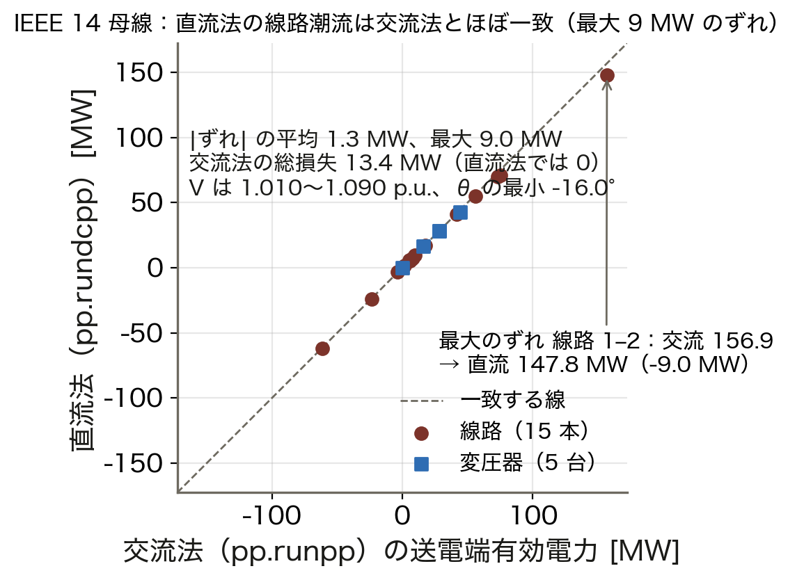

- 20 ブランチの |ずれ| 平均 **1.3 MW**
- 最大 9.0 MW（線路 1–2、157 → 148）
- 交流法の総損失 13.4 MW は直流法で 0
- V は 1.01〜1.09、θ の最小 −16°

概略の分布は直流法で十分読める。ずれるのは損失を運ぶ重い線路。電圧・無効電力・損失が要るなら交流法（第5回）。

<!-- note: 使い分け：N-1 スクリーニング・市場計算・手計算は直流法、電圧問題・損失評価は交流法。配電系統（R ≈ X）では直流法の誤差が大きい。 -->

---

<!-- _class: kpi -->

# 結果 — 直流法は 1 回で解け、ずれは数 MW

  1 回
  線形なので反復不要（交流法は数回の反復）

  9 MW
  IEEE 14 母線の線路潮流の最大ずれ

  13 MW
  直流法では見えない総損失

<!-- note: 「速いが Q と損失は出ない」を数字で。 -->

---

<!-- _class: figure -->

# 動く図で試す — viz/ybus.html

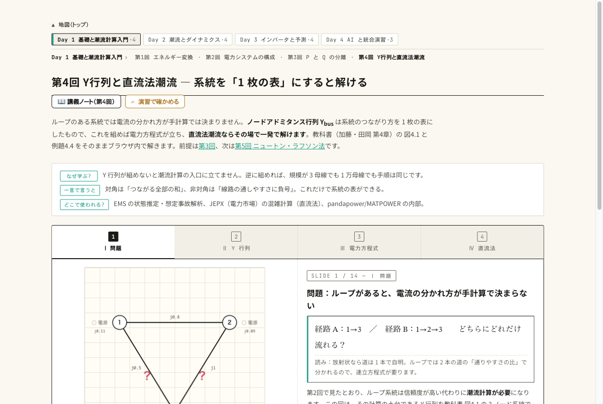

動く図 Y 行列の構築と直流法潮流（教科書 例題 4.4）をブラウザ内で実計算する。

- 線路を 1 本切って、Y_bus の 4 か所だけが変わり、対角が「つながる線路の和」のまま保たれるのを見る
- 発電 P1 のスライダを動かし、δ2, δ3 と 3 本の線路潮流がどう配分されるかを読む
- 対角要素の虚部が充電容量の分だけ行和に残ることを検算する

<!-- note: 演習 ex/ch04.html は学籍番号で数値が変わる。動く図で手順を見せてから演習へ。 -->

---

<!-- _class: blocks -->

# なぜそう考えるか — 非線形・3 種類・スラック

  なぜ非線形なのか
  与えられるのが電流ではなく電力だから。S = VI* に I = Y_bus V を入れると V の積と cos/sin が入り、連立一次方程式にならない。電流で指定できるなら潮流計算は要らない。

  なぜ母線は 3 種類なのか
  各母線は P, Q, V, θ の 4 量のうち 2 つを与える。負荷は P, Q（PQ）、AVR 付き発電機は P と V（PV）。損失は解くまで分からないので、誰かが帳尻を引き受ける（スラック：V, θ）。

  落とし穴
  スラック母線は 1 つだけ。2 つ置くと損失の分担が決まらず解が定まらない。位相の基準もスラックが担う。発電機があっても電圧を制御しなければ PV ではない。

---

<!-- _class: figure-full -->
<!-- source: コード/fig_ch04.py -->

# よくある誤解

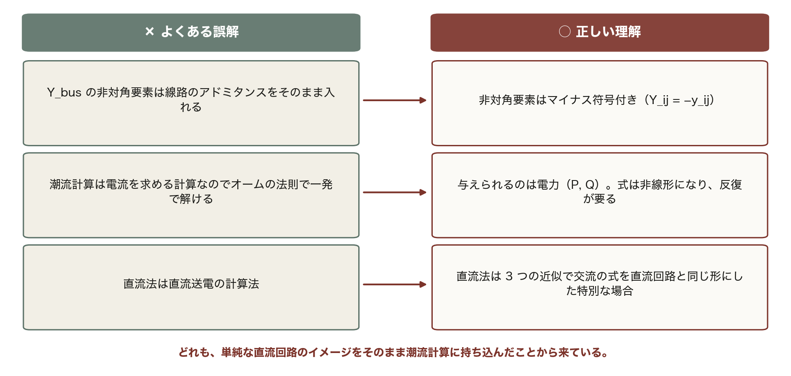

3 つ目の誤解は名前のせい。V と δ、I と P、R と X が対応することを板書で示す。

---

<!-- _class: takeaway -->

# 持ち帰る 3 点

配線は Y_bus、需給は電力方程式。未知数 N_PV + 2N_PQ を反復で解くのが潮流計算

<li>Y_ii = Σ y_ij、Y_ij = −y_ij。対称で疎（IEEE 118 で 3.4%）。線路 1 本で 4 か所更新</li>
<li>母線は 4 量のうち 2 つを与える。スラックは 1 つだけで損失と位相基準を引き受ける</li>
<li>直流法：G = 0、V = 1、sin θ ≈ θ。P = B′θ を 1 回解く。ずれは数 MW、Q と損失は出ない</li>

---

<!-- _class: end -->

# 次回：第5回 潮流計算の理論（2）

演習 ex/ch04.html で数値を変えて確かめる

非線形をどう解くか — ニュートン・ラフソン法とヤコビアン
