<!-- _class: title -->

# 第5回 潮流計算の理論（2）
## 非線形を「接線で」解く — ニュートン・ラフソン法
Day 2・コマ 5 ／ 教科書 第4章

<!-- note: 第4回で立てた非線形方程式を「どう解くか」の回。目的は 2 つ。(1) 接線で跳ぶ＝ヤコビアンで割る、を 1 変数から多変数へ同じ形で見せる。(2) 「4 回で収束する」「収束しない＝解が無い」という数字の感覚を持ち帰る。90 分で 4 章、例題 3 つ。 -->

---

<!-- _class: statement -->

潮流方程式は非線形だが、今いる点で接線を引いて交点へ跳ぶことを繰り返せば、3〜5 回で解に着く。跳ぶ方向を決めるのがヤコビアン。

<!-- note: この 1 文を最後にもう一度見せる。「接線」「ヤコビアン」「3〜5 回」の 3 語がキーワード。 -->

---

<!-- _class: graphical-abstract -->

# この回の全体像

## 一枚で｜問い → 課題 → 道具 → 到達点

  問い
  潮流方程式は非線形で一発では解けない。**何回反復すれば**解けるのか。1,000 母線なら 1,000 回か。そして「解けない」とき何が起きているのか。

  課題
  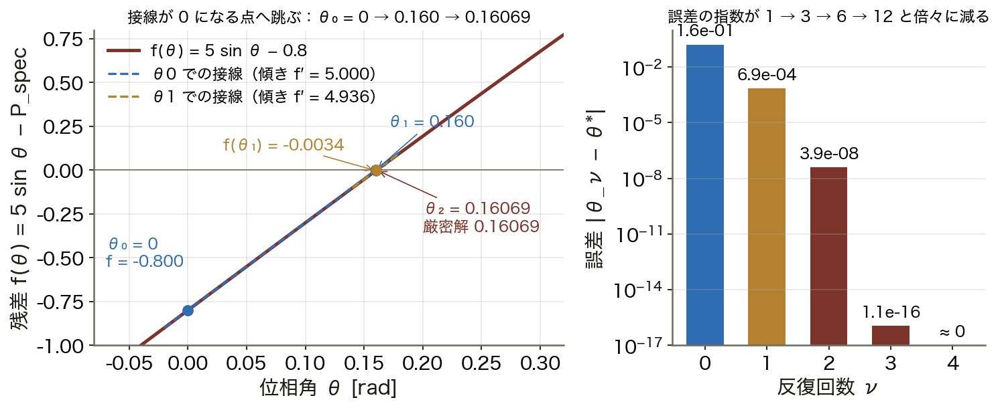
  接線を引いて 0 の点へ跳ぶ。**2 回で 5 桁**合う。

  道具
  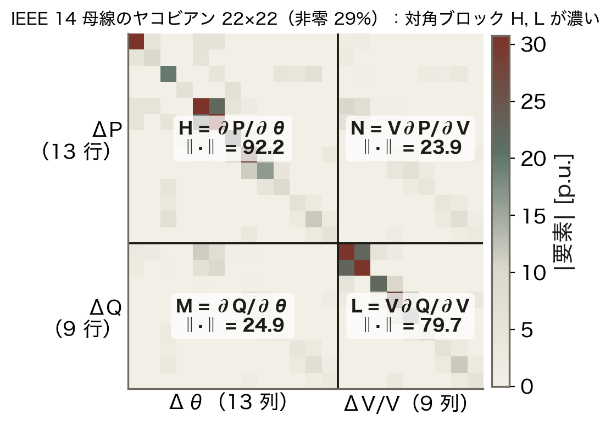
  テイラー展開 ▶ ヤコビアン ▶ 2 次収束
  跳ぶ方向 J を ==導出== する。

  到達点
  4回
  NR 法は規模によらず 3〜5 回。GS 法は 13 回。

数値はすべて本資料の Python コード（コード/fig_ch05.py）で計算。3 母線系統は viz/newton.html と同じ。

<!-- note: 右下の「4 回」が今日の結論。左の図は例題 1、右の図は IEEE 14 母線のヤコビアンで、Ⅱ章で戻ってくる。 -->

---

<!-- _class: sections -->

# 現場で起きたこと — 「解けない」は危険信号

  収束しない潮流計算
  運用の現場では、潮流計算が収束しないことを ==電圧安定限界の兆候== として扱う。解が「見つからない」のではなく「存在しない」状態に近づいている。2003 年北米大停電の調査でも、状態推定が収束せず運用者が系統の状態を把握できない時間帯があった。

  EMS は毎分、何百回も解く
  中央給電の計算機は数分ごとに潮流を回し、想定事故（N-1）を数百ケース評価する。高速デカップル法や直流法が使われるのは、この回数をこなすため。「速さ」は実務では品質の一部。

<!-- note: 今日は「どう解くか」だけでなく「なぜ解けないことがあるか」まで押さえる。Ⅳ章の Q 限界の図で、負荷 2.5 倍から先は本当に解が無くなるのを見せる。 -->

---

<!-- _class: figure-full -->
<!-- source: コード/fig_ch05.py -->

# たとえ話 — 霧の坂道を谷底へ下りる

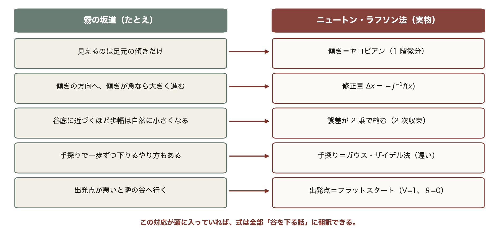

坂道は 1 次元だが、潮流は数千次元。それでも「接線で跳ぶ」考え方は全く同じである。

<!-- note: この 5 行は今日の内容を先取りしている。ヤコビアン・2 次収束・ガウス・ザイデル法・フラットスタートが、あとで順番に出てくる。Ⅳ章の初期値の図で「隣の谷」を実際に見せる。 -->

---

<!-- _class: agenda -->

# この回の地図

1. 接線で跳ぶ — 1 変数のニュートン法と 2 次収束
2. 潮流方程式へ — ヤコビアン H, N, M, L と 3 母線の実例
3. 高速デカップル法 — P–δ / Q–V 分離で軽くする
4. 初期値と PV 母線の Q 限界 — 「解けない」を読む

---

<!-- _class: divider -->

# Ⅰ. 接線で跳ぶ

## 1 変数で感覚をつかむ — 誤差の桁が毎回倍になる

---

<!-- _class: figure-full -->
<!-- source: コード/fig_ch05.py -->

# 接線で跳ぶ — 2 回で 5 桁合う

曲線を接線で置き換えるから 1 回で大きく進み、解に近づくほど接線と曲線が重なって次の一手が正確になる。誤差の指数は 1 → 3 → 6 → 12 と倍々で増え、これが 2 次収束である。

<!-- note: 2 母線・無損失・V = 1・X = 0.2 で P = 0.8 を送る問題。学生に θ₁ = 0.16 を暗算させる。「なぜ 1 回目でほぼ当たるのか」→ sin θ ≈ θ だから。θ₀ → θ₁ → θ₂ の数値と誤差の推移は図にそのまま示されている。 -->

---
<!-- _class: figure-full -->
<!-- source: コード/fig_ch05.py -->

# 導出 — なぜ 2 次収束するのか

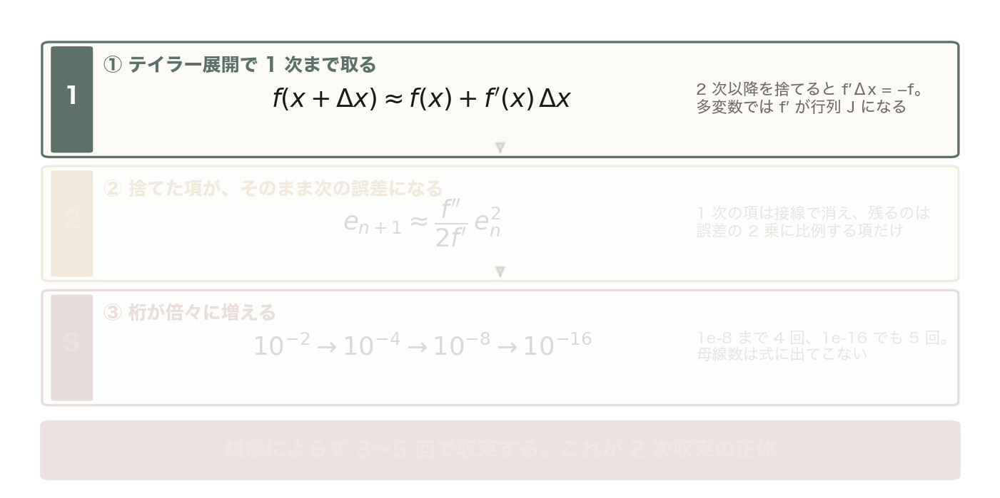

2 次以降を捨てると f′(x) Δx = −f(x)。多変数では f′ が行列 J になり、JΔx = −f(x) が修正方程式。

<!-- note: 段階開示。①で「接線＝1 次で打ち切る」を強調。②は板書で x* を代入して見せると納得が早い。③で「母線数が出てこない」を言い切る。ここが GS との決定的な差。 -->

---

<!-- _class: figure-full -->
<!-- source: コード/fig_ch05.py -->

# 導出 — なぜ 2 次収束するのか

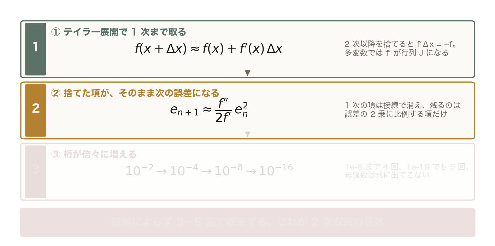

真の解 x* で f(x*) = 0 を展開すると、1 次の項は接線で消え、残るのは e_n² に比例する項 だけ。今の誤差が 10⁻² なら次は 10⁻⁴ のオーダー。

<!-- note: 前の 1 枚に ② を足しただけ。薄い段はまだ出していない段。 -->

---

<!-- _class: figure-full -->
<!-- source: コード/fig_ch05.py -->

# 導出 — なぜ 2 次収束するのか

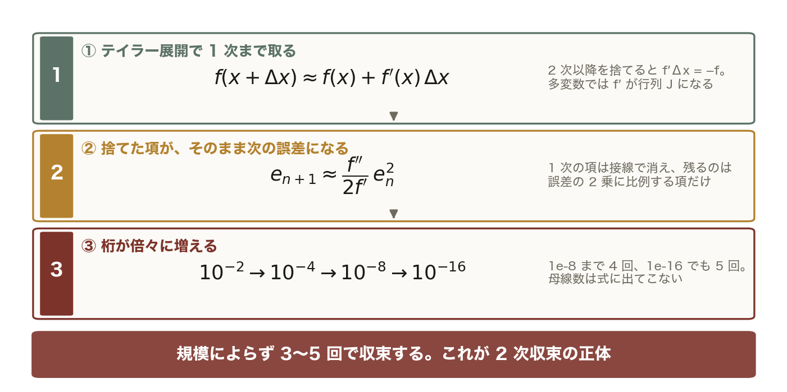

10⁻⁸ に届くのに 4 回。10⁻¹⁶ でも 5 回。系統の母線数は式に出てこないので、規模によらず 3〜5 回で収束する。

<!-- note: 前の 1 枚に ③ を足しただけ。薄い段はまだ出していない段。 -->
---

<!-- _class: figure-story -->
<!-- source: コード/fig_ch05.py -->

# 収束の次数 — 傾き 1 か 2 か

## 読み方｜横軸が今回の誤差、縦軸が次回の誤差。両対数で点が乗る直線の傾きが次数

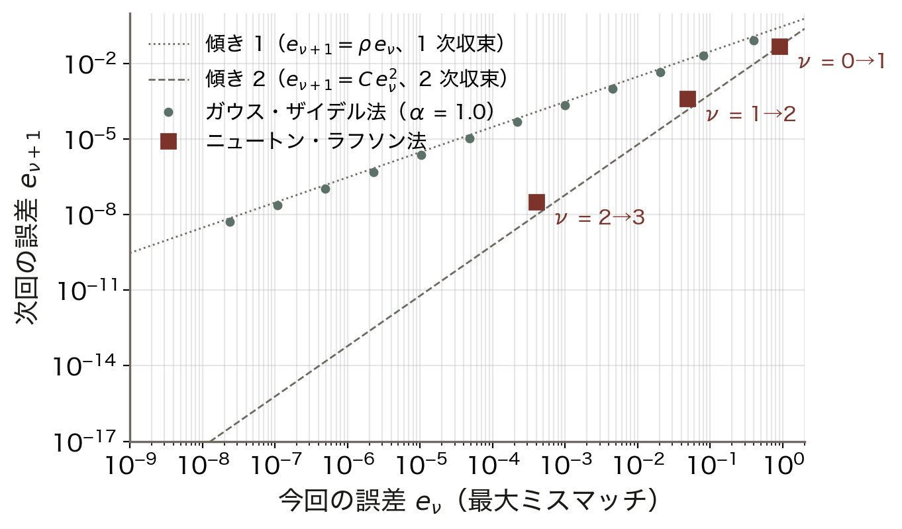

- 横軸 e_n、縦軸 e_{n+1}（対数）
- GS は傾き 1：e_{n+1} = ρ e_n
- NR は傾き 2：e_{n+1} = C e_n²
- 桁数が倍々：1 → 2 → 4 → 8

1 次収束は毎回「同じ比率」でしか減らないので、桁を 1 つ稼ぐのに毎回同じ回数がかかる。2 次収束は近づくほど加速する。

<!-- note: 3 母線系統（Ⅱ章）の実測値で描いている。GS の ρ ≈ 0.2。「傾き 1 の直線を伸ばして 10⁻¹⁶ に届くには何回か」と聞く → 約 23 回。 -->

---

<!-- _class: steps -->

# 例題 1 — 1 変数を 2 回反復する

  1
  式を立てる
  P = V₁V₂ sin θ / X、V = 1、X = 0.2、P_spec = 0.8 → f(θ) = 5 sin θ − 0.8、f′(θ) = 5 cos θ

  2
  反復 1
  θ₀ = 0：f = −0.800、f′ = 5.000 → θ₁ = 0 − (−0.800)/5.000 = 0.160 rad

  3
  反復 2
  f(θ₁) = −0.00341、f′ = 4.936 → θ₂ = 0.160 + 0.00341/4.936 = 0.16069 rad

  4
  答え合わせ
  厳密解 asin(0.16) = 0.160691。誤差 1.6e-1 → 6.9e-4 → 3.9e-8。桁が 1 → 3 → 8 と倍々

<!-- note: 手を動かす 3 分。学生に 2 と 3 を計算させる。「f′ をずっと 5 のままにしたら？」→ 収束はするが 1 次になる（これが後の高速デカップル法の考え方）。 -->

---

<!-- _class: kpi -->

# 結果 — 反復 2 回で誤差は 10⁻⁸

  0.160
  反復 1 の推定 θ₁（誤差 6.9e-4）

  3.9e-8
  反復 2 の誤差（厳密解 0.160691）

  倍々
  誤差の桁数の増え方（2 次収束）

<!-- note: 「桁が倍々」は覚えて帰ってほしい言葉。3 回目で 10⁻¹⁶、つまり倍精度の限界に届く。 -->

---

<!-- _class: divider -->

# Ⅱ. 潮流方程式へ

## 接線の傾きが行列になる — ヤコビアン H, N, M, L

---

<!-- _class: figure-story -->
<!-- source: コード/fig_ch05.py -->

# 同じ系統で GS 13 回、NR 4 回

## 読み方｜3 母線系統（スラック・PV・PQ）を 2 手法で解いた最大ミスマッチの履歴

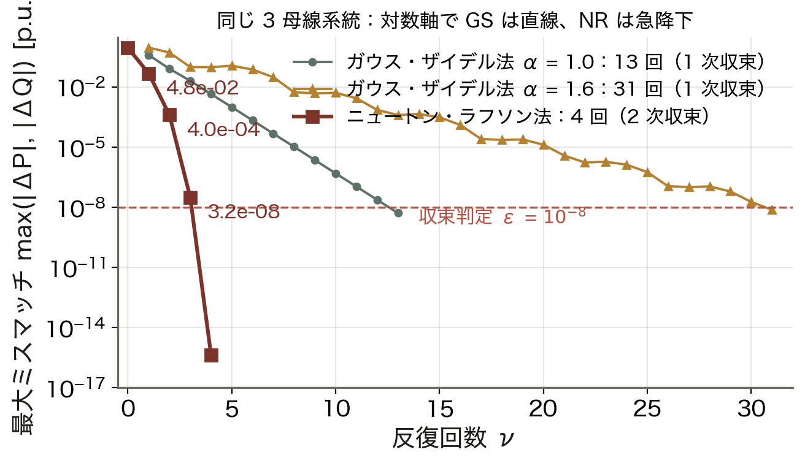

- GS α = 1.0：13 回で 10⁻⁸
- GS α = 1.6：31 回（過修正）
- NR：0.90 → 0.048 → 4e-4 → 3e-8
- 4 回目で 10⁻¹⁵（丸め誤差）

対数軸で GS は直線（1 次）、NR は急降下（2 次）。加速係数 α は大規模系統では効くが、この小さな系統では跳びすぎて逆に遅い。

<!-- note: 系統は viz/newton.html と同じ（x₁₂ = 0.06、x₁₃ = 0.24、x₂₃ = 0.18、P₂ = 0.5、P₃ = −1.0、Q₃ = −0.4）。判定はどちらも「最大ミスマッチ < 10⁻⁸」に揃えてある。GS は母線数に比例して回数が増える、NR は増えない、を次の導出につなぐ。 -->

---
<!-- _class: figure-full -->
<!-- source: コード/fig_ch05.py -->

# 導出 — ヤコビアンの 4 ブロック

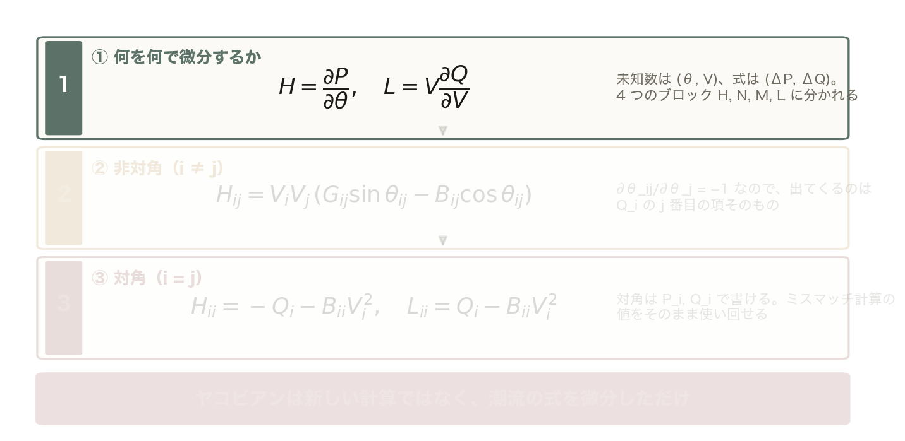

P_i = V_i Σ_j V_j (G_ij cos θ_ij + B_ij sin θ_ij) を θ_j と V_j で微分する。H = ∂P/∂θ、N = V∂P/∂V、M = ∂Q/∂θ、L = V∂Q/∂V。V は ΔV/V で正規化すると式が対称になる。

<!-- note: 段階開示。②は 1 つだけ板書で微分して見せ、残りは「同じ手順」と言う。③の「P_i, Q_i で書ける」が実装上の要点で、例題 2 で H₂₂ = 21.17 を実際に出す。 -->

---

<!-- _class: figure-full -->
<!-- source: コード/fig_ch05.py -->

# 導出 — ヤコビアンの 4 ブロック

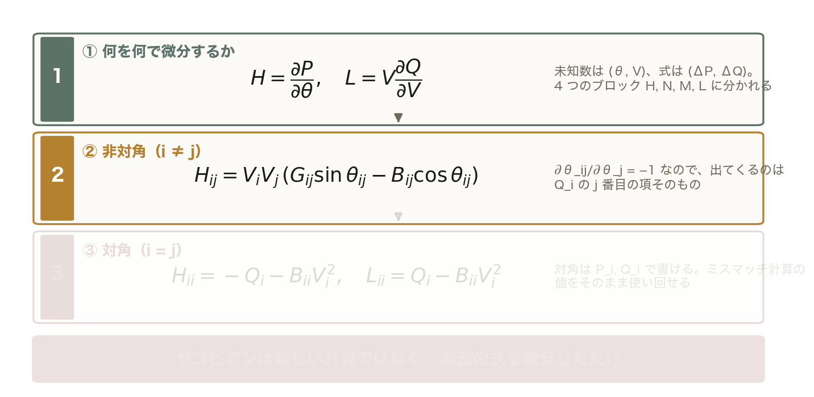

θ_ij = θ_i − θ_j なので ∂θ_ij/∂θ_j = −1。出てくる式は Q_i の j 番目の項そのもの。同様に N_ij = V_iV_j (G_ij cos θ_ij + B_ij sin θ_ij)、M_ij = −N_ij、L_ij = H_ij。

<!-- note: 前の 1 枚に ② を足しただけ。薄い段はまだ出していない段。 -->

---

<!-- _class: figure-full -->
<!-- source: コード/fig_ch05.py -->

# 導出 — ヤコビアンの 4 ブロック

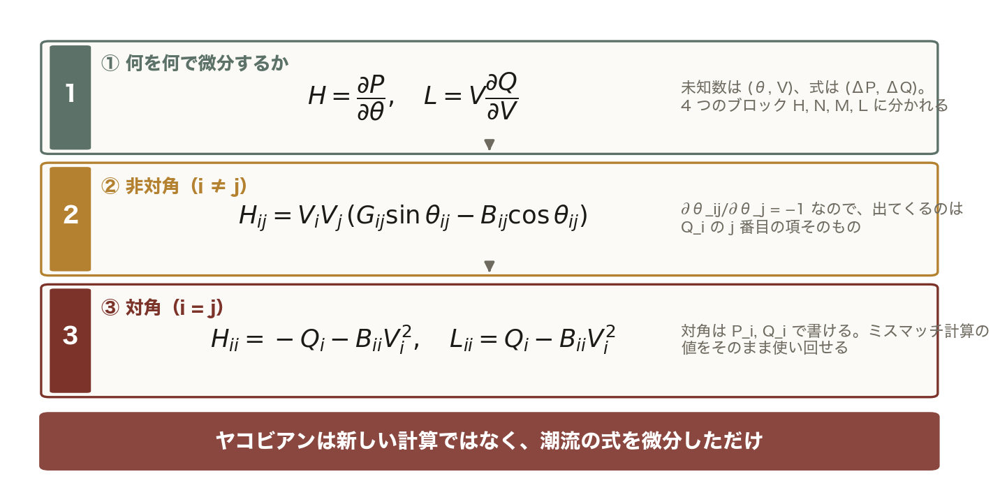

N_ii = P_i + G_ii V_i²、M_ii = P_i − G_ii V_i²。対角は P_i, Q_i で書けるので、ミスマッチを計算したときの P_i, Q_i をそのまま使い回せる。

<!-- note: 前の 1 枚に ③ を足しただけ。薄い段はまだ出していない段。 -->
---

<!-- _class: equation -->

# 修正方程式 — ミスマッチを J で割る

$$\begin{bmatrix}\Delta P \\ \Delta Q\end{bmatrix} = \begin{bmatrix} H & N \\ M & L \end{bmatrix} \begin{bmatrix}\Delta\theta \\ \Delta V / V\end{bmatrix}, \qquad \theta \leftarrow \theta + \Delta\theta,\ \ V \leftarrow V\,(1 + \Delta V / V)$$

  $\Delta P, \Delta Q$
  ミスマッチ P_spec − P_calc、Q_spec − Q_calc。指定値と今の計算値の差。これを 0 にしたい
  $\Delta\theta, \Delta V/V$
  修正量。連立一次方程式を 1 回解いて得る。PV 母線には ΔV の列も ΔQ の行も無い
  $\mathbf{J}$
  大きさは (N_PV + 2N_PQ) 次の正方行列。3 母線（PV 1・PQ 1）なら 3×3、IEEE 14 母線なら 22×22
  $\varepsilon$
  収束判定。max |ΔP|, |ΔQ| が ε（既定 10⁻⁶ p.u.）を下回ったら終了。3〜5 回で着く

<!-- note: 1 変数の f′Δx = −f と同じ形であることを指差す。左辺の符号：ミスマッチ = spec − calc = −f なので、JΔx = −f がそのまま JΔx = Δf になる。 -->

---

<!-- _class: figure-story -->
<!-- source: コード/fig_ch05.py -->

# 14 母線のヤコビアンは 22×22

## 読み方｜IEEE 14 母線を pandapower で解いた点でのヤコビアン。色の濃さが要素の絶対値

- PV 4・PQ 9 → 13 + 9 = 22 行
- 非零は 29%（疎行列）
- ‖H‖ 92、‖L‖ 80 が大きい
- ‖N‖ 24、‖M‖ 25 は 1/3〜1/4

対角ブロック H, L が濃く、非対角 N, M は薄い。第3回の「P は θ、Q は V」の分離がヤコビアンに現れている。これが Ⅲ章の高速デカップル法の根拠。

<!-- note: Y_bus と同じ疎らさ（線路が無い所は 0）。1,000 母線なら 2,000×2,000 で非零は 1% 未満になり、疎行列 LU 分解が必須になる。ノルムは Frobenius ノルム。 -->

---

<!-- _class: steps -->

# 例題 2 — 3 母線の最初の 1 反復

  1
  フラットスタート
  V = (1.05, 1.02, 1.00)、θ = 0。電力方程式で P₂ = −0.119、P₃ = −0.096、Q₂ = −0.409、Q₃ = −0.333

  2
  ミスマッチ
  ΔP₂ = 0.5 − (−0.119) = 0.619、ΔP₃ = −1.0 − (−0.096) = −0.904、ΔQ₃ = −0.4 − (−0.333) = −0.068

  3
  ヤコビアン
  H₂₂ = −Q₂ − B₂₂V₂² = 0.409 + 19.95 × 1.040 = 21.17。H₂₃ = −5.10、H₃₃ = 9.04、L₃₃ = 8.37。N, M は ±1.7〜3.0

  4
  解いて更新
  Δθ₂ = 0.33°、Δθ₃ = −4.84°、ΔV₃/V₃ = −0.040 → V₃ = 0.960。次のミスマッチ 0.048。真の解は θ₃ = −5.12°、V₃ = 0.954

<!-- note: 学生に 3 の H₂₂ を計算させる（B₂₂ = −19.95 は第4回の Y_bus）。1 回目でほぼ答え（−4.84° vs −5.12°）に届き、あとは桁を詰めるだけ、が 2 次収束の見え方。 -->

---

<!-- _class: kpi -->

# 結果 — 反復回数は桁が違う

  4回
  ニュートン・ラフソン法（10⁻⁸ まで）

  13回
  ガウス・ザイデル法 α = 1.0

  31回
  ガウス・ザイデル法 α = 1.6

<!-- note: 3 母線でこの差。100 母線なら GS は 100 回以上、NR は 4〜5 回のまま。GS が今も残っているのは「NR の初期値づくり」用途。 -->

---

<!-- _class: divider -->

# Ⅲ. 高速デカップル法

## N と M を捨て、係数行列を定数にして LU 分解を 1 回で済ませる

---

<!-- _class: figure-story -->
<!-- source: コード/fig_ch05.py -->

# X ≫ R ほど N, M が消える

## 読み方｜3 母線系統の X/R を 1 → 15 に変え、解での ‖N‖/‖H‖ と ‖M‖/‖L‖ を描いた

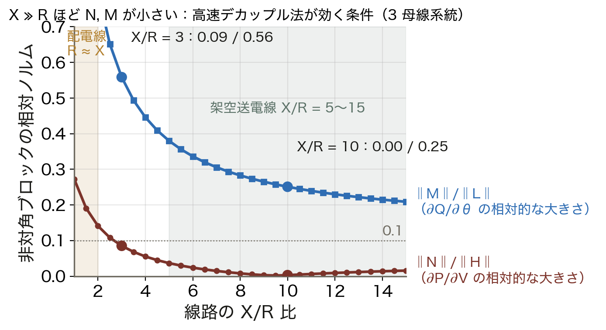

- X/R = 3：‖N‖/‖H‖ 0.09
- 同じく ‖M‖/‖L‖ は 0.56
- X/R = 10：0.00 / 0.25
- 配電線（X/R ≈ 1）は分離が崩れる

第3回の P–δ / Q–V 分離は「X ≫ R」の帰結。架空送電線（X/R = 5〜15）では N ≈ 0、M ≈ 0 と置いてよいが、R の大きい配電線では置けない。

<!-- note: この 3 母線系統は X/R = 3 で「X ≫ R」が弱いので ‖M‖/‖L‖ が 0.56 と大きめ。M は G cos θ の項を含み、R が効く。「なぜ N の方が先に小さくなるか」→ N の対角は P_i + G_ii V² で、P₂ = 0.5 と G の項が打ち消し合う偶然もある、と正直に言う。 -->

---

<!-- _class="figure-story" -->
<!-- _class: figure-story -->
<!-- source: コード/fig_ch05.py -->

# 高速デカップル法 — LU 分解は 1 回

## 読み方｜左が NR 法、右が高速デカップル法の 1 周。赤の箱が毎回やり直す重い処理

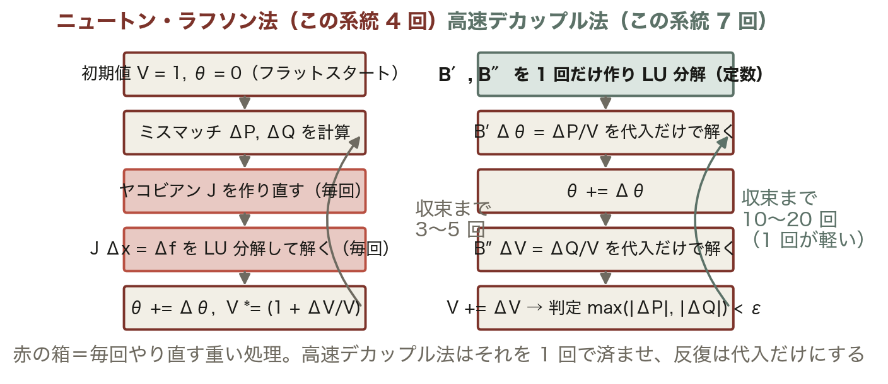

- NR：J を毎回作り LU 分解
- FDLF：B′, B″ は定数で LU 1 回
- 反復は代入だけ（前進・後退）
- この系統：NR 4 回、FDLF 7 回

N = M = 0 に加えて cos θ ≈ 1、G sin θ ≪ B、Q ≪ BV² と近似すると H → B′、L → B″ が定数になる。回数は増えるが 1 回が軽く、N-1 の数千ケースで効く。

<!-- note: ΔP/V = B′Δθ、ΔQ/V = B″ΔV の 2 本に分かれるので行列の大きさも半分。「1 変数で f′ を 5 に固定したら」の多変数版。Stott（1974）の XB 型。配電系統では使えない、を必ず添える。 -->

---

<!-- _class: steps -->

# 例題 3 — B′ の要素を手で作る

  1
  直列リアクタンスだけ残す
  x₁₂ = 0.06、x₁₃ = 0.24、x₂₃ = 0.18。R と充電容量は捨てる。未知の θ は母線 2, 3 なので B′ は 2×2

  2
  対角
  B′₂₂ = 1/0.06 + 1/0.18 = 16.67 + 5.56 = 22.22。B′₃₃ = 1/0.24 + 1/0.18 = 4.17 + 5.56 = 9.72

  3
  非対角と B″
  B′₂₃ = −1/0.18 = −5.56。B″ は PQ 母線 3 だけの 1×1 で B″₃₃ = −B₃₃ = 8.705（Y_bus の虚部そのまま）

  4
  H と比べる
  フラットスタートの H₂₂ = 21.17、H₃₃ = 9.04、L₃₃ = 8.37 とほぼ同じ。B′, B″ は反復中に変わらないので LU 分解は 1 回

<!-- note: 学生に 2 を計算させる。「H₂₂ = 21.17 と B′₂₂ = 22.22 の差はどこから」→ R の分（1/x と Im(1/z) の差）と Q₂ の分。差が小さいから近似で置き換えても跳ぶ方向は狂わない。 -->

---

<!-- _class: figure-story -->
<!-- source: コード/fig_ch05.py -->

# 閾値を厳しくしても NR は 4 回

## 読み方｜収束判定 ε を 10⁻² から 10⁻¹² まで変え、3 手法の必要反復回数を数えた

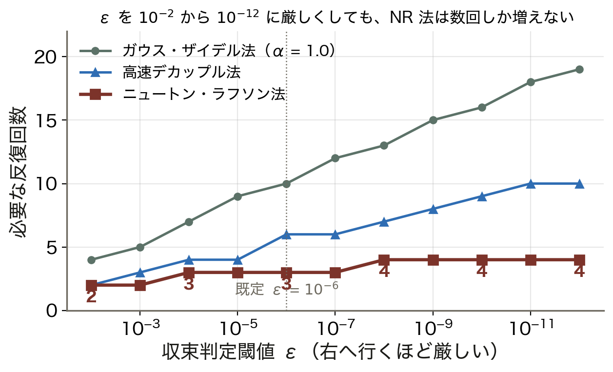

- ε = 10⁻² で NR 2 回、GS 4 回
- ε = 10⁻⁸ で NR 4 回、GS 13 回
- ε = 10⁻¹² で NR 4 回、GS 19 回
- FDLF は 2 → 10 回で中間

1 次収束は ε を 1 桁厳しくするごとに一定回数ずつ増える。2 次収束は桁が倍々なので、ε をどれだけ厳しくしても数回で済む。既定の 10⁻⁶ は実用上十分。

<!-- note: 「ε をゆるくすれば速い」は GS には効くが NR にはほぼ効かない。ε = 10⁻⁶ p.u. = 100 MVA 基準で 100 W。線路潮流を MW 単位で読むなら十分。 -->

---

<!-- _class: divider -->

# Ⅳ. 初期値と Q 限界

## 「解けない」には 2 種類ある — 出発点が悪いか、解が無いか

---

<!-- _class: figure-full -->
<!-- source: コード/fig_ch05.py -->

# 初期値 — 正しい解の近くから出発

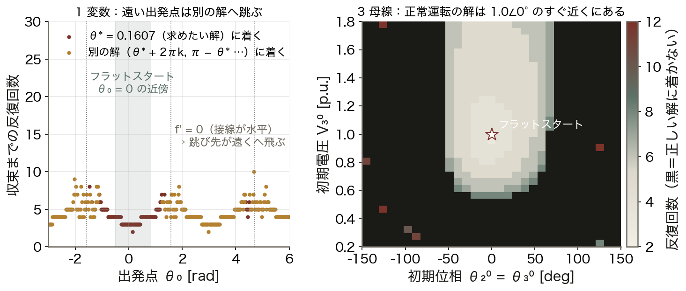

正常運転の解は V ≈ 1、θ ≈ 0 のすぐ近くにある。これは単位法の恩恵で、だから V = 1、θ = 0 から始めれば 3〜4 回で着く。重負荷や逆潮流でそこから外れる系統では、負荷を段階的に増やす継続法や GS の 1〜2 反復で初期値を作る。

<!-- note: 左図で f′ = 0（接線が水平）の点から出ると跳び先が無限遠に飛ぶ。右図の黒は「収束しない」と「別の解（低電圧解）に着く」の両方。潮流方程式には解が複数あり、V₃ が 0.3 のような解も数学的には存在する。 -->

---

<!-- _class: figure-full -->
<!-- source: コード/fig_ch05.py -->

# Q 限界 — 電圧を保てなくなる瞬間

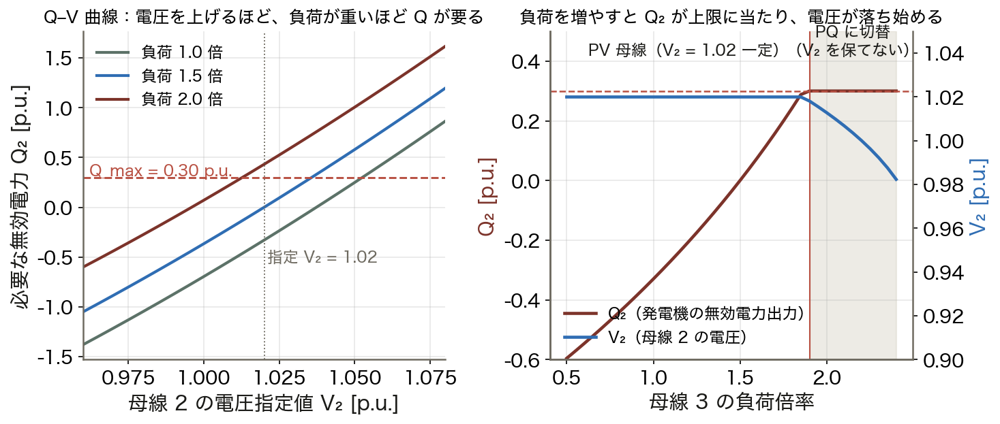

反復の各段階で PV 母線の Q を計算し、上限を超えたら Q を上限に固定して PQ 母線に切り替える。この切替が多発する系統は無効電力の余裕が乏しく、電圧崩壊の前兆と読める。

<!-- note: 右図の先、負荷 2.5 倍あたりで NR が収束しなくなる。これが冒頭の事例「収束しない＝解が無い」の正体で、第6回の PV カーブの鼻先につながる。Q_max = 0.30 p.u. の発電機は負荷 1.9 倍で上限に達して PQ 母線に切り替わり、V₂ は 1.02 から下がり続けて 2.4 倍で 0.982、2.5 倍でついに解が無くなる。切り戻し（PQ → PV）も必要、を添える。 -->

---

<!-- _class: table-slide -->

# 3 手法の比較 — 使い分け

## 同じ 3 母線系統・同じ判定 ε = 10⁻⁸ での実測

| 項目 | ガウス・ザイデル | ニュートン・ラフソン | 高速デカップル |
|:--|:--|:--|:--|
| 収束次数 | 1 次 | **2 次** | 1 次（比率が小さい） |
| この系統での回数 | 13 回（α = 1.0） | **4 回** | 7 回 |
| 1 反復のコスト | 低い | 高い（J を作り LU 分解） | 低い（代入だけ） |
| 母線数が増えると | 回数が比例して増える | **回数は変わらない** | 回数はほぼ変わらない |
| 初期値 | 鈍感 | 敏感（フラットスタート） | 敏感 |
| 使いどころ | NR の初期値づくり | **標準** | N-1 の大量ケース（X ≫ R） |

**実務の標準は NR 法。** 速さが要る場面では高速デカップル法、配電系統（R ≈ X）には別の手法（後退前進法）。

<!-- note: 「高速デカップル法は 2 次収束か」と聞かれたら 1 次（近似したヤコビアンを使うので）。ただし比率が小さいので 10〜20 回で済む。 -->

---

<!-- _class: figure -->

# 動く図で試す — viz/newton.html

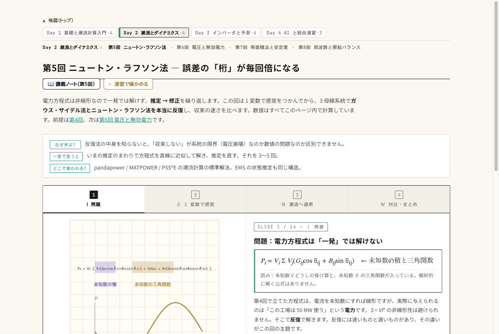

動く図 1 変数の接線と、3 母線系統の GS 法・NR 法を本当に反復し、ヤコビアンの値まで表示する。

- 反復 ν のスライダを 0 → 1 → 2 と進め、最大ミスマッチが 0.90 → 0.048 → 4e-4 と桁を倍々に減らすのを読む
- ヤコビアンの表で H₂₂ = 21.17 と例題 2 の手計算を照合し、N, M が H, L より小さいのを確かめる
- GS の加速係数を 1.0 と 1.6 で切り替え、この系統では 1.6 が逆に遅いことを見る

<!-- note: 演習 ex/ch05.html は学籍番号で系統の数値が変わる。手計算の例題 2 と同じ手順で 1 反復させる。 -->

---

<!-- _class: blocks -->

# なぜそう考えるか — 2 次・分離・Q 限界

  なぜ 2 次収束なのか
  接線近似で捨てたのは 2 次以降の項だから、次の誤差は今の誤差の 2 乗に比例する。0.90 → 0.048 → 4e-4 → 3e-8 と桁が倍々で増え、母線数は式に出てこない。

  なぜ N と M を落とせるのか
  送電線は X ≫ R なので ∂P/∂V と ∂Q/∂θ が小さい（X/R = 10 で ‖N‖/‖H‖ ≈ 0、‖M‖/‖L‖ 0.25）。落としても跳ぶ方向は大きく狂わず、反復を増やせば同じ解に着く。

  PV 母線の Q 限界
  発電機は無限に Q を出せない。限界を超えたら Q を上限に固定して PQ 母線に切り替え、電圧は下がる。切替が多発する系統は電圧が苦しく、その先で解が無くなる。

<!-- note: 3 つとも「今日の図のどれで見たか」を指差して振り返る。2 次＝図 2・3、分離＝図 4・5、Q 限界＝図 8。 -->

---

<!-- _class: figure-full -->
<!-- source: コード/fig_ch05.py -->

# よくある誤解 — 反復回数と「解けない」の意味

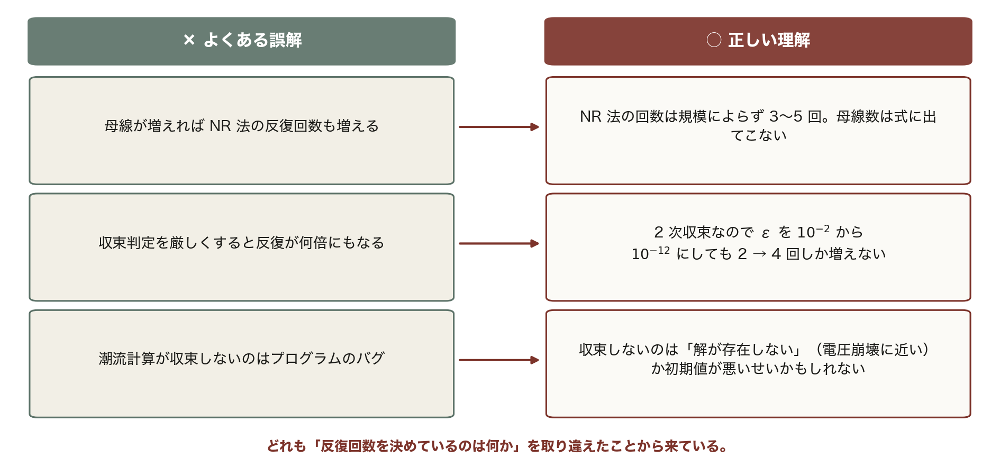

3 つとも「何が反復回数を決めているか」を取り違えたことから来ている。母線数でも判定の厳しさでもなく、収束の次数が効いている。

<!-- note: 3 つ目が実務で一番大事。バグを疑う前に、負荷を 0.8 倍にして解けるか試す。解けるなら解が無い側、解けないならデータかコード。 -->

---

<!-- _class: takeaway -->

# 持ち帰る 3 点

接線で跳ぶから速い。ヤコビアンは「今ここの傾き」で、P–δ / Q–V 分離がそれを軽くする

<li>ΔP = P_spec − P_calc をヤコビアンで割って修正。2 次収束で 3〜5 回、規模によらない</li>
<li>高速デカップル法：N ≈ 0、M ≈ 0、B′ と B″ は定数で LU 分解は 1 回。配電線では使えない</li>
<li>収束しない＝解が無いかもしれない。PV 母線の Q 限界と PQ への切替は電圧崩壊の前兆</li>

<!-- note: 最初の statement をもう一度読む。次回は pandapower に解かせ、自作 NR と照合するところから始める。 -->

---

<!-- _class: end -->

# 次回：第6回 潮流計算の実践

演習 ex/ch05.html で数値を変えて確かめる

pandapower で解き、電圧を読み、鼻先を見つける
