<!-- _class: title -->

# 第6回 潮流計算の実践
## 道具で解き、電圧で読む — pandapower と PV カーブ
Day 2・コマ 6 ／ 教科書 第5章・第6章

<!-- note: 第5回で「どう解くか」をやった。今回は「解いた後に何を読むか」。手を動かす回なので、演習の時間を多めに取る。 -->

---

<!-- _class: statement -->

潮流計算は解けたら終わりではない。電圧逸脱と過負荷を読み、負荷を増やしたとき鼻先がどこかを知って初めて使える。

<!-- note: この 1 文を最後にもう一度出す。「解く」から「読む」への転換が今日の主題。 -->

---

<!-- _class: graphical-abstract -->

# この回の全体像

## 一枚で｜問い → 課題 → 道具 → 到達点

  問い
  計算が終わった。この系統は **安全なのか**。あと何 MW の負荷に耐えるのか。太陽光はあと何 MW つなげるのか。

  課題
  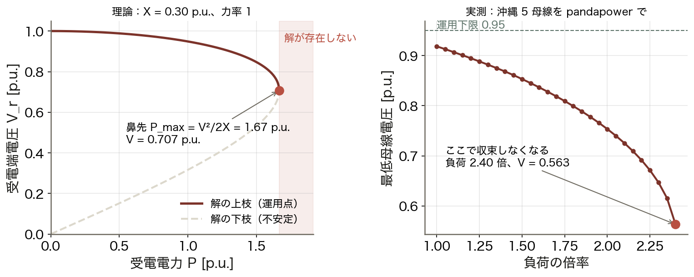
  負荷を増やすと電圧が落ち、ある点で **解が消える**。

  道具
  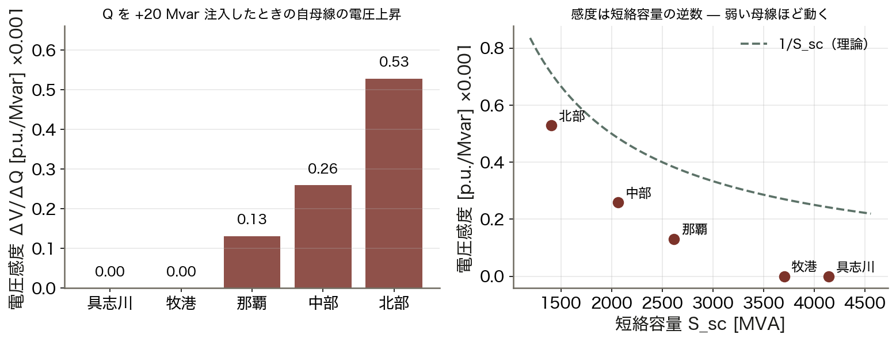
  pandapower ▶ 感度 ▶ PV カーブ
  感度 ΔV/ΔQ を実測する。

  到達点
  2.2 倍
  力率を 1 → 0.95 にすると、つなげる太陽光が 2.5 → 5.5 MW。

数値はすべて本資料の Python コード（コード/fig_ch06.py）で計算。系統は沖縄本島 5 母線・IEEE 14 母線・6.6 kV 配電フィーダ。

<!-- note: 右下の 2.2 倍が今日の結論。連系可能量は「系統の性能」ではなく「運転の仕方」でも変わる、という話につながる。 -->

---

<!-- _class: sections -->

# 現場で起きたこと — 電圧は静かに崩れる

  1987年7月23日 首都圏の電圧崩壊
  猛暑でエアコン負荷が昼休み明けに急増。==無効電力が足りず== 電圧が下がり続け、約 280 万戸が停電した。周波数は正常だった。「電力が足りない」のではなく「Q が足りない」停電である。

  2003年9月 イタリア全土停電
  スイスからの連系線が樹木接触で停止し、残る連系線が過負荷で次々に脱落。電圧と周波数が崩れ、ほぼ全土が停電した。潮流の再配分と過負荷判定が要る理由がここにある。

<!-- note: どちらも事前に「PV カーブの余裕」を見ていれば兆候を捉えられた。今日の道具はそのためにある。 -->

---

<!-- _class: figure-full -->
<!-- source: コード/fig_ch06.py -->

# たとえ話 — 荷物を積むほどしなる橋

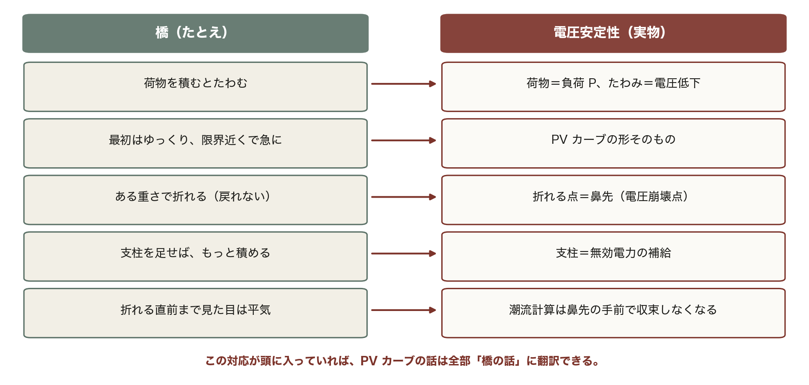

橋は折れる前にきしむが、電圧は数値上「まだ 0.95」でも鼻先が目前ということがある。だから余裕を計算で出す。

<!-- note: この 5 行は今日の内容を先取りしている。PV カーブ・鼻先・無効電力の補給が、あとで順番に出てくる。 -->

---

<!-- _class: agenda -->

# この回の地図

1. pandapower で系統を組み、潮流を回す（符号の規約）
2. 結果の読み方 — 電圧逸脱・過負荷・自作実装との照合
3. 電圧感度と PV カーブ — 鼻先はどこか
4. 太陽光の連系可能量 — 力率 1 と 0.95 で何が変わるか

---

<!-- _class: divider -->

# Ⅰ. 道具を使う

## 系統を表で組み、1 行で解く

---

<!-- _class: figure-story -->
<!-- source: コード/fig_ch06.py -->

# pandapower は系統を「表の集合」で持つ

## 読み方｜入力の表（bus・line・load）に、結果の表（res_*）が足される

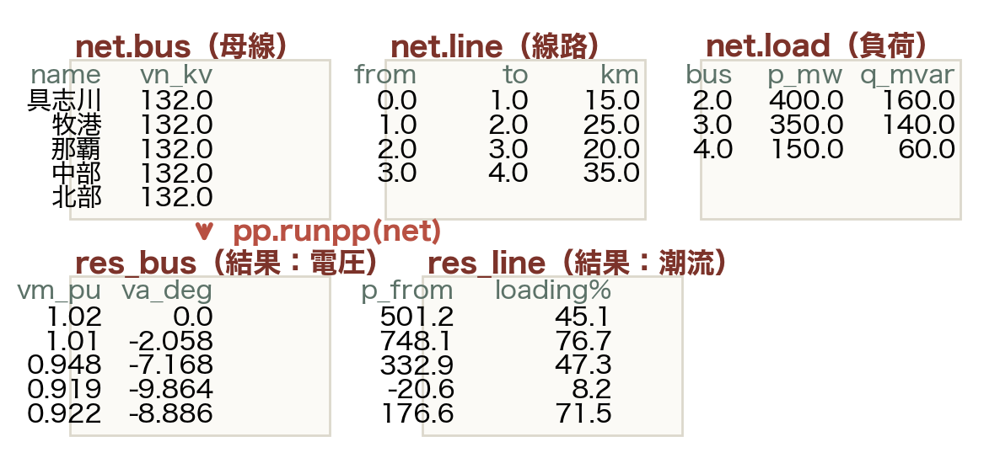

- 母線・線路・負荷を表に積む
- `pp.runpp(net)` を 1 行呼ぶ
- `res_bus` に電圧と位相が入る
- `res_line` に潮流と利用率が入る

中身は第5回のニュートン・ラフソン法そのもの。道具を使っても、解いている式は変わらない。

<!-- note: net.bus は pandas の DataFrame。表計算と同じ感覚で列を足したり絞ったりできる、と伝える。 -->

---

<!-- _class: figure-full -->
<!-- source: コード/fig_ch06.py -->

# 符号の規約 — 最も間違えやすい点

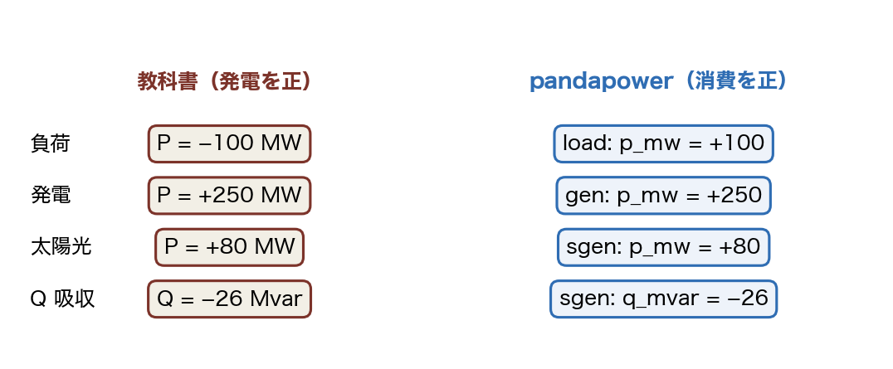

要素ごとに「どちら向きが正か」が決まっている。取り違えると、電圧が上がるはずの計算で下がる。結果がおかしいときに真っ先に疑うのがここである。

<!-- note: 毎年ここで詰まる。「太陽光を入れたのに電圧が下がった」の 9 割は sgen ではなく load に入れている。 -->

---

<!-- _class: steps -->

# 例題 1 — 4 手で系統を組んで解く

  1
  組む
  create_bus / line_from_parameters / load / ext_grid。表に積むだけ

  2
  解く
  pp.runpp(net)。既定はニュートン・ラフソン法、許容誤差 1e-8 p.u.

  3
  読む
  res_bus.vm_pu が 0.95〜1.05 か、res_line.loading_percent が 100 未満か

  4
  直す
  コンデンサ・タップ・力率を変えて、もう一度解く

<!-- note: 実際に手元で打たせる。3 の 2 つの列だけ見れば、系統が安全かどうかは判定できる。 -->

---

<!-- _class: figure-full -->
<!-- source: コード/fig_ch06.py -->

# 自作の実装は必ず既存ライブラリと照合する

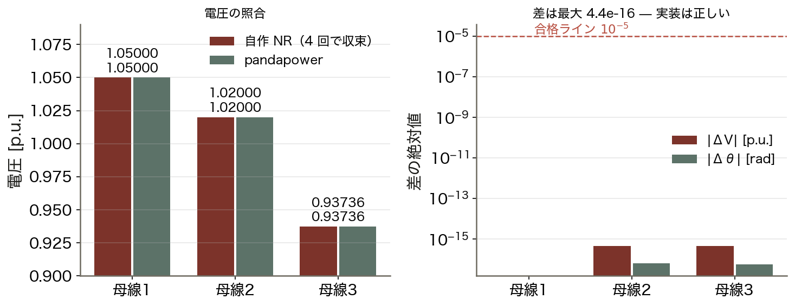

第5回の自作ニュートン法と pandapower を同じ系統で解くと、機械精度で一致した。ここまで合えば実装は正しいと言える。合わないときに疑う先は、符号・基準容量・シャントの扱いの 3 つである。

<!-- note: 10⁻¹⁶ は倍精度の限界。学生の自作実装が 10⁻⁵ 以下なら合格としてよい。比較に使ったのは 3 母線・シャントなしの純 R+jX 回路である。 -->

---

<!-- _class: divider -->

# Ⅱ. 結果を読む

## 電圧は Q が決める。感度は短絡容量の逆数

---

<!-- _class: figure-story -->
<!-- source: コード/fig_ch06.py -->

# 電圧プロファイル — 末端ほど動く

## 読み方｜電源から遠いほど下がり、太陽光を入れると逆に上がる

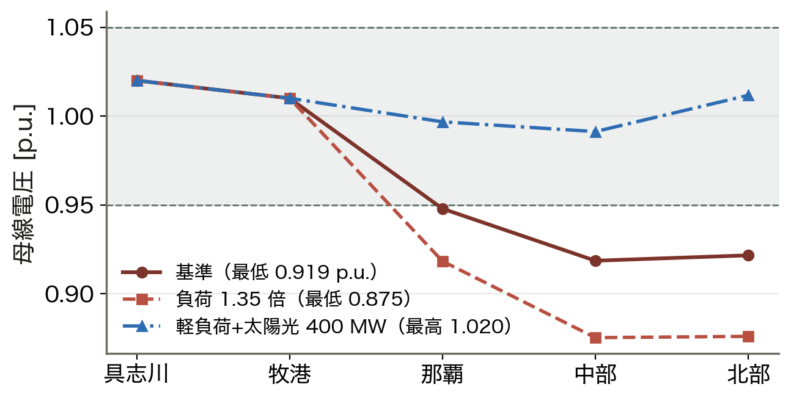

- 基準：最低 0.919 p.u.（中部）
- 負荷 1.35 倍：0.875 まで低下
- 軽負荷＋太陽光 400 MW：北部が上昇
- 電源（具志川・牧港）は 1.02 / 1.01 で固定

電圧は場所ごとに違う「局所量」。系統全体で 1 つの周波数（第8回）とはここが決定的に違う。

<!-- note: 具志川はスラック、牧港は PV 母線なので電圧が指定値に固定される。だから動くのは PQ 母線だけ。 -->

---

<!-- _class: sections -->
<!-- build -->

# 導出 — 電圧降下の近似式

  ① 線路を流れる電流｜受電端で P + jQ を消費する
  受電端電圧を V、消費を P + jQ とすると I = (P − jQ)/V*。線路は R + jX。

  ② 電圧降下｜ΔV = (R + jX)·I を実部と虚部に分ける
  ΔV = (RP + XQ)/V + j(XP − RQ)/V。位相差が小さければ **大きさの変化は実部だけ**で決まる。

  ③ 実用形｜ΔV ≈ (RP + XQ)/V
  送電線は X ≫ R なので **XQ が支配**。配電線は R が大きく **RP も効く**。だから太陽光の逆潮流（P &lt; 0）で電圧が上がる。

<!-- note: ②から③へ落とすとき「虚部は位相をずらすだけ」と言う。第3回の P–δ / Q–V 分離と同じ構造。 -->

---

<!-- _class: figure-story -->
<!-- source: コード/fig_ch06.py -->

# 近似式は実用十分 — 逆潮流では符号が反転する

## 読み方｜灰色が近似、赤が厳密（2 次方程式を解いた値）

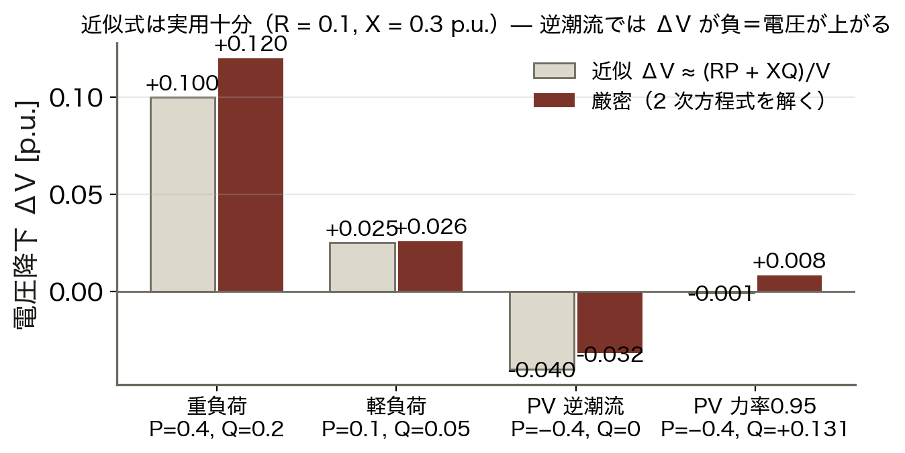

- 重負荷：+0.100 と +0.120（誤差 0.02）
- 軽負荷：+0.025 と +0.026（ほぼ一致）
- PV 逆潮流：**−0.040**（電圧が上がる）
- 力率 0.95：−0.001（打ち消される）

厳密解は潮流計算に任せる。この式は「どちらへ動くか」を頭の中で読むための道具である。

<!-- note: R = 0.10、X = 0.30 p.u. の配電系統寄りの値。送電線なら XQ 項がもっと支配的になる。 -->

---

<!-- _class: figure-full -->
<!-- source: コード/fig_ch06.py -->

# 電圧感度は短絡容量の逆数

同じ 20 Mvar を入れても、短絡容量の小さい弱い母線ほど電圧が大きく動く。感度は ρ ≈ 1/S_sc なので、「どこにつなぐか」が「いくつなげるか」を決める。末端ほど早く限界に当たる。

<!-- note: 右図の破線が理論の 1/S_sc。実測（点）が破線より下にあるのは、近くの電源母線が電圧を支えるため。 -->

---

<!-- _class: kpi -->

# 沖縄 5 母線の実測値

  0.919
  基準ケースの最低電圧 [p.u.]

  17.1
  総送電損失 [MW]（負荷の 1.9%）

  2.40倍
  負荷をこれ以上増やすと解けない

<!-- note: 0.919 は運用下限 0.95 を下回っている。この系統は「今のままでは使えない」— 調相設備かタップで直す必要がある。 -->

---

<!-- _class: divider -->

# Ⅲ. 限界を知る

## 鼻先は「解が消える点」

---

<!-- _class: sections -->
<!-- build -->

# 導出 — PV カーブの鼻先

  ① 2 母線・R = 0・力率 1｜送電端 V_s、受電端 V_r、リアクタンス X
  P = V_sV_r sinδ / X、そして V_r の式を整理すると **V_r⁴ − V_s²V_r² + (XP)² = 0**。V_r² の 2 次方程式になる。

  ② 解が 2 つ｜判別式 V_s⁴ − 4(XP)² ≥ 0
  上枝（運用点）と下枝（不安定）。同じ P に対して電圧が 2 通りある。

  ③ 鼻先｜判別式が 0 になる点
  **P_max = V_s²/(2X)**、そのとき **V_r = V_s/√2 = 0.707 V_s**。これを超えると解が存在しない。

<!-- note: 「解が無い」＝計算機のバグではなく物理。NR 法は無い解を探して発散する。 -->

---

<!-- _class: figure-full -->
<!-- source: コード/fig_ch06.py -->

# 鼻先 — 理論と実測

運用下限 0.95 を割っても、まだ解は存在する。0.95 は機器を守るために人が引いた線、鼻先は解が消える物理の壁で、意味がまったく違う。

<!-- note: 実務では鼻先まで行かせない。P_max に対する余裕（電圧安定余裕）を 20% 以上取るのが普通。 -->

---

<!-- _class: figure-story -->
<!-- source: コード/fig_ch06.py -->

# 無効電力の供給源 — 速さと連続性で選ぶ

## 読み方｜段階的か連続か、応答が秒か ミリ秒か

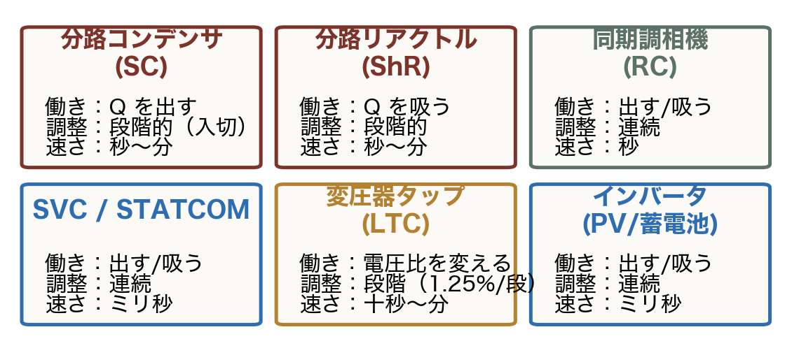

- コンデンサ・リアクトル：安いが段階的
- 同期調相機：連続だが回転機
- SVC / STATCOM：連続・ミリ秒
- LTC タップ：電圧比を変える（1.25%/段）

Q は遠くへ運べない。だから電圧が下がる場所の近くに置く。これが調相設備の配置設計。

<!-- note: 第9回のインバータ（Volt-Var 制御）は、この表の一番下に「太陽光そのものが Q を出す」という行を足す話。 -->

---

<!-- _class: divider -->

# Ⅳ. 太陽光をいくつなげるか

## 答えは「どこに、どんな力率で」

---

<!-- _class: figure-full -->
<!-- source: コード/fig_ch06.py -->

# 連系可能量 — 力率で 2.2 倍変わる

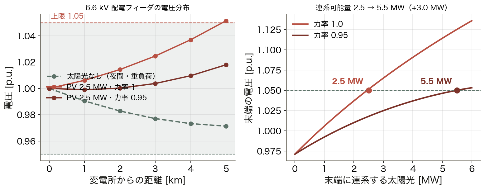

同じ系統・同じ場所でも、インバータを力率 1 で運転するか進み力率で運転するかで、連系できる量が 2.2 倍変わる。設備を増やさずに効く対策である。

<!-- note: 力率 0.95 は Q を吸収する運転。P が同じでも見かけの電流は 5% 増えるので、損失は少し増える。ただでは無い。フィーダは 6.6 kV・5 km、各区間 200 kW の負荷を想定している。 -->

---

<!-- _class: steps -->

# 例題 2 — 逆潮流で電圧はどう動くか

  1
  条件
  R = 0.10、X = 0.30 p.u.、送電端 1.00 p.u.、太陽光 0.4 p.u. が逆潮流

  2
  力率 1
  P = −0.4、Q = 0 → ΔV = (0.1×(−0.4) + 0)/1 = −0.040 → 1.040 p.u.

  3
  力率 0.95 で Q を吸う
  Q = +0.4×tan(18.2°) = +0.131 → ΔV = (−0.04 + 0.30×0.131)/1 = −0.001

  4
  意味
  RP の上昇分を XQ で打ち消した。X が大きい系統ほどこの対策が効く

<!-- note: 学生に 3 を計算させる。tan(acos 0.95) = 0.329 を使う。X/R が大きいほど少ない Q で打ち消せる。 -->

---

<!-- _class: figure-full -->
<!-- source: コード/fig_ch06.py -->

# IEEE 14 母線 — 標準ケースで練習する

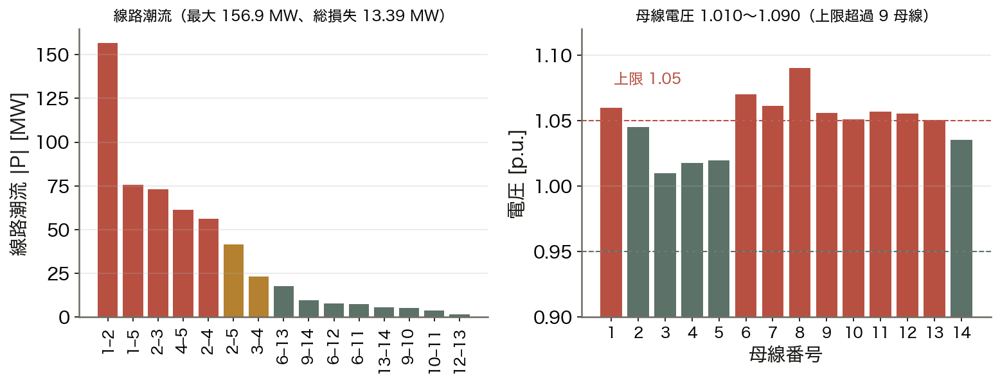

標準データは電圧が高めに設定されていて、そのまま運用できる値とは限らない。教科書のケースであっても、データを鵜呑みにせず運用基準と照らす習慣をつける。

<!-- note: case14 は 1962 年の米国系統がもと。発電機の電圧設定が高いので、日本の基準（1.05）で見ると超過する。 -->

---

<!-- _class: figure -->

# 動く図で試す — viz/voltage.html

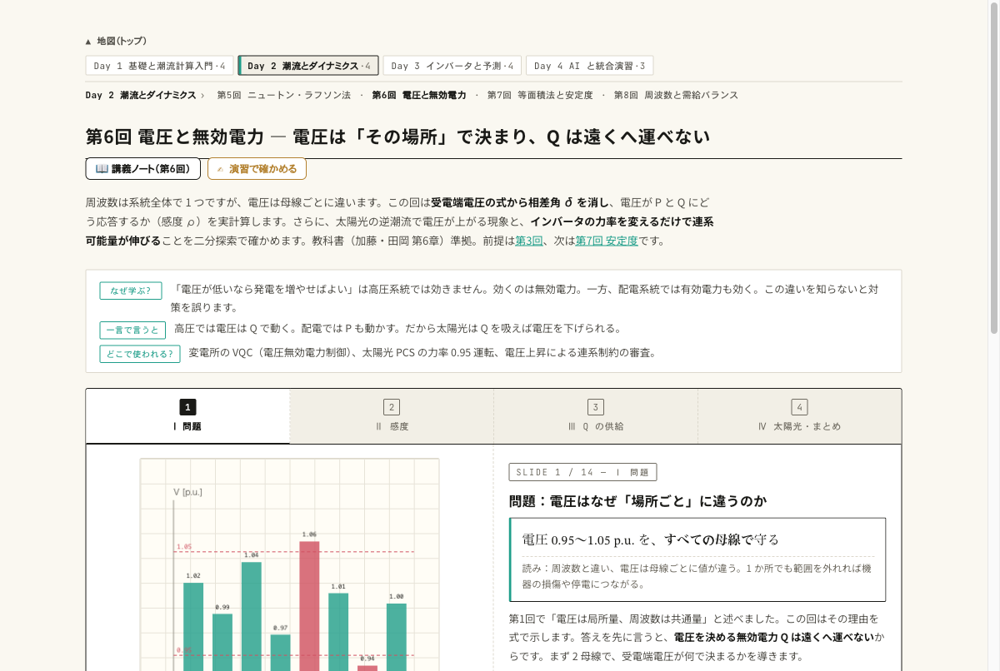

動く図 PV カーブ・電圧感度・太陽光の連系可能量をブラウザ内で実計算する 14 枚のスライド。

- 負荷を増やして PV カーブを描き、鼻先で解けなくなるのを見る
- 短絡容量の大きい母線と小さい母線で、同じ Q に対する ΔV を比べる
- 力率を 1 → 0.95 に切り替え、連系可能量がどれだけ伸びるか見る

---

<!-- _class: blocks -->

# なぜそう考えるか — 符号・鼻先・照合

  なぜ pandapower は「消費が正」なのか
  負荷を主役に見る配電の慣習。発電は負の負荷として扱う。教科書（発電が正）と逆なので、Q の符号を読み違えやすい。

  なぜ鼻先で収束しなくなるのか
  鼻先を越えると方程式の解が存在しない。NR 法は無い解を探して発散する。収束しないのはバグではなく、系統が限界に近いという情報である。

  自作は必ず照合する
  同じ系統を自作 NR と pandapower で解き、差が 10⁻⁵ 以下なら実装は正しい。

---

<!-- _class: figure-full -->
<!-- source: コード/fig_ch06.py -->

# よくある誤解 — 電圧は P ではなく Q が決める

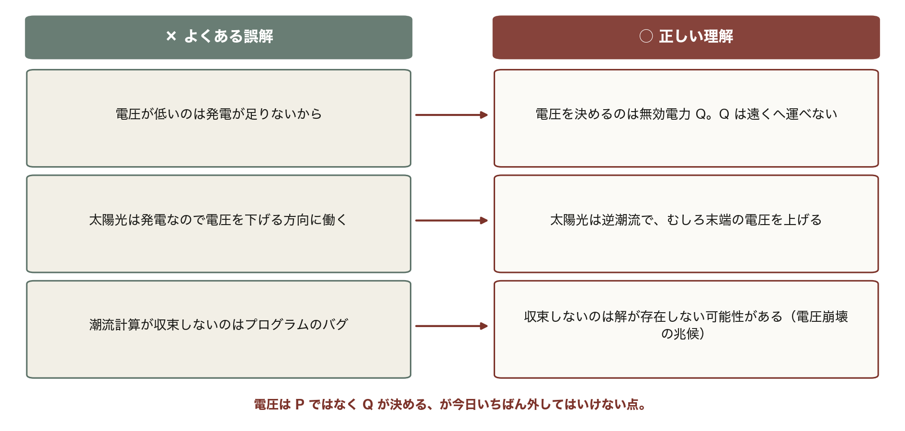

3 つとも「何が電圧を動かしているか」を取り違えたことから来ている。有効電力ではなく無効電力、収束しないことはバグではなく限界の兆候。

---

<!-- _class: takeaway -->

# 持ち帰る 3 点

解いたら読む。電圧は Q が決め、鼻先は解の消える点。つなぐ場所と力率が連系可能量を決める

<li>ΔV ≈ (RP + XQ)/V。配電線は R も効き、逆潮流は電圧を上げる</li>
<li>電圧感度 ρ ≈ 1/S_sc。末端ほど柔らかく、早く限界に当たる</li>
<li>PV カーブの鼻先 P_max = V²/2X。力率 0.95 で連系可能量が 2.2 倍</li>

---

<!-- _class: end -->

# 次回：第7回 電力系統の安定度

演習 ex/ch06.html で数値を変えて確かめる

短絡の瞬間、発電機に何が起きるか — 等面積法
