<!-- _class: title -->

# 第7回 電力系統の安定度
## 臨界時間より早く切れば、発電機は戻ってくる
Day 2・コマ 7 ／ 教科書 第5章

<!-- note: この回だけは「力学」の回。電気の式より、回転体の運動方程式として捉えると腑に落ちる。 -->

---

<!-- _class: statement -->

短絡中に貯まった加速エネルギーを、事故除去後の減速エネルギーで吐き出しきれれば同期は保たれる。

<!-- note: 「貯める・吐き出す」という言葉を今日は繰り返す。面積はそのエネルギーの絵。 -->

---

<!-- _class: graphical-abstract -->

# この回の全体像

## 一枚で｜問い → 課題 → 道具 → 到達点

  問い
  送電線で短絡が起きた。**何ミリ秒以内に切れば** 発電機は元に戻るのか。切るのが遅いと何が起きるのか。

  課題
  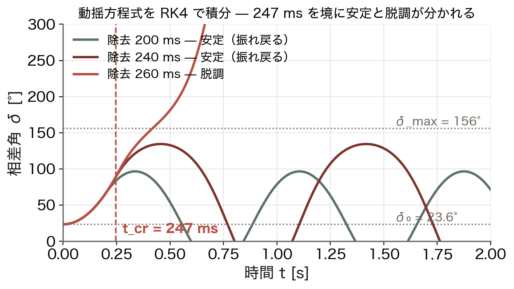
  240 ms で切れば戻り、260 ms では戻らない。

  道具
  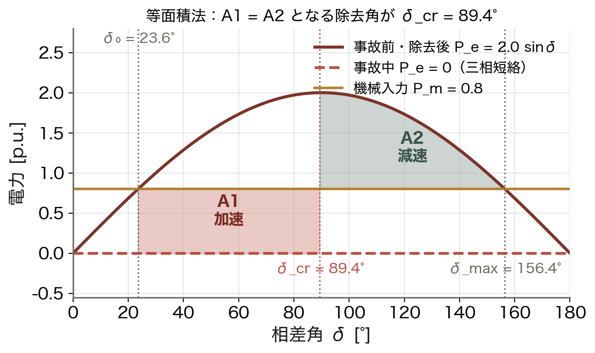
  動揺方程式 ▶ 等面積法 ▶ t_cr
  面積の釣り合いで ==境目== を出す。

  到達点
  247 ms
  等面積法の予測と RK4 積分の実測（245 ms）が一致する。

数値はすべて本資料の Python コード（コード/fig_ch07.py）で計算。P_m = 0.8、P_max = 2.0 p.u.、H = 4 s、60 Hz。

<!-- note: 手計算（等面積法）と数値積分（RK4）が一致することを示すのが今日の骨格。理論が使える、という体験。 -->

---

<!-- _class: sections -->

# 現場で起きたこと — 「遅れ」が系統を割る

  1996年8月10日 米国西部大停電
  猛暑で送電線が熱で弛み、樹木に接触して停止した。潮流の移動で発電機が ==脱調== し、西部系統が 4 つに分裂して約 750 万戸が停電した。相差角が戻れない領域に入った典型例である。

  北海道 2018 との違い
  北海道ブラックアウトは「周波数」が落ちて止まった事故（第8回）。今日の同期安定度は「相差角 δ」が開きすぎて発電機同士の歩調が崩れる事故である。時間スケールは 0.1〜数秒で、保護リレーの整定が勝負を決める。

<!-- note: 同じ「大停電」でも機序が違う。安定度の 3 分類（同期・電圧・周波数）を最初に区別させる。 -->

---

<!-- _class: figure-full -->
<!-- source: コード/fig_ch07.py -->

# たとえ話 — ゴム紐でつながれた台車

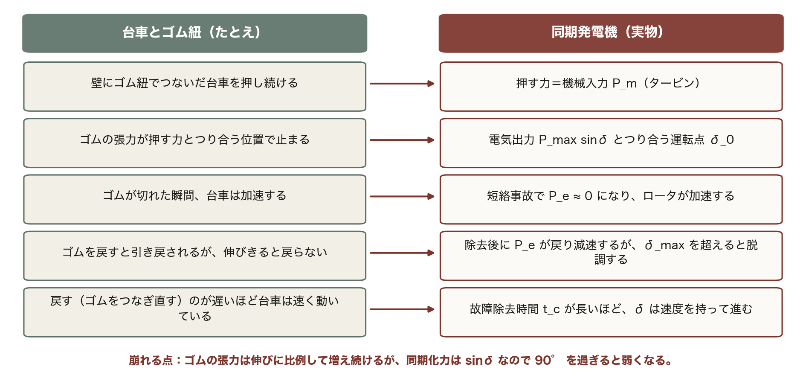

この 5 行は今日の全体を先取りしている。P_m・P_max sinδ・δ₀・脱調・t_c が、あとで順番に式になって出てくる。

<!-- note: 崩れる点：ゴムの張力は伸びに比例して増え続けるが、同期化力は sinδ なので 90° を過ぎると弱くなる。だから「戻れない角度」が存在する。 -->

---

<!-- _class: agenda -->

# この回の地図

1. 安定度の 3 分類と時間スケール
2. 動揺方程式 — 回転体の運動方程式（H の意味）
3. 等面積法 — 臨界除去角と臨界除去時間
4. 対策と、再エネによる慣性低下

---

<!-- _class: divider -->

# Ⅰ. 何が「安定」なのか

## 3 分類と、今日扱う同期安定度

---

<!-- _class: figure-story -->
<!-- source: コード/fig_ch07.py -->

# 安定度は 3 分類 — 時間スケールが違う

## 読み方｜横軸は対数。使う式も、対策も、時間帯ごとに違う

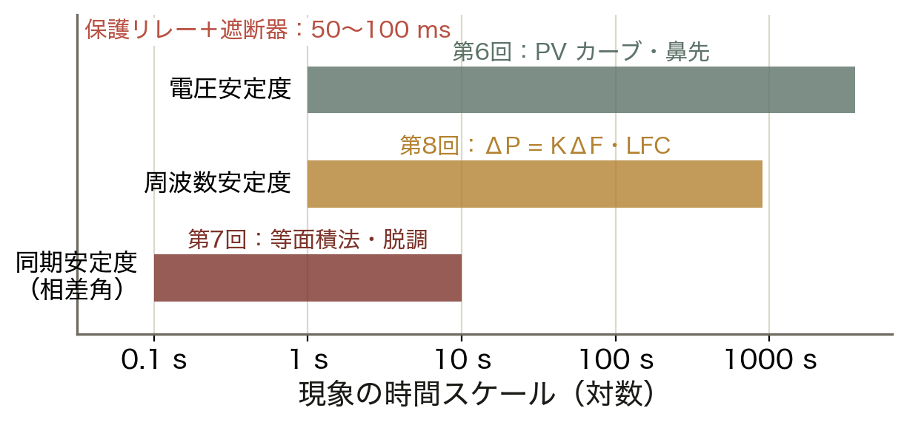

- 同期安定度：0.1〜10 秒（今日）
- 周波数安定度：1 秒〜15 分（第8回）
- 電圧安定度：1 秒〜1 時間（第6回）
- 保護＋遮断器は 50〜100 ms で動く

同じ「不安定」でも、何が崩れているかで打つ手が違う。まず時間スケールを見て切り分ける。

<!-- note: 現場では「電圧が下がった」「周波数が落ちた」「発電機が外れた」のどれかがまず観測される。時間スケールが診断の入口。 -->

---

<!-- _class: figure-full -->
<!-- source: コード/fig_ch07.py -->

# 今日のモデル — 1 機無限大母線

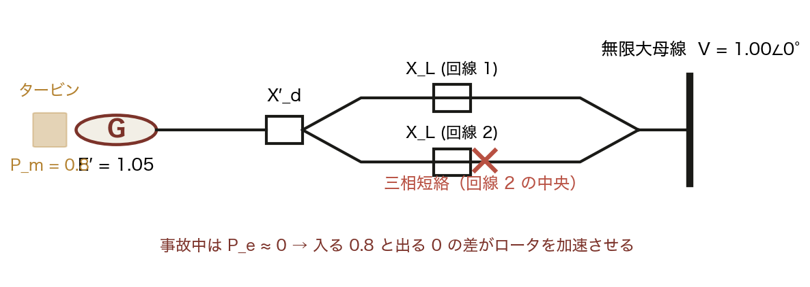

発電機 1 台を無限大母線につなぐ、最も単純な系統モデルである。1 台だけを見ても「切るのが遅れると脱調する」という本質は変わらない。

<!-- note: 無限大母線＝本土の大系統。沖縄には無いが、まずこの理想化で考える。多機系統は第13回の GNN の話につながる。　図の要点：タービンは事故を知らず押し続ける／短絡すると電気を送り出せない／入る 0.8 と出る 0 の差が加速電力／無限大母線は電圧・周波数が不変 -->

---

<!-- _class: divider -->

# Ⅱ. 動揺方程式

## 電気の式ではなく、回転体の運動方程式

---

<!-- _class: sections -->
<!-- build -->

# 導出 — 動揺方程式はニュートンの運動方程式

  ① 回転体の運動方程式｜J θ'' = T_m − T_e
  慣性モーメント J のロータに、機械トルク T_m と電気トルク T_e がかかる。回転版の F = ma そのもの。

  ② トルクを電力に｜P = ωT なので両辺を ω で割る
  定格速度の近くでは ω ≈ ω₀ とみなせるので、**(Jω₀) δ'' = P_m − P_e**。角度は電気角の相差角 δ に取り直す。

  ③ 単位法へ｜定格容量で割り、H = (½Jω₀²)/S_rated を使う
  **(2H/ω₀) δ'' = P_m − P_e**。教科書の M = 2H/ω₀ はこの係数。H は「定格出力で何秒回り続けられるか」で、単位は秒。

<!-- note: ③で H の意味を強調する。H = 4 s なら、入力が止まっても運動エネルギーだけで 4 秒間は定格出力を出せる、という貯金の大きさ。 -->

---

<!-- _class: equation -->

# 動揺方程式 — 今日の主役

$$\frac{2H}{\omega_0}\,\frac{d^2\delta}{dt^2} = P_m - P_e - D\,\frac{d\delta}{dt}, \qquad P_e = P_\text{max}\sin\delta$$

  $P_m - P_e$
  加速電力 P_a。入る力と出る力の差がロータを加速・減速させる
  $2H/\omega_0$
  慣性（質量に相当）。教科書の M。大きいほど δ はゆっくり動く
  $P_\text{max}\sin\delta$
  第3回の送電電力式。三相短絡の間は P_e = 0 になる
  $D$
  制動係数。振れを減衰させる。PSS はこれを実質的に増やす装置

<!-- note: D は本来小さい。だから事故後の振動はなかなか収まらない。PSS の効果は後で図で見せる。 -->

---

<!-- _class: figure-full -->
<!-- source: コード/fig_ch07.py -->

# 慣性 H — 勢いの貯金

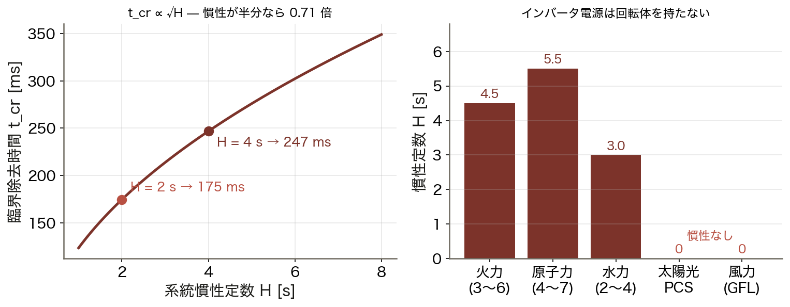

再エネを増やして同期機を止めると、系統全体の H が下がる。角度の余裕（δ_cr）は変わらないが、間に合わせる時間の余裕が縮む。

<!-- note: 右図の 0 が第9回（合成慣性）と第15回（連系可能量の安定度制約）につながる。ここで伏線を張る。　図の要点：t_cr ∝ √H（左図の曲線）／H = 4 s → 247 ms、H = 2 s → 175 ms／火力 3〜6 s、水力 2〜4 s／インバータ電源は H = 0 -->

---

<!-- _class: divider -->

# Ⅲ. 等面積法

## 貯めたエネルギーを吐き出せるか

---

<!-- _class: sections -->
<!-- build -->

# 導出 — 面積がエネルギーになる理由

  ① 動揺方程式に δ' を掛けて積分する
  (2H/ω₀) δ'δ'' = (P_m − P_e) δ'。左辺は (H/ω₀) d(δ'²)/dt で、**運動エネルギーの時間変化**そのもの。

  ② dt を dδ に変えると面積になる
  両辺を時間で積分し δ' dt = dδ を使うと **(H/ω₀)(δ')² = ∫(P_m − P_e) dδ**。右辺は P–δ 平面の面積。

  ③ 戻れる条件｜どこかで δ' = 0 になること
  加速で貯めた面積 A1 を、減速の面積 A2 で使い切れば速度が 0 になり戻ってくる。**A1 = A2 が境目**。

<!-- note: 「面積＝エネルギー」は②で出る。ここが等面積法の核心なので、板書で δ' を掛ける操作を見せる。 -->

---

<!-- _class: figure-story -->
<!-- source: コード/fig_ch07.py -->

# 等面積法 — A1 と A2 が釣り合う角度

## 読み方｜赤が事故中に貯める面積、緑が除去後に吐き出せる面積

- δ₀ = 23.6°（P_m = P_e の運転点）
- δ_max = 180° − δ₀ = 156.4°
- A1 = A2 となる **δ_cr = 89.4°**
- ここまでに切れば戻れる

δ_cr の式に H は出てこない。臨界「角」は P–δ 平面の幾何だけで決まる。

<!-- note: δ_max より右では P_e < P_m に戻ってしまうので、そこを速度を持ったまま越えたら二度と戻れない。 -->

---

<!-- _class: equation -->

# 臨界除去角と臨界除去時間

$$\cos\delta_\text{cr} = \frac{P_m(\delta_\text{max} - \delta_0) + P_\text{max}\cos\delta_\text{max}}{P_\text{max}}, \qquad t_\text{cr} = \sqrt{\frac{4H(\delta_\text{cr}-\delta_0)}{\omega_0 P_m}}$$

  $\delta_\text{cr}$
  臨界除去角。A1 = A2 を解いた結果。角度はラジアンで代入する
  $t_\text{cr}$
  臨界除去時間。事故中は加速電力が一定なので等加速度運動になる
  $\sqrt{H}$
  H が半分になると t_cr は 0.707 倍。角度は変わらず時間だけ縮む
  $P_e = 0$
  条件：三相短絡（事故中 P_e = 0）で、除去後は元の P_max に戻る場合

<!-- note: 度のまま代入する誤りが毎年出る。ω₀ = 2π×60 = 377 rad/s も確認させる。 -->

---

<!-- _class: steps -->

# 例題 1 — t_cr を手で出す

  1
  運転点
  δ₀ = asin(0.8/2.0) = 0.412 rad = 23.6°、δ_max = π − δ₀ = 2.730 rad

  2
  臨界除去角
  cos δ_cr = [0.8×(2.730−0.412) + 2.0×cos(2.730)]/2.0 = 0.0107 → δ_cr = 89.4°

  3
  臨界除去時間
  t_cr = √(4×4×(1.561−0.412)/(377×0.8)) = √0.0610 = 0.247 s

  4
  判定
  保護＋遮断器は 50〜80 ms。247 ms に対して十分な余裕がある

<!-- note: 学生に 2 と 3 を計算させる。電卓のラジアンモードを確認すること。 -->

---

<!-- _class: figure-story -->
<!-- source: コード/fig_ch07.py -->

# 数値積分で確かめる — 247 ms が境目

## 読み方｜動揺方程式を RK4 で解いた δ(t)。除去時間だけを変えている

- 200 ms：小さく振れて戻る
- 240 ms：大きく振れるが戻る
- 260 ms：δ_max を越えて **脱調**
- 破線が等面積法の予測 247 ms

手計算の予測と数値積分が一致した。等面積法は「近似」ではなく、この条件では厳密な判定になっている。

<!-- note: 脱調した曲線は δ が増え続ける。実際には保護が発電機を系統から切り離す（脱調分離）。 -->

---

<!-- _class: figure-story -->
<!-- source: コード/fig_ch07.py -->

# 除去時間を掃引する — 境目は鋭い

## 読み方｜除去時間を 5 ms 刻みで変え、最大相差角を記録した

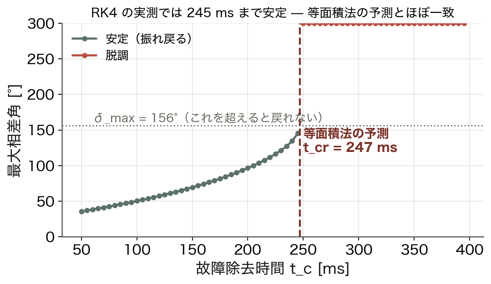

- 245 ms までは安定（緑）
- 250 ms から脱調（赤）
- 境目は **5 ms** の幅しかない
- 等面積法の 247 ms と一致

安定と脱調の間に「だんだん危なくなる」領域はない。だから整定は余裕を持って決める。

<!-- note: この鋭さが安定度計算の怖さ。実系統では想定事故を数百ケース計算して最悪を探す。 -->

---

<!-- _class: kpi -->

# 手計算と数値積分が一致した

  89.4°
  臨界除去角（等面積法）

  247 ms
  臨界除去時間（理論）

  245 ms
  RK4 積分の実測

<!-- note: 実測が 2 ms 短いのは掃引の刻み幅（5 ms）のため。理論と数値が合うことを確認したので、以後は理論式で議論できる。 -->

---

<!-- _class: figure-story -->
<!-- source: コード/fig_ch07.py -->

# 位相面で見る — 越えたら戻れない点

## 読み方｜横軸が角度、縦軸が角速度。閉じた軌道なら戻ってくる

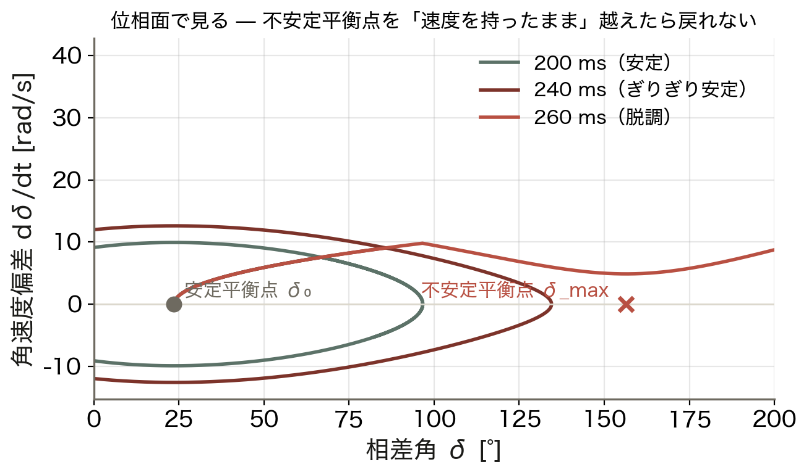

- 200 ms：閉じた軌道を描いて戻る
- 240 ms：ぎりぎり閉じる
- 260 ms：不安定平衡点を越えて発散
- 越えるとき速度が残っているかが分岐

「δ_max を越えたら脱調」ではない。**速度を持ったまま**越えたら戻れない、が正確な言い方である。

<!-- note: 位相面は制御工学の言葉。安定平衡点と鞍点（不安定平衡点）という見方を紹介しておく。 -->

---

<!-- _class: divider -->

# Ⅳ. 現実の系統と対策

## 1 回線開放、制動、慣性低下

---

<!-- _class: figure-story -->
<!-- source: コード/fig_ch07.py -->

# 1 回線開放 — 除去後の曲線が下がる

## 読み方｜事故前・事故中・除去後の 3 本。除去後は 1 回線なので P_max が下がる

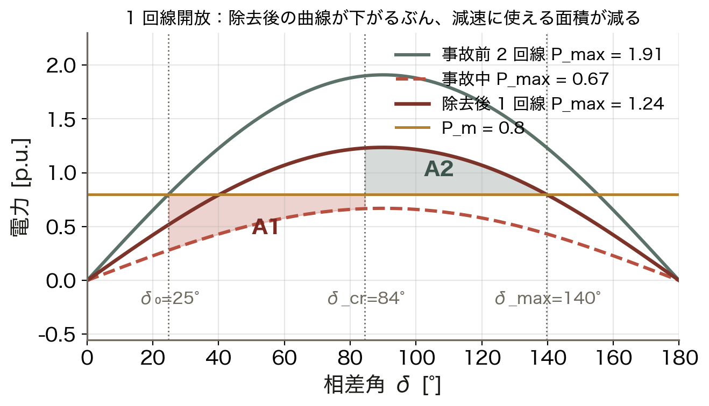

- 事故前 2 回線：P_max = 1.91
- 事故中：P_max = 0.67（完全に 0 ではない）
- 除去後 1 回線：P_max = **1.24**
- δ_cr = 84°、δ_max = 140°

現実には事故中も少しは送れ、除去後は系統が弱くなる。減速に使える面積が減るぶん、許される除去時間も短くなる。

<!-- note: 事故中の P_max はＹ–Δ 変換で求める。事故点が発電機に近いほど小さくなり、厳しくなる。 -->

---

<!-- _class: figure-story -->
<!-- source: コード/fig_ch07.py -->

# 対策 — A1 を減らすか A2 を増やすか

## 読み方｜臨界除去時間で比べた。慣性低下だけが余裕そのものを削る

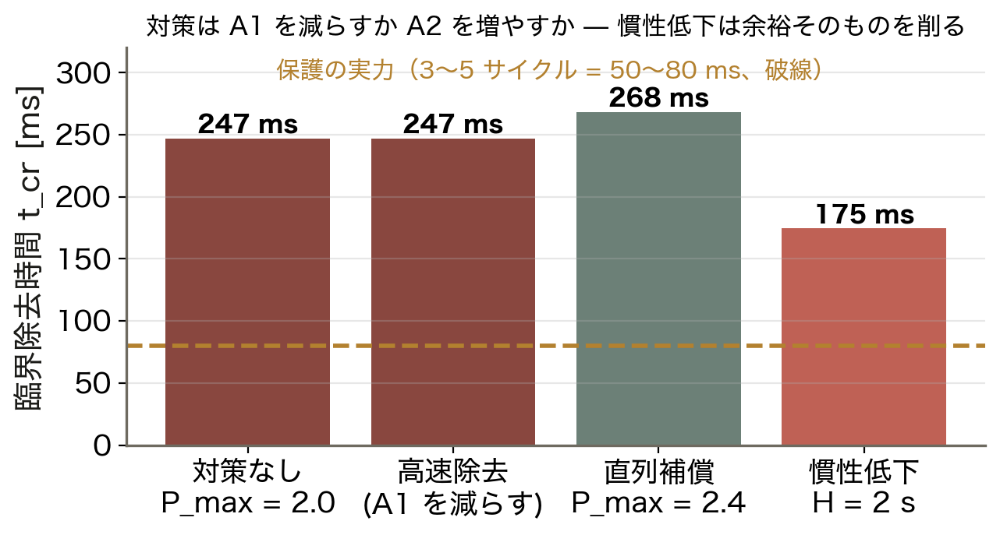

- 高速除去：t_cr は変えず実際の t_c を短く
- 直列補償で P_max 2.0 → 2.4：**268 ms**
- 慣性低下 H = 2 s：**175 ms**
- 保護の実力は 50〜80 ms

対策は 2 通りしかない。事故中に貯める量を減らすか、除去後に吐き出せる量を増やすか。

<!-- note: FACTS（直列コンデンサ・SVC）は P_max を上げる装置。再閉路は事故を早く消す装置。両方が使われている。 -->

---

<!-- _class: figure-story -->
<!-- source: コード/fig_ch07.py -->

# 制動 — PSS は振動を減らす装置

## 読み方｜除去 200 ms で安定はするが、振動がなかなか収まらない

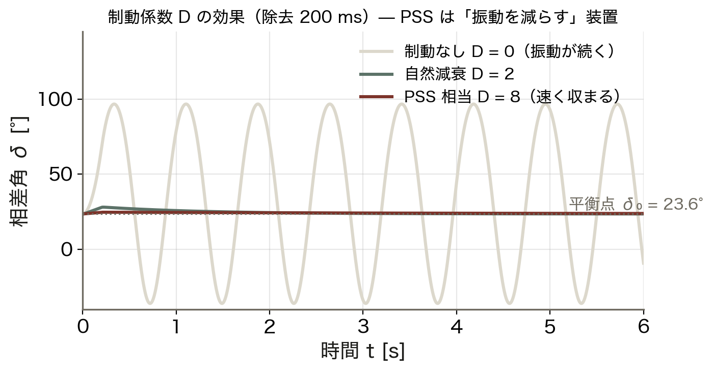

- D = 0：振動が続く（理想化）
- D = 2：ゆっくり収まる
- D = 8（PSS 相当）：速く収まる
- 平衡点 δ₀ = 23.6° に戻る

脱調を防ぐのは等面積法、振動を収めるのは制動。役割が違う 2 つの安定性を区別する。

<!-- note: PSS = 電力系統安定化装置。励磁系に速度偏差の信号を足して、電気トルクに制動成分を作る。 -->

---

<!-- _class: figure -->

# 動く図で試す — viz/swing.html

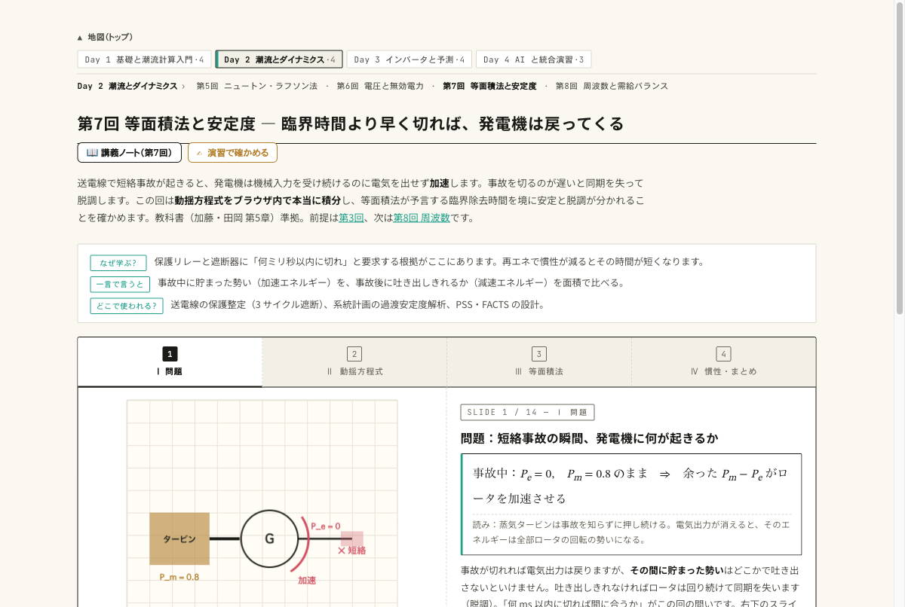

動く図 動揺方程式の RK4 積分と等面積法をブラウザ内で実計算する 14 枚のスライド。

- 除去時間を 240 → 260 ms に動かし、振れ戻りと脱調が切り替わる瞬間を見る
- H を 4 → 2 s にして、δ_cr は変わらず t_cr だけ短くなるのを確かめる
- 面積 A1 と A2 の数値を読み、釣り合う除去角が 89.4° になるのを検算する

---

<!-- _class: blocks -->

# なぜそう考えるか — H は角度でなく時間に効く

  なぜ δ_cr は H に依らないのか
  等面積法はエネルギーの釣り合いで、面積は P–δ 平面の幾何だけで決まる。H は「その角度に何秒で着くか」にしか関わらない。

  なぜ t_cr は √H に比例するのか
  事故中は加速電力が一定なので等加速度運動。δ − δ₀ = (ω₀P_m/4H)t² となり、同じ角度に達する時間は √H に比例する。H が半分なら 0.707 倍。

  落とし穴
  角度を度のまま代入しない。δ はラジアン、ω₀ = 2π×60 = 377 rad/s。

---

<!-- _class: figure-full -->
<!-- source: コード/fig_ch07.py -->

# よくある誤解

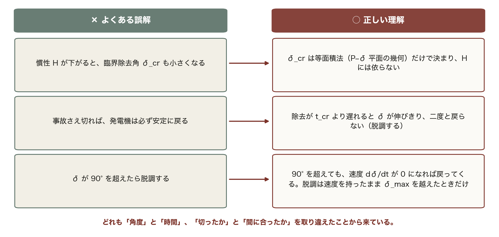

試験でも実務でも、この 3 つが最も多い。問題文を読んだら、まず「臨界除去角」の話か「臨界除去時間」の話かを区別する習慣をつける。

---

<!-- _class: takeaway -->

# 持ち帰る 3 点

安定度は回転体の力学。貯めた勢いを吐き出せるかを面積で比べ、その時間の余裕を H が決める

<li>動揺方程式 (2H/ω₀)δ″ = P_m − P_max sinδ。H は「勢いの貯金」で単位は秒</li>
<li>等面積法：A1 = A2 で δ_cr = 89.4°、t_cr = 247 ms。数値積分とも一致</li>
<li>対策は A1 を減らす（高速除去）か A2 を増やす（P_max 増）。慣性低下は余裕を削る</li>

---

<!-- _class: end -->

# 次回：第8回 受給バランスと周波数制御

演習 ex/ch07.html で数値を変えて確かめる

相差角の次は周波数 — 系統全体で 1 つの値をどう守るか
