<!-- _class: title -->

# 第8回 受給バランスと周波数制御
## 周波数は系統の天秤 — 傾きは ΔP ÷ K
Day 2・コマ 8 ／ 教科書 第7章

<!-- note: Day 2 の最終コマ。第7回の相差角（局所・秒以下）から、周波数（全体・分単位）へ視点を移す。 -->

---

<!-- _class: statement -->

発電と消費の食い違い ΔP を、系統の硬さ K で割ったものが周波数のずれ ΔF。沖縄には隣から応援が来ない。

<!-- note: この 1 文を最後にもう一度出す。ΔP = KΔF が今日の背骨。 -->

---

<!-- _class: graphical-abstract -->

# この回の全体像

## 一枚で｜問い → 課題 → 道具 → 到達点

  問い
  250 MW の発電機が突然止まった。周波数は **どこまで、どれだけ速く** 下がるのか。沖縄と九州で何が違うのか。

  課題
  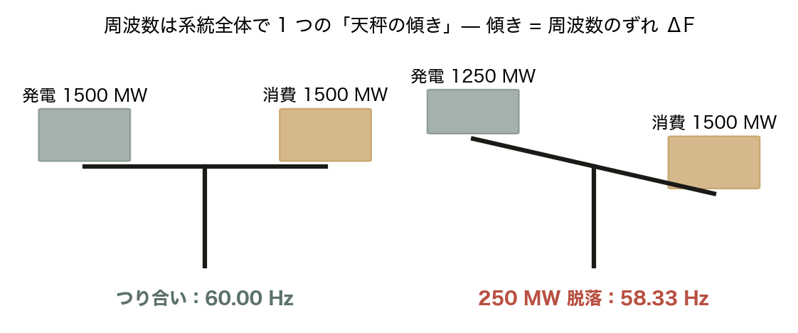
  天秤が傾く。傾きが周波数のずれ。

  道具
  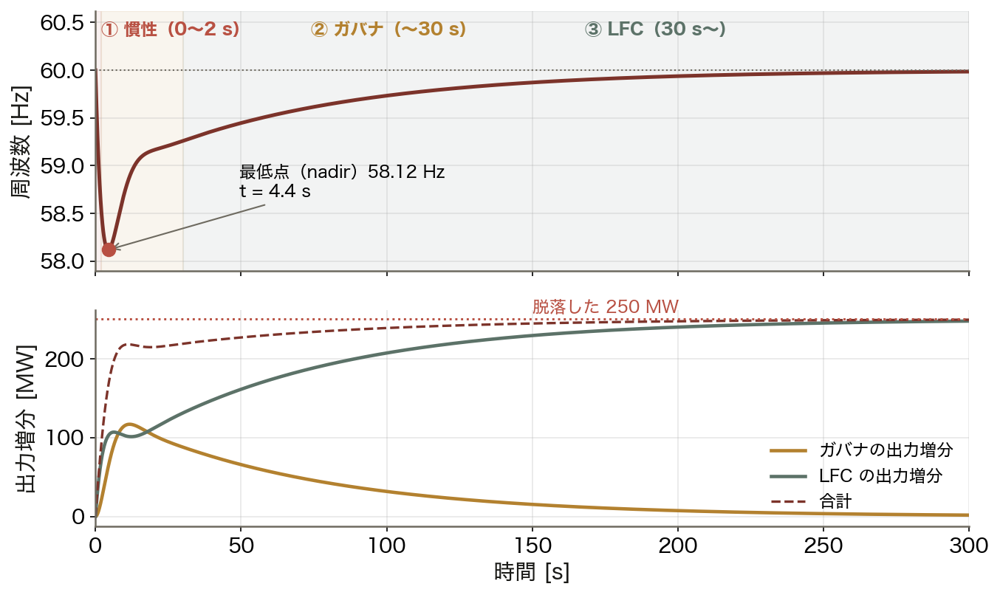
  ΔP = KΔF ▶ 慣性 ▶ ガバナ ▶ LFC
  3 段の応答を ==積分== する。

  到達点
  10 倍
  同じ 250 MW でも、沖縄は九州の 10 倍周波数が動く。

数値はすべて本資料の Python コード（コード/fig_ch08.py）で計算。沖縄 1,500 MW・H = 4.5 s・%K = 1.0 %MW/0.1Hz、60 Hz。

<!-- note: 右下の 10 倍が結論。系統の大きさが周波数の安全余裕を決める、という話。 -->

---

<!-- _class: figure-full -->
<!-- source: コード/fig_ch08.py -->

# 現場で起きたこと — 抜けた割合で並べる

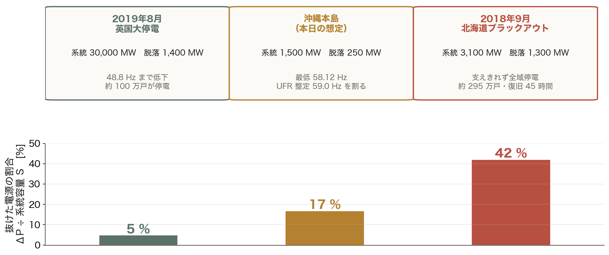

同じ「1 台の脱落」でも、系統の大きさで意味がまったく変わる。沖縄本島で 250 MW が抜けることは、英国で 1,400 MW が抜けるより 3 倍以上きつい事象である。

<!-- note: 北海道は地震で苫東厚真が停止し、負荷遮断でも支えきれず全域停電、約 295 万戸・復旧 45 時間。英国は落雷を契機に洋上風力とガス火力が続けて脱落し、48.8 Hz まで低下して約 100 万戸が停電した。英国の系統容量と脱落量は概数。 -->

---

<!-- _class: figure-full -->
<!-- source: コード/fig_ch08.py -->

# たとえ話 — 天秤で考える

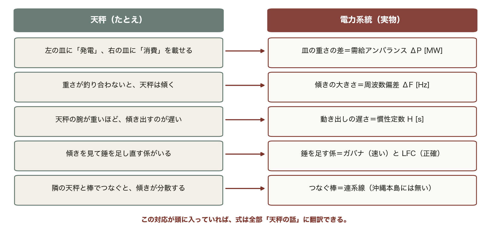

たとえ話が崩れる点も押さえておく。本物の周波数は場所によらず系統全体で 1 つの値なので、天秤が何台もあるのではなく、巨大な天秤が 1 台あると考える。

<!-- note: この 5 行は第8回の全体を先取りしている。ΔP・ΔF・H・ガバナ・LFC・連系線が、あとで順番に式になって出てくる。 -->

---

<!-- _class: agenda -->

# この回の地図

1. 系統定数 K — ΔP = KΔF を作る 3 つの部品
2. 時間応答 — 慣性 → ガバナ → LFC の 3 段ロケット
3. 慣性と RoCoF — 最初の数秒で何が決まるか
4. 連系系統と AR — 応援の式と、応援が無い沖縄

---

<!-- _class: divider -->

# Ⅰ. 系統定数 K

## 周波数の「硬さ」はどこから来るか

---

<!-- _class: figure-story -->
<!-- source: コード/fig_ch08.py -->

# 速度調定率 ε — ガバナの傾き

## 読み方｜横軸が出力、縦軸が周波数。直線の傾きが「何 Hz で何 MW 動くか」

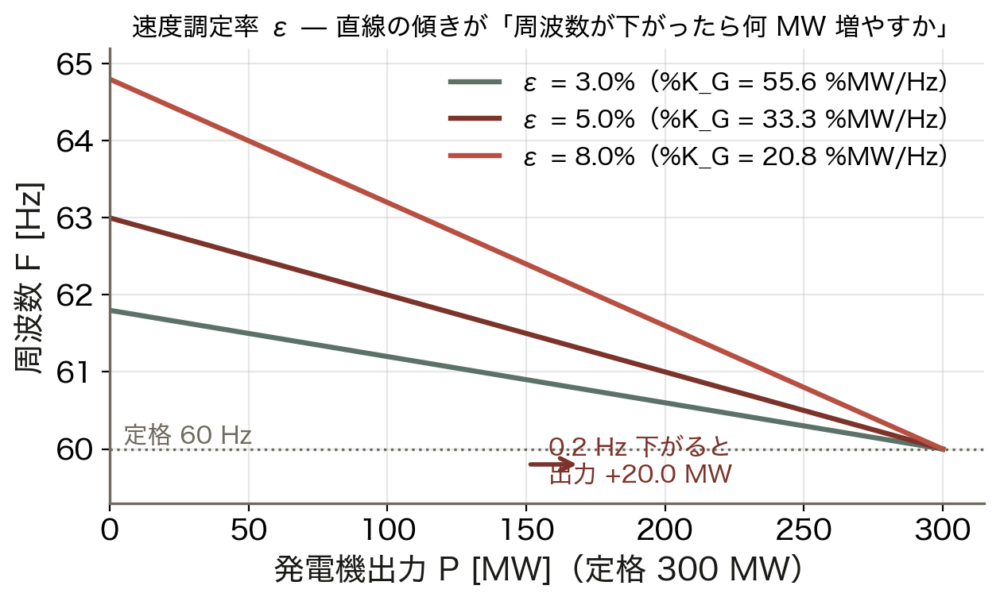

- ε は無負荷と全負荷の周波数差の割合
- ε = 5%、定格 300 MW なら K_G = **100 MW/Hz**
- 0.2 Hz 下がると出力 +20 MW
- ε が小さいほど傾きが急＝よく効く

ε が小さすぎると出力が激しく動いて機器を痛める。4〜5% はその妥協点である。

<!-- note: %K_G = 10000/(ε F_N) の式をここで導く。ε=5%、60 Hz なら 33.3 %MW/Hz。定格 300 MW なら 100 MW/Hz。 -->

---
<!-- _class: figure-full -->
<!-- source: コード/fig_ch08.py -->

# 例題 — 速度調定率 5% は何 MW 効くか

## ε から K_G を出す道筋

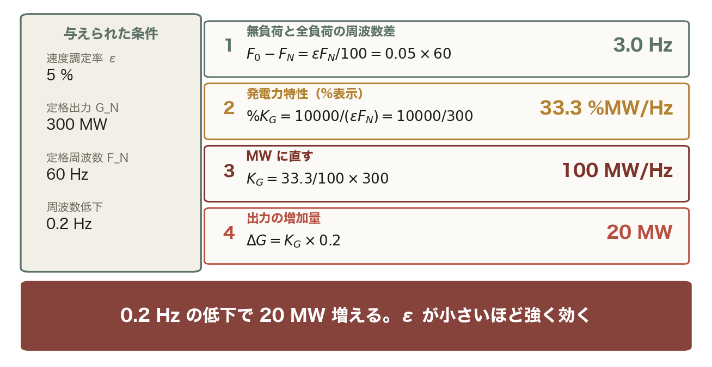

ε が小さいほど K_G は大きく、わずかな周波数変化で出力が大きく動く。4〜5% はその妥協点。

<!-- note: 学生に手順 2 と 3 を計算させる。ε = 3% なら何 MW かも聞く。 -->

---
<!-- _class: figure-full -->
<!-- source: コード/fig_ch08.py -->

# 導出 — ΔP = KΔF はどこから来るか

## 発電側と負荷側、その釣り合い

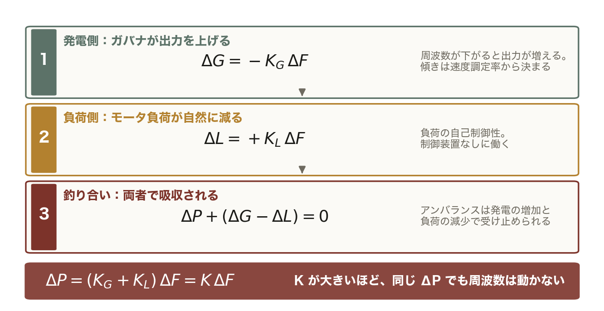

アンバランスは「発電が増える分」と「負荷が減る分」の合計で受け止められる。その合計の傾きが系統定数 K。

<!-- note: 符号の約束（発電余剰を正）をここで確認。ΔP も ΔF も負になるので K は正。 -->

---

<!-- _class: figure-story -->
<!-- source: コード/fig_ch08.py -->

# 交点が運転点 — 発電特性と負荷特性

## 読み方｜2 本の直線の交点が周波数。発電特性が左へずれると交点が下がる

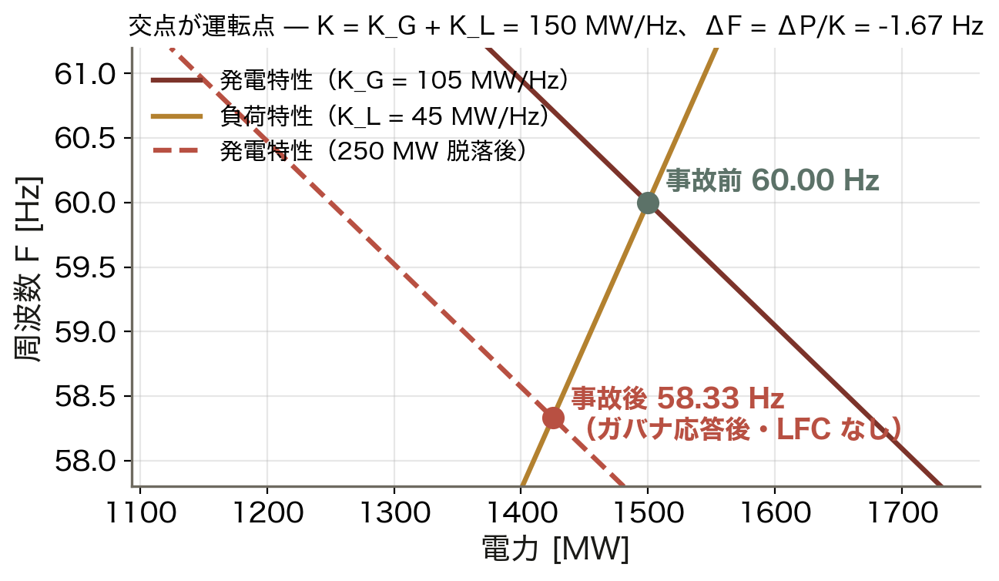

- K = K_G + K_L = **150 MW/Hz**（沖縄）
- 事故前は 1,500 MW・60.00 Hz で交わる
- 250 MW 脱落で線が左へ平行移動
- 新しい交点は **58.33 Hz**

周波数は「発電と消費が釣り合う 1 点」で決まる。天秤の傾きが自然に落ち着く場所である。

<!-- note: %K = 1.0 %MW/0.1Hz は容量の 10%/Hz なので、1,500 MW なら 150 MW/Hz。単位換算をここで再確認。 -->

---
<!-- _class: figure-full -->
<!-- source: コード/fig_ch08.py -->

# 単位の約束 — %MW/0.1Hz を MW/Hz に直す

## 「10 で割る」の中身を、1 段ずつ開く

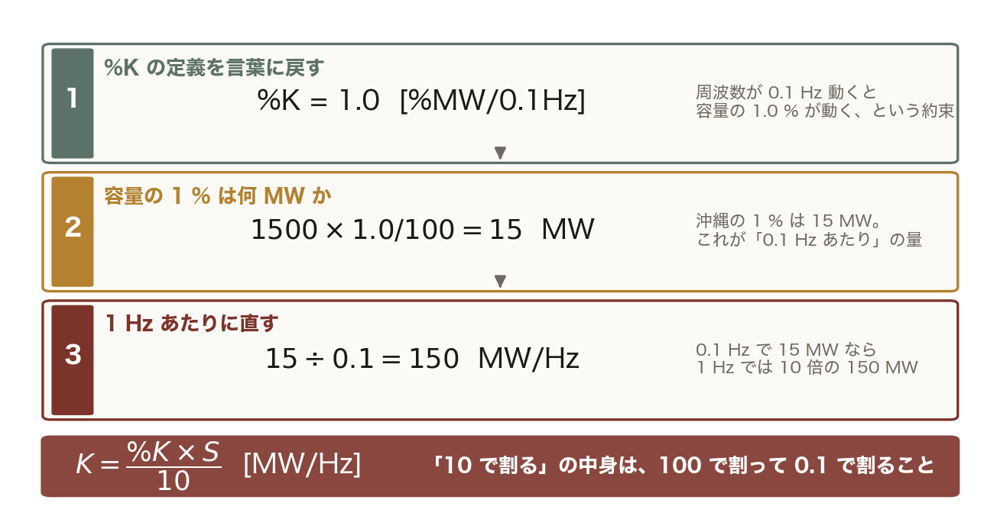

%K は「0.1 Hz あたり、容量の何 % が動くか」。100 で割って MW にし、0.1 で割って 1 Hz あたりに直す。その 2 回の割り算が合わさって 10 になる。

<!-- note: 公式を丸暗記した学生は、%K の単位が %MW/Hz で与えられた問題で必ず間違える。定義に戻れば毎回導ける。 -->

---

<!-- _class: figure-full -->
<!-- source: コード/fig_ch08.py -->

# ΔF = ΔP / K — 系統の大きさが効く

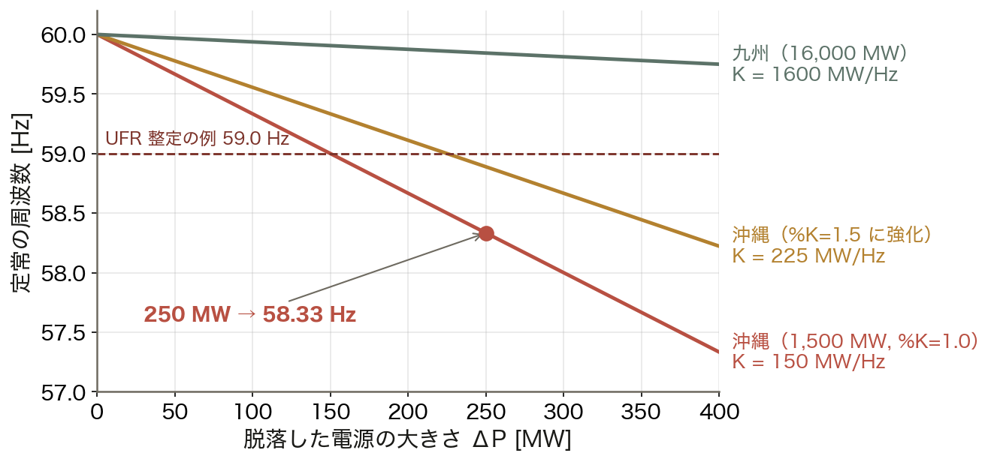

直線の傾きの逆数が K である。同じ 250 MW の脱落でも、沖縄（K = 150）は 58.33 Hz、九州（K = 1,600）は 59.84 Hz。沖縄では 250 MW 級の 1 台が系統全体を脅かす。

<!-- note: 沖縄電力の最大ユニットは 250 MW 級。だから「1 台落ちたら」の想定がそのまま設計条件になる。　図の要点：沖縄（K = 150）：250 MW で 58.33 Hz／九州（K = 1,600）：同じ脱落で 59.84 Hz／%K を 1.5 に強化すると 58.89 Hz／UFR 整定 59.0 Hz を割るかが分岐点 -->

---

<!-- _class: divider -->

# Ⅱ. 時間応答

## 慣性 → ガバナ → LFC の 3 段ロケット

---

<!-- _class: figure-full -->
<!-- source: コード/fig_ch08.py -->

# 制御の階層 — 変動の周期で分担する

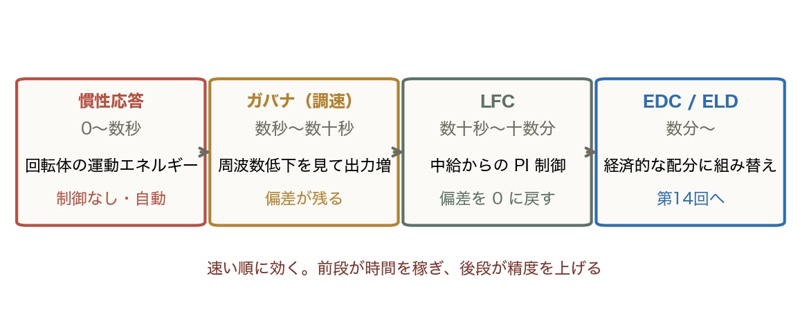

どれか 1 つでは足りない。速いが不正確な段と、遅いが正確な段を積み重ねることで、速さと精度の両方を手に入れている。

<!-- note: 速い順に効く。前段が時間を稼ぎ、後段が精度を上げる。LFC = Load Frequency Control（負荷周波数制御）、ELD = Economic Load Dispatch（第14回）。 -->

---

<!-- _class: figure-full -->
<!-- source: コード/fig_ch08.py -->

# 3 段ロケットを積分する

下の図で、ガバナの出力増分は 10 秒付近で頭打ちになり、そこから LFC が引き継いで合計を 250 MW まで持ち上げる。ガバナは「止める」装置、LFC は「戻す」装置である。

<!-- note: 下の図でガバナの山が下がり LFC が上がる交代を指差す。合計（破線）が 250 MW に収束する。　図の要点：最低点（nadir）58.12 Hz（t = 4.4 s）／ガバナが 10 秒付近でピーク／LFC が徐々に引き継ぐ／5 分後には 59.99 Hz に復帰 -->

---

<!-- _class: figure-full -->
<!-- source: コード/fig_ch08.py -->

# 沖縄と九州 — 同じ事故、違う結末

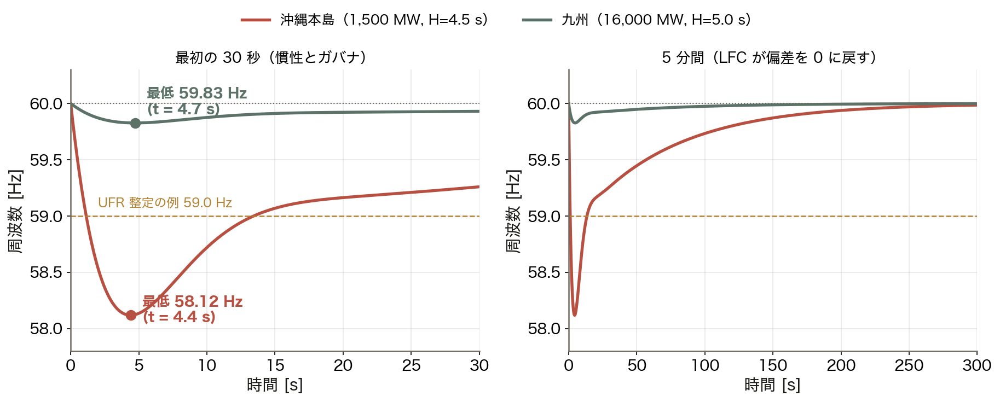

同じ 250 MW 脱落でも、沖縄は UFR 整定 59.0 Hz を割り、九州は運用範囲に収まる。系統が小さいことが、そのまま設計条件の厳しさになる。

<!-- note: UFR = 低周波数リレー。周波数が整定値を割ると需要の一部を切り離して周波数を守る、最後の砦。　図の要点：沖縄は UFR 整定 59.0 Hz を割る／九州は運用範囲に収まる／落ち始めの傾きも沖縄が急／5 分後はどちらも 60 Hz に戻る -->

---

<!-- _class: figure-full -->
<!-- source: コード/fig_ch08.py -->

# 3 つの時間帯 — 別々の量を混ぜない

## 同じ 250 MW 脱落を、3 つの時間窓で見る

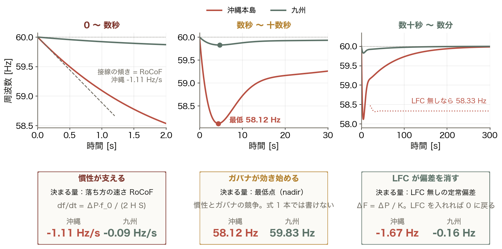

RoCoF は最初の 1 秒、最低点は数秒後、定常偏差は数十秒後の話。「どれが何 Hz か」を答える前に、どの時間帯を聞かれているかを確かめる。

<!-- note: 試験でも実務でも、この 3 つを取り違えた答案が一番多い。RoCoF は H、最低点は H とガバナの競争、定常偏差は K で決まる。 -->

---

<!-- _class: divider -->

# Ⅲ. 最初の数秒

## 落ち方の速さは慣性が決める

---
<!-- _class: figure-full -->
<!-- source: コード/fig_ch08.py -->

# RoCoF — 制御が動く前の落ち方

## 分母に慣性。H が小さいほど速く落ちる

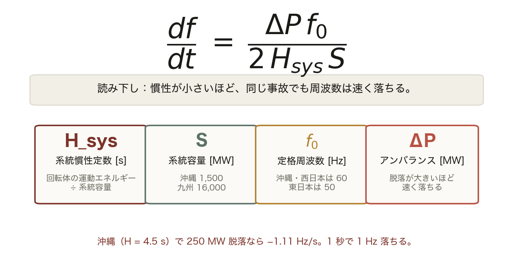

分母に慣性 H がある。同じ ΔP でも、回転体の運動エネルギーが少ない系統ほど周波数は速く落ちる。第7回の動揺方程式を系統全体に広げた形である。

<!-- note: 第7回の動揺方程式そのもの。1 機の H が系統全体の H_sys に変わっただけ。 -->

---

<!-- _class: figure-full -->
<!-- source: コード/fig_ch08.py -->

# 慣性が減ると、速く深く落ちる

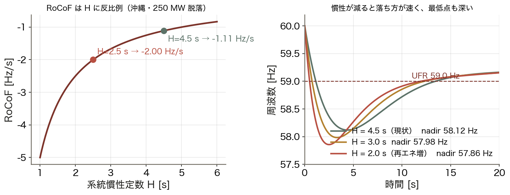

H を 4.5 s から 2.0 s に下げると RoCoF は 2.3 倍速くなり、最低点も 58.1 Hz から 57.2 Hz へ深くなる。それでも定常偏差は動かない。そこは K の担当である。

<!-- note: この区別が重要。H を増やしても定常偏差は変わらない。K を増やさないと最終的な周波数は戻らない。　図の要点：H = 4.5 s：RoCoF −1.11 Hz/s／H = 2.0 s：−2.50 Hz/s（2.3 倍）／最低点も 58.1 → 57.2 Hz へ／定常偏差（K で決まる）は変わらない -->

---
<!-- _class: figure-full -->
<!-- source: コード/fig_ch08.py -->

# 例題 — 250 MW が脱落したら何が起きるか

## 左が条件、右が手順、下が結論

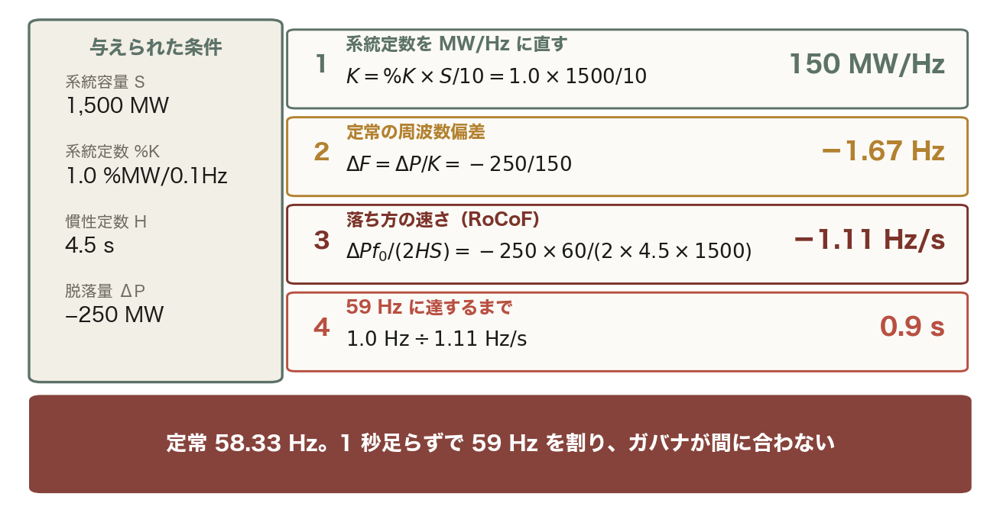

定常値と落ち方の速さは別の式で決まる。両方を出して初めて「危ないか」が言える。

<!-- note: 学生に手順 1 と 2 を計算させる。九州（S = 16,000 MW）でも同じ計算をさせると差が体感できる。 -->

---

<!-- _class: divider -->

# Ⅳ. 連系と地域要求量

## 応援の式、そして応援が無い系統

---
<!-- _class: figure-full -->
<!-- source: コード/fig_ch08.py -->

# 導出 — 連系系統の周波数と潮流

## 2 本の式を足すと周波数、引くと潮流

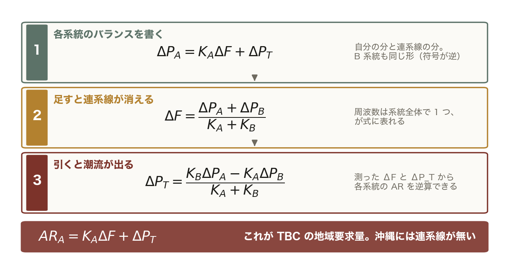

周波数は系統全体で 1 つ、という事実が「足すと連系線が消える」という形で式に表れている。

<!-- note: AR の逆算が TBC の正体。測れる 2 つの量から、測れないアンバランスを推定している。 -->

---

<!-- _class: figure-full -->
<!-- source: コード/fig_ch08.py -->

# 連系の効き目 — 2.7 分の 1 に

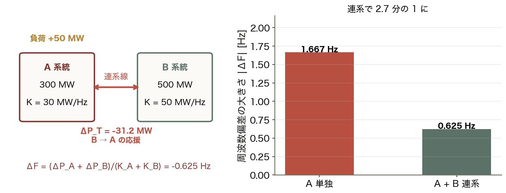

A 系統で 50 MW の負荷が増えたとき、単独なら 1.667 Hz 下がるが、B 系統と連系していれば 0.625 Hz で済む。連系線は「周波数の応援線」で、沖縄本島にはこれが無い。

<!-- note: AR_A = K_A ΔF + ΔP_T、AR_B = K_B ΔF − ΔP_T。B の AR は 0 になる（B にはアンバランスが無い）。　図の要点：A 単独（K = 30）：1.667 Hz の低下／A + B 連系（K = 80）：0.625 Hz／連系線を 31.2 MW が B → A へ流れる／B が応援している -->

---

<!-- _class: figure-story -->
<!-- source: コード/fig_ch08.py -->

# LFC の積分ゲイン — 大きすぎても小さすぎても

## 読み方｜β は「偏差をどれだけ急いで消すか」。行き過ぎると振動する

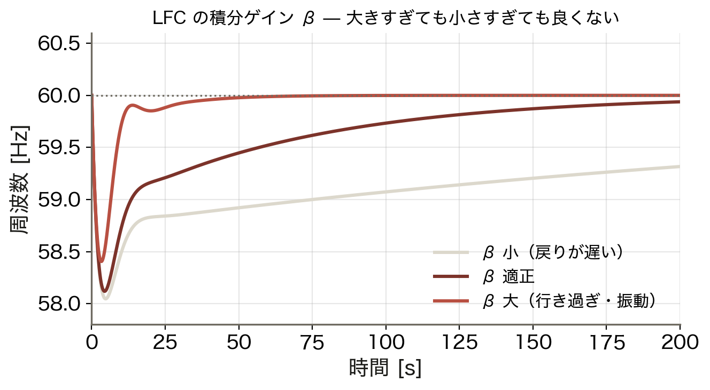

- β 小：戻りが遅く偏差が長く残る
- β 適正：滑らかに 60 Hz へ
- β 大：行き過ぎて **振動**
- 教科書 例題7.3 の主張と同じ

制御ゲインは速さと安定性のトレードオフ。ここは制御工学そのもので、系統に固有の話ではない。

<!-- note: PI 制御の一般論。積分ゲインを上げると定常偏差は速く消えるが、位相余裕が減って振動する。 -->

---

<!-- _class: figure -->

# 動く図で試す — viz/freq.html

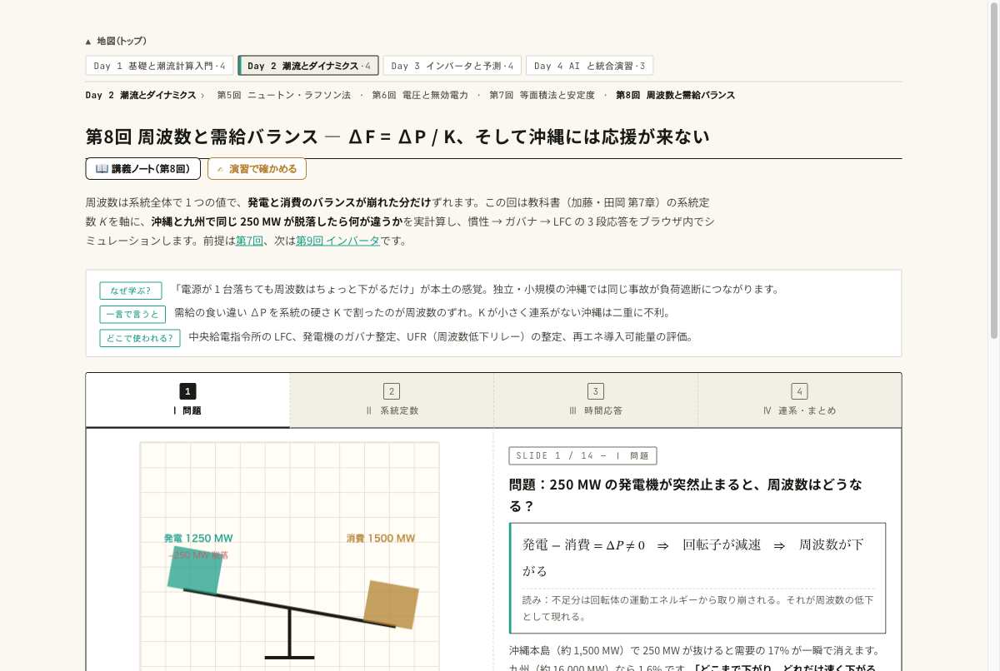

動く図 沖縄と九州の周波数応答、慣性・ガバナ・LFC の 3 段をブラウザ内で実計算する 14 枚のスライド。

- 沖縄と九州を切り替え、同じ 250 MW 脱落で ΔF が約 10 倍違うのを見る
- 慣性 H を 4.5 → 2.5 s に下げ、最初の 1 秒の落ち方が速くなるのを見る
- 連系スライダで K_B を増やし、連系線潮流 ΔP_T と AR の符号を読む

---

<!-- _class: blocks -->

# なぜそう考えるか — 単位・符号・役割

  なぜ %MW/0.1Hz なのか
  運用で扱う周波数偏差は 0.1 Hz 程度。1 Hz 基準だと現場の数字が小さくなりすぎる。K [MW/Hz] = %K × S / 10 と覚える。

  なぜ「発電余剰を正」にするのか
  ΔP と ΔF の符号が揃い、ΔP = KΔF の K が正の定数になる。発電機脱落は ΔP が負、周波数低下も負で、式が 1 本で済む。

  H と K は役割が違う
  H は落ち方の速さと最低点、K は最終的にどこで止まるか。両方が要る。

---

<!-- _class: figure-full -->
<!-- source: コード/fig_ch08.py -->

# よくある誤解 — 3 つとも「いつの話か」の取り違え

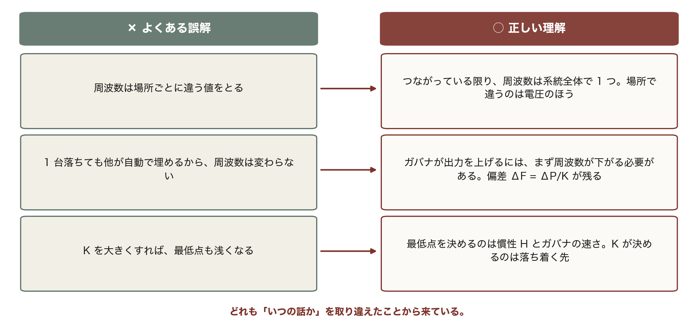

試験でも実務でも、この 3 つが最も多い。問題文を読んだら、まず「RoCoF・最低点・定常偏差のどれを聞かれているか」を確かめる習慣をつける。

---

<!-- _class: takeaway -->

# 持ち帰る 3 点

周波数のずれは ΔP ÷ K。小さい系統・少ない慣性ほど、同じ事故で大きく速く落ちる

<li>K = %K × S / 10 [MW/Hz]。単位の 10 倍の罠に注意</li>
<li>慣性 → ガバナ → LFC の順に効く。RoCoF は H に反比例</li>
<li>連系線は周波数の応援線。沖縄は自分の K と H だけで守る</li>

---

<!-- _class: end -->

# 次回：第9回 インバータと系統連系

演習 ex/ch08.html で数値を変えて確かめる

慣性を持たない電源が増えたとき、何が肩代わりするのか
