<!-- _class: title -->

# 第9回 インバータと系統連系
## 回らない電源が、系統を支えられるか
Day 3・コマ 9 ／ 教科書 第8章

<!-- note: Day 3 の初回。第7・8回で「回転体があるから系統は安定する」と学んだ直後に、回転体を持たない電源の話をする。 -->

---

<!-- _class: statement -->

インバータはスイッチで正弦波を作る電源。回転体がないので慣性はゼロだが、制御の設計次第で電圧と周波数を支える側に回れる。

<!-- note: 「性能」ではなく「制御の設計」で性格が決まる、というのが今日の主題。 -->

---

<!-- _class: graphical-abstract -->

# この回の全体像

## 一枚で｜問い → 課題 → 道具 → 到達点

  問い
  太陽光や風力は回転体を持たない。**慣性ゼロ**の電源が増えても系統は保てるのか。何が肩代わりするのか。

  課題
  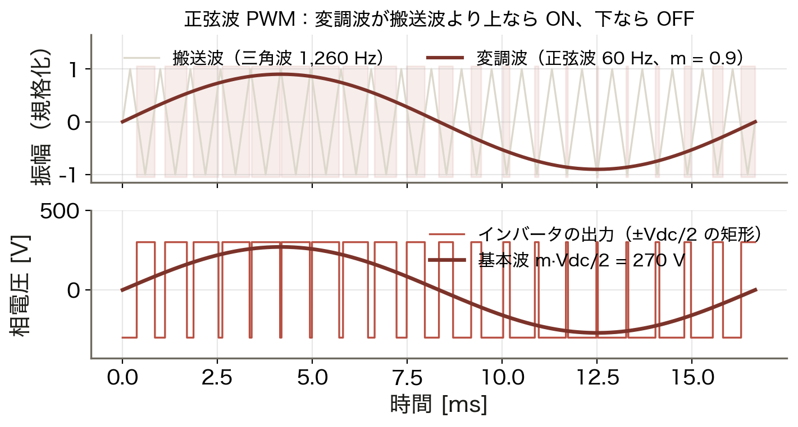
  スイッチの ON/OFF で正弦波を「作る」。

  道具
  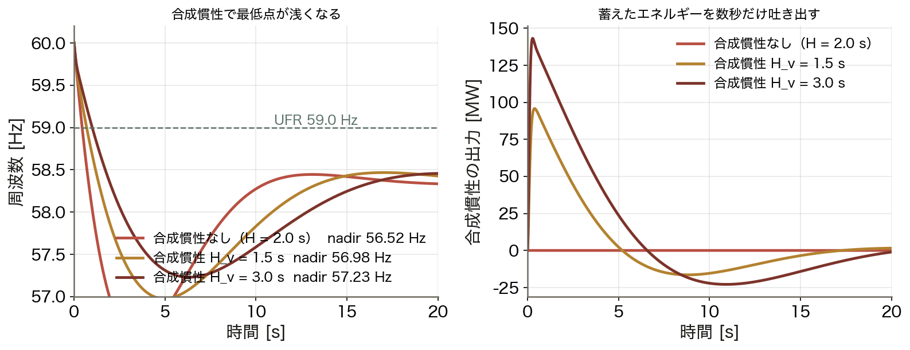
  PWM ▶ dq 制御 ▶ 合成慣性
  制御で慣性を ==模擬== する。

  到達点
  +0.7 Hz
  合成慣性で最低点が 56.52 → 57.23 Hz に改善する。

数値はすべて本資料の Python コード（コード/fig_ch09.py）で計算。Vdc = 600 V、沖縄 1,500 MW・H = 2.0 s・250 MW 脱落。

<!-- note: 右下の +0.7 Hz が結論。ただし「真の慣性ではない」ことを最後に必ず言う。 -->

---

<!-- _class: sections -->

# 現場で起きたこと — 弱さと強さ、どちらも実系統で

  2016年9月 南オーストラリア州 全域停電
  暴風で送電塔が倒れ、電圧低下が短時間に何度も起きた。風力発電の保護設定（電圧低下に耐える回数の上限）で出力が ==急減== し、州外との連系線が過負荷で遮断。州全体がブラックアウトした。

  2017年 同じ州に置かれた大型蓄電池
  約 100 MW の蓄電池が周波数調整の市場に参加し、周波数の落ち込みに 0.1 秒台で応答した。慣性を持たない電源でも、制御が速ければ周波数を支えられることを実系統で示した。

<!-- note: 同じインバータ電源が、設定次第で事故の引き金にも救い手にもなる。今日はその設計を学ぶ。 -->

---

<!-- _class: figure-full -->
<!-- source: コード/fig_ch09.py -->

# たとえ話 — 合唱の「合わせ手」と「指揮者」

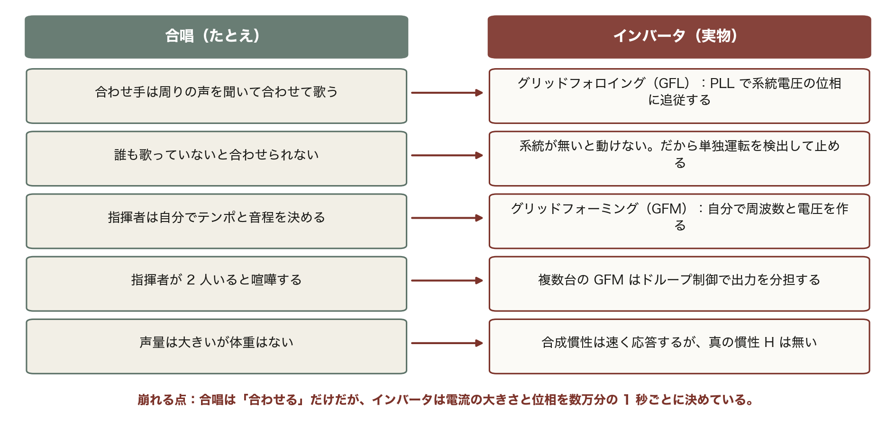

この 5 行は今日の全体を先取りしている。GFL・単独運転検出・GFM・ドループ・合成慣性が、あとで順番に出てくる。

<!-- note: 崩れる点：合唱は「合わせる」だけだが、インバータは電流の大きさと位相を数万分の 1 秒ごとに決めている。その速さが強みでもある。 -->

---

<!-- _class: agenda -->

# この回の地図

1. PWM — スイッチのオン・オフで正弦波を作る
2. dq 変換と制御 — 交流を直流にして PI で扱う
3. フォロイングとフォーミング、単独運転検出
4. 第6回・第8回への答え — Volt-Var 制御と合成慣性

---

<!-- _class: divider -->

# Ⅰ. 正弦波を「作る」

## パルスの幅で電圧を表す

---

<!-- _class: figure-story -->
<!-- source: コード/fig_ch09.py -->

# PWM — 変調波と搬送波を比べるだけ

## 読み方｜上が比較、下が出力。矩形波の平均が正弦波になる

- 変調波（60 Hz）が搬送波より上なら ON
- 出力は ±Vdc/2 の矩形しかない
- その平均が **m·Vdc/2 = 270 V** の正弦波
- 幅で電圧の大小を表している

インバータは正弦波を「増幅」しているのではない。矩形の幅を変えて、平均として正弦波を作っている。

<!-- note: 実機のスイッチング周波数は数 kHz〜数十 kHz。この図は見やすさのため 1,260 Hz にしている。 -->

---

<!-- _class: sections -->
<!-- build -->

# 導出 — 基本波の大きさはどう決まるか

  ① 1 スイッチング周期の平均｜幅が変調波に比例する
  搬送波が三角波なら、ON になる時間の割合は変調波の値に線形に比例する。だから 1 周期の平均電圧は変調波の形をそのままなぞる。

  ② 相電圧の基本波｜V̂₁ = m·Vdc/2
  出力の振れ幅が ±Vdc/2 で、変調率 m がその何割まで使うかを決める。m ≤ 1 が **線形領域**。

  ③ 線間の実効値｜√3 倍して √2 で割る
  V_LL = (√3/√2)·m·Vdc/2 ≈ **0.612 m Vdc**。600 V・m = 0.9 なら 328 V で、400 V 系統には少し足りない。

<!-- note: ③の数字で「なぜ太陽光の PCS は昇圧トランスを持つか」を説明できる。 -->

---

<!-- _class: figure-story -->
<!-- source: コード/fig_ch09.py -->

# 変調率と出力電圧 — m ≤ 1 では比例

## 読み方｜実測（DFT で取り出した基本波）と理論式が線形領域で一致する

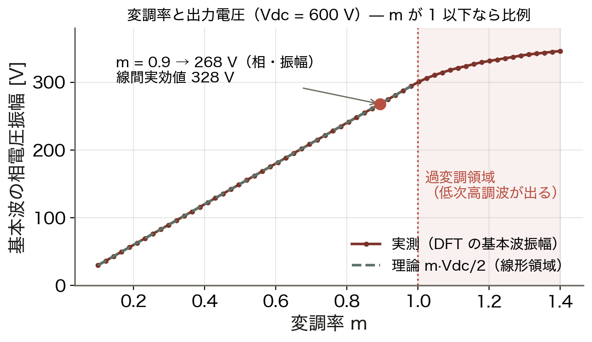

- m = 0.9 → 相電圧の振幅 **268 V**
- 線間実効値 **328 V**
- m > 1 は過変調（低次高調波が出る）
- 理論 m·Vdc/2 と実測がぴったり重なる

直流電圧が足りなければ、m を上げても限界がある。だから系統電圧に対して十分な Vdc を確保する。

<!-- note: 過変調は非常時に電圧を絞り出す手段。常用すると 5 次・7 次の高調波が増える。 -->

---

<!-- _class: figure-full -->
<!-- source: コード/fig_ch09.py -->

# 高調波はどこに出るか

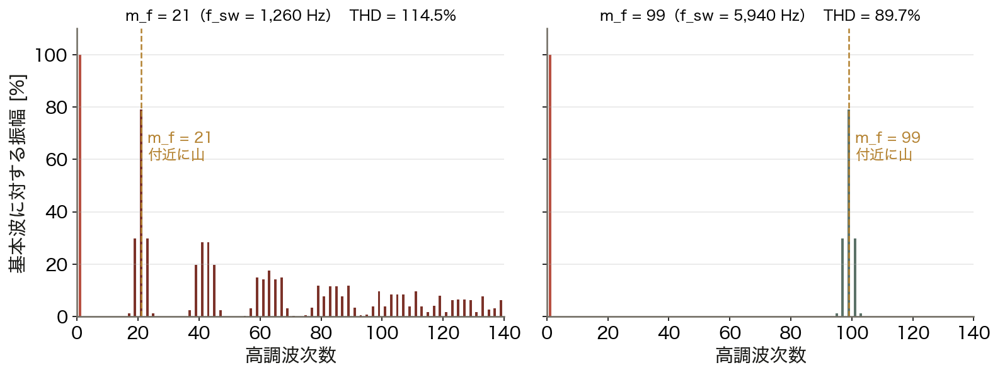

m_f を上げても高調波の総量は大きくは減らない。消えるのではなく、フィルタで落としやすい高い周波数へ移るだけである。

<!-- note: 連系規程の THD 5% はフィルタ後の系統側の値。この図はフィルタ前なので桁が違う。　図の要点：m_f = 21：21 次付近に大きな山／m_f = 99：99 次付近へ移動／低次（5・7 次）はほとんど出ない／フィルタ前の THD は 100% 前後 -->

---

<!-- _class: figure-story -->
<!-- source: コード/fig_ch09.py -->

# LCL フィルタ — 高い周波数を急峻に落とす

## 読み方｜両対数。L 単体より傾きが急で、同じ減衰を小さな部品で得られる

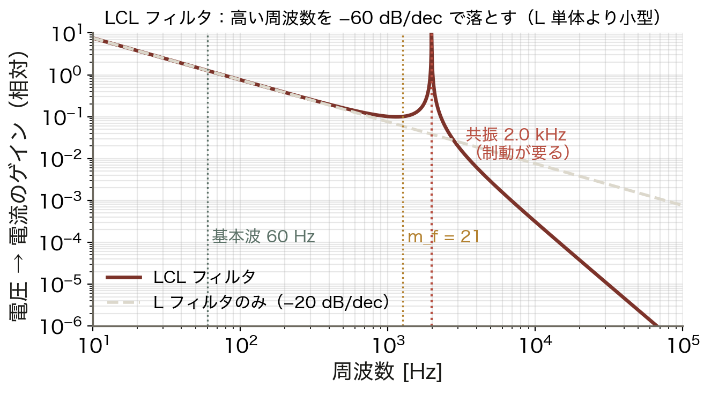

- 基本波 60 Hz はそのまま通す
- スイッチング成分を大きく減衰
- L 単体は −20 dB/dec、LCL は −60 dB/dec
- 共振 **約 2.0 kHz** には制動が要る

m_f を上げるほど小さなフィルタで済むが、スイッチング損失が増える。ここが設計のトレードオフ。

<!-- note: 共振点を放置すると発振する。受動制動（抵抗）か能動制動（制御）で抑える。 -->

---

<!-- _class: divider -->

# Ⅱ. どう制御するか

## 交流を直流に直してから決める

---

<!-- _class: figure-full -->
<!-- source: コード/fig_ch09.py -->

# dq 変換 — 回る座標に乗ると直流になる

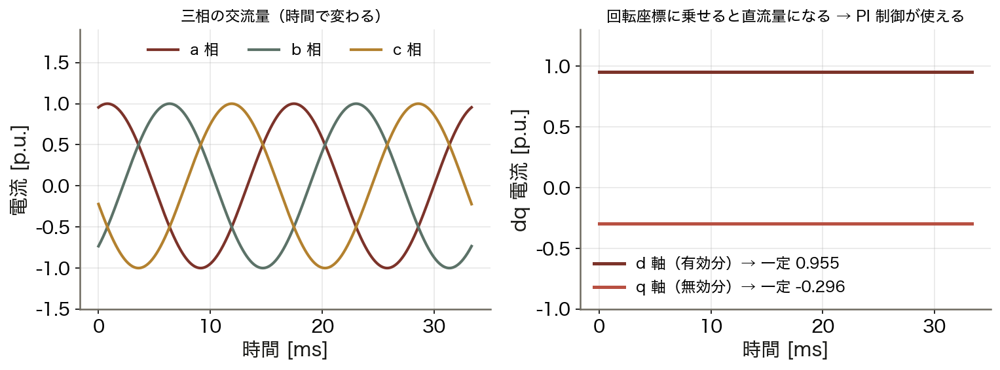

d 軸と q 軸に分けることで、有効電力 P と無効電力 Q を独立に指令できる。P と Q を分けて制御できるのは、この座標変換のおかげである。

<!-- note: 回転位相は PLL（位相同期回路）が系統電圧から作る。PLL が乱れると制御全体が乱れる。　図の要点：三相は時間とともに変わる／系統の位相に同期して回る座標へ／d 軸（有効分）と q 軸（無効分）が 一定値／直流なので PI 制御で偏差ゼロにできる -->

---

<!-- _class: figure-full -->
<!-- source: コード/fig_ch09.py -->

# 2 つの性格 — フォロイングとフォーミング

同じハードウェアでも、制御の設計次第で電源の性格が変わる。沖縄のように小さな系統ほど、「支えてもらう」GFL から「支える」GFM への転換の価値は大きい。

<!-- note: GFM の実装は仮想同期発電機（VSG）やドループ制御。同期機の振る舞いを制御で模擬する。　図の要点：GFL は電流源：系統に合わせる／GFM は電圧源：自分で作る／GFL は系統が弱いと不安定になる／GFM はブラックスタートができる -->

---

<!-- _class: figure-full -->
<!-- source: コード/fig_ch09.py -->

# 単独運転はなぜ危険か

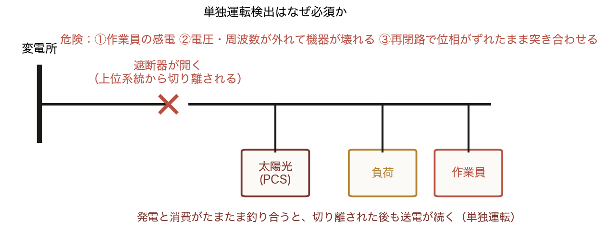

検出方式には、電圧・周波数の変化を見る受動的方式と、わざと乱して反応を見る能動的方式の 2 系統がある。

<!-- note: 能動的方式は多数台が並ぶと互いに干渉する。大量導入時代の課題の 1 つ。　図の要点：作業員が感電する／電圧・周波数が外れて機器が壊れる／再閉路で位相がずれたまま突き合わせる／だから検出して 止める のが義務 -->

---

<!-- _class: divider -->

# Ⅲ. 系統を支える側に回る

## 第6回と第8回への答え

---

<!-- _class: figure-full -->
<!-- source: コード/fig_ch09.py -->

# Volt-Var 制御 — 第6回の電圧問題への答え

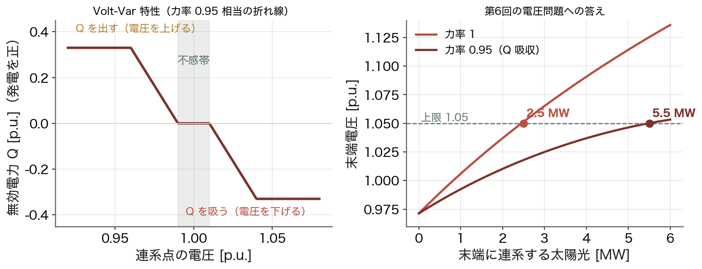

同じ太陽光が、電圧が高いときだけ無効電力を吸う調相設備にもなる。第6回で「Q は遠くへ運べない」と学んだ問題に、現地で答える形である。

<!-- note: 力率 0.95 運転は見かけの電流が 5% 増えるので損失も少し増える。ただではない。　図の要点：電圧が高いときだけ Q を吸う／不感帯を設けて無駄に動かさない／連系可能量 2.5 → 5.5 MW／設備を増やさずに 2.2 倍 -->

---

<!-- _class: equation -->

# 合成慣性 — 第8回の周波数問題への答え

$$\Delta P_\text{inv} = -\frac{2 H_v S}{f_0}\,\frac{df}{dt}$$

  $H_v$
  仮想慣性定数 [s]。制御で「重さ」を模擬する。エネルギー源は直流側の蓄電
  $df/dt$
  周波数変化率。測るのに数十〜数百 ms かかる。ここが真の慣性との決定的な差
  $df/dt < 0$
  符号：周波数が下がる（df/dt < 0）ときに出力を増やす。第7回の動揺方程式と同じ形
  $\Delta t$
  限界：数秒しか続かない。定常偏差を消すのは K（ガバナ・LFC）の仕事

<!-- note: 真の慣性は「測らずに物理的に出る」。合成慣性は「測ってから出す」。この差が遅れになる。 -->

---

<!-- _class: figure-full -->
<!-- source: コード/fig_ch09.py -->

# 合成慣性の効果 — 最低点が浅くなる

H = 2.0 s の系統で 250 MW が脱落した場合の応答である。ガバナが立ち上がるまでの数秒を合成慣性が肩代わりし、UFR の動作を回避できる。

<!-- note: 出力は数秒でゼロに戻る。蓄電池の容量（kWh）ではなく出力（kW）が効く用途。　図の要点：合成慣性なし：nadir 56.52 Hz／H_v = 1.5 s：56.98 Hz／H_v = 3.0 s：57.23 Hz（+0.7 Hz）／最大 143 MW を数秒だけ出す -->

---

<!-- _class: figure-story -->
<!-- source: コード/fig_ch09.py -->

# 遅れがあると効果が薄れる

## 読み方｜同じ H_v = 3.0 s でも、df/dt の測定に時間がかかると効かない

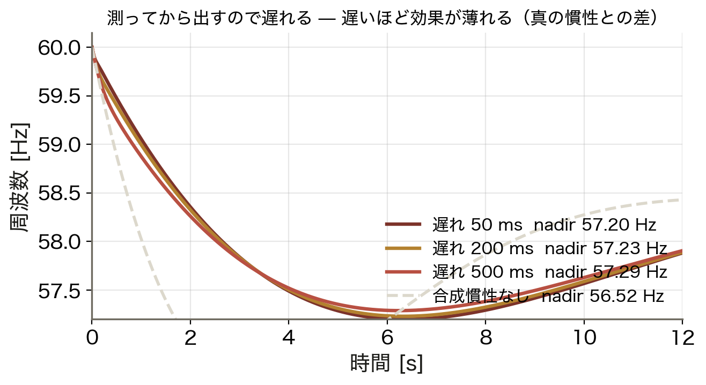

- 遅れ 50 ms：最低点が大きく改善
- 遅れ 200 ms：効果が半分程度
- 遅れ 500 ms：ほとんど効かない
- 破線は合成慣性なしの場合

合成慣性は「速さ」が命。だから真の慣性の代わりにはならず、RoCoF の初期値そのものは変えられない。

<!-- note: df/dt は微分なのでノイズに弱い。フィルタをかけると遅れ、かけないと誤動作する。ここが実装の難所。 -->

---

<!-- _class: kpi -->

# 制御で何がどこまでできるか

  2.2 倍
  Volt-Var による連系可能量

  +0.7 Hz
  合成慣性による最低点の改善

  0 s
  それでも真の慣性 H はゼロ

<!-- note: 3 つ目が今日の落としどころ。制御でできることは多いが、物理的な慣性の代わりにはならない。 -->

---

<!-- _class: steps -->

# 例題 1 — 600 V の直流から何ボルト出せるか

  1
  条件
  Vdc = 600 V、変調率 m = 0.9、系統 60 Hz、線形領域（m ≤ 1）

  2
  相電圧の振幅
  V̂₁ = m·Vdc/2 = 0.9 × 300 = 270 V（実測 268 V）

  3
  線間の実効値
  V_LL = 270 × √3/√2 = 331 V（実測 328 V）

  4
  判定
  400 V 系統には足りない。Vdc を上げるか昇圧トランスを入れる

<!-- note: 学生に 2 と 3 を計算させる。0.612 m Vdc = 0.612 × 0.9 × 600 = 330 V と一気に出す形も示す。 -->

---

<!-- _class: figure -->

# 動く図で試す — viz/inverter.html

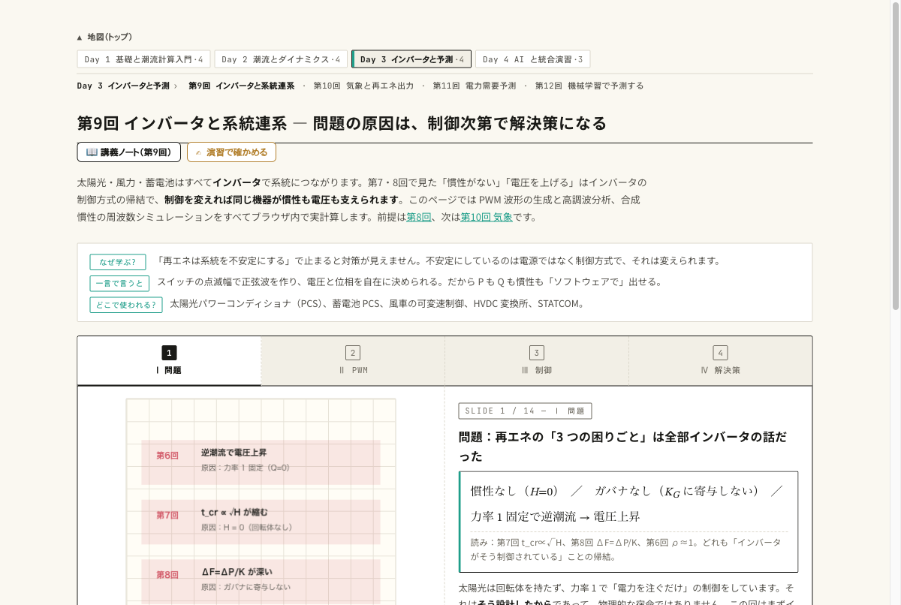

動く図 PWM 波形の生成と DFT、合成慣性の効果をブラウザ内で実計算する 14 枚のスライド。

- 変調率 m を動かし、基本波振幅が m に比例するのを DFT で見る
- m_f を 21 → 99 に上げ、高調波の山が高い次数へ移るのを見る
- 合成慣性を ON にして、周波数の最低点が浅くなるのを確かめる

---

<!-- _class: blocks -->

# なぜそう考えるか — dq・単独運転・合成慣性

  なぜ dq 変換をするのか
  正弦波のままでは PI 制御に定常偏差が残る。位相に同期した座標に乗ると正弦波が直流に見え、普通の PI で偏差ゼロにできる。

  なぜ単独運転検出が必須なのか
  系統が切れた後も送電を続けると、作業員の感電、電圧・周波数の逸脱による機器破損、再閉路時の位相不一致が起きる。だから「系統が無い」ことを検出して止める。

  合成慣性は真の慣性ではない
  df/dt を測ってから出すので遅れる。蓄電が無ければ続かない。RoCoF の初期値は変えられない。

---

<!-- _class: figure-full -->
<!-- source: コード/fig_ch09.py -->

# よくある誤解

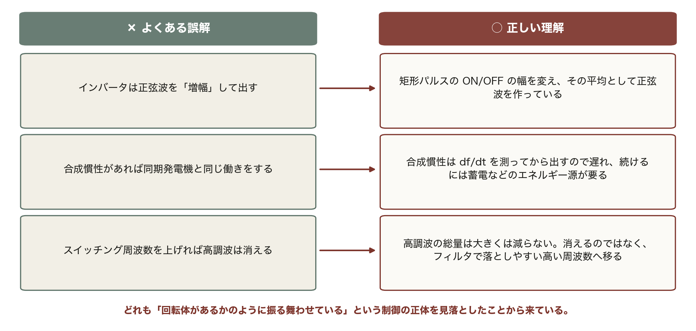

3 つとも PWM と合成慣性の仕組みに立ち戻れば解ける。「作り方」と「速さの限界」を先に押さえておくと、この種の設問に強くなる。

---

<!-- _class: takeaway -->

# 持ち帰る 3 点

インバータは制御そのものが電源の性格を決める。フォロイングは従い、フォーミングは作る

<li>PWM：V̂₁ = m·Vdc/2、高調波は m_f 付近。dq 変換で PI が効く</li>
<li>Volt-Var で電圧（第6回）、合成慣性で周波数（第8回）に答える</li>
<li>合成慣性は真の慣性ではない。遅れとエネルギー源が要る</li>

---

<!-- _class: end -->

# 次回：第10回 気象予測と再エネ出力

演習 ex/ch09.html で数値を変えて確かめる

天気予報を MW に翻訳する — 日射・風速・温度
