<!-- _class: title -->

# 第10回 気象予測と再エネ出力
## 天気予報を MW に翻訳する
Day 3・コマ 10

<!-- note: ここから 3 回は「予測」の話。供給側の不確実性が系統計画に入ってきた、という位置づけ。 -->

---

<!-- _class: statement -->

再エネの出力予測は「気象を予測し、物理式で MW に翻訳する」2 段階。誤差は両方から来て、風力では 3 乗で増える。

<!-- note: 「予報が当たれば予測も当たる」という誤解を最初に壊す。翻訳の式にも誤差がある。 -->

---

<!-- _class: graphical-abstract -->

# この回の全体像

## 一枚で｜問い → 課題 → 道具 → 到達点

  問い
  明日の太陽光は何 MW 出るのか。**どれくらい外れる**のか。外れたぶんは誰が埋めるのか。

  課題
  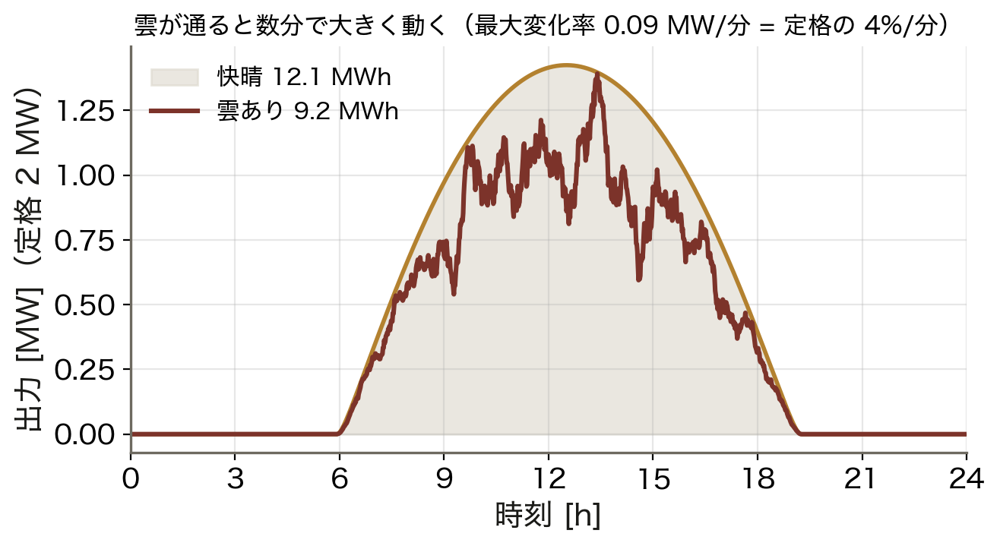
  雲が通ると数分で大きく動く。

  道具
  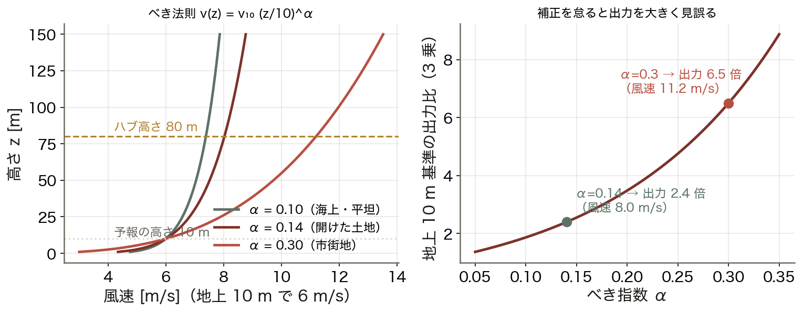
  日射 ▶ 温度補正 ▶ べき法則
  物理式で ==翻訳== する。

  到達点
  2.4 倍
  ハブ高さ補正を怠ると、風力の出力を 2.4 倍見誤る。

数値はすべて本資料の Python コード（コード/fig_ch10.py）で計算。地点は那覇（北緯 26.21°）。

<!-- note: 右下の 2.4 倍は「地上 10 m の予報値をそのまま使ったら」の話。翻訳の式が効くことを示す。 -->

---

<!-- _class: sections -->

# 現場で起きたこと — 供給側にも「天気」が入った

  2018年10月 九州で日本初の再エネ出力制御
  晴天で需要の軽い休日、太陽光の出力が需要に迫り、揚水と連系線を使い切っても ==余った==。太陽光に一時停止を指示する出力制御が国内で初めて実施された。予測が当たったからこそ、前日に指示が出せた。

  台風と雲 — 沖縄の 2 つの急変
  台風では風車がカットアウト風速（約 25 m/s）で一斉に停止し、出力が数分でゼロになる。日射の強い沖縄では雲の通過で太陽光が数分で数割変わる。どちらも「いつ」を当てる予測が要る。

<!-- note: 予測は「当てる」ためだけでなく「備える量を決める」ためにある。第8回の予備力につながる。 -->

---

<!-- _class: figure-full -->
<!-- source: コード/fig_ch10.py -->

# たとえ話 — 天気予報を「通訳」する

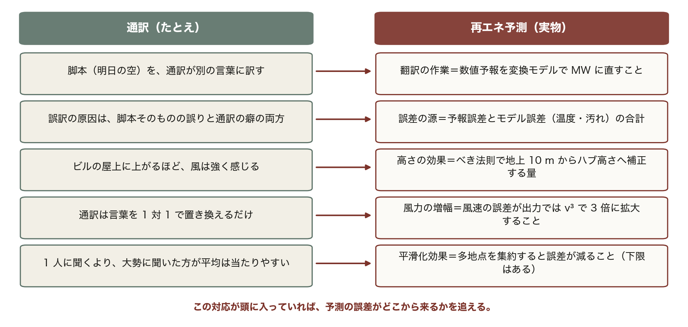

通訳は言葉を 1 対 1 で置き換えるだけだが、風力は 3 乗則で誤差を増幅する。だから風力予測は太陽光より難しい。

<!-- note: この 5 行は今日の全体を先取りしている。予報誤差・モデル誤差・べき法則・v³・平滑化効果が、あとで順番に式になって出てくる。 -->

---

<!-- _class: agenda -->

# この回の地図

1. 数値気象予報（NWP）の枠組みと予測の流れ
2. 日射 → 太陽光出力（温度で目減りする）
3. 風速 → 風力出力（べき法則とパワーカーブ）
4. 誤差の評価、平滑化効果、アンサンブル、出力制御

---

<!-- _class: divider -->

# Ⅰ. 予測の枠組み

## 空を予測し、MW に翻訳する

---

<!-- _class: figure-full -->
<!-- source: コード/fig_ch10.py -->

# 予測は 2 段構え

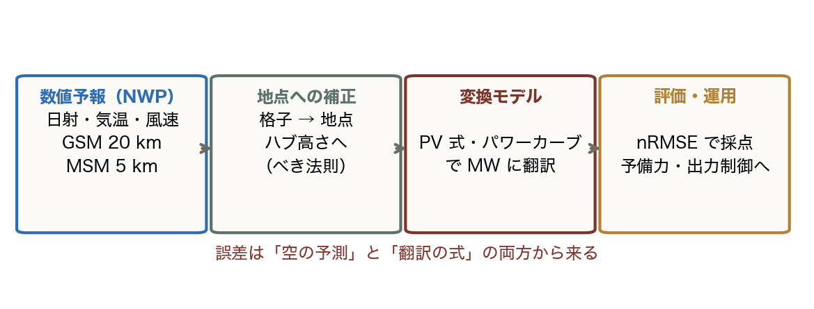

「予報が当たれば予測も当たる」わけではない。空の予測（NWP）に加え、翻訳の式（温度・汚れ・高さ）の誤差も同じくらい効く。

<!-- note: 日本では GSM（20 km・週間）、MSM（5 km・翌日の主力）、LFM（2 km・数時間先）を使い分ける。　図の要点：NWP：物理方程式を格子上で積分／地点補正：格子の値を現地・ハブ高さへ／変換モデル：PV 式・パワーカーブ／評価：nRMSE で採点し予備力へ -->

---

<!-- _class: figure-story -->
<!-- source: コード/fig_ch10.py -->

# 那覇の晴天日射 — まず「上限」を知る

## 読み方｜太陽位置から計算した、雲が無いときの日射量

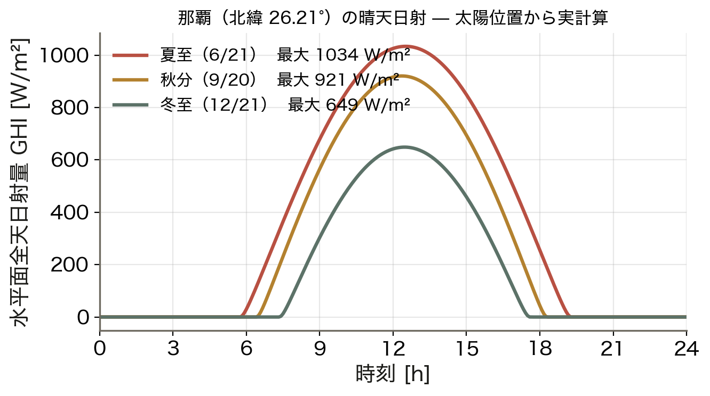

- 夏至：最大 1,034 W/m²、日積算 8.6 kWh/m²
- 秋分：921 W/m²、6.8 kWh/m²
- 冬至：649 W/m²、4.2 kWh/m²
- 沖縄は緯度が低く冬でも比較的多い

実際の日射は必ずこの曲線以下になる。予測とはこの曲線に「雲の透過率」を掛けることに他ならない。

<!-- note: 晴天指数 kt = 実測 GHI / 晴天 GHI。予測の実務はこの kt を当てる問題に帰着する。 -->

---

<!-- _class: divider -->

# Ⅱ. 太陽光の翻訳

## 日射に比例し、温度で目減りする

---

<!-- _class: equation -->

# 太陽光の出力モデル

$$P = P_\text{rated}\,\frac{G}{1000}\,\bigl[1 + \gamma\,(T_\text{cell} - 25)\bigr]\,\eta_\text{sys}, \qquad T_\text{cell} = T_a + \frac{\text{NOCT} - 20}{800}\,G$$

  $G$
  面日射量 [W/m²]。1,000 が標準試験条件（STC）。予報から来る主役
  $\gamma$
  温度係数 約 −0.4 %/°C。セルが熱いほど出力が落ちる
  $T_\text{cell}$
  セル温度。気温より 20〜30 °C 高い。NOCT は公称動作温度（約 45 °C）
  $\eta_\text{sys}$
  インバータ・配線・汚れの総合。0.82〜0.92

<!-- note: この式は PVWatts 型と呼ばれる実用モデル。分光応答や入射角依存を無視した簡略版だが実務で広く使われる。 -->

---

<!-- _class: figure-full -->
<!-- source: コード/fig_ch10.py -->

# 温度損失 — 暑い日ほど出ない

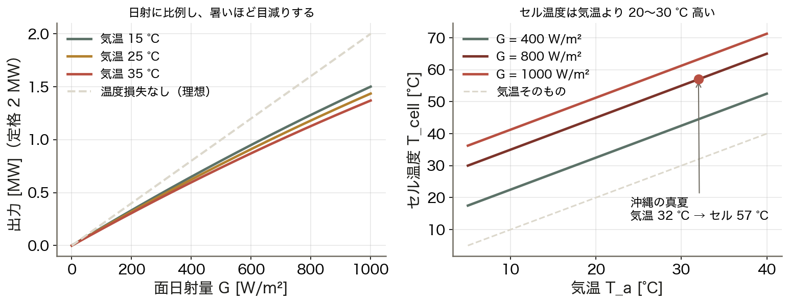

出力は日射に比例するが、気温が上がるほど目減りする。沖縄の真夏の快晴でも定格の 6 割程度で、気温 1 °C の予報誤差がそのまま出力 0.4% の誤差になる。

<!-- note: パネルを地面から離して風を通す、白い屋根に置く、といった設計は温度損失を減らすため。　図の要点：出力は日射にほぼ比例する／気温 32 °C・G = 800 で 1.14 MW／気温 15 °C なら 1.23 MW（7% 差）／セル温度は気温 +25 °C（G = 800 のとき） -->

---

<!-- _class: figure-story -->
<!-- source: コード/fig_ch10.py -->

# 雲が通ると数分で動く

## 読み方｜同じ日の快晴（薄い面）と、雲があった場合（太線）

- 快晴 12.1 MWh、雲あり 9.2 MWh
- 最大変化率 **0.09 MW/分**（定格の 4%/分）
- 数分スケールの変動は予報では追えない
- だから予備力（第8回）が要る

日量は当てられても、分単位の急変は当てられない。予測の役割は「計画」で、急変は「制御」が引き受ける。

<!-- note: 1 地点ならこの変動。多地点なら平滑化される（後で図で見せる）。 -->

---

<!-- _class: divider -->

# Ⅲ. 風力の翻訳

## 高さを直し、3 乗する

---
<!-- _class: figure-full -->
<!-- source: コード/fig_ch10.py -->

# 導出 — べき法則とパワーカーブ

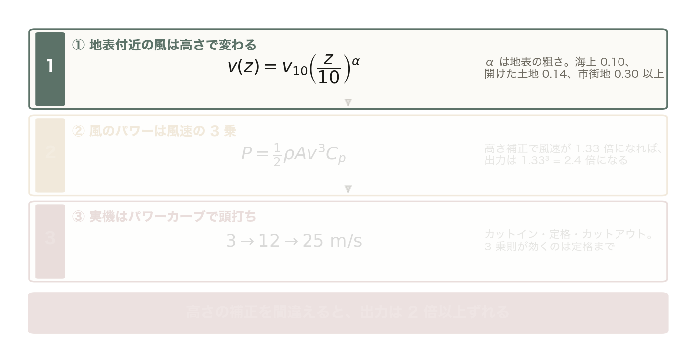

対数則を実用的に近似したのが べき法則 v(z) = v₁₀ (z/10)^α。α は地表の粗さで決まり、海上 0.10、開けた土地 0.14、市街地 0.30 以上。

<!-- note: ②が今日の「2.4 倍」。予報の地上 10 m の値をそのまま使うと、これだけ見誤る。 -->

---

<!-- _class: figure-full -->
<!-- source: コード/fig_ch10.py -->

# 導出 — べき法則とパワーカーブ

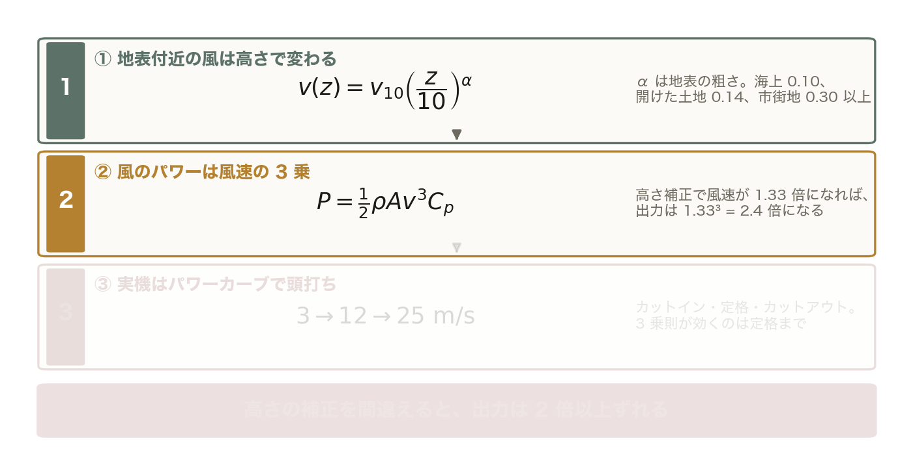

P = ½ρA v³ C_p。高さ補正で風速が 1.33 倍になれば、出力は 1.33³ = 2.4 倍になる。

<!-- note: 前の 1 枚に ② を足しただけ。薄い段はまだ出していない段。 -->

---

<!-- _class: figure-full -->
<!-- source: コード/fig_ch10.py -->

# 導出 — べき法則とパワーカーブ

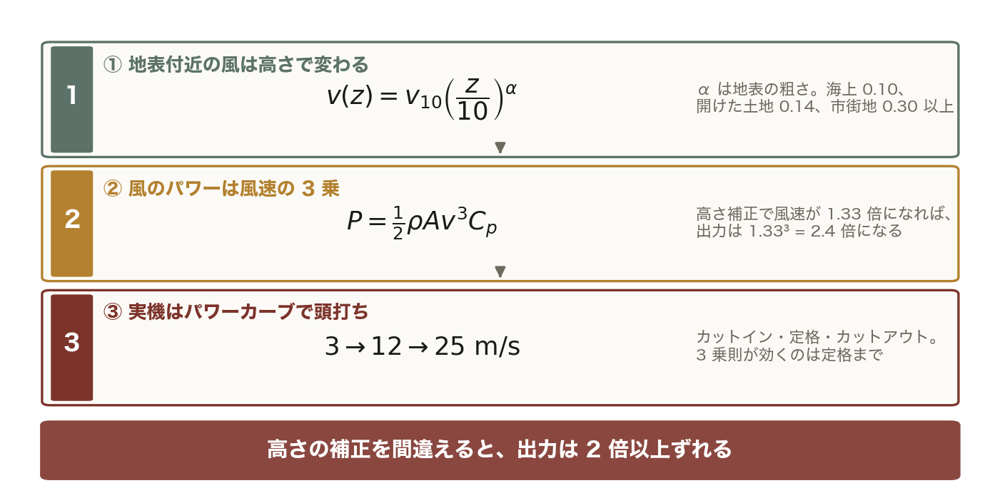

カットイン 3 m/s まで出ず、定格 12 m/s で頭打ち、カットアウト 25 m/s で停止。3 乗則が効くのは定格まで。

<!-- note: 前の 1 枚に ③ を足しただけ。薄い段はまだ出していない段。 -->
---

<!-- _class: figure-full -->
<!-- source: コード/fig_ch10.py -->

# べき法則 — 高さを直さないと 2.4 倍ずれる

予報値は地上 10 m だが、ハブ高さは 80〜120 m。この高さの補正を怠ると、市街地（α = 0.30）では出力を 6.5 倍も見誤る。

<!-- note: α は現地の観測から推定する。事前調査でマストを立てて 1 年測るのはこのため。　図の要点：地上 10 m で 6 m/s のとき／α = 0.14 → 80 m で 8.0 m/s／出力は 3 乗で 2.4 倍／α = 0.30 なら 9.6 m/s・4.1 倍 -->

---

<!-- _class: figure-story -->
<!-- source: コード/fig_ch10.py -->

# 年間の期待出力 — 分布と掛け合わせる

## 読み方｜パワーカーブに風速の出現確率を掛けて積分する

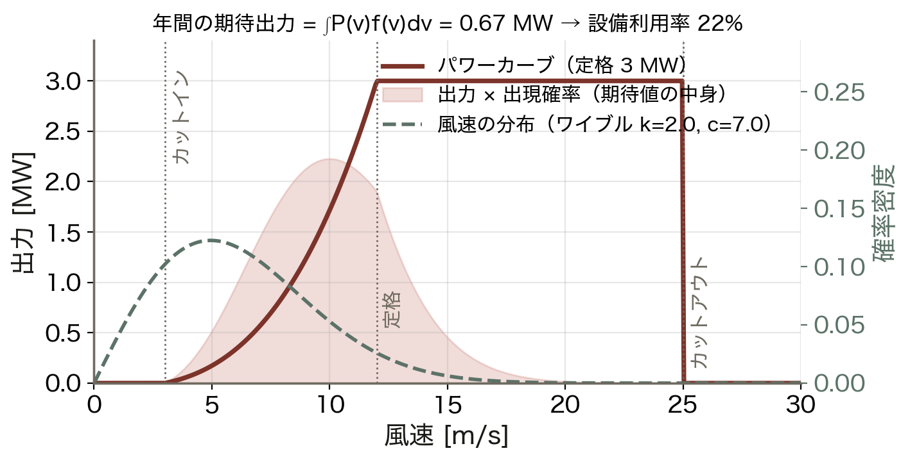

- 風速はワイブル分布で近似（k = 2）
- 定格 3 MW でも期待値は **0.67 MW**
- 設備利用率 **22%**
- 定格風速に達する時間は意外に短い

「定格 3 MW の風車」は 3 MW を出し続けない。kW（容量）と kWh（電力量）を分けて考える。

<!-- note: 洋上風力の設備利用率が高い（30〜40%）のは、平均風速が高くワイブル分布が右に寄るから。 -->

---

<!-- _class: divider -->

# Ⅳ. 誤差と運用

## どう測り、どう備えるか

---

<!-- _class: figure-full -->
<!-- source: コード/fig_ch10.py -->

# 評価指標 — MAPE は夜に壊れる

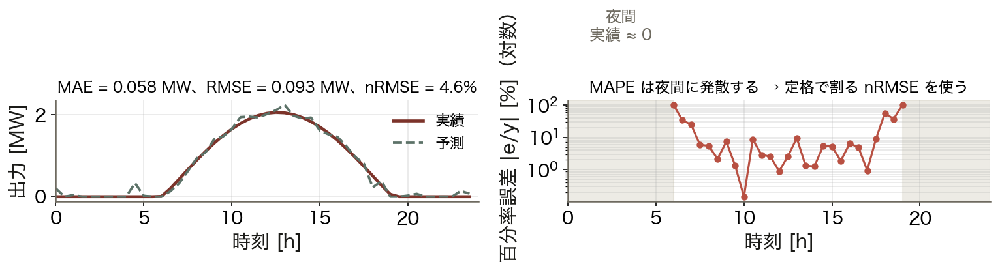

この例では RMSE 0.093 MW だが定格で割ると nRMSE 4.6% になる。規模の違う設備を比べるなら nRMSE、運用の痛みを測るなら RMSE が向いている。

<!-- note: 翌日予測で nRMSE 数 % 台なら良い方。ここから必要な予備力を決める。　図の要点：MAE 0.058 MW、RMSE 0.093 MW／定格で割った nRMSE 4.6%／夜間は実績 ≈ 0 で MAPE が発散／だから太陽光では MAPE を使わない -->

---

<!-- _class: figure-full -->
<!-- source: コード/fig_ch10.py -->

# 平滑化効果 — 集めると誤差が減る、が下限がある

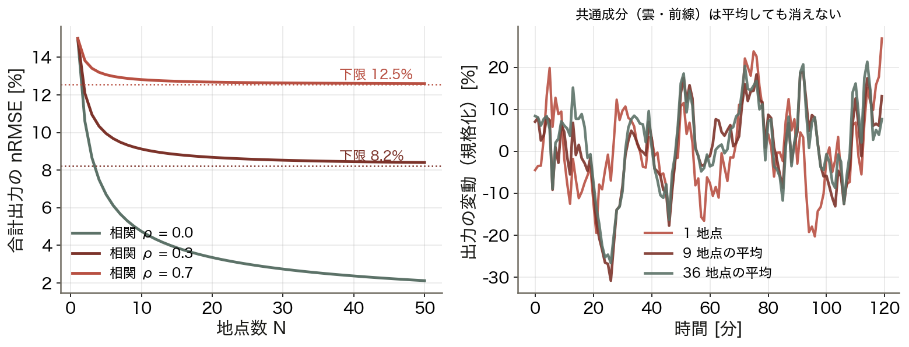

沖縄本島は面積が小さく地点間の相関が強いため、相関 0.7 の場合は 9 地点を集めても誤差は 12.5% までしか下がらない。

<!-- note: 九州や東北なら地点間距離が大きく相関が弱い。系統の広がりが予測精度の資産になる。　図の要点：独立なら 1/√N（9 地点で 15 → 5.0%）／相関 ρ = 0.3 なら 9.2%／相関 ρ = 0.7 なら 12.8%／N → ∞ でも σ₁√ρ より下がらない -->

---

<!-- _class: figure-story -->
<!-- source: コード/fig_ch10.py -->

# アンサンブル予報 — 不確実性を数値で持つ

## 読み方｜初期値を少しずつ変えた 21 通りの予報。広がりが不確実性の大きさ

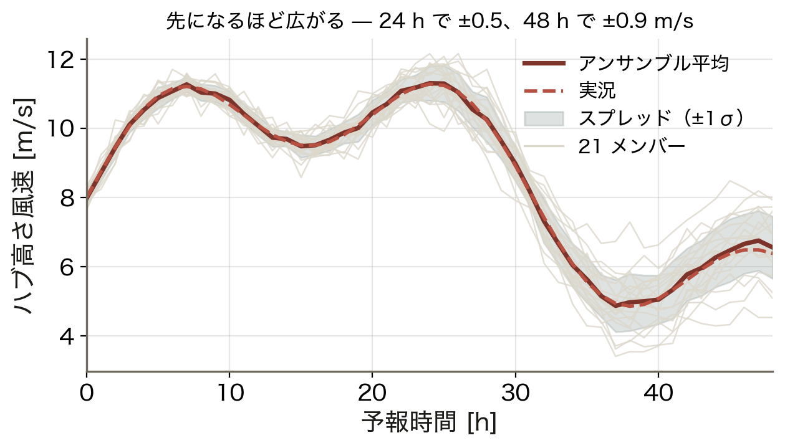

- 先になるほどメンバーが広がる
- 24 時間先で ±0.5 m/s
- 48 時間先で ±0.9 m/s
- 広がり（スプレッド）＝予測の自信のなさ

「何 MW」だけでなく「どれくらい自信があるか」を持つ。第12回の予測区間へつながる考え方。

<!-- note: スプレッドが大きい日は予備力を多めに、小さい日は少なめに。確率予測の運用上の価値はここ。 -->

---

<!-- _class: figure-story -->
<!-- source: コード/fig_ch10.py -->

# 出力制御 — 予測が当たると事前に打てる

## 読み方｜休日の軽負荷日。火力の最低出力を引いた残りが太陽光の居場所

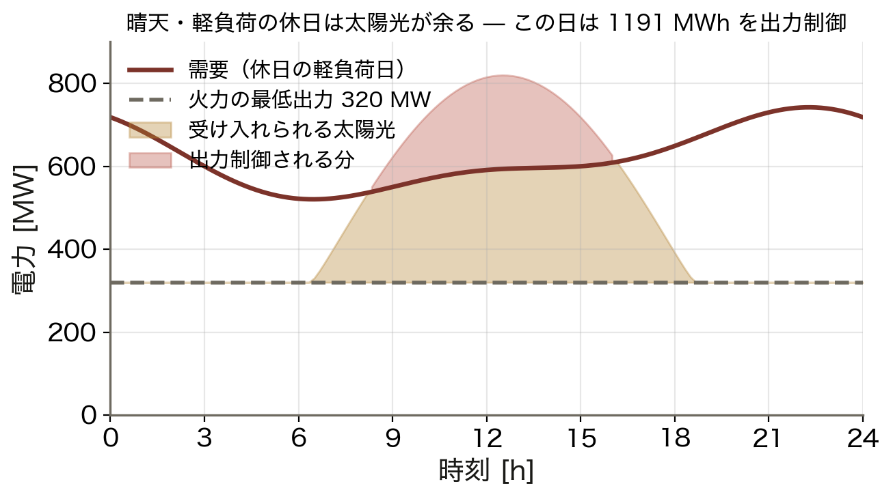

- 需要が軽く、火力は最低出力で運転
- 太陽光がその隙間を超えると余る
- この日は最大 227 MW を制御
- 日量にして 1,191 MWh

出力制御は「予測が外れた結果」ではなく「予測が当たったから前日に指示できた」運用である。

<!-- note: 火力の最低出力は第14回、連系可能量としての扱いは第15回で扱う。今日は予測との関係だけ。 -->

---

<!-- _class: kpi -->

# 今日の数字

  2.4 倍
  ハブ高さ補正での出力の違い

  4.6%
  太陽光予測の nRMSE（例）

  22%
  風力の設備利用率（k=2, c=7）

---

<!-- _class: steps -->

# 例題 1 — 沖縄の夏、2 MW の太陽光は何 MW 出るか

  1
  条件
  G = 800 W/m²、気温 32 °C、NOCT = 45 °C、γ = −0.4 %/°C、η = 0.82

  2
  セル温度
  T_cell = 32 + (45 − 20)/800 × 800 = 57 °C

  3
  温度補正
  1 + (−0.004)(57 − 25) = 0.872（12.8% の目減り）

  4
  出力
  P = 2 × 0.8 × 0.872 × 0.82 = 1.14 MW（定格の 57%）

<!-- note: 学生に 2 と 3 を計算させる。「気温が 25 °C なら？」と続けると温度の効き方が体感できる。 -->

---

<!-- _class: figure -->

# 動く図で試す — viz/weather.html

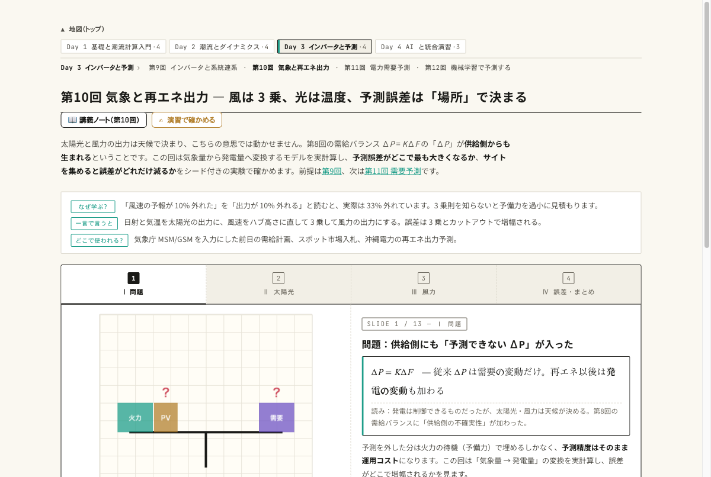

動く図 晴天日射・PV 出力・べき法則・平滑化効果をブラウザ内で実計算する 13 枚のスライド。

- 気温を 20 → 35 °C に上げ、温度損失で出力が目減りするのを見る
- べき指数 α を変え、ハブ高さの風速と出力（3 乗）がどれだけ変わるか見る
- 地点数を増やして、合計出力の誤差が 1/√N より鈍く減るのを見る

---

<!-- _class: blocks -->

# なぜそう考えるか — 指標・平滑化・3 乗

  なぜ MAPE を使わないのか
  太陽光は夜間の実績が 0 で、百分率誤差が発散する。定格で割った nRMSE なら常に意味を持ち、規模の違う設備も比較できる。

  なぜ集めると誤差が減るのか
  地点ごとの誤差が独立なら、N 地点の合計の誤差は 1/√N に縮む。実際は雲や前線で誤差が相関するので、σ₁√ρ という下限が残る。

  風力は v³
  風速 10% の誤りが出力 33% の誤りになる。高さ補正と地形補正を省略しない。

---

<!-- _class: figure-full -->
<!-- source: コード/fig_ch10.py -->

# よくある誤解 — 別のものを同じだと思い込む

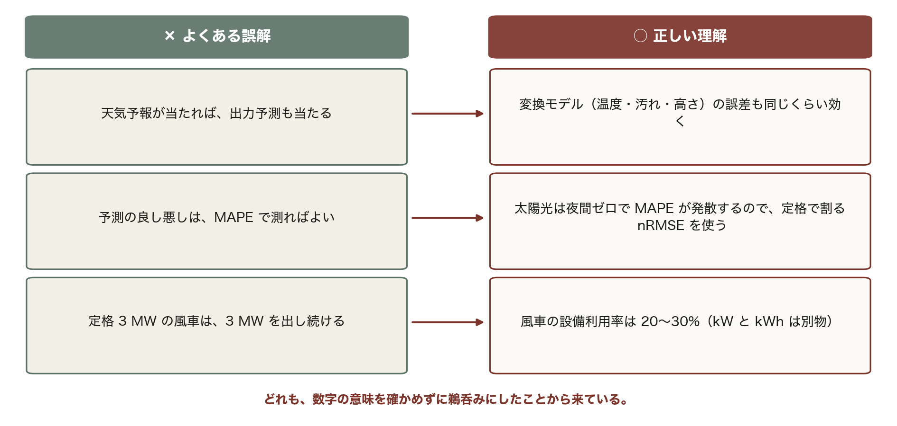

試験でも実務でも、この 3 つが最も多い。「空の予報」「予測の指標」「定格」は、それぞれ別のものと混同しやすい。

---

<!-- _class: takeaway -->

# 持ち帰る 3 点

再エネ予測は「空の予測 × 翻訳の式」。誤差は両方から来て、風力では 3 乗で増える

<li>太陽光：P ∝ G、温度で −0.4 %/°C。真夏の快晴でも定格の 6 割</li>
<li>風力：べき法則でハブ高さへ、v³ でカーブへ。補正を怠ると 2.4 倍の誤り</li>
<li>評価は nRMSE。集約で平滑化するが、相関があると下限が残る</li>

---

<!-- _class: end -->

# 次回：第11回 電力需要予測

演習 ex/ch10.html で数値を変えて確かめる

需要は体温調節 — 気温・曜日・時刻で 9 割読める
