<!-- _class: title -->

# 第11回 電力需要予測（統計的手法）
## 需要は体温調節 — 気温・曜日・時刻で 9 割読める
Day 3・コマ 11

<!-- note: 第10回は供給側の予測。今回は需要側。同じ「予測」でも、需要の方が構造がはっきりしていて当てやすい。 -->

---

<!-- _class: statement -->

電力需要はトレンド・年周期・週周期・日内変動・気温効果に分解できる。素朴な「前週同曜日」に勝って初めて価値がある。

<!-- note: 分解できる＝式に書ける。だから統計モデルが今も主力である。 -->

---

<!-- _class: graphical-abstract -->

# この回の全体像

## 一枚で｜問い → 課題 → 道具 → 到達点

  問い
  明日の需要は何 MW か。**何を見れば**当たるのか。そして「当たった」とはどう測るのか。

  課題
  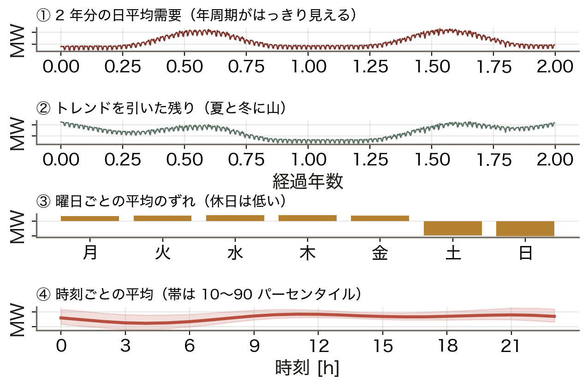
  需要は 4 つの周期が重なっている。

  道具
  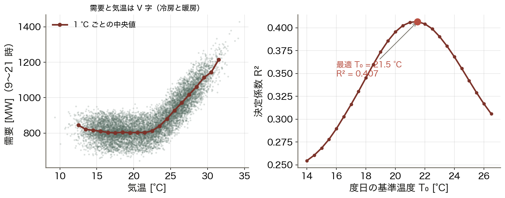
  分解 ▶ 度日 ▶ 重回帰
  構造を式に ==書き下す== 。

  到達点
  0.58
  Skill Score 0.58。前週同曜日より誤差を 58% 減らせた。

数値はすべて本資料の Python コード（コード/fig_ch11.py）で計算。沖縄を模した 2 年・17,520 時間の需要データ。

<!-- note: 右下の 0.58 が結論。「当たった」を客観的に測る物差しが Skill Score。 -->

---

<!-- _class: sections -->

# 現場で起きたこと — 予測が外れた日

  2022年3月22日 東京エリアの需給ひっ迫警報
  地震で火力が止まっていたところに、季節外れの寒さと曇天が重なった。暖房需要が増え、太陽光が出ず、需要が ==予測を上回った==。国は初めて「需給ひっ迫警報」を出し、節電を呼びかけた。

  2022年6月末 猛暑の需給ひっ迫注意報
  梅雨明けが早く、記録的な暑さで冷房需要が急増した。過去の同じ時期のデータに頼れない状況だった。沖縄は冷房需要の割合が高く、気温 1 °C の差が需要に直結する。

<!-- note: どちらも気温効果が主役。今日の重回帰の気温項がそのまま効く。 -->

---

<!-- _class: figure-full -->
<!-- source: コード/fig_ch11.py -->

# たとえ話 — 需要は体温調節

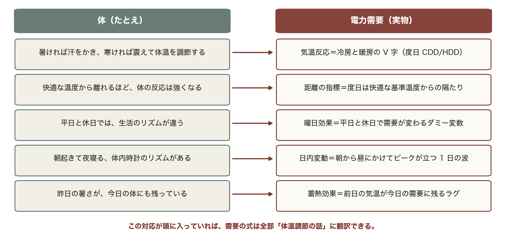

体は「慣れる」が、慣れは線形ではない。前日・前々日の気温をラグで入れるのはこのため。

<!-- note: この 5 行は今日の全体を先取りしている。V 字・度日・曜日効果・日内変動・ラグが、あとで順番に式になって出てくる。 -->

---

<!-- _class: agenda -->

# この回の地図

1. 需要の分解 — トレンド・年・週・日
2. 気温との非線形関係 — 度日と不快指数
3. 重回帰モデル — 係数の読み方
4. 評価 — 指標の使い分け、時系列分割、予備力へ

---

<!-- _class: divider -->

# Ⅰ. 需要を分解する

## 4 つの周期が重なっている

---

<!-- _class: figure-story -->
<!-- source: コード/fig_ch11.py -->

# 需要は 4 層に分けられる

## 読み方｜上から、2 年の推移・年周期・曜日・時刻

- 平均 809 MW、最大 1,484 MW
- 年周期：夏に大きな山（冷房）
- 曜日：平日と休日で **70 MW** の差
- 日内：朝から昼にかけて上がる

分解できるということは、式に書けるということ。だから需要予測は再エネ予測より当てやすい。

<!-- note: 沖縄は冷房主体なので夏の山が支配的。北日本なら冬にも山が立つ（双峰型）。 -->

---

<!-- _class: figure-story -->
<!-- source: コード/fig_ch11.py -->

# 自己相関 — 24 時間前と 168 時間前が効く

## 読み方｜横軸は何日前か。ピークが立つラグが「使える特徴量」

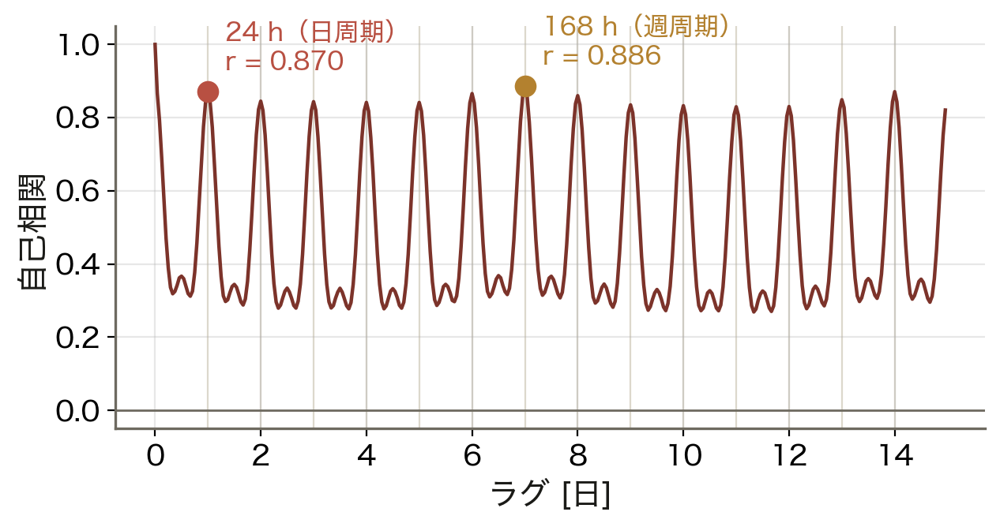

- 24 時間（1 日前）：r = **0.870**
- 168 時間（1 週前）：r = **0.886**
- 週のピークが日のピークより高い
- だからベースラインは「前週同曜日」

1 週間前の同じ時刻が最も似ている。曜日と時刻が同時に揃うからで、これが最も手強い「何もしない予測」になる。

<!-- note: ARIMA の次数決定も、この自己相関と偏自己相関を見て行う。 -->

---

<!-- _class: divider -->

# Ⅱ. 気温をどう扱うか

## V 字を 2 本の直線に

---

<!-- _class: figure-full -->
<!-- source: コード/fig_ch11.py -->

# 需要と気温は V 字 — 基準温度はデータで決める

気温 1 本の直線では V 字を表せない。基準温度で折って 2 本の直線（度日）にすると、この系統では T₀ = 21.5 °C で当てはまり（R² = 0.407）が最も良くなる。

<!-- note: 基準温度は系統ごとに違う。冷房主体の沖縄は高め、暖房主体の北海道は低め。　図の要点：低温側も高温側も需要が上がる／谷が「快適な温度」／最適な基準温度 T₀ = 21.5 °C／そのとき R² = 0.407 -->

---

<!-- _class: figure-full -->
<!-- source: コード/fig_ch11.py -->

# 度日と不快指数

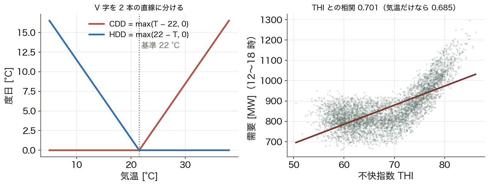

蒸し暑い沖縄では、湿度を含む不快指数（THI）との相関が 0.701 で、気温単独の 0.685 を上回る。特徴量を 1 つ替えるだけで精度が上がる好例である。

<!-- note: THI = 0.81T + 0.01H(0.99T − 14.3) + 46.3。体感を数値化した古典的な指標。　図の要点：CDD = max(T − T₀, 0)：冷房側だけ／HDD = max(T₀ − T, 0)：暖房側だけ／THI との相関 0.701／気温だけなら 0.685 -->

---

<!-- _class: divider -->

# Ⅲ. 重回帰で書き下す

## 係数がそのまま読める

---

<!-- _class: equation -->

# 重回帰モデル — 構造を式にする

$$y_t = a + b\,\text{CDD}_t + c\,\text{HDD}_t + d\,\text{平日}_t + \sum_{k=1}^{3}\left(e_k\sin\tfrac{2\pi k t}{24} + f_k\cos\tfrac{2\pi k t}{24}\right) + \varepsilon_t$$

  $b, c$
  気温感度 [MW/°C]。b が冷房側、c が暖房側。沖縄は b ≫ c
  $d$
  平日ダミー。平日と休日の差 [MW]。係数が読めるのが重回帰の強み
  $e_k, f_k$
  フーリエ項：日内変動を滑らかに表す。k を増やすほど細かい形を表現できる
  $\varepsilon_t$
  説明できない残り。小さいほど良いが、リークで小さく見せてはいけない

<!-- note: 年周期のフーリエ項も 1 組入れている。特徴量の設計そのものがモデリング。 -->

---

<!-- _class: figure-story -->
<!-- source: コード/fig_ch11.py -->

# 当てはめてベースラインと比べる

## 読み方｜上は検証期間の 1 週間、下は RMSE の比較

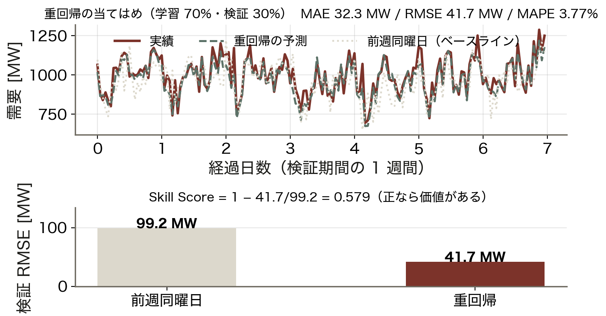

- MAE 32.3 MW、RMSE 41.7 MW
- MAPE 3.77%
- 前週同曜日は RMSE **99.2 MW**
- Skill Score = 1 − 41.7/99.2 = **0.579**

前週同曜日は「気温の急変」に無力。そこを気温項が拾うので、誤差を 6 割近く減らせる。

<!-- note: 上の図で、点線（前週同曜日）が実績から大きくずれる日が気温の変わった日。 -->

---

<!-- _class: figure-full -->
<!-- source: コード/fig_ch11.py -->

# 係数がそのまま意味を持つ

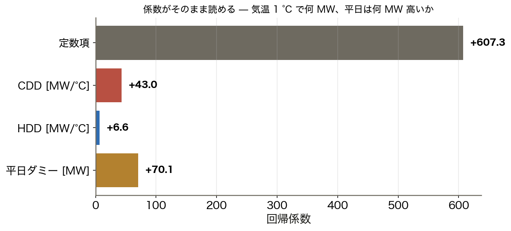

単位がついたまま「気温が 1 °C 上がると 43 MW 増える」と説明できる。説明責任が要る実務で統計モデルが今も残っている理由。

<!-- note: 43 MW/°C は系統容量 1,500 MW の約 3%。猛暑日が続く夏の運用がいかに気温に依存するかが分かる。　図の要点：CDD +43.0 MW/°C（冷房側）／HDD +6.6 MW/°C（暖房側）／平日ダミー +70.1 MW／冷房の感度は暖房の 6.5 倍 -->

---

<!-- _class: kpi -->

# 予測の実力

  41.7
  重回帰の RMSE [MW]

  99.2
  前週同曜日の RMSE [MW]

  0.58
  Skill Score（正なら価値あり）

---

<!-- _class: divider -->

# Ⅳ. どう測り、どう使うか

## 指標・分割・予備力

---

<!-- _class: figure-full -->
<!-- source: コード/fig_ch11.py -->

# MAE と RMSE — 外れ値 1 点で差がつく

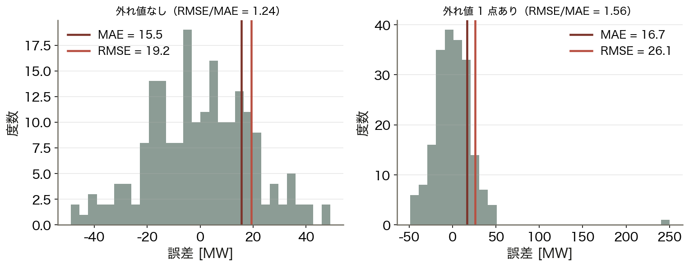

同じ誤差分布に大外れを 1 点だけ足すと、RMSE/MAE の比は 1.24 から 1.56 まで上がる（MAE はほとんど動かない）。予備力は「大外れ」に備えて持つため、電力では RMSE を重く見る。

<!-- note: RMSE/MAE の比が 1.3 を超えたら、外れ値か分布の裾を疑うという実務的な使い方もある。　図の要点：外れ値なし：RMSE/MAE = 1.24／1 点あり：1.56 に開く／MAE はほとんど動かない／RMSE は 2 乗なので大きく動く -->

---

<!-- _class: sections -->
<!-- build -->

# 導出 — なぜランダム分割をしてはいけないか

  ① 時系列は隣が似ている｜自己相関が高い
  1 時間前との相関はほぼ 1。ランダムに分けると、検証データの「すぐ隣」が学習に入ってしまう。

  ② それは実質的に答えを見ている｜リーク
  未来の情報が学習に混ざると、検証精度は現実より良く出る。運用に出した瞬間に精度が崩れる。

  ③ だから時間順に切る｜過去で学び、未来で試す
  実測では、ランダム分割は RMSE を **41.7 → 36.1 MW** と 14% 過小に見せる。運用では出ない性能である。

<!-- note: 「予測時点で本当に手に入る情報か」を特徴量 1 つずつ問う習慣をつけさせる。 -->

---

<!-- _class: figure-full -->
<!-- source: コード/fig_ch11.py -->

# 分割の仕方で結果が変わる

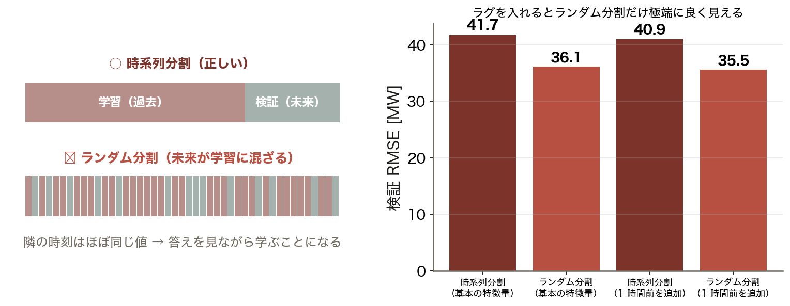

ランダム分割は検証 RMSE を 41.7 → 36.1 MW と 14% も良く見せてしまう。まず分割を正しくしてから、精度を語るべきである。

<!-- note: 交差検証をするなら時系列用（前方連鎖 / TimeSeriesSplit）を使う。　図の要点：時系列分割：RMSE 41.7 MW／ランダム分割：36.1 MW（14% 良く見える）／ラグを足すと差はさらに開く／良すぎる結果はリークを疑う -->

---

<!-- _class: figure-full -->
<!-- source: コード/fig_ch11.py -->

# 残差を診る — どこで外しているか

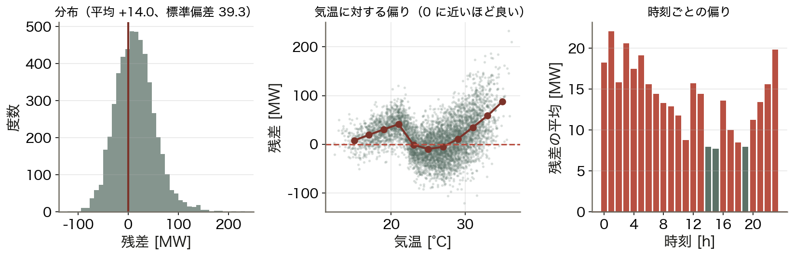

残差の標準偏差は 39.3 MW で、高温側にわずかな偏り（構造）が残る。それが次に足すべき特徴量の手がかりになる。

<!-- note: 高温側の偏りは、猛暑日の非線形性（エアコンの飽和）を 1 次式で表しきれないため。　図の要点：分布はほぼ左右対称／高温側でわずかに偏りが残る／時刻ごとの偏りは小さい／標準偏差 39.3 MW -->

---

<!-- _class: figure-full -->
<!-- source: コード/fig_ch11.py -->

# 予測精度は予備力の量になる

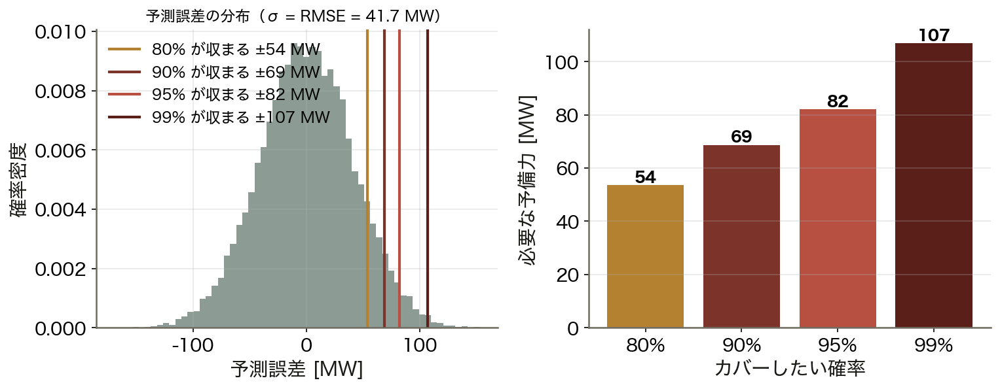

誤差の分布から、95% をカバーするには 82 MW、99% なら 107 MW の予備力が要ると読み取れる。予測を良くすることは燃料と設備を節約することでもある。

<!-- note: 第8回で学んだ予備力の量が、ここで予測精度から決まる。予測と制御がつながる場所。　図の要点：90% をカバー：69 MW／95%：82 MW／99%：107 MW／RMSE が半分なら予備力も半分 -->

---

<!-- _class: steps -->

# 例題 1 — 誤差 5 点から 3 つの指標を出す

  1
  誤差
  e = 実績 − 予測 = [+20, −30, +10, +50, −10] MW（需要は約 1,000 MW）

  2
  MAE
  (20 + 30 + 10 + 50 + 10)/5 = 24 MW

  3
  RMSE
  √((400 + 900 + 100 + 2500 + 100)/5) = √800 = 28.3 MW

  4
  読み方
  RMSE/MAE = 1.18。+50 の大外れが RMSE を押し上げている

<!-- note: 学生に 3 を計算させる。MAPE は 2.4% になることも確認させる。 -->

---

<!-- _class: figure -->

# 動く図で試す — viz/demand.html

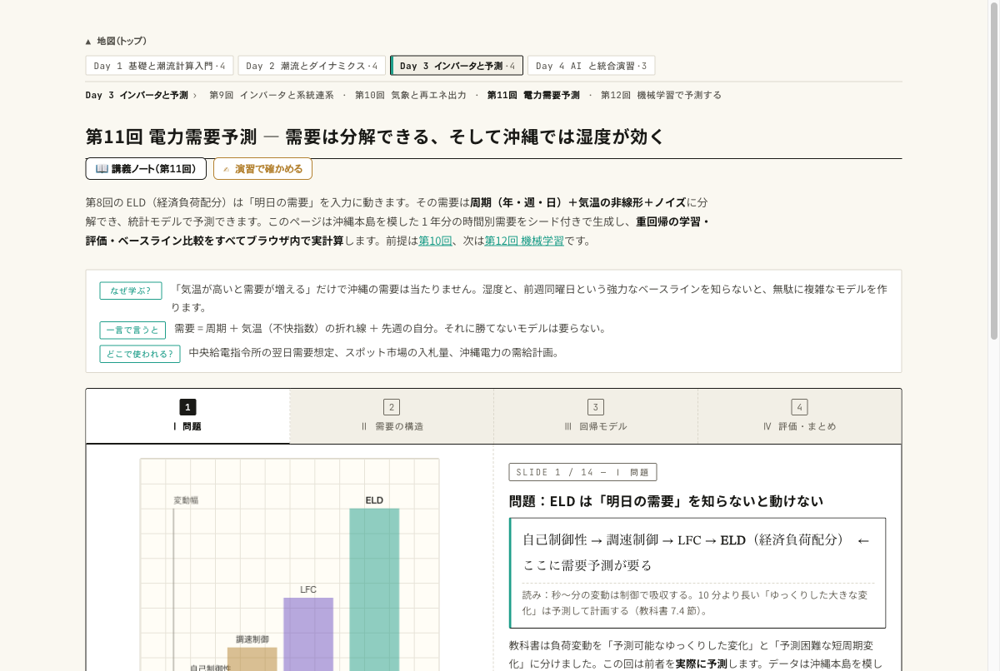

動く図 需要の生成・度日・重回帰とベースライン比較をブラウザ内で実計算する 14 枚のスライド。

- 1 年分の需要を生成し、年周期・週周期・日内変動が重なっているのを見る
- CDD の基準温度を動かし、当てはまりが最も良い T₀ を探す
- 重回帰と前週同曜日の RMSE を比べ、Skill Score を読む

---

<!-- _class: blocks -->

# なぜそう考えるか — RMSE・分割・外挿

  なぜ電力では RMSE を重く見るのか
  予備力は最悪の外れに備えて持つ。平均的な外れ（MAE）より、大外れを強く罰する RMSE の方が運用の痛みに近い。

  なぜ前週同曜日と比べるのか
  曜日・季節・時刻をほぼ含む、最も手強い「何もしない予測」だから。これに勝てないモデルには価値がない。

  記録更新の日は苦手
  学習範囲の外は、統計モデルも機械学習も外挿になる（第12回）。

---

<!-- _class: figure-full -->
<!-- source: コード/fig_ch11.py -->

# よくある誤解 — 「当たっている」を鵜呑みにしない

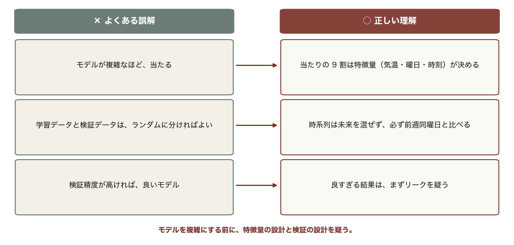

モデルの複雑さより特徴量、検証精度より検証の設計。良すぎる結果はまずリークを疑う。

---

<!-- _class: takeaway -->

# 持ち帰る 3 点

需要は分解できる。気温を度日に直し、時系列順に検証し、素朴な基準に勝つ

<li>需要 = トレンド + 年 + 週 + 日 + 気温効果 + 残り。気温は V 字（度日）</li>
<li>係数が読める：CDD +43 MW/°C、平日 +70 MW。Skill Score 0.58</li>
<li>ランダム分割は禁止。予測精度がそのまま予備力の量になる</li>

---

<!-- _class: end -->

# 次回：第12回 機械学習を用いた予測

演習 ex/ch11.html で数値を変えて確かめる

木は「間違いノート」で賢くなる — そして地図の外は歩けない
