<!-- _class: title -->

# 第12回 機械学習を用いた予測
## 木は「間違いノート」で賢くなる — そして地図の外は歩けない
Day 3・コマ 12

<!-- note: Day 3 の最終コマ。第11回の統計モデルと同じデータ・同じ検証期間で比べるので、差がそのまま手法の差になる。 -->

---

<!-- _class: statement -->

表形式のデータでは、決定木を残差で積み上げる勾配ブースティングが強い。ただし木は外挿ができず、入力の誤差はそのまま出力に出る。

<!-- note: 「強い」と「使える」は違う。今日は限界の方を丁寧に扱う。 -->

---

<!-- _class: graphical-abstract -->

# この回の全体像

## 一枚で｜問い → 課題 → 道具 → 到達点

  問い
  機械学習は統計モデルより当たるのか。**どこまで信じて**運用に載せてよいのか。

  課題
  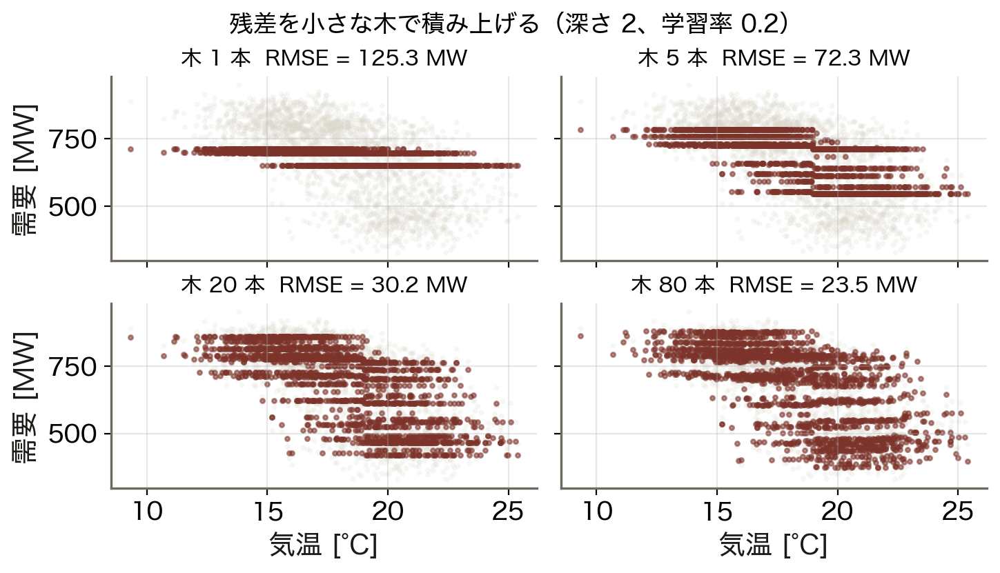
  残差を小さな木で積み上げていく。

  道具
  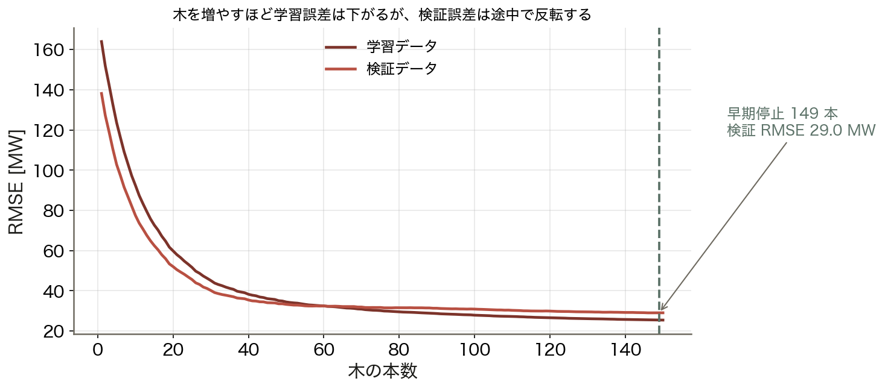
  木 ▶ ブースティング ▶ 早期停止
  検証誤差で ==止める== 。

  到達点
  1.7 倍
  気温を予報値にすると誤差は 1.7 倍になる。

数値はすべて本資料の Python コード（コード/fig_ch12.py）で計算。木もブースティングも numpy で自作。第11回と同じデータ・検証期間。

<!-- note: 右下が今日の落としどころ。モデルを凝るより、入力（気象予報）の質を上げる方が効く場面が多い。 -->

---

<!-- _class: sections -->

# 現場で起きたこと — 検証では見えない失敗

  2021年2月 テキサス寒波
  記録的な低温は学習データの ==範囲の外== だった。需要予測は暖房需要の急増を捉えきれず、供給側も設備の凍結で次々に脱落。数百万世帯が数日停電した。外挿の失敗と供給脱落が重なった事例である。

  データリーク — 模試は満点、本番は零点
  「未来の実績」や「当日にならないと分からない値」が特徴量に紛れると、検証精度が現実離れして高くなる。運用に出した瞬間に精度が崩れる。最も多いのは、気温を実測値で検証してしまう形である。

<!-- note: どちらも検証では見えない。だから今日は「検証の設計」を手法と同じ重さで扱う。 -->

---

<!-- _class: figure-full -->
<!-- source: コード/fig_ch12.py -->

# たとえ話 — 間違いノートと地図の外

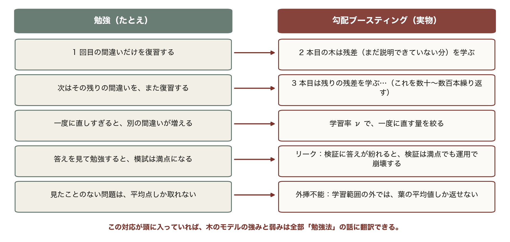

たとえ話が崩れる点も押さえておく。間違いノートは覚えるほど賢くなるが、覚えすぎると別の間違い（過学習）を生む。木の深さ・本数・早期停止で止めるのはそのため。

<!-- note: この 5 行は第12回の全体を先取りしている。残差・学習率・リーク・外挿不能が、あとで順番に式やグラフになって出てくる。 -->

---

<!-- _class: agenda -->

# この回の地図

1. 決定木 — 1 回の分割で何が起きているか
2. ブースティング — 残差を積み上げる、早期停止で止める
3. 限界 — 外挿できない、入力の誤差がそのまま出る
4. 実務 — 区間で出す、重要度で説明する

---

<!-- _class: divider -->

# Ⅰ. 決定木

## 「どこで分けるか」を全探索する

---

<!-- _class: figure-full -->
<!-- source: コード/fig_ch12.py -->

# 1 回の分割 — 誤差が最も減る場所を選ぶ

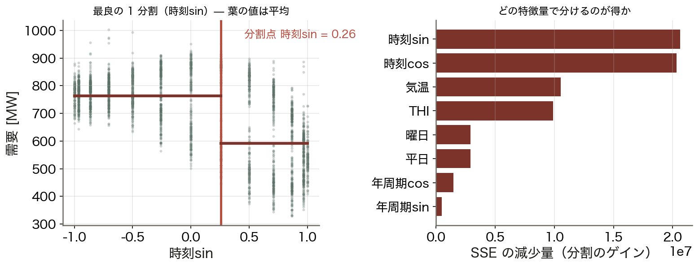

木は「閾値で場合分けする」モデルで、冷房が入る温度のような折れ点を人が指定せずに見つける（左が実際の分割、右がどの特徴量が有効かを示す）。

<!-- note: 分割の基準は分散減少（SSE の減少）。分類なら Gini 係数やエントロピーを使う。　図の要点：全特徴量・全閾値を試して SSE 最小を選ぶ／葉の値はそこに入ったデータの 平均／時刻の周期成分が最も効く／気温・THI がそれに続く -->

---
<!-- _class: figure-full -->
<!-- source: コード/fig_ch12.py -->

# 導出 — 勾配ブースティングの考え方

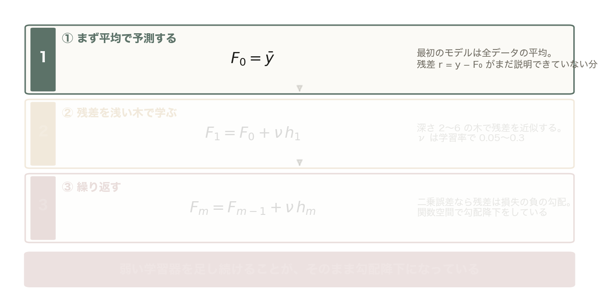

最初のモデルは全データの平均。残差 r = y − F₀ が「まだ説明できていない分」になる。

<!-- note: ③が名前の由来。損失を二乗誤差から変えれば、分位点回帰にもロバスト回帰にもなる。 -->

---

<!-- _class: figure-full -->
<!-- source: コード/fig_ch12.py -->

# 導出 — 勾配ブースティングの考え方

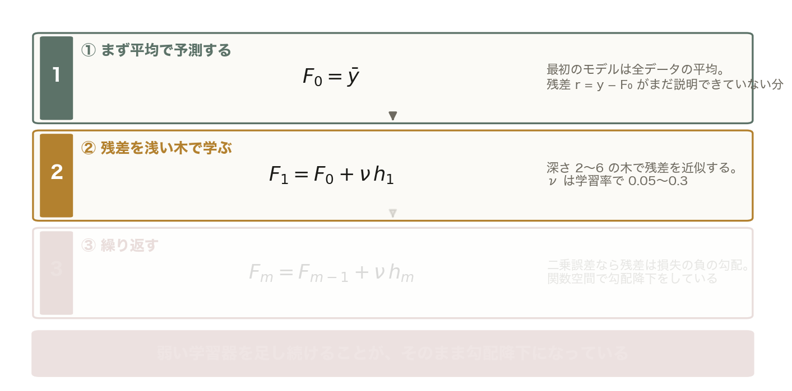

浅い木（深さ 2〜6）で残差を近似する。これを F₁ = F₀ + ν h₁ として足す。ν は学習率で 0.05〜0.3。

<!-- note: 前の 1 枚に ② を足しただけ。薄い段はまだ出していない段。 -->

---

<!-- _class: figure-full -->
<!-- source: コード/fig_ch12.py -->

# 導出 — 勾配ブースティングの考え方

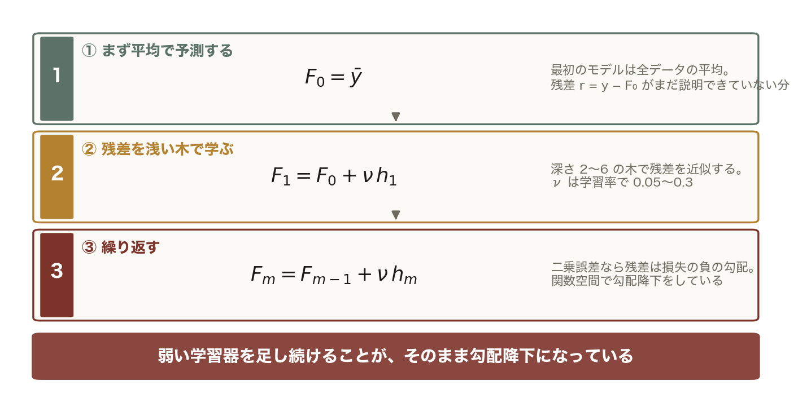

新しい残差をまた木で学ぶ。二乗誤差の場合、残差はそのまま損失の負の勾配なので 勾配降下法を関数空間で行っていることになる。

<!-- note: 前の 1 枚に ③ を足しただけ。薄い段はまだ出していない段。 -->
---

<!-- _class: figure-story -->
<!-- source: コード/fig_ch12.py -->

# 木を足すたびに形が細かくなる

## 読み方｜灰色が実績、赤が予測。木の本数だけを変えている

- 1 本：大まかな段差だけ
- 5 本：気温の傾向を捉え始める
- 20 本：ばらつきの形が見えてくる
- 80 本：かなり細かく追従

1 本の木は弱いが、残差を積み上げると強くなる。ただし積みすぎるとノイズまで覚える。

<!-- note: 深さ 2 の木を 80 本。1 本ずつは「切り株」に近いが、足し合わせると滑らかな関数になる。 -->

---

<!-- _class: figure-full -->
<!-- source: コード/fig_ch12.py -->

# 早期停止 — 検証誤差が反転する前に止める

学習誤差は下がり続けるが、検証誤差はどこかで底を打って反転する。「木を増やすほど良い」わけではなく、止めどきを教えるのが検証データの役割である。

<!-- note: 実務では検証誤差が N 回連続で改善しなければ打ち切る（patience）。　図の要点：学習誤差は単調に減る／検証誤差は底を打って上がる（過学習）／底が 149 本、検証 RMSE 29.0 MW／ここで止めるのが早期停止 -->

---

<!-- _class: divider -->

# Ⅱ. 統計モデルとの比較

## どこで勝ち、どこで負けるか

---

<!-- _class: figure-full -->
<!-- source: コード/fig_ch12.py -->

# 線形と木 — 交互作用を自動で拾う

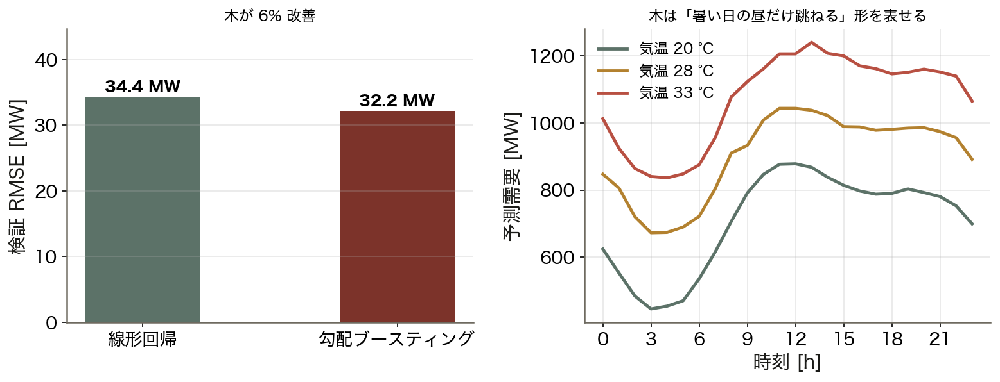

特徴量を丁寧に設計した線形モデルは強く、精度の差はわずか（左）。木の利点は、気温×時刻のような交互作用を設計しなくても拾えること（右）にある。

<!-- note: 第11回で度日とフーリエ項を入れた線形が 34.4 MW。特徴量設計を手抜きすると木の差が大きく開く。　図の要点：線形回帰（第11回と同じ特徴量）34.4 MW／勾配ブースティング 32.2 MW／差は 6%。大差ではない／右図：暑い日の昼だけ跳ねる形を表現 -->

---

<!-- _class: figure-story -->
<!-- source: コード/fig_ch12.py -->

# モデルを並べて比べる

## 読み方｜同じデータ・同じ検証期間での RMSE

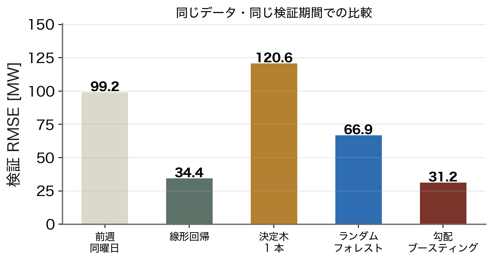

- 前週同曜日：99.2 MW
- 決定木 1 本：120.6 MW（弱い）
- ランダムフォレスト：66.9 MW
- 勾配ブースティング：**31.2 MW**

木 1 本はベースラインにも負ける。弱い学習器を束ねる方法（バギング・ブースティング）が効いている。

<!-- note: ランダムフォレストは並列に育てて平均（分散を減らす）、ブースティングは直列に積む（バイアスを減らす）。 -->

---

<!-- _class: divider -->

# Ⅲ. 限界を知る

## 外挿できない、入力の誤差が出る

---

<!-- _class: figure-story -->
<!-- source: コード/fig_ch12.py -->

# 外挿 — 学習範囲の外では平らになる

## 読み方｜32 °C 以上を学習させずに、40 °C まで予測させた

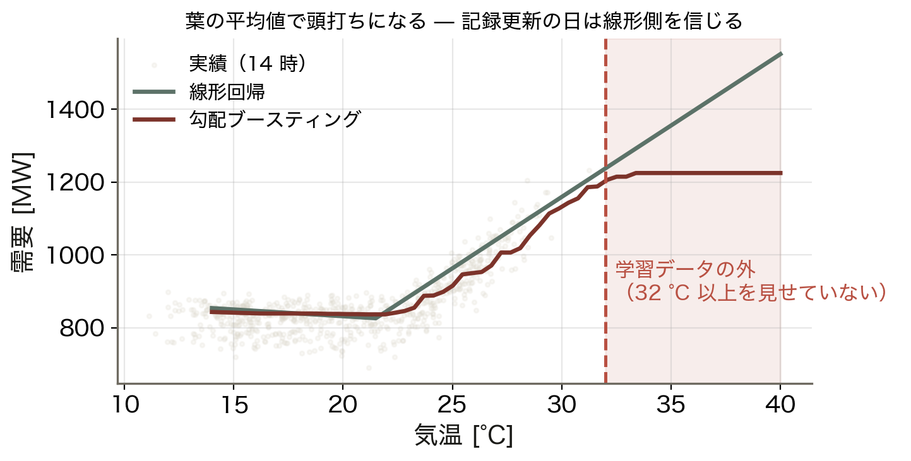

- 線形回帰は傾きを保って伸びる
- 木は学習範囲の端で **平ら** になる
- 40 °C で線形 1,551 MW、木 1,225 MW
- 差は 326 MW（系統容量の 2 割超）

木の出力は「葉に入った学習データの平均」でしかない。記録更新の日は、線形側を信じる方が安全である。

<!-- note: これがテキサス寒波で起きたこと。実務では「学習範囲外の入力が来た」ことを検知して警告する仕組みを入れる。 -->

---

<!-- _class: figure-full -->
<!-- source: コード/fig_ch12.py -->

# 入力の誤差はそのまま出力に出る

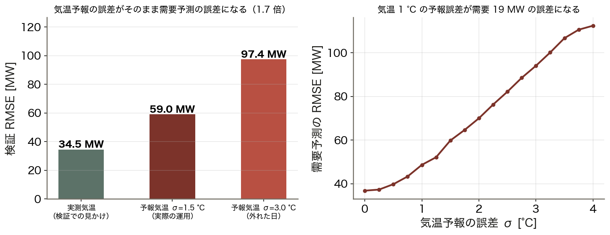

検証を実測気温で行うと、運用の実力を大きく見誤る（左）。誤差は気温予報の精度にほぼ比例するので（右）、前日予測の検証には「前日時点の予報」を使う。

<!-- note: これがリークの最も一般的な形。モデルを凝るより気象予報を良くする方が効く場面が多い、という含意もある。　図の要点：実測気温で検証：34.5 MW／予報気温 σ=1.5 °C：59.0 MW（1.7 倍）／σ=3.0 °C なら 97.4 MW／気温 1 °C の誤差 ≈ 需要 19 MW -->

---

<!-- _class: kpi -->

# 何が効いているか

  31.2
  ブースティングの RMSE [MW]

  1.7 倍
  気温を予報値にしたときの悪化

  19
  気温 1 °C あたりの誤差 [MW]

<!-- note: モデルの改善余地（34.4 → 31.2 MW）より、入力の改善余地（59.0 → 34.5 MW）の方が大きい。 -->

---

<!-- _class: divider -->

# Ⅳ. 運用に載せる

## 区間で出し、理由を示す

---

<!-- _class: figure-story -->
<!-- source: コード/fig_ch12.py -->

# 点ではなく区間で予測する

## 読み方｜帯が 90% 予測区間、点が区間から外れた時刻

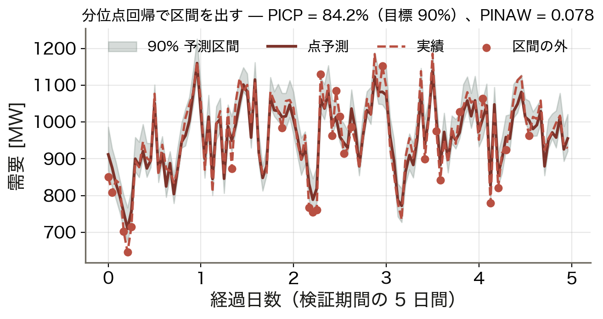

- 時刻ごとに残差の分位点から幅を決める
- PICP（区間に入った割合）= **84.2%**
- PINAW（幅の指標）= 0.078
- 朝夕のピークで幅が広がる

当てるだけなら幅を広げればよい。狭くて当たる区間が価値で、予備力はこの上端で決める。

<!-- note: PICP が目標 90% を下回るのは、検証期間が学習期間と分布が違うため。実務ではここを補正する。 -->

---

<!-- _class: figure-story -->
<!-- source: コード/fig_ch12.py -->

# 何が効いているかを測る

## 読み方｜その特徴量をわざと壊したとき、誤差がどれだけ増えるか

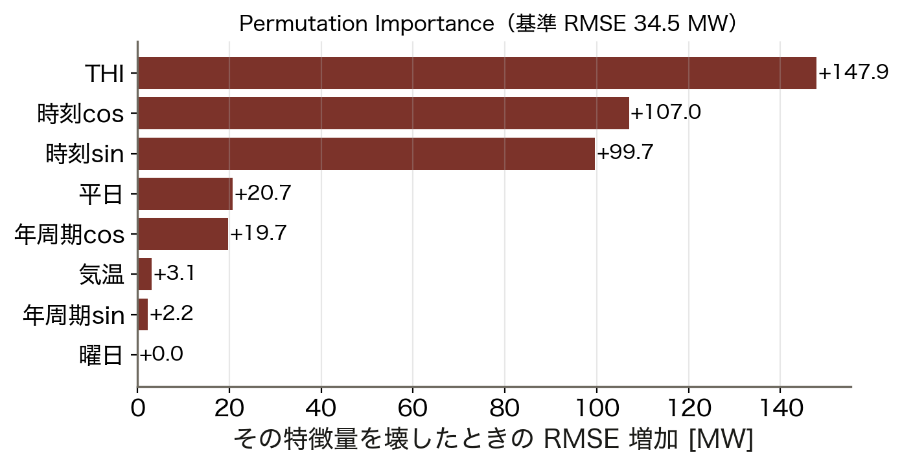

- THI（不快指数）が最も効く
- 時刻の周期成分がそれに続く
- 平日・曜日は寄与が小さい
- 壊しても増えないなら不要な特徴量

Permutation Importance はモデルによらず使える。「なぜこの予測になったか」を説明する第一歩。

<!-- note: 個別の予測を説明したいなら SHAP。ここでは実装が簡単で解釈も明快な置換重要度を使っている。 -->

---

<!-- _class: figure-full -->
<!-- source: コード/fig_ch12.py -->

# LSTM — 長い記憶を保つ仕組み

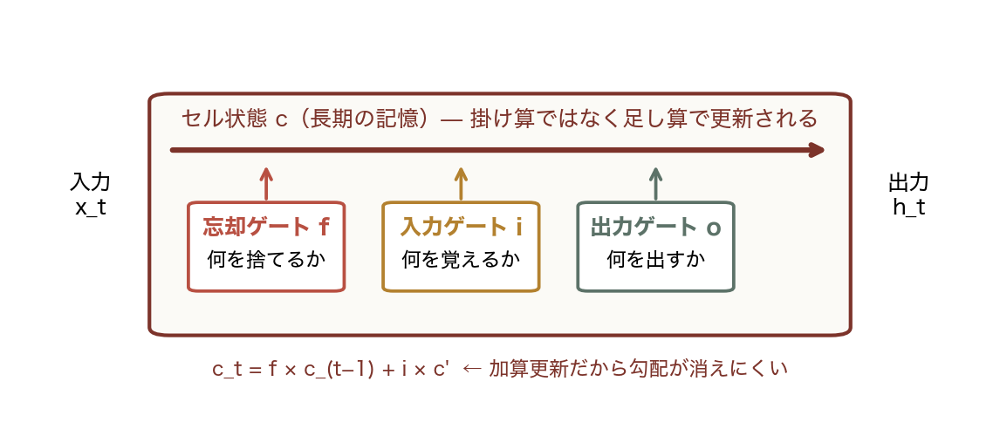

3 つのゲートがセル状態への出入りを制御し、加算更新だから勾配が消えにくく長い系列を扱える。ただし表形式のデータでは、木モデルに勝てないことが多い。

<!-- note: 深層学習が強いのは、画像・音声・自然言語のように「特徴量設計が難しい」データ。需要予測は特徴量が明快なので木が強い。　図の要点：忘却ゲート：何を捨てるか／入力ゲート：何を覚えるか／出力ゲート：何を出すか／セル状態は 加算 で更新される -->

---

<!-- _class: steps -->

# 例題 1 — ブースティングの 1 ステップ

  1
  出発点
  5 点の需要、F₀ = 平均 1,000。残差 r = [+80, −40, +20, −60, 0]、SSE = 12,000

  2
  木 1 本（分割 1 回）
  気温で 2 葉に分け、葉の値は残差の平均 {+33.3, −50}

  3
  学習率 ν = 0.5 で足す
  F₁ = F₀ + 0.5 h₁。新しい残差 [+63.3, −15, +3.3, −35, −16.7]

  4
  結果
  SSE 12,000 → 5,745（52% 減）。次の木はこの残差を学ぶ

<!-- note: 学生に 3 の残差を計算させる。ν を 1.0 にすると一度に消えるが、過学習しやすくなることも触れる。 -->

---

<!-- _class: figure -->

# 動く図で試す — viz/ml.html

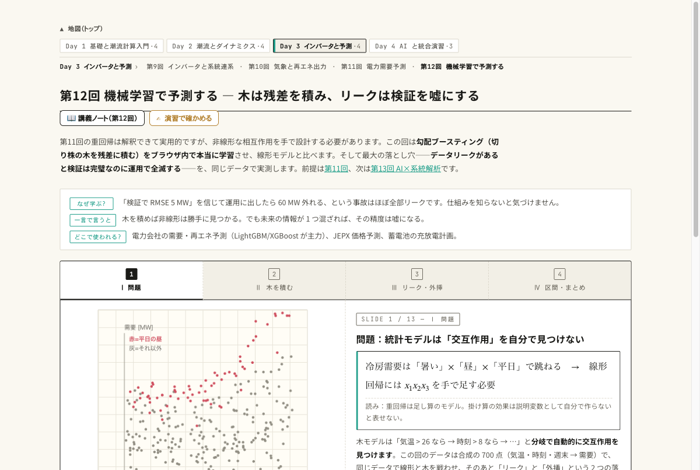

動く図 木のブースティング・リークの逆転・外挿・分位点区間をブラウザ内で実計算する 13 枚のスライド。

- 木を 1 本ずつ足して、検証誤差が下がり、やがて上がり始めるのを見る
- 線形回帰と深さ 2 の木を同じデータで比べ、交互作用で木が勝つのを見る
- 気温を学習範囲の外に出し、木が平らになる（外挿不能）のを見る

---

<!-- _class: blocks -->

# なぜそう考えるか — 外挿・表形式・リーク

  なぜ木は外挿できないのか
  木の出力は「葉に入った学習データの平均」。学習範囲を超えた入力は端の葉に落ち、端の平均値を返し続ける。記録更新の日は線形の方が素直に伸びる。

  なぜ表形式では木が強いのか
  気温 × 時刻 × 曜日のような交互作用と、冷房が入る温度のような閾値を、分割の組合せで自然に表せる。線形回帰は人が項を書かないと表せない。

  リークの見つけ方
  「予測時点で本当に手に入るか」を特徴量 1 つずつ問う。精度が良すぎたら疑う。

---

<!-- _class: figure-full -->
<!-- source: コード/fig_ch12.py -->

# よくある誤解 — 3 つとも「検証を信じすぎた」結果

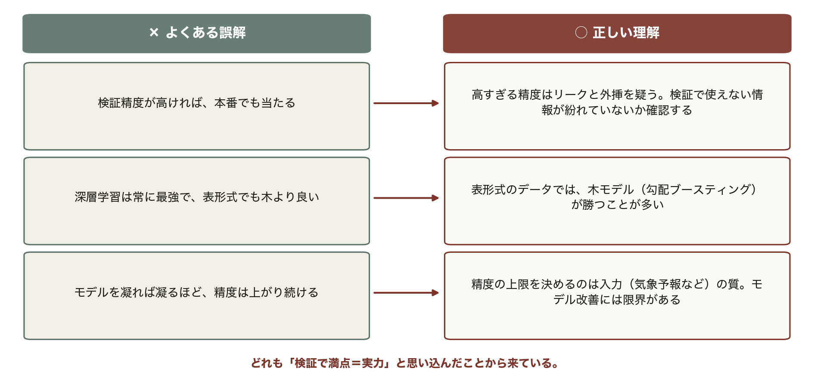

試験でも実務でも、この 3 つが最も多い。高すぎる精度を見たら、まずリークと外挿を疑う習慣をつける。

---

<!-- _class: takeaway -->

# 持ち帰る 3 点

残差を積む木は強いが、地図の外は歩けない。入力の質が精度の上限を決める

<li>F_m = F_(m−1) + ν h_m。浅い木を多数、検証誤差で早期停止</li>
<li>木は外挿不能。記録更新の日は線形側を信じる</li>
<li>気温 1 °C の予報誤差が需要 19 MW の誤差になる。区間で出して予備力へ</li>

---

<!-- _class: end -->

# 次回：第13回 AI × 系統解析

演習 ex/ch12.html で数値を変えて確かめる

系統はグラフ — 隣から伝わる情報で状態を推定し、異常を見つける
