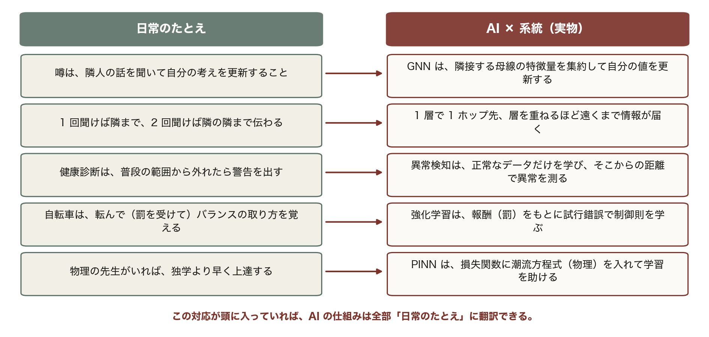
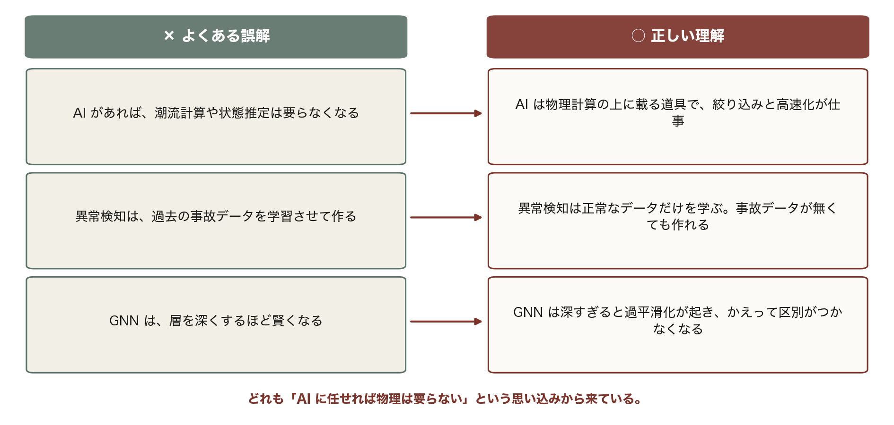

<!-- _class: title -->

# 第13回 AI を用いた電力系統解析
## 系統はグラフ — 隣から学び、普段からの距離で異常を見つける
Day 4・コマ 13

<!-- note: Day 4 の初回。ここまでの物理モデルの上に AI を載せる、という位置づけを最初に明示する。 -->

---

<!-- _class: statement -->

電力系統は母線と線路のグラフ。AI は隣の情報を集めて学び、普段からの距離で異常を測る。ただし物理は捨てない。

<!-- note: 最後の一文が今日の主題。AI は物理を置き換えるのではなく、その上に載る。 -->

---

<!-- _class: graphical-abstract -->

# この回の全体像

## 一枚で｜問い → 課題 → 道具 → 到達点

  問い
  系統解析に AI をどう使うのか。**どこまで任せて**、どこから物理で確かめるのか。

  課題
  
  系統はグラフ。表形式のモデルでは扱いにくい。

  道具
  
  GNN ▶ 状態推定 ▶ 異常検知
  正常を学び ==距離== で測る。

  到達点
  99%
  正常データだけを学習して、線路故障を 99% 検出できる。

数値はすべて本資料の Python コード（コード/fig_ch13.py）で計算。系統は IEEE 14 母線。GNN・PCA・Q 学習は numpy で自作。

<!-- note: 右下の 99% は「事故データを 1 つも学習せずに」達成している点が重要。 -->

---

<!-- _class: sections -->

# 現場で起きたこと — 見つける速さが被害を決める

  2015年12月 ウクライナ送電網へのサイバー攻撃
  遠隔操作で変電所の遮断器が次々に開かれ、約 22 万戸が停電した。操作そのものは「正規の手順」に見えた。==普段と違う== 操作の並びを早く見つける監視が要る、と世界が認識した事件である。

  2019年 風力予測への機械学習の適用
  Google と DeepMind は風力発電の出力を 36 時間先まで機械学習で予測し、電力の価値を約 2 割高めたと報告した。一方、状態推定は 1970 年代から EMS の中核であり、AI はその上に載る道具である。

<!-- note: 「AI で何ができるか」より「系統のどの仕事に、どう嵌めるか」を今日は見る。 -->

---

<!-- _class: figure-full -->
<!-- source: コード/fig_ch13.py -->

# たとえ話 — 噂・健康診断・自転車

たとえ話が崩れる点も押さえておく。噂は伝わるほど誇張されるが、GNN の集約は平均化して差が薄まる。層を重ねすぎると全ノードが同じ値になる。

<!-- note: この 5 行は第13回の全体を先取りしている。GNN・異常検知・強化学習・PINN が、あとで順番に式や図になって出てくる。 -->

---

<!-- _class: agenda -->

# この回の地図

1. 系統はグラフ — GNN の集約と、その限界
2. 状態推定 — 今どうなっているかを計測から復元する
3. 異常検知 — 正常を学び、距離で測る
4. 強化学習と PINN、そして実務での使いどころ

---

<!-- _class: divider -->

# Ⅰ. 系統はグラフ

## 隣から情報を集める

---

<!-- _class: figure-full -->
<!-- source: コード/fig_ch13.py -->

# 系統をグラフとして見る

第4回で組んだ Y_bus は、実はグラフの隣接構造そのもの（左がグラフ表現、右が隣接行列）。ここに機械学習を載せるのが GNN である。

<!-- note: 母線に番号を振り直しても物理は変わらない。この「順序に依らない」性質を扱えるのが GNN の強み。　図の要点：ノード＝母線、エッジ＝線路・変圧器／14 母線・20 枝／隣接行列の非零は 20.4%／Y_bus と同じ疎なパターン -->

---

<!-- _class: equation -->

# GNN の 1 層 — 自分と隣の平均を混ぜる

$$h_i^{(l+1)} = \sigma\!\left( W_\text{self}\, h_i^{(l)} + W_\text{nbr}\, \frac{1}{|N(i)|}\sum_{j \in N(i)} h_j^{(l)} \right)$$

  $N(i)$
  母線 i の隣接母線。Y_bus の非零パターンがそのまま隣接関係になる
  $W_\text{self}, W_\text{nbr}$
  全ノード共通の重み。だから母線番号の順序に依らず、大きな系統にも使い回せる
  $l$
  層数：l 層で l ホップ先の情報が届く。潮流の影響範囲に合わせて 2〜4 層
  $h^{(l)}$
  用途：潮流の近似、状態推定の初期値、N-1 のスクリーニング

<!-- note: 平均を取るのは「隣が何本あっても同じ扱い」にするため。和にすると次数の大きいノードだけ値が大きくなる。 -->

---

<!-- _class: figure-full -->
<!-- source: コード/fig_ch13.py -->

# 1 層で隣、2 層で隣の隣

4 母線の直線グラフで、層を重ねたときの実際の数値を示す。層を重ねるほど遠くの情報が届くが、同時に値が平均化されて差が消えていく。

<!-- note: 手計算できる大きさで見せる。母線 2 の 1 層目は 0.5×2.0 + 0.5×(1.0+0.5)/2 = 1.375。　図の要点：入力 [1.0, 2.0, 0.5, 1.5]／1 層後 [1.500, 1.375, 1.125, 1.000]／2 層後 [1.438, 1.344, 1.156, 1.062]／層数＝情報が届くホップ数 -->

---

<!-- _class: figure-full -->
<!-- source: コード/fig_ch13.py -->

# 過平滑化 — 深くしすぎると区別がつかない

左が各ノードの値、右がノード間のばらつきの推移である。深層学習の「深いほど良い」は GNN には当てはまらず、設計するのは深さではなく届けたいホップ数である。

<!-- note: 対策は残差接続（skip connection）や、層ごとに異なる集約を使う方法。研究上の主要テーマの 1 つ。　図の要点：層を重ねると全ノードが同じ値へ／4 層でばらつきは 43% に減る／12 層ではほぼ区別がつかない／実用は 2〜4 層 -->

---

<!-- _class: divider -->

# Ⅱ. 状態推定

## 今どうなっているかを計測から復元する

---

<!-- _class: sections -->
<!-- build -->

# 導出 — 加重最小二乗（WLS）

  ① 計測は誤差を含む｜z = h(x) + e
  計測 z（潮流・電圧・注入）と、状態 x（各母線の電圧の大きさと位相）を結ぶのが潮流の式 h(x)。計測誤差 e の分散は計器ごとに違う。

  ② 精度の良い計測を重く扱う｜J(x) = Σ (z_i − h_i(x))² / σ_i²
  σ が小さい（正確な）計測ほど、ずれたときのペナルティが大きい。この J を最小にする x を探す。

  ③ 反復で解く｜(HᵀR⁻¹H) Δx = HᵀR⁻¹(z − h(x))
  H は h の偏微分（ヤコビアン）。形は第5回のニュートン・ラフソン法と同じで、**計測が未知数より多い**（冗長）ことが前提になる。

<!-- note: 冗長性があるから、誤差を平均化でき、不良データも見つけられる。この 2 つが状態推定の存在理由。 -->

---

<!-- _class: figure-full -->
<!-- source: コード/fig_ch13.py -->

# 精度の違う計測をどう混ぜるか

「たくさん測って平均する」のではなく「精度に応じて重みをつけて混ぜる」（左が目的関数、右が真値からの誤差）。それだけで推定は大きく改善する。

<!-- note: 重みは 1/σ²。PMU（同期フェーザ計測）は σ が小さいので、少数でも大きく効く。　図の要点：計測1（σ=0.01）と計測2（σ=0.03）／単純平均：0.9545／WLS：0.9509（真値 0.95）／誤差は約 4 分の 1 に -->

---

<!-- _class: figure-story -->
<!-- source: コード/fig_ch13.py -->

# 不良データを見つける

## 読み方｜推定値との残差。しきい値を超えたものが疑わしい

- 冗長な計測があるから残差が計算できる
- 3σ を超えた計測を除いて再推定
- 故障した計器・通信エラーを検出
- 除いた後にもう一度 WLS を回す

状態推定は「推定する」だけでなく「計測を検品する」機能を持つ。EMS のすべての計算はこの後に続く。

<!-- note: 2003 年北米大停電では、状態推定が収束せず運用者が系統の状態を把握できない時間帯があった。 -->

---

<!-- _class: divider -->

# Ⅲ. 異常検知

## 正常を学び、距離で測る

---

<!-- _class: figure-full -->
<!-- source: コード/fig_ch13.py -->

# PCA — 正常時の潮流は少数の軸で表せる

事故データを 1 つも学習していないのに検出できるのは、「正常から遠い」という判断だけで済むからである（左が累積寄与率、右が再構成誤差の分布）。

<!-- note: 主成分は「潮流パターンの典型的な変わり方」。負荷が増えれば全線路が比例して増える、といった構造を捉えている。　図の要点：正常データだけで主成分を学習／5 主成分で大部分を説明／線路故障の検出率 99%／誤検出 1%（しきい値は正常の 99 パーセンタイル） -->

---

<!-- _class: figure-full -->
<!-- source: コード/fig_ch13.py -->

# オートエンコーダ — 同じ考えを非線形に

圧縮して復元し、その差を測る仕組みである。事故データは希少で未知の故障もあるため、「正常を学ぶ」設計にするのが実務上の解である。

<!-- note: 教師あり学習（事故の種類を当てる）は、学習データにある事故しか当てられない。ここが決定的な違い。　図の要点：中央の層で情報を絞る／正常データは上手く復元できる／異常は復元できず誤差が大きい／PCA の非線形版と考えてよい -->

---

<!-- _class: divider -->

# Ⅳ. 学習と物理

## 制御を学ぶ、物理を守らせる

---

<!-- _class: figure-full -->
<!-- source: コード/fig_ch13.py -->

# 強化学習 — 試行錯誤で制御則を得る

左が学習の進み、右が学習された方策である。人が制御則を書かなくても、報酬の設計だけで妥当な方策に至る。ただし報酬の設計自体が難しい。

<!-- note: 実系統で試行錯誤はできないので、シミュレータで学習して実機に移す（sim-to-real）のが基本。　図の要点：状態＝電圧、行動＝無効電力の増減／報酬＝範囲内なら +、逸脱なら −／逸脱の割合 9% → 1.2%／「電圧が高いなら Q を減らす」を獲得 -->

---

<!-- _class: figure-story -->
<!-- source: コード/fig_ch13.py -->

# PINN — 物理を知っている家庭教師

## 読み方｜データが無い領域で、物理項の有無がどう効くか

- 観測は δ < 0.6 の範囲だけ
- データのみ：外側で大きく外れる（2.13）
- 物理項あり：ほぼ真値どおり（0.00）
- 損失に「潮流方程式の残差」を足すだけ

第12回の「木は外挿できない」への一つの答え。物理を損失に入れれば、データの無い領域でも法則に沿う。

<!-- note: L = L_data + λ L_physics。λ の選び方が難所で、大きすぎるとデータに合わなくなる。 -->

---

<!-- _class: figure-full -->
<!-- source: コード/fig_ch13.py -->

# 実務での使いどころ — 2 段構え

速さは AI が担い、正しさは物理計算が保証する。役割を分けるからこそ、説明責任と信頼性の要求に応えられる。

<!-- note: N-1 想定事故は数百〜数千ケース。全部を厳密に解く時間はないので、AI で絞る意味がある。　図の要点：計測 → 状態推定（AI は高速化）／AI で危険な候補を絞る／厳密計算で確認してから実行／AI 単独で遮断器は操作しない -->

---

<!-- _class: kpi -->

# 今日の数字

  99%
  線路故障の検出率（正常のみ学習）

  1.2%
  強化学習後の電圧逸脱

  43%
  4 層 GNN で残るノード間の差

---

<!-- _class: steps -->

# 例題 1 — GNN の 1 層を手で計算する

  1
  設定
  母線 1–2–3–4 が一直線。特徴量 h = [1.0, 2.0, 0.5, 1.5]、W_self = W_nbr = 0.5

  2
  母線 2（隣は 1 と 3）
  隣の平均 = (1.0 + 0.5)/2 = 0.75 → 0.5×2.0 + 0.5×0.75 = 1.375

  3
  端の母線 1（隣は 2 だけ）
  0.5×1.0 + 0.5×2.0 = 1.500

  4
  2 層目
  母線 1 に母線 3 の情報が届く。層数だけ遠くまで伝わる

<!-- note: 学生に 2 と 3 を計算させる。母線 4 も同様に端の扱いになることを確認させる。 -->

---

<!-- _class: figure -->

# 動く図で試す — viz/ai.html

動く図 メッセージパッシング・PCA 異常検知・Q 学習をブラウザ内で実計算する 13 枚のスライド。

- メッセージパッシングを 1 層ずつ進め、情報が隣へ隣へ広がるのを見る
- PCA の再構成誤差で、線路故障の潮流パターンが「普段」から外れるのを見る
- Q 学習の試行回数を増やし、電圧逸脱の割合が下がっていくのを見る

---

<!-- _class: blocks -->

# なぜそう考えるか — 正常を学ぶ・物理を残す

  なぜ「正常」を学ぶのか
  事故のデータは希少で、未知の故障は学習できない。正常だけを学び、そこからの距離で検出すれば、見たことのない異常も拾える。

  なぜ物理を捨てないのか
  電力系統には確立した物理モデルがある。PINN は損失に方程式の残差を足し、データが薄い領域でも物理に沿った答えを出す。純データ駆動は学習範囲の外で崩れる。

  実務の型
  AI でスクリーニング → 厳密計算で確認。AI 単独で遮断器は操作しない。

---

<!-- _class: figure-full -->
<!-- source: コード/fig_ch13.py -->

# よくある誤解 — 3 つとも「AI に任せすぎた」結果

AI は絞り込みと高速化の道具で、正しさを保証するのは物理計算である。過去の事故データが無くても、正常データだけで異常検知は作れる。

---

<!-- _class: takeaway -->

# 持ち帰る 3 点

系統はグラフ。AI は隣から学び、普段からの距離を測る。物理が正しさを担保する

<li>GNN：1 層 1 ホップ、順序に依らず規模に汎化。深すぎると過平滑化</li>
<li>状態推定は精度で重みをつける WLS。冗長性が不良データ検出を可能にする</li>
<li>異常検知は正常を学ぶ。AI で絞り、厳密計算で確認する 2 段構え</li>

---

<!-- _class: end -->

# 次回：第14回 系統最適化と市場

演習 ex/ch13.html で数値を変えて確かめる

一番安い電気から使う — 等 λ 法から OPF・LMP へ
