<!-- _class: title -->

# 第14回 系統最適化と市場
## 一番安い電気から使う — 等 λ 法から OPF・LMP へ
Day 4・コマ 14

<!-- note: 物理から経済へ。ここまでの制約（電圧・容量・安定度）が、そのまま最適化の制約条件になる。 -->

---

<!-- _class: statement -->

発電機を安い順に使うのが経済負荷配分で、最適条件は「限界費用 λ が全機で等しい」。制約を足すと OPF になり、混雑があると地点ごとに価格が分かれる。

<!-- note: 「揃える」が今日のキーワード。水面が揃う、という直感を最後まで使う。 -->

---

<!-- _class: graphical-abstract -->

# この回の全体像

## 一枚で｜問い → 課題 → 道具 → 到達点

  問い
  発電機が何台もある。**どれをどれだけ**動かせば燃料費が最小になるのか。送電線が詰まったらどうなるのか。

  課題
  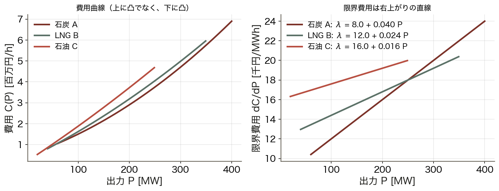
  機ごとに費用の形が違う。

  道具
  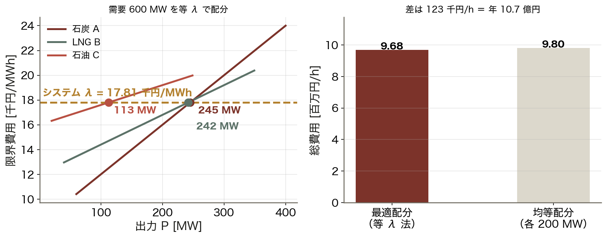
  等 λ 法 ▶ OPF ▶ LMP
  限界費用を ==揃える== 。

  到達点
  2.6 倍
  線路が混雑すると、地点価格が 14.0 → 36.5 千円/MWh に。

数値はすべて本資料の Python コード（コード/fig_ch14.py）で計算。3 機の経済負荷配分と 3 母線の DC-OPF。

<!-- note: 右下が結論。物理的な制約（線路容量）が、価格という形で経済に現れる。 -->

---

<!-- _class: sections -->

# 現場で起きたこと — 価格は「限界」で決まる

  2021年1月 スポット価格が 200 円/kWh を超えた
  日本卸電力取引所（JEPX）のスポット市場は、安い電源から順に積み上げて需要と交わる点で価格が決まる。寒波と LNG 在庫不足で ==高い電源まで== 使う日が続き、価格は平時の 10 倍以上に跳ねた。

  地点で違う価格 — 米国 PJM の LMP
  送電線が混雑すると、安い電気を運びきれない地点では高い電源で賄うしかなく、その地点の価格（地点別限界価格 LMP）が上がる。沖縄は他地域と連系がなく市場取引もないため、沖縄電力が自社内で経済負荷配分を行う。

<!-- note: 今日の λ が、市場では「価格」として目に見える。理論と制度が直結している回。 -->

---

<!-- _class: figure-full -->
<!-- source: コード/fig_ch14.py -->

# たとえ話 — つながった水槽と渋滞

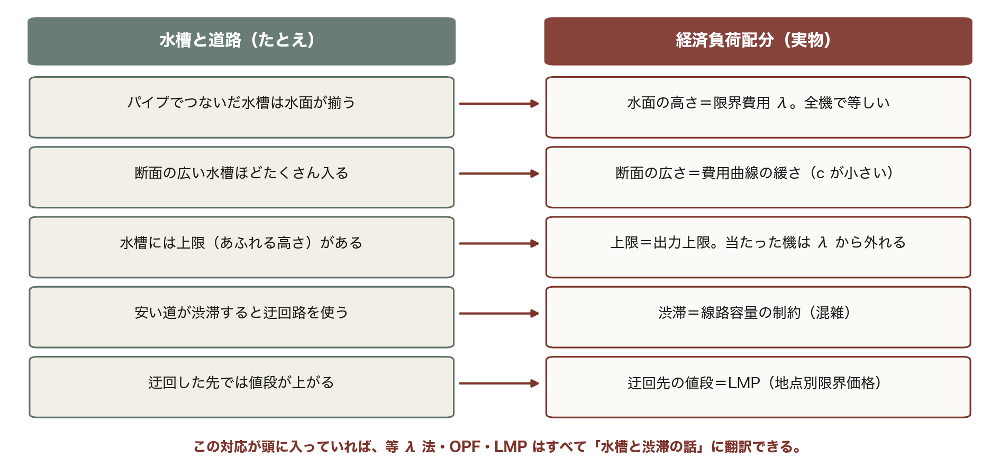

たとえ話が崩れる点も押さえておく。水槽は独立に上限があるだけだが、発電機は起動・停止に時間と費用がかかる。それを扱うのがユニットコミットメント（UC）である。

<!-- note: 表の5行は本日の全体を先取りしている。λ・費用曲線・出力上限・混雑・LMP が、あとで順番に式になって出てくる。 -->

---

<!-- _class: agenda -->

# この回の地図

1. 経済負荷配分（ELD）と等 λ 法 — なぜ「等しい」が最適か
2. 市場のメリットオーダーと価格の決まり方
3. OPF と DC-OPF — 制約を足すとどうなるか
4. LMP と混雑、そして EMS の中での位置づけ

---

<!-- _class: divider -->

# Ⅰ. 経済負荷配分

## なぜ「限界費用を揃える」のが最適か

---

<!-- _class: figure-full -->
<!-- source: コード/fig_ch14.py -->

# 費用曲線と限界費用

出力を上げるほど限界費用が上がるので、「安い機を全部使う」のが最適とは限らない。

<!-- note: 2 次近似は実務でも使う。実際には弁点効果（valve point）でギザギザするが、まずはこの形で考える。　図の要点：費用は出力の 2 次関数で近似する／傾き（限界費用）は右上がりの直線／石炭は安いが傾きが急／石油は高いが傾きは緩い -->

---

<!-- _class: sections -->
<!-- build -->

# 導出 — 等 λ 法

  ① 問題を書く｜総費用を最小に、需給は一致
  min Σ C_i(P_i)、条件 Σ P_i = D。制約付き最小化なのでラグランジュの未定乗数法を使う。

  ② 微分する｜L = Σ C_i(P_i) − λ(Σ P_i − D)
  P_i で偏微分して 0 と置くと **dC_i/dP_i = λ**（すべての i で同じ）。これが等 λ 条件である。

  ③ 直感で確かめる｜λ が違えば動かす余地がある
  もし機 1 の λ が機 2 より高ければ、機 1 を 1 MW 減らして機 2 を 1 MW 増やすだけで総費用が下がる。**下がらなくなる点が等しい点**。λ は「あと 1 MWh の値段」。

<!-- note: ③の説明が最も腑に落ちる。数式より先にこちらを話してもよい。 -->

---

<!-- _class: figure-full -->
<!-- source: コード/fig_ch14.py -->

# 等 λ で配分する

限界費用を「揃える」だけで年 10 億円の差になる。3 機でこれなら、数十機の系統では桁が変わる。

<!-- note: 均等配分は極端な比較だが、λ を揃える価値を実感させるには分かりやすい。　図の要点：需要 600 MW、λ = 17.81 千円/MWh／石炭 245 MW、LNG 242 MW、石油 113 MW／均等配分（各 200 MW）より安い／差は 123 千円/h ＝ 年 10.7 億円 -->

---

<!-- _class: figure-full -->
<!-- source: コード/fig_ch14.py -->

# λ をどう探すか — 二分法

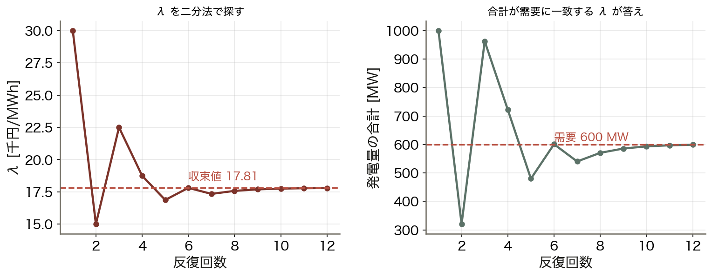

解くべきは λ という 1 変数の方程式。数十機あっても、探す相手は λ ただ 1 つである。

<!-- note: 単調性があるので二分法で確実に解ける。実装は数十行で済む。　図の要点：λ を仮に決めると各機の出力が決まる／合計が需要より少なければ λ を上げる／12 回程度の反復で収束／上下限に当たった機は固定して残りで揃える -->

---

<!-- _class: figure-full -->
<!-- source: コード/fig_ch14.py -->

# 需要が増えると何が起きるか

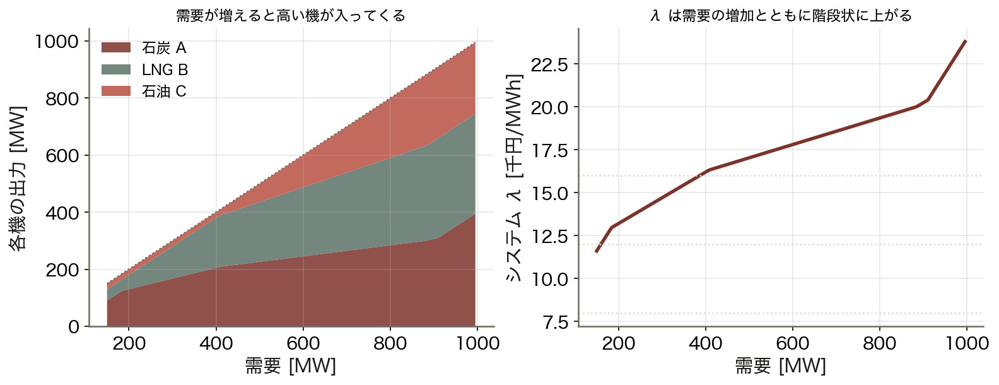

λ は「その時点の需要 1 MWh あたりの値段」。これが市場価格の理論値になる。

<!-- note: 折れ点は「ある機が上限に達した」瞬間。そこから先は残りの機で需要増を賄うので λ の上がり方が急になる。　図の要点：需要が小さいうちは安い機が主体／増えると高い機が入ってくる／λ は 11.6 → 23.8 千円/MWh へ上昇／上限に当たると傾きが変わる -->

---

<!-- _class: divider -->

# Ⅱ. 市場での価格

## メリットオーダーと約定価格

---

<!-- _class: figure-story -->
<!-- source: コード/fig_ch14.py -->

# メリットオーダー — 安い順に積む

## 読み方｜横軸が累積の供給力、縦軸が限界費用。需要線と交わる高さが価格

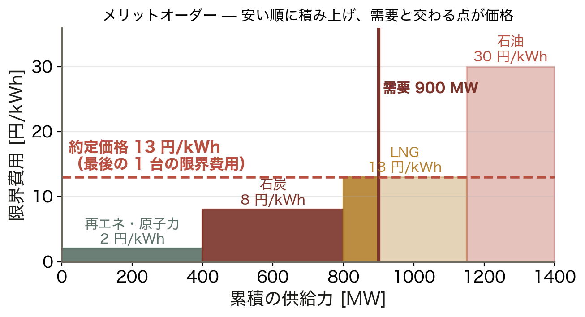

- 再エネ・原子力 → 石炭 → LNG → 石油
- 需要 900 MW は LNG まで届く
- 約定価格は **13 円/kWh**
- 安い電源も同じ価格で売れる

価格を決めるのは「最後の 1 台」。安い電源はその差額が利益になり、投資回収の原資になる。

<!-- note: これが限界費用価格（marginal pricing）。全員が同じ価格で約定するので、単一価格オークションとも呼ばれる。 -->

---

<!-- _class: figure-story -->
<!-- source: コード/fig_ch14.py -->

# 需要が伸びると価格は階段状に跳ねる

## 読み方｜需要がどの電源まで届くかで、価格が段階的に変わる

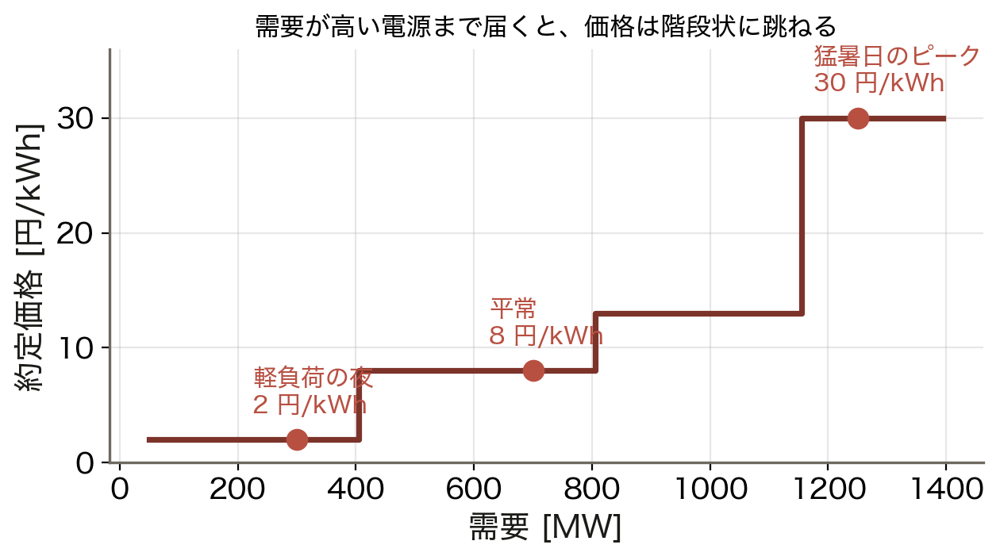

- 軽負荷の夜：2 円/kWh
- 平常：8 円/kWh
- 猛暑日のピーク：30 円/kWh
- 段差は電源の切り替わり点

2021 年 1 月に価格が 200 円を超えたのは、この階段の一番上まで需要が届いたから。

<!-- note: 実際には「焚けるものが無い」状態になると価格は上限（当時 200 円）まで跳ね上がる。 -->

---

<!-- _class: figure-story -->
<!-- source: コード/fig_ch14.py -->

# 炭素価格は順位を入れ替える

## 読み方｜横軸が炭素価格、縦軸が燃料費＋炭素費用

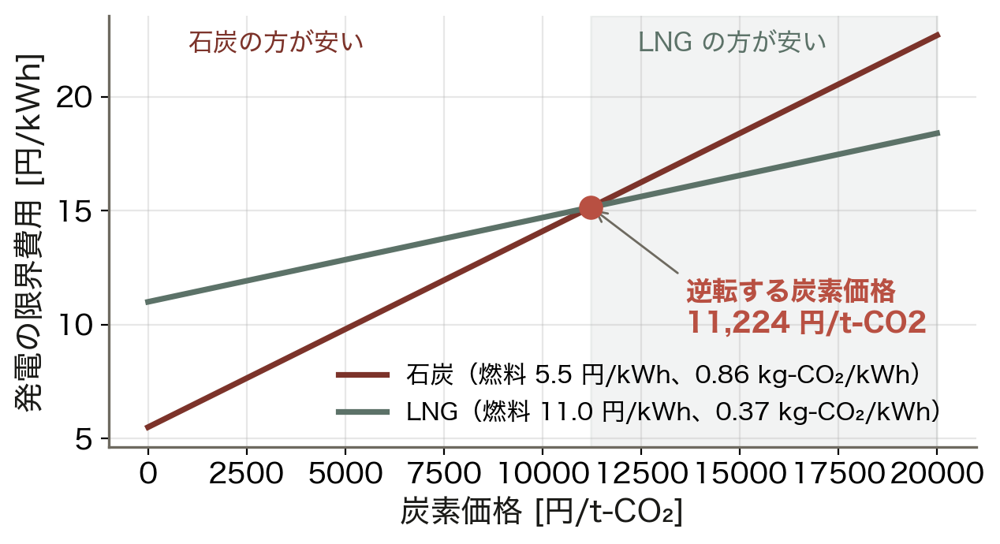

- 石炭は燃料が安いが CO₂ が多い
- LNG は燃料が高いが CO₂ が半分以下
- 約 **11,200 円/t-CO₂** で逆転
- そこを超えると LNG が先に焚かれる

価格に環境コストを載せると、メリットオーダーそのものが変わる。制度が運用を動かす仕組み。

<!-- note: 逆転価格は燃料費の前提で大きく動く。燃料が高騰すれば、より低い炭素価格で逆転する。 -->

---

<!-- _class: divider -->

# Ⅲ. 制約を足す

## ELD から OPF へ

---

<!-- _class: equation -->

# OPF — 潮流方程式と系統制約を足す

$$\min \sum_i C_i(P_{Gi}) \quad \text{s.t.}\quad
\begin{cases}
\text{潮流方程式（第4回）} \\
P_{Gi}^{\text{min}} \le P_{Gi} \le P_{Gi}^{\text{max}} \\
V_i^{\text{min}} \le V_i \le V_i^{\text{max}} \\
|P_{ij}| \le P_{ij}^{\text{max}}
\end{cases}$$

  $\text{s.t.}$
  ELD との違い：需給バランスだけでなく、電圧・線路容量・安定度も守る
  AC-OPF
  厳密だが非線形・非凸。局所解に落ちることがある
  DC-OPF
  第4回の 3 近似で線形化。線形計画なので数万変数でも秒で解ける
  $P_{ij}$
  用途：市場の約定計算・混雑管理は DC-OPF、詳細検討は AC-OPF

<!-- note: 第4回の直流法がここで効いてくる。近似だからこそ、市場という「毎日必ず解く」場面で使える。 -->

---

<!-- _class: figure-full -->
<!-- source: コード/fig_ch14.py -->

# 3 母線の DC-OPF — 混雑で配分が変わる

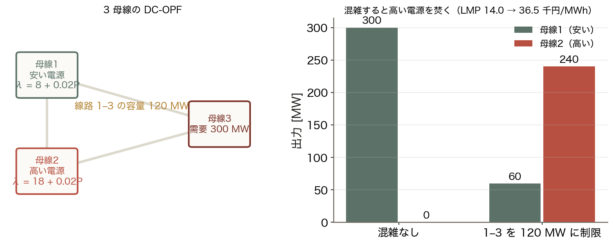

送電線の容量は「物理の制約」だが、結果として「経済の損失」になる。増強の価値はここで測る。

<!-- note: 三角形の系統なので、母線1 の出力は 1–3 と 1–2–3 の 2 経路に分かれて流れる。だから 1–3 の容量が 120 でも 60 MW しか出せない。　図の要点：混雑なし：安い母線1 が 300 MW すべて／容量 120 MW に制限すると／母線1 は 60 MW、母線2 が 240 MW／費用は 3.30 → 5.41 百万円/h に増加 -->

---

<!-- _class: sections -->
<!-- build -->

# 導出 — LMP はなぜ地点で違うのか

  ① LMP の定義｜その地点で需要を 1 MW 増やしたときの総費用の増分
  λ と同じ考え方を「地点ごと」に適用する。混雑がなければ、どの地点で増やしても同じ機が応じるので **全地点で同じ値**になる。

  ② 混雑すると届かない｜安い電気が入ってこられない
  線路が満杯だと、その先で 1 MW 増やす需要は**その地点側の高い電源**で賄うしかない。だから LMP がそこだけ上がる。

  ③ 分解すると 3 成分｜LMP = λ + 混雑 + 損失
  系統全体の λ に、混雑成分と損失成分が地点ごとに乗る。**混雑レント = (LMP差) × 潮流** が、送電線を増強する価値の目安になる。

<!-- note: ②が直感の核心。「安い電気が届かないから高い電気を使う」という当たり前のことを価格が表している。 -->

---

<!-- _class: figure-full -->
<!-- source: コード/fig_ch14.py -->

# 容量と価格の関係

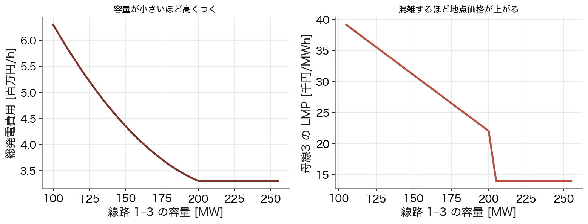

送電線を 1 MW 太くすると、いくら安くなるか。この図の傾きが増強投資の判断材料になる。

<!-- note: 混雑レント（価格差 × 潮流）は送電事業者の収入にもなる。制度設計と物理がつながる場所。　図の要点：容量が十分なら費用も価格も一定／絞るほど費用が増える／LMP は混雑した瞬間から跳ね上がる／14.0 → 36.5 千円/MWh（2.6 倍） -->

---

<!-- _class: kpi -->

# 今日の数字

  17.81
  システム λ [千円/MWh]

  10.7 億円
  等 λ 法による年間の節約

  2.6 倍
  混雑による LMP の上昇

---

<!-- _class: divider -->

# Ⅳ. 運用の中で

## EMS の一部としての最適化

---

<!-- _class: figure-full -->
<!-- source: コード/fig_ch14.py -->

# EMS の流れ — 最適化はこの輪の中にある

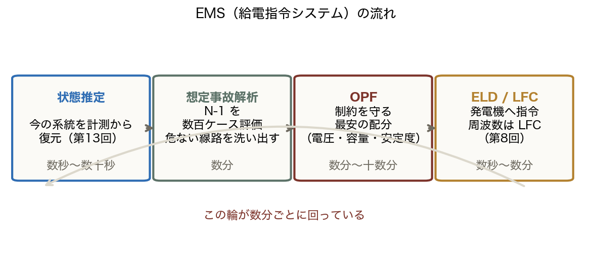

最適化は単体の技術ではなく、運用の輪の 1 工程。前後の工程がなければ答えを実行できない。

<!-- note: 講義全体の構造がここで見える。第4〜8回の物理が、第13〜14回の運用を支えている。　図の要点：状態推定で今を知る（第13回）／N-1 で危ない箇所を洗い出す／OPF で制約を守る最安の配分／ELD / LFC で発電機へ指令（第8回） -->

---

<!-- _class: blocks -->

# なぜそう考えるか — 等 λ・線形化・二値

  なぜ「等しい」が最適なのか
  ラグランジュ乗数 λ は「需要を 1 MW 増やしたときの総費用の増分」。どの機で増やしても同じでなければ、安い方へ移す余地が残っている。

  なぜ DC-OPF は線形計画になるのか
  直流法の 3 近似（|V| = 1、R = 0、sin θ ≈ θ）で潮流制約が線形になる。費用も区分線形にすれば完全な LP で、数万変数でも秒で解ける。

  ユニットコミットメント（UC）
  「どの機を起動するか」は 0/1 の変数。混合整数計画で NP 困難。起動費用と最低運転時間が絡む。

---

<!-- _class: steps -->

# 例題 1 — 2 台の等 λ 配分

  1
  条件
  機1：λ₁ = 10 + 0.04 P₁、機2：λ₂ = 12 + 0.02 P₂。需要 400 MW

  2
  等 λ 条件
  10 + 0.04 P₁ = 12 + 0.02 (400 − P₁)

  3
  解く
  0.06 P₁ = 10 → P₁ = 166.7 MW、P₂ = 233.3 MW

  4
  λ
  λ = 10 + 0.04 × 166.7 = 16.7 千円/MWh。安い機 1 の方が出力は少ない

<!-- note: 直感に反して「安い機の出力が少ない」。傾き（c）が急だからで、ここが等 λ の面白いところ。 -->

---

<!-- _class: figure -->

# 動く図で試す — viz/opf.html

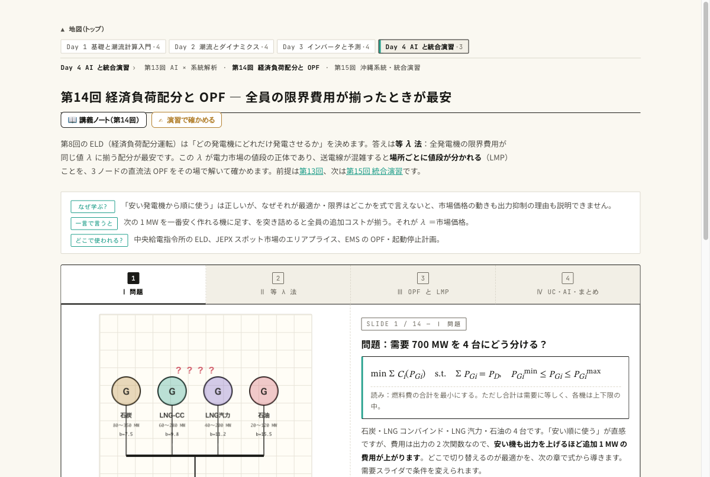

動く図 等 λ 法・メリットオーダー・炭素価格・LMP をブラウザ内で実計算する 14 枚のスライド。

- 等 λ の反復を 1 回ずつ進め、λ が需要に合うまで修正されるのを見る
- メリットオーダーで需要を動かし、約定価格が段階的に跳ねるのを見る
- 線路容量を絞り、混雑したノードだけ LMP が上がるのを見る

---

<!-- _class: figure-full -->
<!-- source: コード/fig_ch14.py -->

# よくある誤解 — 3 つとも「限界費用」を見落としている

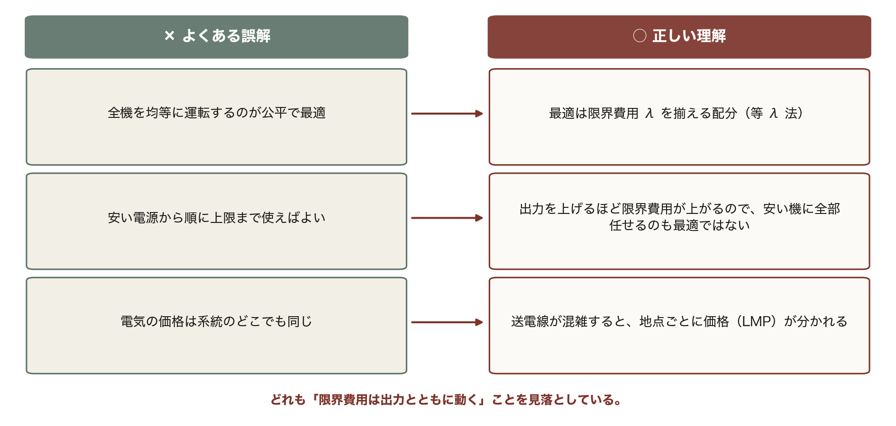

3 つとも根は同じ。限界費用は出力とともに動き、混雑すれば地点によっても動く。「一定」だと思っている限り、この 3 つの誤解から抜けられない。

---

<!-- _class: takeaway -->

# 持ち帰る 3 点

最適は「揃える」。λ を揃え、制約を足して OPF、混雑は価格に表れる

<li>等 λ 法：dC_i/dP_i = λ。上限に当たった機は固定して残りで揃える</li>
<li>OPF = ELD + 潮流 + 制約。DC-OPF は第4回の近似で線形計画になる</li>
<li>LMP = λ + 混雑 + 損失。混雑レントが送電線増強の価値を測る</li>

---

<!-- _class: end -->

# 次回：第15回 沖縄系統・統合演習

演習 ex/ch14.html で数値を変えて確かめる

15 回の道具を全部つないで、太陽光を何 MW まで入れられるかを出す
