<!-- _class: title -->

# 第15回 沖縄系統・統合演習
## 最も厳しい制約が連系可能量を決める
Day 4・コマ 15 ／ 第16回は最終試験

<!-- note: 最終回。14 回分の道具を全部つないで 1 つの数字を出す。答えより「どの制約が効いているか」を言えることが目標。 -->

---

<!-- _class: statement -->

沖縄本島に太陽光を何 MW まで入れられるか。答えは 6 つの上限の最小値で決まり、対策は「今の律速」に打つ。

<!-- note: 樽の一番低い板。この比喩を最後まで使う。 -->

---

<!-- _class: graphical-abstract -->

# この回の全体像

## 一枚で｜問い → 課題 → 道具 → 到達点

  問い
  沖縄本島に太陽光は **何 MW** まで入るのか。増やすには何に投資すればよいのか。

  課題
  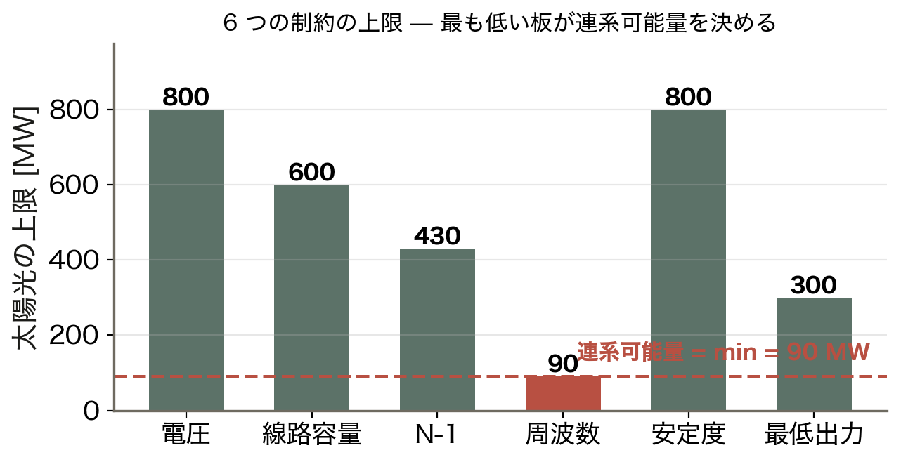
  制約は 6 つ。最も低い板が答えを決める。

  道具
  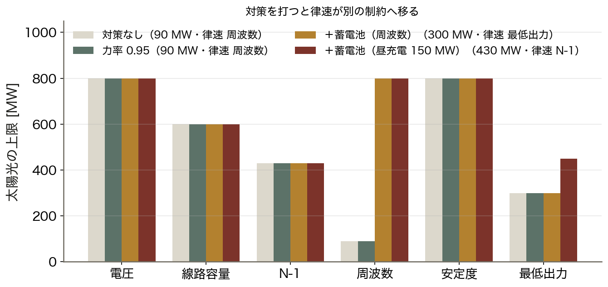
  6 制約 ▶ 最小値 ▶ 律速
  対策で律速が ==移る== 。

  到達点
  4.8 倍
  律速に順番に手を打つと 90 → 430 MW に伸びる。

数値はすべて本資料の Python コード（コード/fig_ch15.py）で計算。簡略モデル：1,500 MW・H = 4.5 s・K = 150 MW/Hz・火力の最低出力 320 MW。

<!-- note: 絶対値ではなく「どこが効いているか」と「対策で律速が移る」ことを持ち帰らせる。 -->

---

<!-- _class: sections -->

# 現場で起きたこと — 小さく、独立で、大型電源に頼る

  2018年 北海道ブラックアウトの教訓
  大型電源への依存、系統の小ささ、そして ==応援が来ない== こと。北海道は本州との直流連系が細く、沖縄は連系そのものが無い。周波数と慣性の議論（第8回）は、沖縄では設計の前提になる。

  離島の実証と、本島の制約
  宮古島などの離島では再エネと蓄電池を組み合わせた実証が行われてきた。本島は 60 Hz の独立系統で、太陽光の拡大とともに火力の最低出力と慣性が制約として前に出てきている。今日の 6 制約はこの現実を式にしたもの。

<!-- note: 沖縄は「日本で最も再エネ統合が難しい系統の 1 つ」。だからこそ教材として面白い。 -->

---

<!-- _class: figure-full -->
<!-- source: コード/fig_ch15.py -->

# たとえ話 — 樽の一番低い板

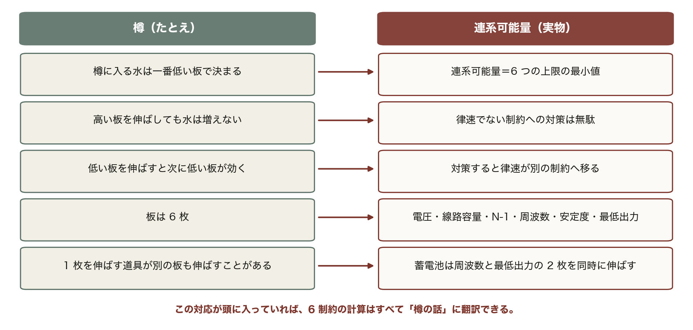

たとえ話が崩れる点も押さえておく。板は独立だが制約は連動する。太陽光を増やすと同期機が減り、周波数と安定度の板が同時に下がる。

<!-- note: 表の5行は本日の全体を先取りしている。6制約・最小値・律速の移り変わりが、あとで順番に実計算になって出てくる。 -->

---

<!-- _class: agenda -->

# この回の地図

1. 系統モデルと 6 つの制約
2. 制約ごとに「どこで破れるか」を実計算する
3. 最小値を取り、律速を言う
4. 対策を打つと律速が移る — 投資の順番

---

<!-- _class: divider -->

# Ⅰ. 前提を置く

## 沖縄本島の簡略モデル

---

<!-- _class: figure-full -->
<!-- source: コード/fig_ch15.py -->

# 系統モデル — 132 kV・5 母線

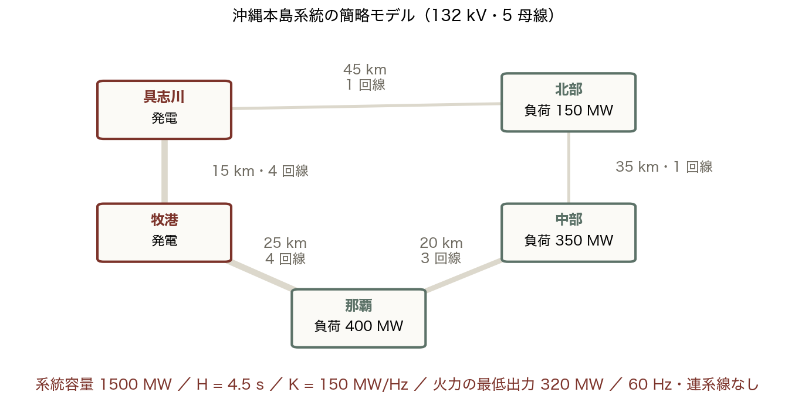

第6回で潮流を解き、第8回で周波数を追ったのと同じ系統である。線の太さが回線数で、北部へ向かう末端だけが 1 回線。この 1 回線が、あとで律速になる。

<!-- note: 実系統はもっと複雑だが、6 制約の考え方を通すにはこの粒度で十分。　図の要点：系統容量 1,500 MW、負荷 900 MW／基準の最低電圧 0.919 p.u.／最大線路利用率 77%／60 Hz・連系線なし -->

---
<!-- _class: figure-full -->
<!-- source: コード/fig_ch15.py -->

# 導出 — 連系可能量の定式化

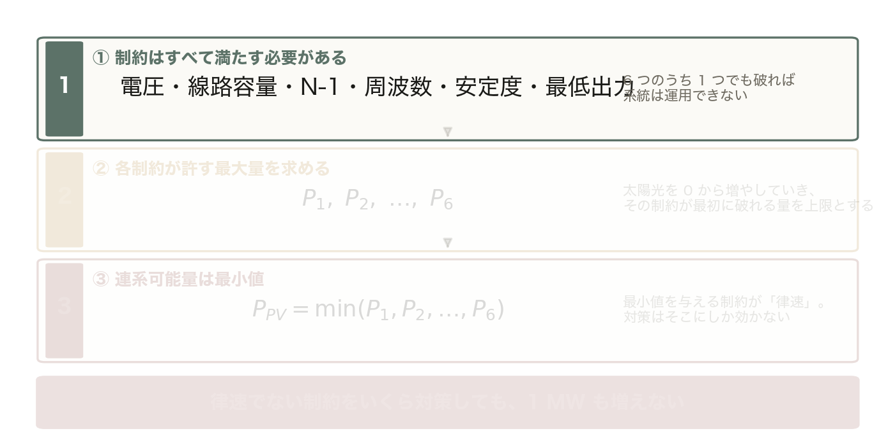

電圧 ≤ 1.05、線路利用率 ≤ 100%、N-1 でも成立、周波数 ≥ UFR、t_cr ≥ 保護時間、正味需要 ≥ 火力の最低出力。1 つでも破れば運用できない。

<!-- note: 数学的には自明だが、実務では「電圧は大丈夫だから入る」と 1 つだけ見て判断する事故が起きる。 -->

---

<!-- _class: figure-full -->
<!-- source: コード/fig_ch15.py -->

# 導出 — 連系可能量の定式化

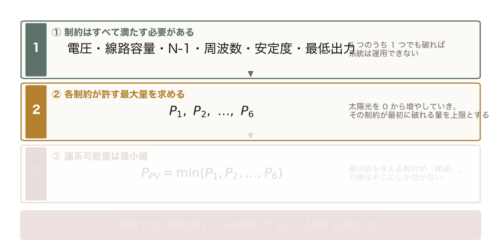

太陽光の量を 0 から増やしていき、その制約が最初に破れる量を上限とする。制約ごとに違う値が出る。

<!-- note: 前の 1 枚に ② を足しただけ。薄い段はまだ出していない段。 -->

---

<!-- _class: figure-full -->
<!-- source: コード/fig_ch15.py -->

# 導出 — 連系可能量の定式化

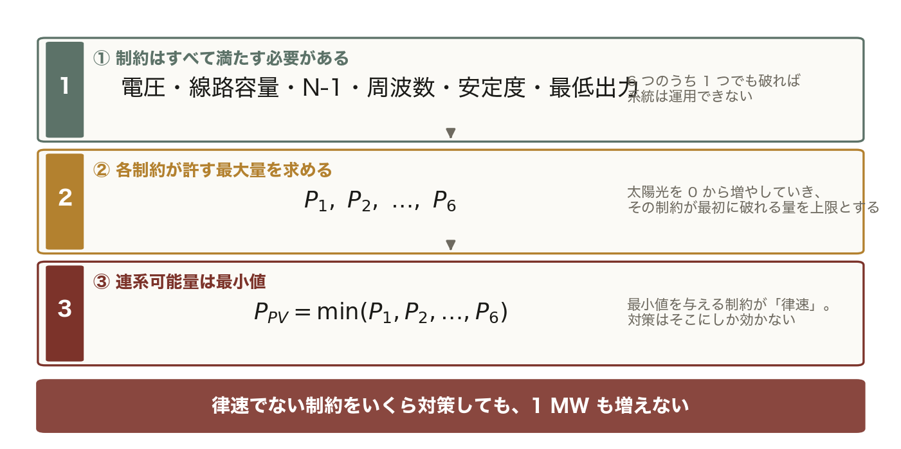

P_PV = min(P₁, P₂, …, P₆)。この最小値を与える制約が「律速」で、対策はそこにしか効かない。

<!-- note: 前の 1 枚に ③ を足しただけ。薄い段はまだ出していない段。 -->
---

<!-- _class: divider -->

# Ⅱ. 制約を 1 つずつ計算する

## どこで、なぜ破れるか

---

<!-- _class: figure-full -->
<!-- source: コード/fig_ch15.py -->

# 4 つの制約の中身

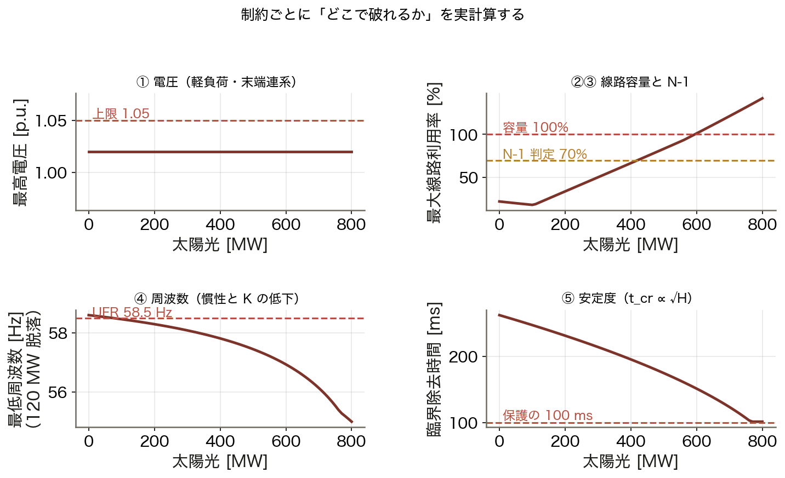

同じ「太陽光を増やす」でも、破れ方は制約ごとに違う。電圧は導入量に比例してすぐ上限に当たり、周波数は慣性と K の低下を通じてじわじわ効いてくる。

<!-- note: 電圧と容量は潮流計算（第6回）、周波数は動的シミュレーション（第8回）、安定度は等面積法（第7回）で計算している。　図の要点：電圧：軽負荷・末端連系で 1.05 に到達／線路容量と N-1：逆潮流が増えて利用率が上がる／周波数：H と K が下がり最低点が UFR を割る／安定度：t_cr が保護の 100 ms を切る -->

---

<!-- _class: figure-full -->
<!-- source: コード/fig_ch15.py -->

# 太陽光が増えると H と K が下がる

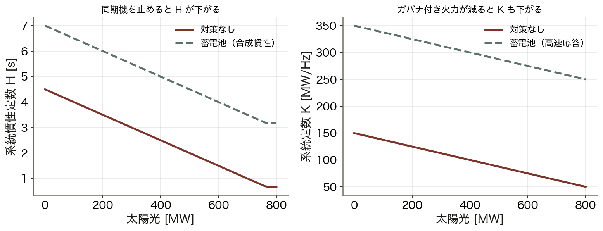

太陽光は「発電を増やす」だけでなく「系統の粘りを減らす」。だから量の議論には、必ず慣性の議論がついてくる。

<!-- note: H が下がると RoCoF が大きく（第8回）、t_cr が短く（第7回）なる。1 つの原因が 2 つの制約に効く。　図の要点：H：4.50 → 2.50 s（太陽光 400 MW）／K：150 → 100 MW/Hz／蓄電池を入れると両方を補える／周波数と安定度が同時に厳しくなる -->

---

<!-- _class: figure-story -->
<!-- source: コード/fig_ch15.py -->

# 周波数応答で確かめる

## 読み方｜120 MW 脱落時の周波数。太陽光が増えるほど深く落ちる

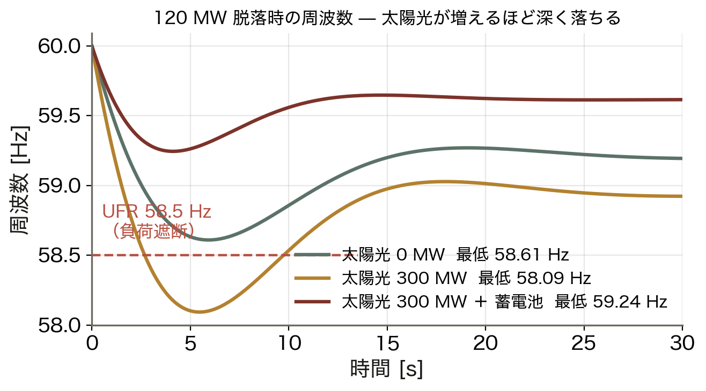

- 太陽光 0 MW：最低点は UFR の上
- 太陽光 300 MW：UFR を割る
- 蓄電池を足すと戻る
- 落ち方（RoCoF）も速くなる

周波数制約は「何 MW 入るか」を、動的シミュレーションで確かめて初めて言える。定常計算では足りない。

<!-- note: 第8回の 3 段応答モデルをそのまま使っている。慣性とガバナだけで、LFC が動く前の最低点を見ている。 -->

---

<!-- _class: figure-story -->
<!-- source: コード/fig_ch15.py -->

# 6 つを並べて、最小値を取る

## 読み方｜赤い棒が最も低い制約＝律速

- 電圧 800、線路容量 600、N-1 430 MW
- 周波数 **90 MW**（律速）
- 安定度 800、最低出力 300 MW
- 連系可能量は **90 MW**

電圧には 800 MW 分の余裕があるのに、答えは 90 MW。1 つの制約だけを見て「まだ入る」と判断してはいけない。

<!-- note: この簡略モデルでの値。実際の沖縄はもっと多く導入されているが、それは UFR 整定・予備力・出力制御を組み合わせているため。 -->

---

<!-- _class: kpi -->

# 律速は周波数

  90
  連系可能量 [MW]

  800
  電圧が許す上限 [MW]

  周波数
  律速している制約

<!-- note: 「電圧対策をしても 1 MW も増えない」ことを、この 3 つの数字で示す。 -->

---

<!-- _class: divider -->

# Ⅲ. 対策を打つ

## 律速から順に、1 枚ずつ

---

<!-- _class: figure-full -->
<!-- source: コード/fig_ch15.py -->

# どの対策がどの制約に効くか

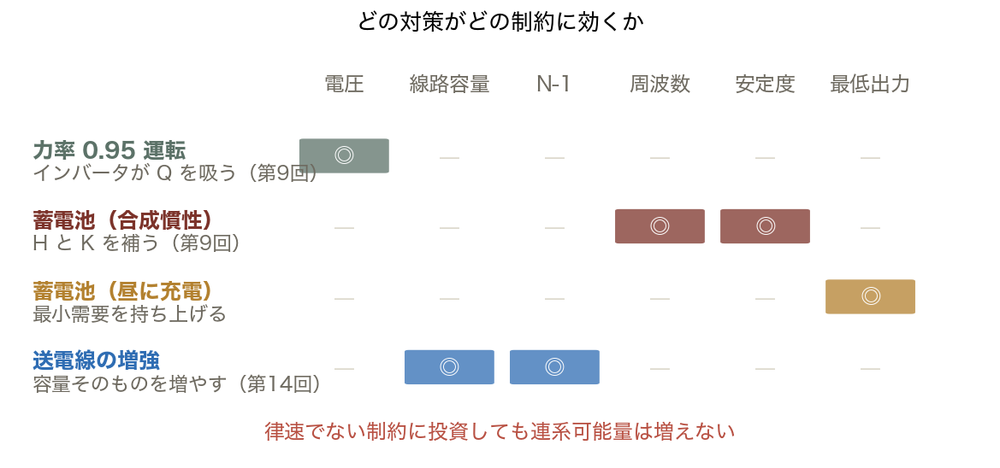

対策と制約の対応を先に描き、そのうえで「今の律速に効くもの」だけを選ぶ。それが投資の順番である。

<!-- note: 第9回の Volt-Var と合成慣性、第14回の送電線増強が、ここで 1 枚の表に統合される。　図の要点：力率 0.95：電圧だけ／蓄電池（合成慣性）：周波数と安定度／蓄電池（昼充電）：最低出力／送電線増強：線路容量と N-1 -->

---

<!-- _class: figure-full -->
<!-- source: コード/fig_ch15.py -->

# 対策を打つと律速が移る

力率対策は電圧の板を伸ばすが、答えは 1 MW も変わらない。律速に打って初めて連系可能量が増える。

<!-- note: 90 → 300 → 430 MW。1 つ対策するごとに次の律速が現れる。これが系統計画の実際の姿。　図の要点：対策なし：90 MW（律速 周波数）／力率 0.95：90 MW のまま（律速でない）／＋蓄電池（周波数）：300 MW（律速 最低出力）／＋昼充電：430 MW（律速 N-1） -->

---

<!-- _class: figure-story -->
<!-- source: コード/fig_ch15.py -->

# 火力の最低出力 — もう 1 つの壁

## 読み方｜正味需要（需要 − 太陽光）が最低出力を割ると太陽光を絞る

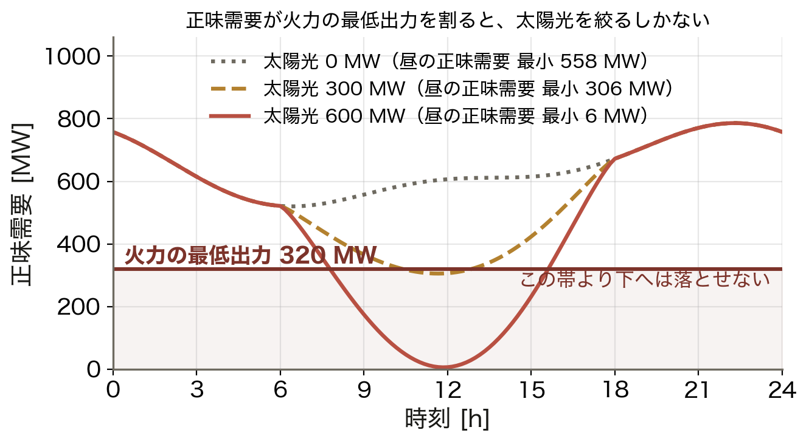

- 休日の最小需要は 520 MW
- 火力の最低出力 320 MW は止められない
- 太陽光 600 MW では正味需要が 6 MW に
- 昼に蓄電池を充電すれば需要を持ち上げられる

「太陽光を増やせば火力を止められる」は、最低出力と慣性の分だけ成り立たない。第10回の出力制御の正体。

<!-- note: 火力を止められないのは、慣性・電圧支持・予備力を担っているから。単なる「メンツ」ではない。 -->

---

<!-- _class: figure-full -->
<!-- source: コード/fig_ch15.py -->

# 蓄電池は何 MW 要るか

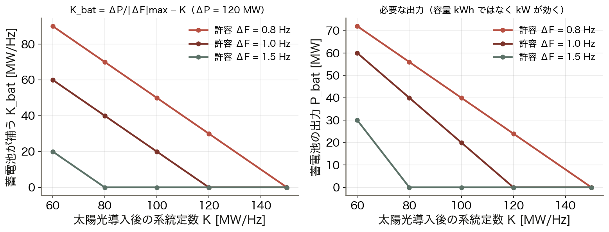

周波数対策の蓄電池は「大容量」ではなく「高速・高出力」が要る。kWh ではなく kW で設計する。

<!-- note: 数秒〜数十秒しか出さないので、蓄電容量（kWh）はごく小さくてよい。用途で設計が変わる好例。　図の要点：K_bat = ΔP / |ΔF|max − K／太陽光 400 MW で K = 100 MW/Hz／ΔF を 1.0 Hz に抑えるには +20 MW/Hz／出力にして 20 MW（容量ではなく出力） -->

---

<!-- _class: divider -->

# Ⅳ. 15 回のまとめ

## 道具と制約の対応

---

<!-- _class: figure-story -->
<!-- source: コード/fig_ch15.py -->

# この講義の全体像

## 読み方｜上が 4 日間の内容、下が今日の 6 制約。矢印が対応

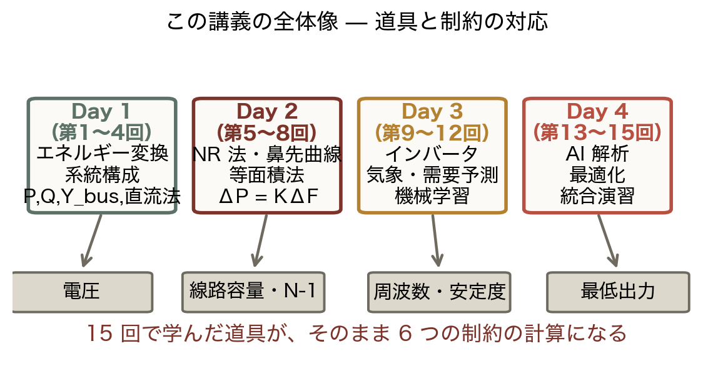

- Day 1・2 の物理が電圧・容量・周波数を計算する
- Day 3 の予測が「いつ厳しいか」を教える
- Day 4 の最適化が「どう配分するか」を決める
- 6 制約はそれらの総合問題

今日の 1 つの数字を出すために、14 回分の道具がすべて要る。これが系統工学の姿である。

<!-- note: 学生にここで「どの回の道具がどこで使われたか」を言わせると、講義全体が繋がる。 -->

---

<!-- _class: steps -->

# 例題 1 — 6 制約から連系可能量を出す

  1
  各制約の上限
  電圧 800、容量 600、N-1 430、周波数 90、安定度 800、最低出力 300 MW

  2
  最小値
  min = 90 MW。律速は周波数

  3
  対策を選ぶ
  周波数に効くのは蓄電池（合成慣性）。力率対策は効かない

  4
  次の律速
  周波数を伸ばすと 300 MW（最低出力）→ さらに伸ばすと 430 MW（N-1）

<!-- note: 学生に 2 と 4 を答えさせる。「次に何に投資すべきか」まで言えたら合格。 -->

---

<!-- _class: figure -->

# 動く図で試す — viz/island.html

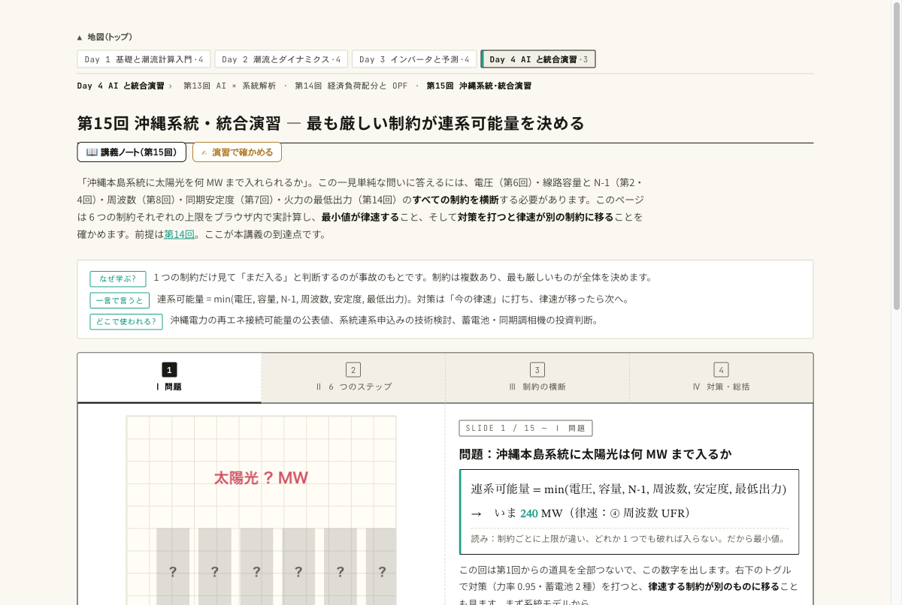

動く図 6 制約の同時計算と対策トグルをブラウザ内で実計算する 15 枚のスライド。

- 太陽光を 0 → 600 MW に動かし、6 本の棒のどれが最初に赤くなるか見る
- 力率 0.95 を ON にして、電圧の板だけ伸びて答えが変わらないのを確かめる
- 蓄電池を ON にして、律速が周波数から別の制約へ移るのを見る

---

<!-- _class: blocks -->

# なぜそう考えるか — 最小値・移る律速

  なぜ最小値なのか
  制約は「すべて満たす」もの。1 つでも破れば運用できないので、上限の集合の最小値が答えになる。

  なぜ対策で律速が移るのか
  対策は特定の板だけを伸ばす。伸ばした板が最小でなくなった瞬間、次に低い板が答えを決める。投資の順番は「今の律速」で決まる。

  1 つの制約だけ見ない
  電圧が余裕でも周波数で入らない。系統計画は 6 枚の板を同時に見る仕事である。

---

<!-- _class: figure-full -->
<!-- source: コード/fig_ch15.py -->

# よくある誤解 — 3 つとも「律速」を見落としている

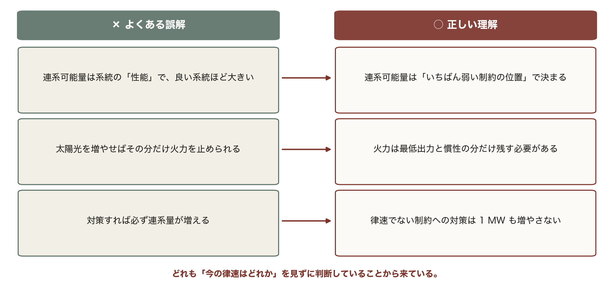

3 つとも根は同じ。連系可能量は「今いちばん弱い板」の高さで決まる。そこを見ずに投資や見通しを語ると、必ずこの 3 つのどれかに落ちる。

---

<!-- _class: takeaway -->

# 15 回で持ち帰る 3 点

P は角度、Q は電圧、周波数は系統全体。制約は最小値で効き、対策は律速から打つ

<li>潮流：Y_bus と電力方程式を NR 法で解き、電圧と潮流を読む（第3〜6回）</li>
<li>ダイナミクス：等面積法と ΔP = KΔF。慣性 H が時間の余裕を決める（第7〜9回）</li>
<li>予測と最適化：区間で予測し、λ を揃え、6 制約の最小値で連系可能量（第10〜15回）</li>

---

<!-- _class: end -->

# 第16回：最終試験（90 分）

演習 ex/ch15.html と viz/island.html で総復習

各回の「持ち帰る 3 点」と記号表（notes/symbols.html）を見直しておく
