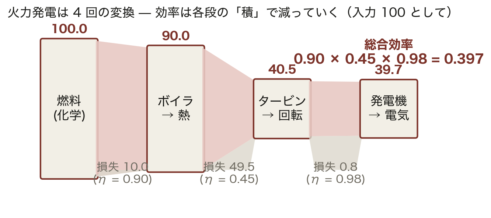
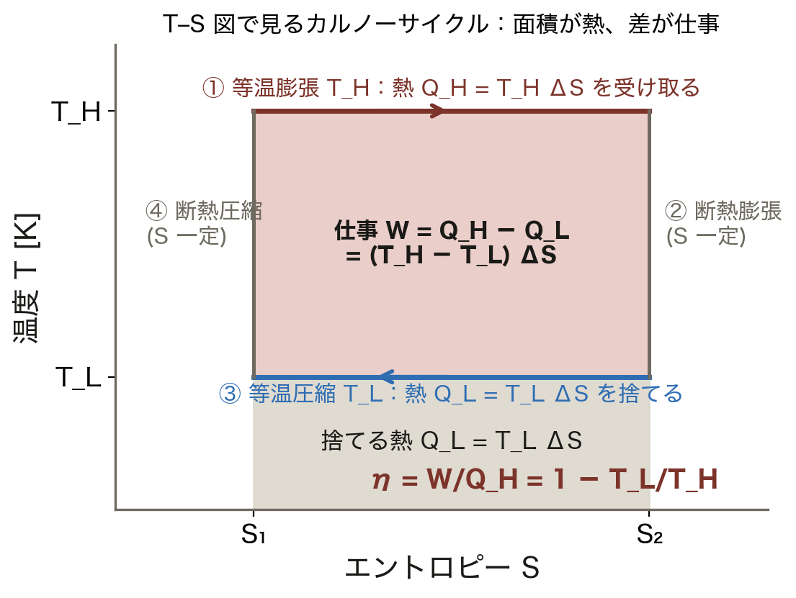
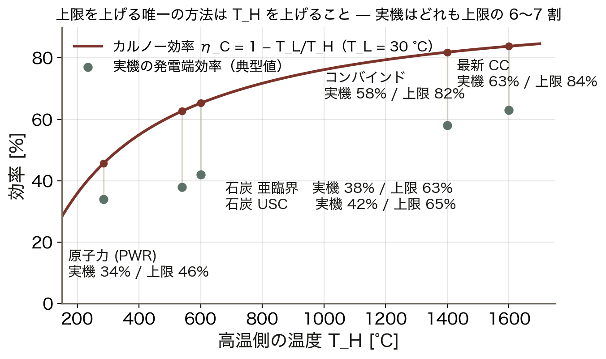
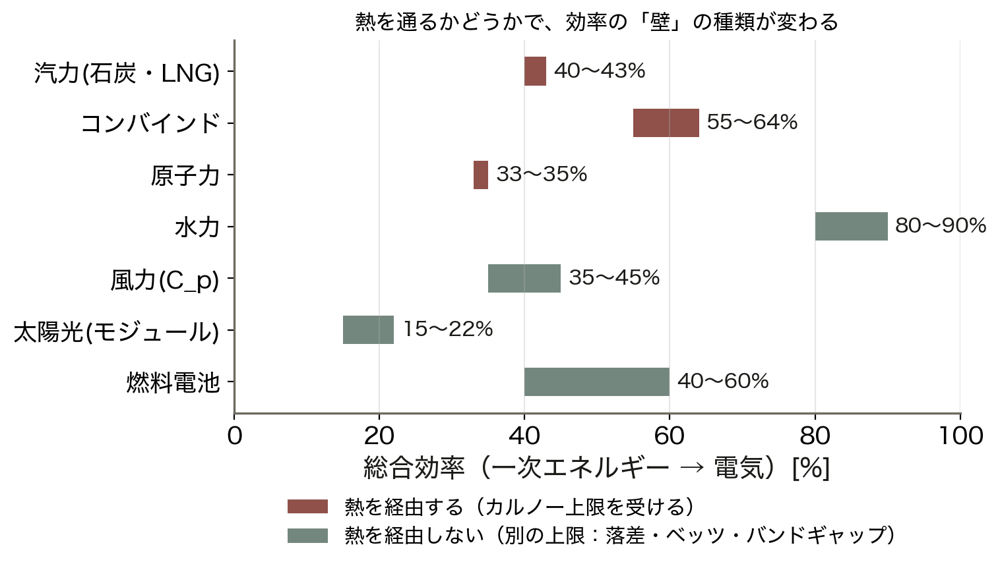
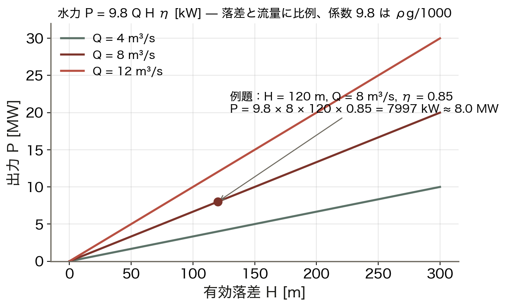
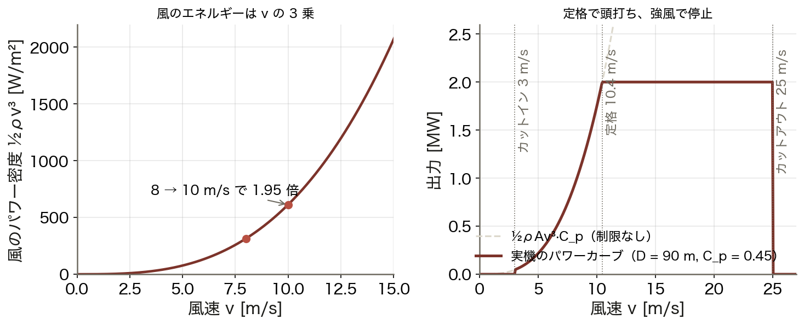
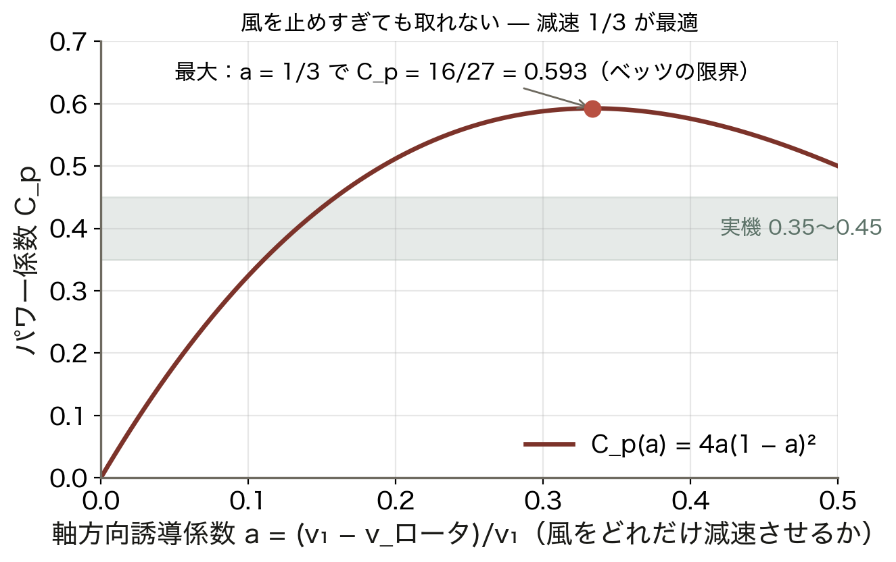
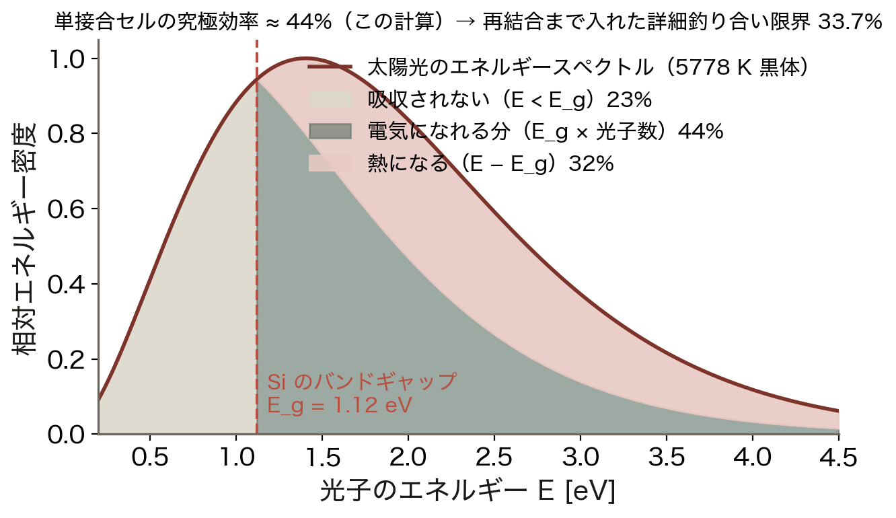
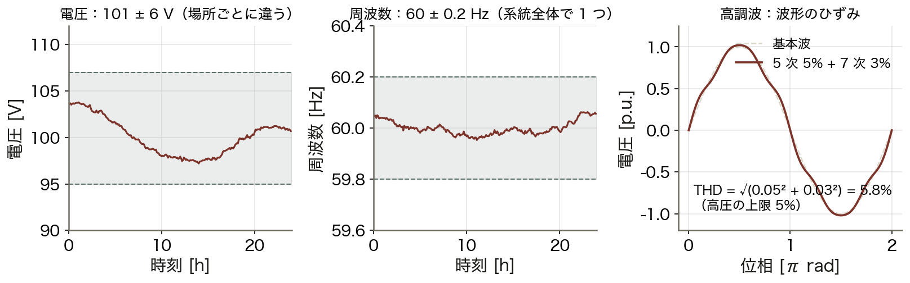
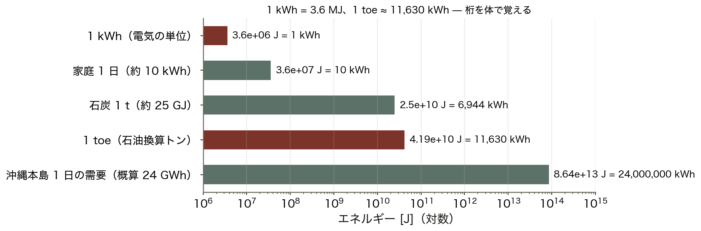

# 第1回: エネルギー変換の基礎

**Day 1 / コマ1** ｜ 電力エネルギーシステム解析の基礎と応用

> **教科書対応**: 加藤・田岡『電力システム工学の基礎』**第1章 電力システム**（pp.1–14）
> — 1.1 電気の流れと電力システム。本回はここに**エネルギー変換の熱力学的基礎**を補って構成する。

> **🖥 動くインフォグラフ**：[`viz/energy.html`](../viz/energy.html) — カルノー効率の壁と風速の3乗則。
> ブラウザで「次へ ▶」を押しながら、この回の核心を実計算で追えます（`index.html` から全回に飛べます）。


<!-- intuition:start（tools/sync-intuition.mjs が スライド/ch01.md から生成。直接編集せずスライドを直す）-->
> **✍ 演習**：[`ex/ch01.html`](../ex/ch01.html) — 学籍番号ごとに数値が変わる問題。採点・途中式つき。
> **📊 スライド**：`スライド/ch01.pptx`（講義用）

---

## まず直感で（3 分でつかむ）

> **📌 一言でいうと**：発電とは多段のエネルギー変換であり、総合効率は各段の効率の積で決まる。熱を通る道には、技術では越えられない物理の壁がある。

> **🪄 たとえ話：滝とバケツリレー**
>
> | 滝と水車 | 発電 |
> |:--|:--|
> | 水車が取り出せるのは **落差の分** だけ | 落差＝**温度差 T_H − T_L** |
> | 落差が大きいほど取り出せる | 高温化＝効率向上（コンバインド） |
> | 下の川面より下には落とせない | 下の川面＝**環境温度 T_L**（捨てる熱） |
> | バケツリレーは 1 人ずつ **少しこぼす** | 各段の損失＝ボイラ・タービン・発電機 |
> | 最後に残る水＝全員のこぼし残しの積 | 総合効率＝**各段の効率の積** |
>
> 崩れる点：水は下流に残るが、捨てた熱は二度と仕事に戻らない（熱力学第二法則）。だから「熱を通る道」にだけ上限がある。

> **📰 事例：2011年 東日本大震災の後**
> 原子力の停止で火力（LNG・石炭・石油）への依存が **約9割** に上がり、燃料の輸入額が年に数兆円規模で増えた。発電効率 1 ポイントの差が、そのまま燃料費と CO₂ の差になる。

> **📰 事例：沖縄本島の電源構成**
> 石炭・LNG・石油火力が中心で、他地域との連系線がない。燃料の調達と効率が電気料金に直結し、太陽光を増やすほど「回転機が減る」問題（第8回の慣性）が前に出てくる。

> **🤔 この回の式で読むと**：今日の式 η_total = Π η_i と η_C = 1 − T_L/T_H で、この 2 つの話がどちらも読める。効率の話は「環境の話」である前に「お金の話」。

> **🤔 なぜ効率は「積」なのか**
> 変換が直列だから。前段の出力がそのまま次段の入力になる。並列なら足し算、直列なら掛け算。

> **🤔 なぜ絶対温度なのか**
> η_C は温度の「比」で決まる。比が意味を持つのは絶対零度を 0 とする尺度だけ。°C のまま 1 − 30/1400 と計算すると 0.98 になり、物理的に無意味。

> **⚠ 壁は 3 種類**
> 熱を通る方式はカルノー（温度の比）、流体はベッツ（速度の比）、光はバンドギャップ（光子のエネルギー）。

**この回の地図**：Ⅰ エネルギー保存則と第二法則 — 効率に上限がある理由 → Ⅱ 発電方式を「変換の連鎖」として統一的に見る → Ⅲ 理論限界 — カルノー効率とベッツの限界 → Ⅳ 電力品質の 3 指標と単位換算（W・Wh・J・toe）

<!-- intuition:end -->
---

## 1.1 導入

### 学習目標

この回を終えると、次のことができるようになる。

1. エネルギー保存則と熱力学第二法則から、**発電効率に上限がある理由**を説明できる。
2. 火力・水力・原子力・再生可能エネルギーの各発電方式を、**エネルギー変換の連鎖**として統一的に記述できる。
3. 電力品質の3指標（電圧・周波数・高調波）が**何を守るための指標か**を説明できる。
4. 発電量・エネルギー量の単位（W, Wh, J, toe）を相互換算できる。

### 前提知識

- 高校物理のエネルギー保存則、電磁誘導
- 交流回路の基礎（実効値、複素数表示）

本講義は全16コマを通して「**発電 → 輸送 → 消費**」という電力の流れを追う。
第1回はその出発点である**エネルギー変換**を扱う。

---

## 1.2 理論

### 1.2.1 エネルギー変換の連鎖

発電とは、一次エネルギーを電気エネルギーに変換する多段のプロセスである。

```
一次エネルギー → 熱 → 機械（回転） → 電気
   (燃料)      (ボイラ)  (タービン)   (発電機)
```

各段の効率を $\eta_1, \eta_2, \eta_3$ とすると、総合効率は積で表される。

$$\eta_\text{total} = \eta_1 \cdot \eta_2 \cdot \eta_3$$

**ここが重要**: 効率は「かけ算」なので、**一箇所でも低い段があると全体が引きずられる**。
火力発電の総合効率が 40% 程度に留まる主因は、次に見る熱→機械の変換段にある。

<!-- fig:ch01_chain.png -->

*図 1.1　火力発電の変換連鎖。入力を 100 とすると 90 → 40.5 → 39.7 と減り、総合効率は各段の効率の積 0.397 になる。最も大きく失うのは熱→回転の段で、ここにカルノーの壁がある。*
<!-- /fig -->

### 1.2.2 カルノー効率 — なぜ火力発電は40%なのか

熱機関が高温熱源 $T_H$ \[K\] から熱を受け取り、低温熱源 $T_L$ \[K\] に捨てるとき、
熱力学第二法則が定める効率の上限が**カルノー効率**である。

$$\eta_\text{Carnot} = 1 - \frac{T_L}{T_H}$$

**導出のポイント**（可逆サイクルのエントロピー収支）:

可逆サイクルでは1周でエントロピーが元に戻るので、
$$\frac{Q_H}{T_H} = \frac{Q_L}{T_L}$$

エネルギー保存則より取り出せる仕事は $W = Q_H - Q_L$ だから、

$$\eta = \frac{W}{Q_H} = \frac{Q_H - Q_L}{Q_H} = 1 - \frac{Q_L}{Q_H} = 1 - \frac{T_L}{T_H}$$

**数値例**: 主蒸気温度 566 °C（839 K）、復水器 33 °C（306 K）の超臨界圧火力では

$$\eta_\text{Carnot} = 1 - \frac{306}{839} = 0.635$$

実機の効率が 40% 程度なのは、この 63.5% という**理論上限**にさらに
機械損・発電機損・所内動力が乗るためである。

> **コンバインドサイクルが効率を上げる仕組み**
> ガスタービン（$T_H \approx 1600$ °C）の排熱で蒸気タービンを回す。
> 高い $T_H$ を使えるため $\eta_\text{Carnot}$ が上がり、総合効率 60% 超を達成する。
> 「捨てる熱を減らす」のではなく「**より高い温度から熱を取る**」のが本質。

<!-- fig:ch01_carnot_ts.png -->

*図 1.2　T–S 図で見るカルノーサイクル。受け取る熱 Q_H = T_H ΔS と捨てる熱 Q_L = T_L ΔS の差が仕事で、比を取ると η = 1 − T_L/T_H。温度は絶対温度。*
<!-- /fig -->

<!-- fig:ch01_carnot_curve.png -->

*図 1.3　カルノー効率の曲線（T_L = 30 °C）と実機の発電端効率。原子力は T_H が低いため上限が 46% と低く、コンバインドサイクルは 1,400 °C 以上の高温から取るため上限 82% に達する。どの方式も上限の 6〜7 割で動いている。*
<!-- /fig -->

### 1.2.3 発電方式ごとの変換経路

| 方式 | 変換経路 | 総合効率の目安 | カルノー制約 |
|:---|:---|:--:|:--:|
| 汽力（石炭・LNG） | 化学 → 熱 → 機械 → 電気 | 40〜43% | 受ける |
| コンバインドサイクル | 化学 → 熱 → 機械 → 電気（2段） | 55〜64% | 受ける |
| 原子力（PWR/BWR） | 核 → 熱 → 機械 → 電気 | 33〜35% | 受ける（$T_H$ が低い） |
| 水力 | 位置 → 運動 → 機械 → 電気 | 80〜90% | **受けない** |
| 風力 | 運動 → 機械 → 電気 | 35〜45% | **受けない**（別の上限あり） |
| 太陽光 | 光 → 電気（直接） | 15〜22% | **受けない**（別の上限あり） |
| 燃料電池 | 化学 → 電気（直接） | 40〜60% | **受けない** |

**ここが重要**: 水力・風力・太陽光・燃料電池は熱を経由しないため、
カルノー効率の制約を受けない。原子力の効率が火力より低いのは技術が劣るからではなく、
燃料被覆管の健全性から蒸気温度を約 280 °C に抑える必要があり、$T_H$ が低いためである。

<!-- fig:ch01_methods.png -->

*図 1.4　発電方式ごとの総合効率。熱を経由する方式（赤）はカルノー上限を受け、経由しない方式（緑）は落差・ベッツ・バンドギャップという別の上限を持つ。*
<!-- /fig -->

### 1.2.4 水力発電の出力式

有効落差 $H$ \[m\]、流量 $Q$ \[m³/s\]、総合効率 $\eta$ のとき、発電出力 $P$ \[kW\] は

$$P = 9.8\, Q H \eta$$

**導出**: 単位時間に落下する水の質量は $\rho Q = 1000Q$ \[kg/s\]。
その位置エネルギーの減少率は $\rho Q g H = 1000 \times 9.8 \times QH$ \[W\] $= 9.8QH$ \[kW\]。
これに効率を掛ける。係数 9.8 は $\rho g / 1000$ に由来する。

<!-- fig:ch01_hydro.png -->

*図 1.5　水力の出力 P = 9.8QHη。落差と流量に比例する。例題（H = 120 m、Q = 8 m³/s、η = 0.85）は 7,997 kW ≈ 8.0 MW。*
<!-- /fig -->

### 1.2.5 風力発電とベッツの限界

受風面積 $A$ \[m²\]、空気密度 $\rho$ \[kg/m³\]、風速 $u_w$ \[m/s\] のとき、
風が持つ運動エネルギーの流量は

$$P_\text{wind} = \frac{1}{2}\rho A u_w^3$$

**風速の3乗に比例する**ことが決定的に重要である。風速が2倍になれば出力は8倍になる。
第10回で風力発電量の予測を扱うが、この非線形性が予測を難しくしている。

ただし風のエネルギーを全て取り出すことはできない（取り出しきると風が止まり、
後続の空気が流れ込めない）。理論上の最大取り出し割合が**ベッツの限界**である。

$$C_p^\text{max} = \frac{16}{27} \approx 0.593$$

実際の風車のパワー係数 $C_p$ は 0.35〜0.45 程度。

$$P = \frac{1}{2}\rho A u_w^3 C_p$$

<!-- fig:ch01_wind.png -->

*図 1.6　左：風のパワー密度は風速の 3 乗（8 → 10 m/s で 1.95 倍）。右：直径 90 m・C_p = 0.45 の風車のパワーカーブ。カットイン 3 m/s、定格 10.4 m/s で 2 MW に頭打ち、25 m/s で停止。*
<!-- /fig -->

<!-- fig:ch01_betz.png -->

*図 1.7　運動量理論から得られる C_p = 4a(1 − a)²。風を 1/3 だけ減速させたとき最大 16/27 = 0.593（ベッツの限界）。実機は 0.35〜0.45。*
<!-- /fig -->

### 1.2.6 太陽光発電とショックレー・クワイサー限界

単接合シリコン太陽電池の理論変換効率の上限は約 **33.7%**（ショックレー・クワイサー限界）。
バンドギャップ $E_g$ より小さいエネルギーの光子は吸収されず、
大きすぎる光子は余剰分が熱になるため、原理的に大部分が失われる。

実用結晶シリコンセルの効率は 20% 前後、モジュールでは 15〜22%。

<!-- fig:ch01_pv_spectrum.png -->

*図 1.8　太陽光のエネルギースペクトル（5778 K 黒体）と Si のバンドギャップ 1.12 eV。E_g 未満の光子は吸収されず（23%）、E_g を超える分は熱になる（32%）。残り 44% が究極効率で、再結合まで考えた詳細釣り合いの限界が 33.7%。*
<!-- /fig -->

### 1.2.7 電力品質の3指標

電力は「同じ品質のものが届く」ことを前提に機器が設計されている。
品質を規定する主要3指標は次のとおり。

| 指標 | 日本の基準 | 崩れると何が起きるか | 主な原因 |
|:---|:---|:---|:---|
| **電圧** | 101±6 V / 202±20 V（低圧） | 機器の焼損・トルク不足・照明のちらつき | 需要変動、太陽光の逆潮流 |
| **周波数** | 東 50 Hz / 西・沖縄 60 Hz、偏差 ±0.2 Hz 程度 | 同期機の脱調、時計の狂い、最悪は広域停電 | **需給バランスの崩れ** |
| **高調波** | 総合電圧歪率 5% 以下（高圧） | コンデンサ過熱、機器の誤動作 | インバータ等の非線形負荷 |

**ここが重要**: 電圧は**局所的**な量（母線ごとに違う）だが、
**周波数は系統全体で共通**の量である。この違いが第8回の周波数制御の出発点になる。

- 電圧が下がる → その地域の無効電力 $Q$ が足りない（第3回、第4回）
- 周波数が下がる → 系統全体で有効電力 $P$ が足りない（第8回）

<!-- fig:ch01_quality.png -->

*図 1.9　電力品質の 3 指標。電圧は場所ごとに違い 101 ± 6 V の範囲で動く。周波数は系統全体で 1 つの値で 60 ± 0.2 Hz。高調波は基本波に 5 次 5%・7 次 3% が重なると THD 5.8% になり高圧の上限 5% を超える。*
<!-- /fig -->

### 1.2.8 単位の換算

| 量 | 記号 | 関係 |
|:---|:---|:---|
| 仕事率（電力） | W | 1 W = 1 J/s |
| エネルギー | Wh | 1 kWh = 3.6 MJ |
| 石油換算 | toe | 1 toe = 41.868 GJ ≈ 11,630 kWh |
| 熱量 | cal | 1 cal = 4.186 J |

**発電端と送電端**: 発電機の出力を**発電端**、所内動力（ポンプ・ファン等、
発電端の 3〜7%）を差し引いたものを**送電端**という。効率を比較するときは
どちらの定義かを必ず確認すること。

<!-- fig:ch01_units.png -->

*図 1.10　エネルギーの単位はしご（対数）。1 kWh = 3.6 MJ、1 toe ≈ 41.9 GJ ≈ 11,630 kWh。沖縄本島の 1 日の需要（概算 24 GWh）は 1 kWh の 2 千万倍以上。*
<!-- /fig -->

---

## 1.3 シミュレーション

### 1.3.1 カルノー効率と実効率の比較

```python
"""第1回 デモ1: 発電方式ごとの効率比較"""
import numpy as np
import matplotlib.pyplot as plt

plt.rcParams['font.family'] = ['Hiragino Sans', 'Yu Gothic', 'DejaVu Sans']

# (方式名, 高温側[degC], 低温側[degC], 実効率)
plants = [
    ("汽力(超臨界)",       566, 33, 0.42),
    ("コンバインドサイクル", 1600, 33, 0.62),
    ("原子力(PWR)",        325, 33, 0.34),
]

names, carnot, actual = [], [], []
for name, t_h, t_l, eta in plants:
    T_H, T_L = t_h + 273.15, t_l + 273.15
    names.append(name)
    carnot.append(1 - T_L / T_H)
    actual.append(eta)

x = np.arange(len(names))
fig, ax = plt.subplots(figsize=(8, 4.5))
ax.bar(x - 0.2, carnot, 0.4, label="カルノー効率（理論上限）", color="#8ecae6")
ax.bar(x + 0.2, actual, 0.4, label="実機の総合効率", color="#fb8500")
for i, (c, a) in enumerate(zip(carnot, actual)):
    ax.text(i - 0.2, c + 0.01, f"{c:.1%}", ha="center", fontsize=9)
    ax.text(i + 0.2, a + 0.01, f"{a:.1%}", ha="center", fontsize=9)
ax.set_xticks(x); ax.set_xticklabels(names)
ax.set_ylabel("効率"); ax.set_ylim(0, 1.0)
ax.set_title("理論上限と実機効率の差")
ax.legend(); ax.grid(axis="y", alpha=0.3)
plt.tight_layout()
plt.savefig("../図/ch01_carnot.png", dpi=150)
print("カルノー効率:", [f"{c:.3f}" for c in carnot])
```

**読み取ってほしいこと**: 実効率はどの方式もカルノー効率の 55〜65% 程度に収まる。
つまり「理論上限に対してどれだけ迫れているか」は方式によらずほぼ一定であり、
**総合効率の差は主に $T_H$ の差から来ている**。

### 1.3.2 風力の3乗則とベッツの限界

```python
"""第1回 デモ2: 風速-出力特性"""
import numpy as np
import matplotlib.pyplot as plt

rho = 1.225        # 空気密度 [kg/m^3]
D   = 90.0         # ロータ直径 [m]
A   = np.pi * (D / 2) ** 2
Cp  = 0.45         # パワー係数
BETZ = 16 / 27

u = np.linspace(0, 25, 300)
P_wind = 0.5 * rho * A * u**3 / 1e6          # 風の全エネルギー [MW]
P_betz = P_wind * BETZ                        # ベッツ限界 [MW]
P_real = P_wind * Cp                          # 実際の取り出し [MW]

# 実機は定格出力で頭打ち（ピッチ制御）、カットイン/カットアウトあり
P_rated, u_in, u_out = 3.0, 3.0, 25.0
P_turbine = np.clip(P_real, 0, P_rated)
P_turbine[(u < u_in) | (u > u_out)] = 0.0

fig, ax = plt.subplots(figsize=(8, 4.5))
ax.plot(u, P_wind, "--", label="風の全エネルギー ($u^3$ に比例)")
ax.plot(u, P_betz, "--", label=f"ベッツの限界 ({BETZ:.3f})")
ax.plot(u, P_turbine, lw=2.5, label=f"実機 ($C_p$={Cp}, 定格{P_rated} MW)")
ax.axvline(u_in, color="gray", ls=":"); ax.axvline(u_out, color="gray", ls=":")
ax.text(u_in, 8, " カットイン", fontsize=9); ax.text(u_out - 4, 8, "カットアウト ", fontsize=9)
ax.set_xlabel("風速 $u_w$ [m/s]"); ax.set_ylabel("出力 [MW]")
ax.set_ylim(0, 10); ax.set_title("風力発電の出力特性")
ax.legend(); ax.grid(alpha=0.3)
plt.tight_layout()
plt.savefig("../図/ch01_wind.png", dpi=150)

for us in [5, 10, 12, 15]:
    p = min(0.5 * rho * A * us**3 * Cp / 1e6, P_rated)
    print(f"風速 {us:2d} m/s → 出力 {p:.2f} MW")
```

### 1.3.3 対応する MATLAB コード（参考）

```matlab
% 第1回: 水力発電の出力計算
Q   = 12.0;    % 流量 [m^3/s]
H   = 85.0;    % 有効落差 [m]
eta = 0.87;    % 総合効率
P = 9.8 * Q * H * eta;
fprintf('発電出力: %.1f kW (%.2f MW)\n', P, P/1000);

% 年間発電電力量（設備利用率 45%）
E = P * 8760 * 0.45 / 1000;   % [MWh]
fprintf('年間発電量: %.0f MWh\n', E);
```

---

## 1.4 例題

### 例題 1-1（水力発電）

有効落差 85 m、使用水量 12 m³/s、水車効率 0.90、発電機効率 0.97 の水力発電所がある。

1. 発電端出力 \[MW\] を求めよ。
2. 設備利用率 45% として年間発電電力量 \[MWh\] を求めよ。

**解答**

**(1)** 総合効率は $\eta = 0.90 \times 0.97 = 0.873$。

$$P = 9.8 \times 12 \times 85 \times 0.873 = 8727\ \text{kW} = \boxed{8.73\ \text{MW}}$$

**(2)** 年間時間数は $365 \times 24 = 8760$ h。

$$E = 8.73 \times 8760 \times 0.45 = \boxed{34{,}400\ \text{MWh}}$$

### 例題 1-2（カルノー効率）

主蒸気温度 600 °C、復水器温度 30 °C の汽力発電所がある。

1. カルノー効率を求めよ。
2. 実際の送電端効率が 43% であった。カルノー効率に対する達成率を求めよ。
3. この発電所を出力 500 MW で 1 年間（設備利用率 70%）運転したときの
   投入熱量 \[GJ\] を求めよ。

**解答**

**(1)** $T_H = 873.15$ K、$T_L = 303.15$ K。

$$\eta_\text{Carnot} = 1 - \frac{303.15}{873.15} = \boxed{0.653}$$

**(2)** $0.43 / 0.653 = \boxed{0.659}$（65.9%）

**(3)** 年間発電電力量は
$$E = 500 \times 8760 \times 0.70 = 3.066 \times 10^6\ \text{MWh}$$

$1\ \text{MWh} = 3.6\ \text{GJ}$ なので、出力エネルギーは $3.066\times10^6 \times 3.6 = 1.104\times10^7$ GJ。
効率 43% で割ると

$$Q_\text{in} = \frac{1.104 \times 10^7}{0.43} = \boxed{2.57 \times 10^7\ \text{GJ}}$$

### 例題 1-3（風力の3乗則）

ロータ直径 90 m、パワー係数 $C_p = 0.45$、空気密度 1.225 kg/m³ の風車がある。

1. 風速 10 m/s のときの出力 \[MW\] を求めよ。
2. 風速が 12 m/s に増えたとき、出力は何倍になるか。

**解答**

**(1)** 受風面積 $A = \pi (45)^2 = 6362$ m²。

$$P = \tfrac{1}{2} \times 1.225 \times 6362 \times 10^3 \times 0.45 = 1.754 \times 10^6\ \text{W} = \boxed{1.75\ \text{MW}}$$

**(2)** 出力は $u_w^3$ に比例するので

$$\left(\frac{12}{10}\right)^3 = \boxed{1.728\ \text{倍}}$$

風速が 20% 増えるだけで出力が 73% 増える。この鋭敏さが第10回の予測課題につながる。

---

## 1.5 演習問題

### 基礎問題

**問 1-1** 次の各発電方式について、エネルギー変換の経路を
「◯◯エネルギー → △△エネルギー → …」の形で書き、
カルノー効率の制約を受けるかどうかを答えよ。
(a) 石炭火力　(b) 揚水発電（発電時）　(c) 太陽光　(d) 地熱

**問 1-2** 有効落差 120 m、使用水量 8 m³/s、総合効率 0.85 の水力発電所の
発電端出力 \[MW\] を求めよ。

**問 1-3** 定格出力 2.0 MW の風車が、風速 8 m/s で 0.85 MW を発電した。
風速が 11 m/s になったときの出力を推定せよ。定格を超える場合は定格値で頭打ちとすること。

### 応用問題

**問 1-4** ガスタービン入口温度 1400 °C、排熱回収ボイラを経た蒸気タービンの
復水器温度 32 °C のコンバインドサイクル発電所がある。

(a) 全体を1つの熱機関とみなしたときのカルノー効率を求めよ。
(b) 実際の総合効率が 61% のとき、カルノー効率に対する達成率を求めよ。
(c) 同じ復水器温度で、蒸気タービン単独（主蒸気 566 °C）の場合と比較し、
   コンバインドサイクルが高効率である理由を 100 字程度で説明せよ。

**問 1-5** ある離島の系統（定格 60 Hz）に、定格出力 5 MW のディーゼル発電機 3 台と
出力 4 MW の太陽光発電が接続されている。ある晴天日の正午、需要が 9 MW、
太陽光出力が 4 MW であった。

(a) ディーゼル発電機が分担すべき出力の合計 \[MW\] を求めよ。
(b) 突然雲がかかり、太陽光出力が 10 秒間で 4 MW → 1 MW に低下した。
   このとき系統周波数はどちらに動くか、理由とともに答えよ。
(c) (b) の状況で電力品質の3指標のうち、最も速く・最も広範囲に影響が出るのはどれか。
   理由を述べよ。

> 問 1-5 は第8回（受給バランスと周波数制御）の予告を兼ねている。
> 定量的に解けなくてよい。**どちらに動くか**と**なぜか**が答えられれば十分である。

---

## 1.6 まとめ

### キーポイント

- 発電は**多段のエネルギー変換**であり、総合効率は各段の効率の**積**になる。
- 熱を経由する方式（火力・原子力）は**カルノー効率 $\eta = 1 - T_L/T_H$ の上限**を受ける。
  効率を上げる王道は $T_H$ を上げること。コンバインドサイクルはこれを実践したもの。
- 水力・風力・太陽光はカルノー制約を受けないが、**別の理論限界**を持つ。
  風力はベッツの限界 16/27 ≈ 59.3%、単接合太陽電池は約 33.7%。
- 風力出力は**風速の3乗**に比例する。この非線形性が予測を難しくする（→ 第10回）。
- 電力品質の3指標のうち、**電圧は局所量・周波数は系統全体の共通量**。
  電圧不足は無効電力 $Q$ の不足、周波数低下は有効電力 $P$ の不足を意味する。

### 次回への橋渡し

第1回では「電気をどう作るか」を見た。第2回では作った電気を
**どう運ぶか** — 発電・送電・変電・配電の階層構造を扱う。
なぜ超高電圧で送るのか、なぜ交流なのか、という問いに答えていく。

第1回で導入した「電圧は局所量」という視点は、第3回の等価回路、
第4回の潮流計算へと直結する。ここを押さえておくこと。
