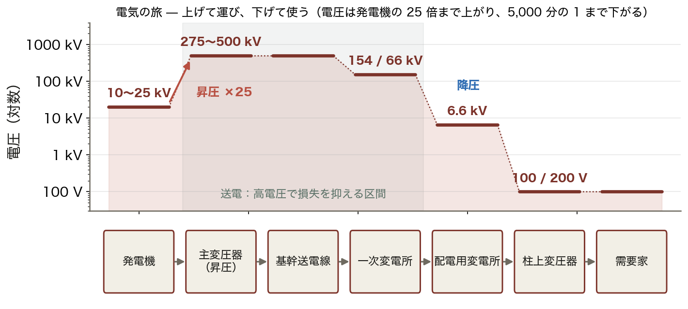
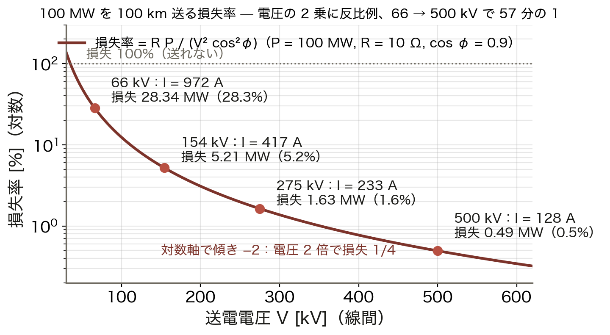
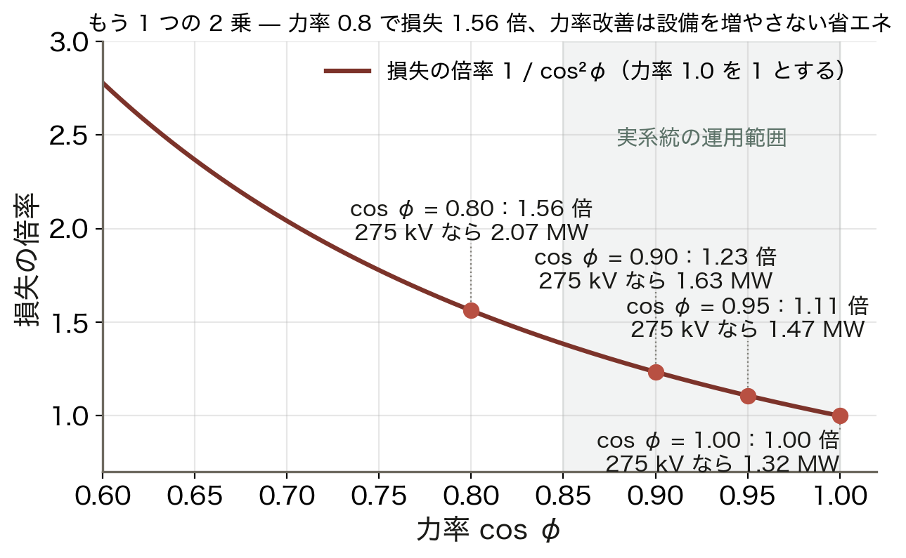
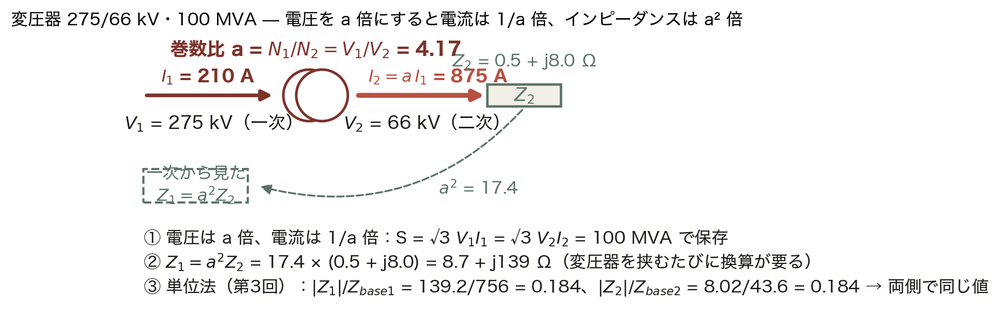
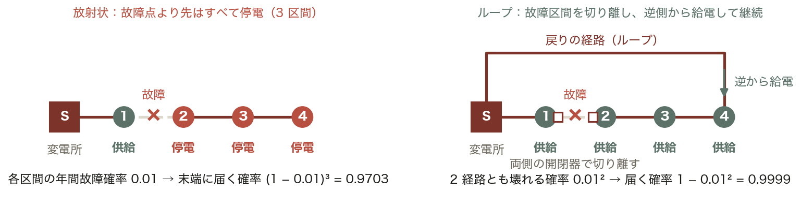
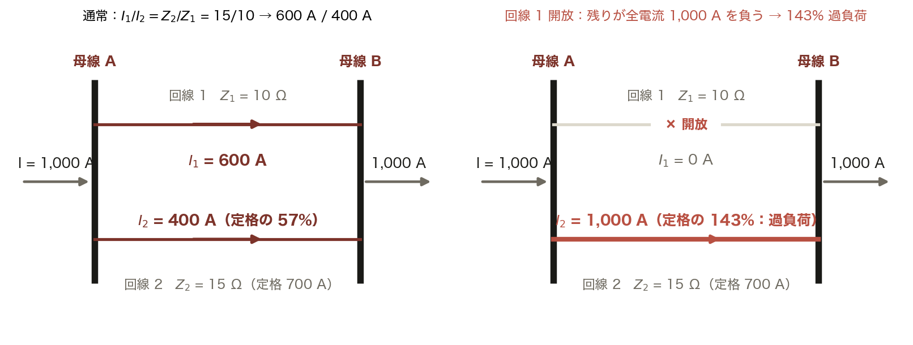
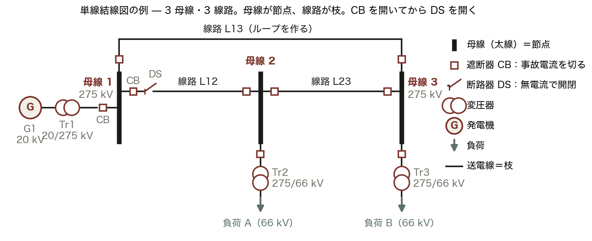
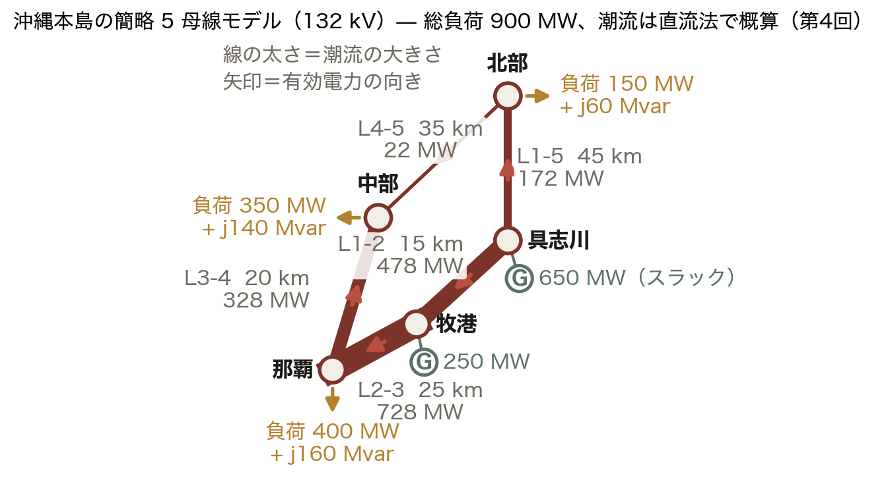
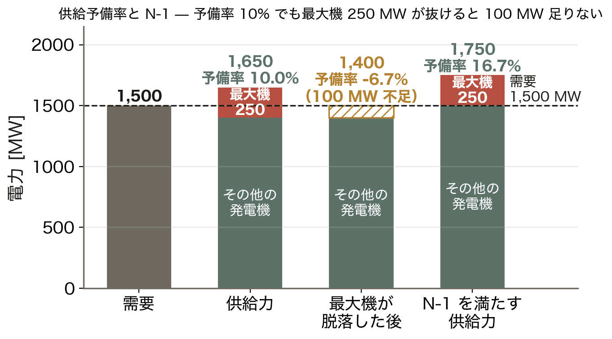

# 第2回: 電力システムの構成

**Day 1 / コマ2** ｜ 電力エネルギーシステム解析の基礎と応用

> **教科書対応**: 加藤・田岡『電力システム工学の基礎』**第1章 電力システム**（pp.1–14）
> — 1.1 電気の流れ（図1.1 日本の電力システム、図1.2 電気の流れ）、1.2 歴史、1.3 最近の動向

> **🖥 動くインフォグラフ**：[`viz/grid.html`](../viz/grid.html) — 損失は電圧の2乗に反比例、放射状vsループ。
> ブラウザで「次へ ▶」を押しながら、この回の核心を実計算で追えます（`index.html` から全回に飛べます）。


<!-- intuition:start（tools/sync-intuition.mjs が スライド/ch02.md から生成。直接編集せずスライドを直す）-->
> **✍ 演習**：[`ex/ch02.html`](../ex/ch02.html) — 学籍番号ごとに数値が変わる問題。採点・途中式つき。
> **📊 スライド**：`スライド/ch02.pptx`（講義用）

---

## まず直感で（3 分でつかむ）

> **📌 一言でいうと**：電力系統は「昇圧して運び、降圧して使う」階層構造。送電損失は電圧の 2 乗に反比例するから、高い電圧で運ぶ。母線が節点、線路が枝で、電流は経路を選ばずインピーダンスの逆比で分かれる。

> **🪄 たとえ話：高速道路と生活道路**
>
> | 道路 | 電力系統 |
> |:--|:--|
> | 高速道路は少ない車線で **大量輸送** | 超高圧送電線（275〜500 kV） |
> | IC で降りて生活道路へ | 変電所で **降圧**（154 → 66 → 6.6 kV） |
> | 交差点で道が分かれる | 交差点＝**母線（bus）** |
> | 渋滞の摩擦で燃料を失う | 摩擦＝**送電損失 3I²R** |
> | 車の台数が多いほど摩擦は増える | 台数＝**電流 I**。電圧を上げて台数を減らす |
>
> 崩れる点：車は経路を選ぶが、電流は選ばない。並列する全経路に、インピーダンスの逆比で勝手に分かれる。

> **📰 事例：2003年8月 北米北東部大停電**
> 送電線が樹木に接触して停止、警報システムの不具合で運用者が気づかず、潮流が他の線路へ移って次々に過負荷停止。**約 5,000 万人** が停電した。網目状の系統では 1 本の停止が「再配分」を起こす。今日の Ⅲ で、その再配分を 2 回線の数値で追う。

> **📰 事例：2011年 東西の周波数の壁**
> 日本は東 50 Hz・西 60 Hz に分かれ、間をつなぐ周波数変換設備の容量は当時約 100 万 kW。震災後、西から東へ十分に融通できなかった。現在は約 210 万 kW に増強されている。「つながっていれば助け合える」の裏返しで、つながっていない沖縄には融通そのものがない。

> **🤔 この回の式で読むと**：沖縄は他地域と連系線がなく、この「融通」がそもそも存在しない。第8回で効いてくる。

> **🤔 なぜ交流が主流なのか**
> 変圧器で電圧を自在に上げ下げできるから。損失を下げるには高電圧、使うには低電圧。この両立は変圧器なしには成り立たない。

> **🤔 なぜ 50 Hz と 60 Hz に分かれたのか**
> 明治期に東京はドイツ製、大阪は米国製の発電機を導入した歴史の名残。統一の費用が大きく、変換設備でつないでいる。

> **⚠ 直流送電（HVDC）の出番**
> 変圧は苦手だが、長距離（架空線 600 km・ケーブル 50 km 超）・海底ケーブル・非同期連系では有利。北海道–本州、紀伊水道はこれ。

**この回の地図**：Ⅰ 発電 → 送電 → 変電 → 配電 の階層と電圧レベル → Ⅱ 損失の式 — なぜ高電圧か、を数字で → Ⅲ 単線結線図の読み方 — 母線・線路・変圧器・遮断器と分流 → Ⅳ 日本の系統（50/60 Hz、連系線）と沖縄の独自性

<!-- intuition:end -->
---

## 2.1 導入

### 学習目標

1. 発電・送電・変電・配電の**階層構造**を、電圧レベルとともに説明できる。
2. **なぜ高電圧で送電するのか**を送電損失の式から定量的に説明できる。
3. 単線結線図（single-line diagram）を読み、母線・線路・変圧器・遮断器を identify できる。
4. 日本の電力系統の特徴（50/60 Hz 分断、連系線）と、**沖縄系統の独自性**を説明できる。
5. 系統構成（放射状・ループ・網目）と信頼度の関係を説明できる。

### 前提知識（第1回との接続）

第1回では「電気をどう作るか」を見た。今回は「**どう運ぶか**」。
第1回で述べた「電圧は局所的な量、周波数は系統共通の量」という性質が、
なぜそうなるのかが今回の構造から見えてくる。

---

## 2.2 理論

### 2.2.1 電力システムの階層構造

```
 [発電所]                    [送電系統]              [配電系統]      [需要家]
 火力/原子力  ──昇圧──→  500 kV / 275 kV  ──降圧──→  6.6 kV  ──→ 100/200 V
   水力       (発電所         基幹系統          (配電用      高圧配電線      低圧
   風力        変圧器)            │            変電所)          │
   太陽光                    154/110 kV                    柱上変圧器
                              (地域供給)
                                  │
                              66/22 kV
                             (二次変電所)
```

| 区分 | 電圧レベル | 役割 |
|:---|:---|:---|
| 発電端 | 10〜25 kV | 発電機の端子電圧。絶縁の制約で高くできない |
| 基幹送電 | 500 / 275 kV | 大電力を長距離輸送。系統の「背骨」 |
| 地域送電 | 154 / 110 / 66 kV | 地域内の供給。二次変電所へ |
| 特別高圧配電 | 22 / 33 kV | 大口需要家（工場・鉄道） |
| 高圧配電 | 6.6 kV | 市街地の配電線。柱上変圧器まで |
| 低圧 | 100 / 200 V | 一般家庭・小規模事業所 |

**ここが重要**: 発電機の端子電圧は 10〜25 kV しかない。
これは回転子・固定子の絶縁厚が物理的に制約されるためである。
そこで発電所出口の**主変圧器で一気に 275〜500 kV まで昇圧**する。

<!-- fig:ch02_hierarchy.png -->

*図 2.1　電気の旅（縦軸は対数）。発電機の 10〜25 kV を主変圧器で 275〜500 kV に上げて運び、一次変電所 154/66 kV → 配電用変電所 6.6 kV → 柱上変圧器 100/200 V と段階的に下げる。上げ下げを可能にしているのが変圧器で、交流が主流になった理由。*
<!-- /fig -->


### 2.2.2 なぜ高電圧で送るのか — 送電損失の定量化

送電線を流れる電流を $I$、線路抵抗を $R$ とすると、ジュール損失は

$$P_\text{loss} = 3 I^2 R \quad \text{(三相)}$$

一方、送電電力 $P$ は線間電圧 $V$、力率 $\cos\phi$ を用いて

$$P = \sqrt{3}\, V I \cos\phi \quad\Longrightarrow\quad I = \frac{P}{\sqrt{3}\, V \cos\phi}$$

これを損失の式に代入すると、

$$\boxed{P_\text{loss} = 3R\left(\frac{P}{\sqrt{3}V\cos\phi}\right)^2 = \frac{R P^2}{V^2 \cos^2\phi}}$$

**ここが重要**: 損失は**電圧の2乗に反比例**する。
同じ電力を送るとき、電圧を2倍にすれば損失は 1/4 になる。
275 kV を 500 kV にすれば損失は $(275/500)^2 = 0.30$ 倍、つまり 70% 削減できる。

また、力率 $\cos\phi$ の2乗にも反比例する。力率改善（無効電力の補償）が
省エネ対策として有効な理由がここにある。第3回・第4回で詳しく扱う。

**損失率の目安**: 日本の送配電損失率は約 4.5%（うち送電 1.5%、配電 3.0%）。

<!-- fig:ch02_loss_voltage.png -->

*図 2.2　100 MW を 100 km（R = 0.1 Ω/km、力率 0.9）送るときの損失率。66 kV では I = 972 A で 28.3 MW（28%）を失うが、275 kV で 1.63 MW（1.6%）、500 kV で 0.49 MW（0.5%）。対数軸で傾き −2 の直線、すなわち損失は電圧の 2 乗に反比例し、66 kV と 500 kV では (500/66)² = 57 倍違う。*
<!-- /fig -->

<!-- fig:ch02_loss_pf.png -->

*図 2.3　損失のもう 1 つの 2 乗、力率。力率 1.0 のときを 1 とすると 0.95 で 1.11 倍、0.9 で 1.23 倍、0.8 で 1.56 倍（275 kV・100 MW なら 1.32 → 2.07 MW）。力率改善は設備を増やさずに損失を減らす。*
<!-- /fig -->


### 2.2.3 なぜ交流なのか / 直流はどこで使うか

| 項目 | 交流 (AC) | 直流 (DC) |
|:---|:---|:---|
| 電圧変換 | 変圧器で容易・高効率 | 変換器が必要（高価） |
| 遮断 | 電流零点があり容易 | 零点がなく困難 |
| 線路の充電電流 | 長距離・ケーブルで問題化 | 発生しない |
| 安定度 | 位相角の制約あり（第7回） | 制約なし |
| 損失 | 表皮効果あり、無効電力を運ぶ | 導体を有効利用 |

歴史的に**変圧器で電圧を自在に変えられる**ことが決定的で、交流が採用された（電流戦争）。
ただし次の場合は直流が有利になる。

- **長距離大容量**: 架空線でおよそ 600 km 以上、ケーブルで 50 km 以上
- **異周波数間連系**: 日本の東西連系（佐久間・新信濃・東清水 周波数変換所）
- **海底ケーブル**: 北海道-本州連系（新北本連系）

これが **HVDC（高圧直流送電）** である。第9回のインバーター技術と直結する。

### 2.2.4 変圧器の基本

変圧器は一次巻数 $N_1$、二次巻数 $N_2$ の比で電圧を変換する。

$$\frac{V_1}{V_2} = \frac{N_1}{N_2} = a \quad (\text{巻数比}), \qquad \frac{I_1}{I_2} = \frac{1}{a}$$

理想変圧器では容量が保存される: $V_1 I_1 = V_2 I_2$。

**インピーダンスの換算**: 二次側のインピーダンス $Z_2$ を一次側から見ると

$$Z_1 = a^2 Z_2$$

これは**単位法を使えば意識しなくてよくなる**（第3回）。
系統解析で単位法が標準になっている最大の理由がこれである。

**三相変圧器の結線**:

| 結線 | 特徴 | 主な用途 |
|:---|:---|:---|
| Y-Y | 中性点接地可能、第3調波の問題 | あまり使わない |
| Δ-Δ | V結線で運転継続可能 | 配電用 |
| Y-Δ | 降圧用、Δ側で第3調波を循環させ吸収 | 受電用変圧器 |
| Δ-Y | 昇圧用、Y側中性点接地可能 | **発電所主変圧器** |

Y-Δ / Δ-Y 結線では**一次と二次で 30° の位相差**が生じる。
潮流計算では通常この位相差は無視するが、実系統の保護協調では重要になる。

<!-- fig:ch02_transformer.png -->

*図 2.4　275/66 kV・100 MVA の変圧器。巻数比 a = 4.17 で電圧は a 倍、電流は 1/a 倍（一次 210 A、二次 875 A）。二次側の Z₂ = 0.5 + j8.0 Ω は一次から見ると a² = 17.4 倍の 8.7 + j139 Ω に見える。単位法（第3回）ならどちらも 0.184 p.u. で同じ値になる。*
<!-- /fig -->


### 2.2.5 系統構成と信頼度

```
【放射状（樹枝状）】     【ループ】            【網目（メッシュ）】
   電源                  電源                  電源      電源
    │                    ┌─┴─┐                 ├────┬───┤
    ├──○                 │      │                 ○────○───○
    ├──○                 ○      ○                 │    │   │
    └──○                 │      │                 ○────○───○
                         └─┬─┘
                           ○
  配電系統で一般的        送電系統の基本      大都市の基幹系統
  安価・保護が簡単        1回線故障に耐える   高信頼度・高コスト
  1点故障で停電          切替で復旧可能       潮流計算が必須
```

**ここが重要**: 放射状系統では電流の流れる向きが一意に決まるので、
手計算で潮流が求まる。しかしループ・網目系統では**電流の分流が
インピーダンスの比で決まる**ため、連立方程式を解く必要がある。
これが第4〜6回で学ぶ**潮流計算**が必要になる理由である。

なお、太陽光発電が配電系統に大量導入されると、放射状系統でも
**逆潮流**（需要家 → 変電所の向きの潮流）が発生し、
従来の「電圧は末端に行くほど下がる」という前提が崩れる。

<!-- fig:ch02_topology.png -->

*図 2.5　同じ 1 区間の故障でも、放射状では故障点より先がすべて停電し、ループでは故障区間を両側の開閉器で切り離して逆側から給電を続けられる。各区間の年間故障確率を 0.01 とすると、末端に届く確率は放射状 (1 − 0.01)³ = 0.9703、ループ 1 − 0.01² = 0.9999。*
<!-- /fig -->

<!-- fig:ch02_parallel.png -->

*図 2.6　並列 2 回線の分流。両端の母線電圧が共通なので Z₁I₁ = Z₂I₂、すなわち I₁/I₂ = Z₂/Z₁（インピーダンスの逆比）。Z₁ = 10 Ω、Z₂ = 15 Ω、全電流 1,000 A なら 600 A / 400 A。回線 1 を開放すると残りの回線 2 が 1,000 A を負い、定格 700 A の 143% の過負荷になる。これが N-1 基準と潮流計算の動機。*
<!-- /fig -->


### 2.2.6 単線結線図の読み方

三相回路は3本の線を持つが、平衡三相なら1相分で代表できる。
これを1本の線で描いたものが**単線結線図**である。

```
     G1                    Bus1        L1         Bus2
    ( ~ )────╫╫────×────────┬──────/\/\/\──────┬────×────╫╫────▽
   発電機   変圧器 遮断器    母線    送電線      母線  遮断器 変圧器  負荷
              Tr1   CB1                          CB2   Tr2
```

| 記号 | 名称 | 役割 |
|:---|:---|:---|
| $\sim$（丸） | 発電機 | 電源 |
| ╫╫ | 変圧器 | 電圧変換 |
| × または ■ | 遮断器 (CB) | 事故電流の遮断 |
| ／ | 断路器 (DS) | 無電流時の開閉・作業時の絶縁確保 |
| 太い横線 | 母線 (bus) | 接続点。**潮流計算の節点になる** |
| ▽ | 負荷 | 消費 |
| ⊥ | 接地 | — |

**ここが重要**: 遮断器（CB）は事故電流を切れるが、断路器（DS）は切れない。
必ず「CB を開いてから DS を開く」。逆順は重大事故になる。
系統図を読むときは、この2つを区別できることが必須である。

**母線 = 潮流計算の節点**。第4回以降、単線結線図の母線に番号を振り、
$\mathbf{Y}_\text{bus}$ を組み立てていく。今回の図の読み方がその前提になる。

<!-- fig:ch02_sld.png -->

*図 2.7　3 母線・3 線路の単線結線図の例。太線が母線（節点）、線路が枝、□ が遮断器 CB、斜めの刃が断路器 DS、◎ が変圧器。線路 L13 があるためループになっている。操作の順序は必ず「CB を開いてから DS を開く」。*
<!-- /fig -->


### 2.2.7 日本の電力系統

**周波数の東西分断**: 明治期にドイツ製 50 Hz 発電機（東京）、
アメリカ製 60 Hz 発電機（大阪）を導入したことに由来する。
静岡県の富士川〜新潟県の糸魚川を境界とする。

連系には**周波数変換所（FC）**が必要:

| 変換所 | 容量 |
|:---|:---|
| 佐久間 FC | 300 MW |
| 新信濃 FC | 600 MW |
| 東清水 FC | 300 MW |
| 飛騨信濃 FC | 900 MW |
| **合計** | **2,100 MW** |

**沖縄電力系統の特徴** — 本講義の受講生に最も身近な系統である。

| 項目 | 沖縄本島系統 | 本土（例: 九州） |
|:---|:---|:---|
| 他系統との連系 | **なし（完全独立）** | 関門連系線で中国と接続 |
| 周波数 | 60 Hz | 60 Hz |
| 系統規模（最大需要） | 約 1,500 MW | 約 16,000 MW |
| 主力電源 | 石炭・LNG 火力 | 原子力・LNG・石炭 |
| 慣性 | **小さい** | 大きい |

**ここが極めて重要**: 沖縄系統は他系統と繋がっていない**独立系統**である。
本土なら周波数が乱れたとき隣の系統から応援が来るが、沖縄にはそれがない。
さらに系統規模が小さく**慣性定数が小さい**ため、
同じ大きさの電源脱落でも**周波数の変化が急峻**になる。

$$\frac{df}{dt} = \frac{f_0}{2H_\text{sys} S_\text{sys}} \Delta P \quad \text{(第8回で導出)}$$

系統容量 $S_\text{sys}$ が小さいほど $df/dt$ が大きい。
このため沖縄では再生可能エネルギーの導入可能量が本土より厳しく制約される。
**離島系統の再エネ統合は、世界的にも先端の研究課題**であり、
第8回・第13回・第15回で繰り返し扱う。

<!-- fig:ch02_okinawa.png -->

*図 2.8　沖縄本島の簡略 5 母線モデル（132 kV、pws_common.build_okinawa と同じ構成）。総負荷 900 MW を具志川（スラック 650 MW）と牧港（250 MW）が供給する。矢印は直流法（第4回）で概算した有効電力の向きで、牧港 → 那覇に 728 MW が集中し、中部は那覇側 328 MW と北部側 22 MW の 2 方向から受ける。回線数の多い中枢の線路ほどリアクタンスが小さく、潮流が集まる。*
<!-- /fig -->

<!-- fig:ch02_reserve.png -->

*図 2.9　供給予備率と N-1。需要 1,500 MW に対して供給力 1,650 MW なら予備率 10% だが、最大機 250 MW が脱落すると 1,400 MW で 100 MW 足りない（予備率 −6.7%）。N-1 を満たすには 1,750 MW（予備率 16.7%）が要る。連系線のない沖縄では、この不足を融通で埋められない。*
<!-- /fig -->


---

## 2.3 シミュレーション

### 2.3.1 送電電圧と損失の関係

```python
"""第2回 デモ1: 送電電圧レベルと損失率"""
import numpy as np
import matplotlib.pyplot as plt

plt.rcParams['font.family'] = ['Hiragino Sans', 'Yu Gothic', 'DejaVu Sans']

P      = 1000e6        # 送電電力 1000 MW
length = 200.0         # 亘長 200 km
r_per_km = 0.03        # 線路抵抗 [ohm/km]（ACSR 610mm^2 相当）
R      = r_per_km * length
pf     = 0.95          # 力率

V_levels = np.array([66, 110, 154, 275, 500]) * 1e3   # [V]

print(f"{'電圧[kV]':>8} {'電流[A]':>10} {'損失[MW]':>10} {'損失率[%]':>10}")
loss_rates = []
for V in V_levels:
    I    = P / (np.sqrt(3) * V * pf)
    loss = 3 * I**2 * R
    rate = loss / P * 100
    loss_rates.append(rate)
    print(f"{V/1e3:8.0f} {I:10.0f} {loss/1e6:10.2f} {rate:10.2f}")

fig, ax = plt.subplots(figsize=(7.5, 4.5))
ax.plot(V_levels/1e3, loss_rates, "o-", lw=2, ms=8, color="#e63946")
for v, lr in zip(V_levels/1e3, loss_rates):
    ax.annotate(f"{lr:.1f}%", (v, lr), textcoords="offset points",
                xytext=(6, 6), fontsize=9)
ax.set_xlabel("送電電圧 [kV]"); ax.set_ylabel("損失率 [%]")
ax.set_title(f"送電損失率 vs 電圧（{P/1e6:.0f} MW を {length:.0f} km 送電）")
ax.set_yscale("log"); ax.grid(alpha=0.3, which="both")
plt.tight_layout()
plt.savefig("../図/ch02_loss_vs_voltage.png", dpi=150)
```

**期待される出力**:

```
 電圧[kV]    電流[A]   損失[MW]   損失率[%]
      66       9206     1525.75     152.57   ← 送電不可能
     110       5524      549.27      54.93
     154       3945      280.24      28.02
     275       2209       87.87       8.79
     500       1215       26.57       2.66
```

66 kV で 1000 MW を送ろうとすると損失が送電電力を超えてしまう（物理的に不可能）。
**大電力の長距離送電には超高電圧が必然**であることが数値で分かる。

### 2.3.2 系統構成による信頼度の違い

```python
"""第2回 デモ2: 放射状 vs ループの供給信頼度（簡易モンテカルロ）"""
import numpy as np

rng = np.random.default_rng(42)
N_TRIAL  = 200_000
p_fail   = 0.01      # 各線路の年間故障確率

# 放射状: 3本直列。どれか1本でも故障すると末端needs停電
radial_ok = rng.random((N_TRIAL, 3)) > p_fail
radial_supply = radial_ok.all(axis=1)

# ループ: 2経路。両方故障したときのみ停電
loop_ok = rng.random((N_TRIAL, 2)) > p_fail
loop_supply = loop_ok.any(axis=1)

print(f"放射状系統の供給成功率: {radial_supply.mean():.5f}")
print(f"ループ系統の供給成功率: {loop_supply.mean():.5f}")
print(f"年間停電時間の目安:")
print(f"  放射状: {(1-radial_supply.mean())*8760*60:.1f} 分/年")
print(f"  ループ: {(1-loop_supply.mean())*8760*60:.1f} 分/年")
```

理論値: 放射状 $= (1-0.01)^3 = 0.9703$、ループ $= 1-0.01^2 = 0.9999$。
**ループ化により停電時間が約 300 分の 1 になる**。
ただし設備コストは倍増し、潮流計算が必要になる。

### 2.3.3 対応する MATLAB コード（参考）

```matlab
% 第2回: 変圧器のインピーダンス換算
V1 = 275e3;  V2 = 66e3;        % 一次/二次 電圧 [V]
a  = V1 / V2;                   % 巻数比
Z2 = 0.5 + 1j*8.0;              % 二次側インピーダンス [ohm]
Z1 = a^2 * Z2;                  % 一次側換算
fprintf('巻数比 a = %.3f\n', a);
fprintf('一次側換算 Z1 = %.2f + j%.2f ohm\n', real(Z1), imag(Z1));

% パーユニット換算（第3回の予告）
Sbase = 100e6;                  % 基準容量 100 MVA
Zbase1 = V1^2 / Sbase;
Zbase2 = V2^2 / Sbase;
fprintf('一次側 p.u.: %.4f\n', abs(Z1)/Zbase1);
fprintf('二次側 p.u.: %.4f  <- 同じ値になる\n', abs(Z2)/Zbase2);
```

最後の 2 行が示すとおり、**パーユニットにすれば変圧器の両側で同じ値**になる。
これが次回のテーマである。

---

## 2.4 例題

### 例題 2-1（送電損失）

線間電圧 154 kV、力率 0.9 で 60 MW を送電する三相送電線がある。
線路 1 条あたりの抵抗は 8.0 Ω である。

1. 線路電流 \[A\] を求めよ。
2. 送電損失 \[MW\] と損失率 \[%\] を求めよ。
3. 電圧を 275 kV に昇圧した場合の損失率を求めよ。

**解答**

**(1)**
$$I = \frac{P}{\sqrt{3}V\cos\phi} = \frac{60 \times 10^6}{\sqrt{3} \times 154\times10^3 \times 0.9} = \boxed{250\ \text{A}}$$

**(2)**
$$P_\text{loss} = 3I^2R = 3 \times 250^2 \times 8.0 = 1.50\times10^6\ \text{W} = \boxed{1.50\ \text{MW}}$$
$$\text{損失率} = \frac{1.50}{60} = \boxed{2.50\ \%}$$

**(3)** 損失は $V^2$ に反比例するので
$$2.50 \times \left(\frac{154}{275}\right)^2 = 2.50 \times 0.3136 = \boxed{0.784\ \%}$$

### 例題 2-2（力率改善の効果）

例題 2-1 の系統（154 kV）で、力率を 0.9 から 0.98 に改善した。
損失率は何 % になるか。また損失の削減量 \[kW\] を求めよ。

**解答**

損失は $\cos^2\phi$ に反比例するので

$$P_\text{loss}' = 1.50 \times \left(\frac{0.9}{0.98}\right)^2 = 1.50 \times 0.8434 = 1.265\ \text{MW}$$

$$\text{損失率} = \frac{1.265}{60} = \boxed{2.11\ \%}, \qquad
\text{削減量} = 1.50 - 1.265 = \boxed{235\ \text{kW}}$$

**着眼点**: 設備を増強せずに力率だけで 15.7% の損失削減ができる。
無効電力の管理が重要な理由である（第3回、第4回、第14回）。

### 例題 2-3（沖縄系統の独立性）

沖縄本島系統（最大需要 1,500 MW、系統慣性定数 $H_\text{sys} = 4.0$ s、定格 60 Hz）で、
出力 250 MW の火力発電機 1 台が脱落した。

1. 脱落直後の周波数変化率 $df/dt$ \[Hz/s\] を求めよ。
   （$df/dt = f_0 \Delta P / (2 H_\text{sys} S_\text{sys})$、$S_\text{sys} = 1500$ MVA とする）
2. 同じ規模の脱落が、系統容量 16,000 MVA・$H_\text{sys}=5.0$ s の九州系統で起きた場合と比較せよ。

**解答**

**(1)**
$$\frac{df}{dt} = \frac{60 \times 250}{2 \times 4.0 \times 1500} = \frac{15000}{12000} = \boxed{1.25\ \text{Hz/s}}$$

**(2)**
$$\frac{df}{dt} = \frac{60 \times 250}{2 \times 5.0 \times 16000} = \frac{15000}{160000} = \boxed{0.094\ \text{Hz/s}}$$

**比較**: 沖縄系統は九州系統の**約 13 倍の速さ**で周波数が低下する。
UFR（周波数低下リレー）の整定が 57.0 Hz だとすると、
沖縄では $(60-57)/1.25 = 2.4$ 秒で到達してしまう。
**小規模独立系統では周波数維持がいかに厳しいか**が数値で理解できる。

---

## 2.5 演習問題

### 基礎問題

**問 2-1** 次の電圧レベルを、系統上で電気が流れる順に並べよ。
また各段階の名称（発電端・基幹送電・高圧配電など）を答えよ。
`6.6 kV`, `500 kV`, `100 V`, `18 kV`, `66 kV`

**問 2-2** 線間電圧 66 kV、力率 0.85 で 20 MW を送電する。
線路抵抗が 1 条あたり 5.0 Ω のとき、線路電流と損失率を求めよ。

**問 2-3** 遮断器（CB）と断路器（DS）の違いを述べ、
送電線を停止して点検する際の正しい操作順序を書け。

### 応用問題

**問 2-4** ある送電系統で、275 kV・亘長 150 km・線路抵抗 0.025 Ω/km の
送電線により 400 MW（力率 0.95）を送電している。

(a) 送電損失 \[MW\] と損失率を求めよ。
(b) この線路を 500 kV に昇圧した場合の損失率を求めよ。
(c) 500 kV への昇圧工事に 200 億円かかるとする。電力量単価を 15 円/kWh、
   設備利用率を 70% として、損失削減による年間の便益 \[億円\] を求め、
   単純投資回収年数を計算せよ。
(d) (c) の計算で考慮していない要素を 2 つ挙げよ。

**問 2-5** 沖縄本島系統に大規模太陽光発電（合計 300 MW）を導入する計画がある。

(a) 晴天の昼間、需要 1,000 MW に対し太陽光が 300 MW 発電しているとき、
   火力発電機が分担する出力を求めよ。
(b) この状態で、系統に接続されている同期発電機の台数が減る。
   系統慣性定数 $H_\text{sys}$ はどう変化するか、理由とともに答えよ。
(c) (b) の結果、電源脱落時の $df/dt$ はどうなるか。
   例題 2-3 の式を用いて、$H_\text{sys}$ が 4.0 s から 2.5 s に低下した場合の
   250 MW 脱落時の $df/dt$ を求めよ。
(d) この問題への対策を 2 つ挙げ、それぞれ簡潔に説明せよ。
   （ヒント: 第8回・第9回の内容を先取りしてよい）

---

## 2.6 まとめ

### キーポイント

- 電力系統は**発電（10〜25 kV）→ 昇圧（275〜500 kV）→ 送電 → 降圧 → 配電（6.6 kV）→ 消費（100/200 V）**
  という階層構造を持つ。
- 送電損失は $P_\text{loss} = RP^2/(V^2\cos^2\phi)$。
  **電圧の2乗・力率の2乗に反比例**するため、超高電圧送電と力率改善が損失低減の要。
- 交流が主流なのは**変圧器で電圧を自在に変えられる**から。
  長距離大容量・異周波数連系・海底ケーブルでは HVDC が有利。
- **母線（bus）は潮流計算の節点**である。単線結線図が読めることが第4回以降の前提。
- ループ・網目系統では電流の分流がインピーダンス比で決まるため、
  **連立方程式を解く必要がある** → これが潮流計算の動機。
- **沖縄系統は完全独立・小規模**。慣性が小さく $df/dt$ が本土の 10 倍以上大きくなる。
  再エネ統合の制約が厳しく、本講義の主要な題材となる。

### 次回への橋渡し

第2回で「系統は多数の電圧レベルが変圧器で繋がった階層構造」であることを見た。
このまま解析しようとすると、変圧器のたびにインピーダンスを $a^2$ 倍で
換算しなければならず極めて煩雑である。

第3回では、この問題を一掃する**単位法**を導入する。
あわせて複素電力・力率・線路の π 型等価回路を扱い、
第4回の潮流計算に必要な道具を揃える。
