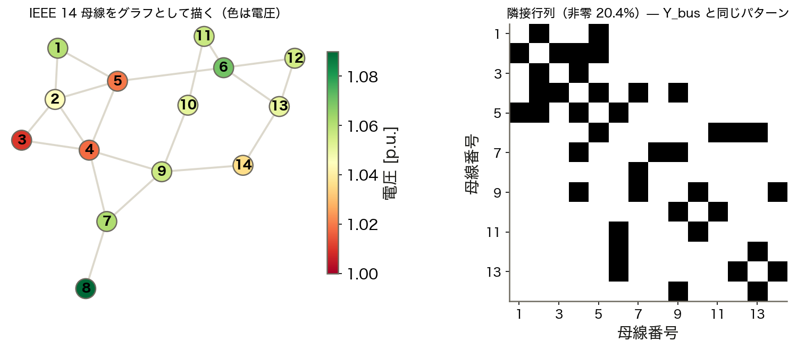
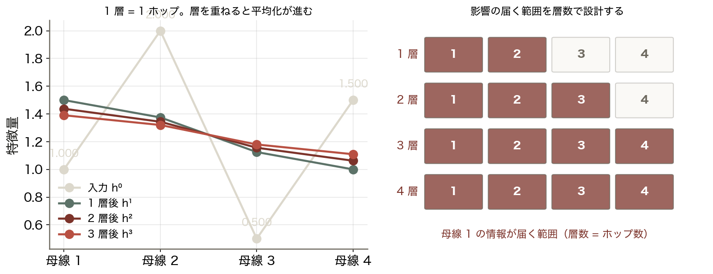
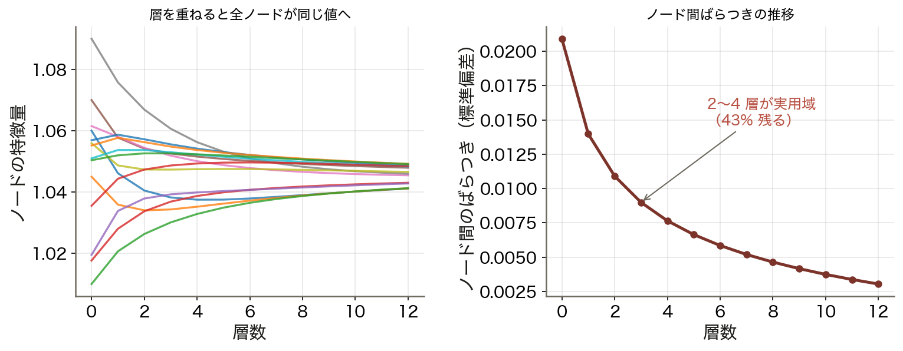
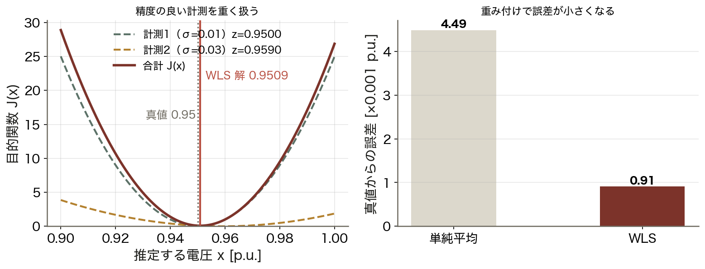
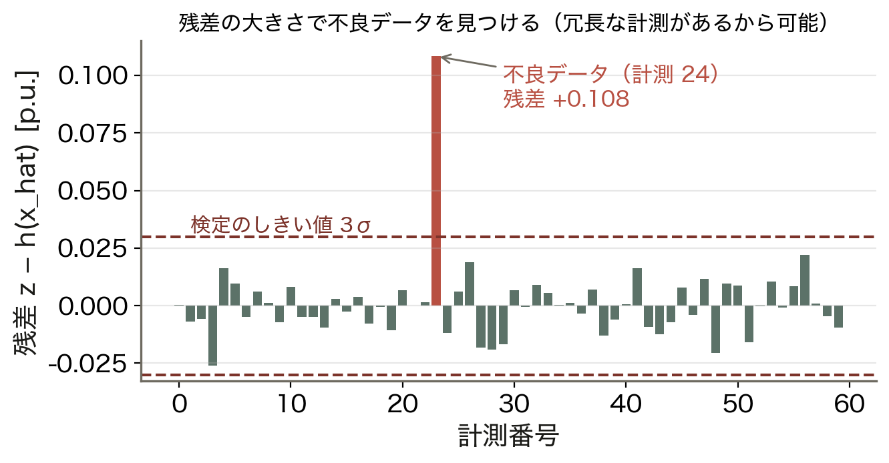
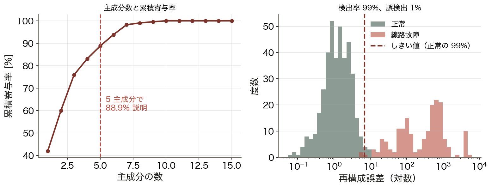
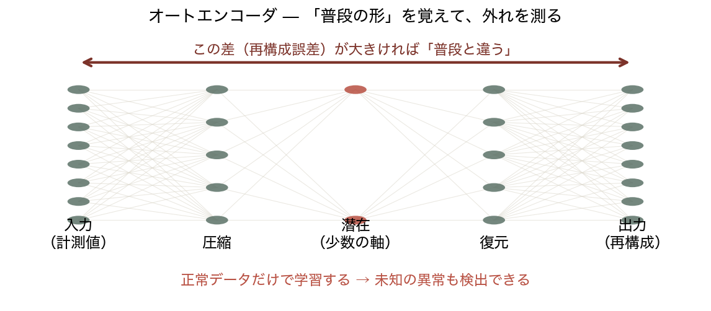
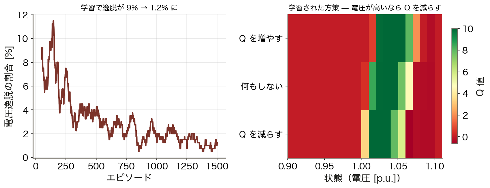
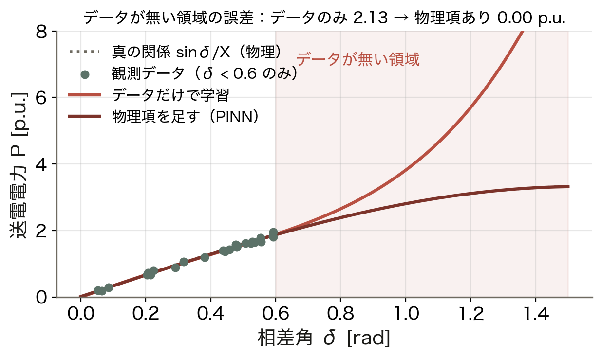
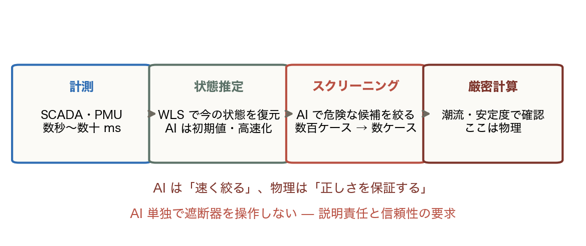

# 第13回: AI を用いた電力系統解析

**Day 4 / コマ13** ｜ 電力エネルギーシステム解析の基礎と応用

> **教科書対応**: 本講義の独自部分（教科書の範囲外）。
> ただし内容は第4〜7回（潮流計算・安定度計算）を土台にしている。
> **AI は物理を置き換えるのではなく、物理計算を高速化・補完する**という視点で扱う。

> **🖥 動くインフォグラフ**：[`viz/ai.html`](../viz/ai.html) — PCA 異常検知と Q 学習による電圧制御。
> ブラウザで「次へ ▶」を押しながら、この回の核心を実計算で追えます（`index.html` から全回に飛べます）。


<!-- intuition:start（tools/sync-intuition.mjs が スライド/ch13.md から生成。直接編集せずスライドを直す）-->
> **✍ 演習**：[`ex/ch13.html`](../ex/ch13.html) — 学籍番号ごとに数値が変わる問題。採点・途中式つき。
> **📊 スライド**：`スライド/ch13.pptx`（講義用）

---

## まず直感で（3 分でつかむ）

> **📌 一言でいうと**：電力系統は母線と線路のグラフ。AI は隣の情報を集めて学び、普段からの距離で異常を測る。ただし物理は捨てない。

> **🪄 たとえ話：噂・健康診断・自転車**
>
> | 日常 | AI × 系統 |
> |:--|:--|
> | **噂**：隣人の話を聞いて考えを更新 | **GNN**：隣接母線の特徴を集約 |
> | 1 回で隣、2 回で隣の隣まで届く | 1 層 = 1 ホップ。層数がホップ数 |
> | **健康診断**：普段の範囲から外れたら警告 | **異常検知**：正常だけ学び、距離で検出 |
> | **自転車**：転んで（罰）バランスを覚える | **強化学習**：報酬で制御則を学ぶ |
> | 物理の先生がいれば早く上達 | **PINN**：損失に潮流方程式を入れる |
>
> 崩れる点：噂は誇張されるが、GNN の集約は平均化して薄まる。層を重ねすぎると全ノードが同じ値になる。

> **📰 事例：2015年12月 ウクライナ送電網へのサイバー攻撃**
> 遠隔操作で変電所の遮断器が次々に開かれ、約 22 万戸が停電した。操作そのものは「正規の手順」に見えた。**普段と違う** 操作の並びを早く見つける監視が要る、と世界が認識した事件である。

> **📰 事例：2019年 風力予測への機械学習の適用**
> Google と DeepMind は風力発電の出力を 36 時間先まで機械学習で予測し、電力の価値を約 2 割高めたと報告した。一方、状態推定は 1970 年代から EMS の中核であり、AI はその上に載る道具である。

> **🤔 この回の式で読むと**：「AI で何ができるか」より「系統のどの仕事に、どう嵌めるか」を今日は見る。

> **🤔 なぜ「正常」を学ぶのか**
> 事故のデータは希少で、未知の故障は学習できない。正常だけを学び、そこからの距離で検出すれば、見たことのない異常も拾える。

> **🤔 なぜ物理を捨てないのか**
> 電力系統には確立した物理モデルがある。PINN は損失に方程式の残差を足し、データが薄い領域でも物理に沿った答えを出す。純データ駆動は学習範囲の外で崩れる。

> **⚠ 実務の型**
> AI でスクリーニング → 厳密計算で確認。AI 単独で遮断器は操作しない。

**この回の地図**：Ⅰ 系統はグラフ — GNN の集約と、その限界 → Ⅱ 状態推定 — 今どうなっているかを計測から復元する → Ⅲ 異常検知 — 正常を学び、距離で測る → Ⅳ 強化学習と PINN、そして実務での使いどころ

<!-- intuition:end -->
---

## 13.1 導入

### 学習目標

1. 電力系統が**グラフ構造**であることを踏まえ、**GNN** の枠組みを説明できる。
2. **状態推定**の定式化を理解し、AI による高速化の意義を説明できる。
3. 深層学習による**異常検知・故障診断**の手法を説明できる。
4. **強化学習**の枠組みを電力系統制御に対応づけられる。
5. **物理法則を組み込んだ学習**（PINN・物理制約付き学習）の必要性を論じられる。
6. AI を系統運用に適用する際の**信頼性・説明性の要求**を論じられる。

### 前提知識（第4〜7回・第12回との接続）

第12回まで、AI は**予測**（時系列の外挿）に使ってきた。
本回では**系統解析そのもの**に適用する。

| 従来手法 | 課題 | AI による解決 |
|:---|:---|:---|
| 潮流計算（第5回、NR 法） | 反復計算。大量ケースだと重い | **学習済みモデルで一発推論** |
| 状態推定（本回） | 反復・計測欠損に弱い | GNN で頑健化 |
| 安定度計算（第7回、時間積分） | 数値積分が非常に重い | 分類器で安定/不安定を判定 |
| 保護・診断 | ルールベースで網羅が難しい | 異常検知で未知の故障も検出 |
| 電圧無効電力制御（第6回 VQC） | ルールと最適化の設計が難しい | 強化学習で方策を獲得 |

**重要な前提**: これらはすべて**物理モデルが既にある**問題である。
AI の役割は物理を置き換えることではなく、**物理計算のコストを下げる**ことにある。

---

## 13.2 理論

### 13.2.1 なぜ電力系統に GNN なのか

第2回・第4回で見たとおり、電力系統は

- **ノード**（母線）= 発電機・負荷・変電所
- **エッジ**（ブランチ）= 送電線・変圧器

からなる**グラフ**である。$\mathbf{Y}_\text{bus}$ はまさにグラフの隣接構造そのものだった。

**通常のニューラルネット（MLP）の問題**:

| 問題 | 内容 |
|:---|:---|
| 入力の順序に依存 | 母線に番号を振り直すと別の入力になってしまう |
| トポロジー変化に対応できない | 線路 1 本が開放されただけで再学習が必要 |
| 系統規模が変わると使えない | 14 母線で学習したモデルは 118 母線に使えない |

**GNN（Graph Neural Network）の考え方**: 各ノードが**近傍のノードと情報をやり取り**しながら
自分の状態表現を更新する（**メッセージパッシング**）。

$$\boxed{\mathbf{h}_i^{(l+1)} = \sigma\left(\mathbf{W}_\text{self}\mathbf{h}_i^{(l)}
+ \sum_{j\in\mathcal{N}(i)}\mathbf{W}_\text{nb}\,\mathbf{h}_j^{(l)}\,e_{ij}\right)}$$

$\mathcal{N}(i)$ は母線 $i$ に隣接する母線の集合、$e_{ij}$ はエッジの特徴（線路アドミタンス）。

**この式が潮流計算に似ていることに注目せよ**。第4回の電力方程式は

$$P_i = V_i\sum_{j\in\mathcal{N}(i)} V_j(G_{ij}\cos\theta_{ij}+B_{ij}\sin\theta_{ij})$$

**どちらも「自分の量は隣接ノードからの寄与の和で決まる」という構造**を持つ。
GNN が電力系統に適合する根本的な理由がこれである。

**GNN の利点**:

| 利点 | 内容 |
|:---|:---|
| **順序不変性** | 母線の番号付けによらない |
| **トポロジーを入力にできる** | 線路開放（N-1）を自然に扱える |
| **規模への汎化** | 小さい系統で学習し大きい系統に適用できる（部分的に） |
| **パラメータ共有** | 全ノードで同じ重みを使うので効率的 |

**層数の意味**: $L$ 層の GNN では、各ノードは**$L$ ホップ先まで**の情報を集める。
電力系統では 2〜4 層程度が適切とされる。深すぎると
**過平滑化（over-smoothing）**で全ノードの表現が似てしまう。

<!-- fig:ch13_graph.png -->

*図 13.1　IEEE 14 母線をグラフとして描いたもの（左、色は電圧）と隣接行列（右）。14 母線・20 枝で隣接行列の非零は 20.4%。第4回で組んだ Y_bus と同じ疎なパターンになる。*
<!-- /fig -->

<!-- fig:ch13_gnn.png -->

*図 13.2　GNN の集約を 4 母線の直線グラフで実際に計算したもの。1 層で隣、2 層で隣の隣まで情報が届く。層数がそのまま情報の到達ホップ数になる。*
<!-- /fig -->

<!-- fig:ch13_oversmooth.png -->

*図 13.3　過平滑化。層を重ねるほど全ノードの値が近づき、4 層でノード間のばらつきは 43% に減る。GNN では「深いほど良い」が成り立たず、実用は 2〜4 層である。*
<!-- /fig -->

### 13.2.2 状態推定と AI

**状態推定（State Estimation）**とは、
計測値（電力・電流・電圧の測定値、ノイズを含む）から
**系統の真の状態**（各母線の $V_i, \theta_i$）を推定する問題である。

第4〜6回の潮流計算との違い:

| | 潮流計算 | 状態推定 |
|:---|:---|:---|
| 入力 | 指定値（$P^\text{sch}, Q^\text{sch}, V$） | **ノイズを含む計測値**（冗長） |
| 方程式の数 | 未知数と同数 | **未知数より多い**（過決定） |
| 解き方 | 非線形連立方程式 | **重み付き最小二乗（WLS）** |
| 目的 | 「こう運転したらどうなるか」 | 「**今どうなっているか**」 |

**WLS の定式化**:

$$\min_{\mathbf{x}}\ J(\mathbf{x}) = \sum_{k=1}^{m}\frac{[z_k - h_k(\mathbf{x})]^2}{\sigma_k^2}
= [\mathbf{z}-\mathbf{h}(\mathbf{x})]^T\mathbf{R}^{-1}[\mathbf{z}-\mathbf{h}(\mathbf{x})]$$

$\mathbf{z}$ は計測ベクトル、$\mathbf{h}$ は計測関数（潮流方程式）、
$\mathbf{R}$ は計測誤差の共分散行列。

反復解法（ガウス・ニュートン法）:

$$\mathbf{x}^{(\nu+1)} = \mathbf{x}^{(\nu)}
+ (\mathbf{H}^T\mathbf{R}^{-1}\mathbf{H})^{-1}\mathbf{H}^T\mathbf{R}^{-1}[\mathbf{z}-\mathbf{h}(\mathbf{x}^{(\nu)})]$$

$\mathbf{H} = \partial\mathbf{h}/\partial\mathbf{x}$ は第5回のヤコビアンと同じ構造である。

**不良データ検出**: 残差 $r_k = z_k - h_k(\hat{\mathbf{x}})$ が大きい計測は
故障したセンサの可能性がある。正規化残差で検定する。

**AI を使う動機**:

| 課題 | AI による対応 |
|:---|:---|
| 反復計算が遅い（リアルタイム性） | 学習済み GNN で**一発推論**（ミリ秒） |
| 計測が欠損すると解けないことがある | 学習により**欠損に頑健** |
| 不良データの識別が難しい | 異常検知と統合 |
| 配電系統は計測点が極端に少ない | 少数計測からの推定（**擬似計測の生成**） |

> **PMU（Phasor Measurement Unit）**: GPS 同期により**位相角を直接測定**できる装置。
> 従来の SCADA（数秒周期）に対し、PMU は 1 秒間に 30〜60 回サンプリングする。
> PMU が普及すると状態推定が線形問題になり、
> **広域監視（WAMS）**による動的な系統監視が可能になる。
> AI との相性も良い（データ量が多い）。

<!-- fig:ch13_state_estimation.png -->

*図 13.4　加重最小二乗（WLS）の考え方。精度の良い計測（σ = 0.01）を重く扱うことで、単純平均 0.9545 に対して推定値 0.9509 と、真値 0.95 への誤差が約 4 分の 1 になる。*
<!-- /fig -->

<!-- fig:ch13_bad_data.png -->

*図 13.5　不良データの検出。冗長な計測があるため推定値との残差が計算でき、3σ を超えた計測を除いて再推定できる。状態推定は「推定」だけでなく「計測の検品」も担う。*
<!-- /fig -->

### 13.2.3 深層学習による異常検知・故障診断

**異常検知の 3 つのアプローチ**:

| 方式 | 学習データ | 原理 | 適する場面 |
|:---|:---|:---|:---|
| **教師あり分類** | 正常＋異常（ラベル付き） | 分類器を学習 | 既知の故障種別の判別 |
| **オートエンコーダ** | **正常のみ** | 再構成誤差が大きい＝異常 | **未知の異常の検出** |
| **予測残差** | 正常のみ | 予測と実測の乖離を見る | 時系列の異常 |

**なぜオートエンコーダが有効か**: 電力系統では

- **異常（事故）のデータが圧倒的に少ない**（不均衡データ）
- **未知の故障モード**が起こりうる

そこで**正常データだけ**で「正常とはどういうものか」を学習し、
それから外れたものを異常とする。

$$\text{異常スコア} = \|\mathbf{x} - \text{Decoder}(\text{Encoder}(\mathbf{x}))\|^2$$

**故障診断のタスク**:

| タスク | 内容 |
|:---|:---|
| **故障検出** | 事故が起きたか（0/1） |
| **故障分類** | 三相短絡・二相短絡・一線地絡・断線のどれか |
| **故障標定** | どの線路の、どの地点か |
| **故障除去の判断** | どの遮断器を開くべきか |

**必要な速さ**: 第7回で見たとおり、臨界故障除去時間 $t_\text{cr}$ は 0.15〜0.4 秒。
再エネ導入で $H$ が下がるとさらに短くなる。
したがって**検出から判断まで数十ミリ秒**で行う必要がある。

$$\boxed{\text{AI の推論速度が保護リレーの要求に応えられるかが実用化の鍵}}$$

<!-- fig:ch13_pca.png -->

*図 13.6　PCA による異常検知。正常時の潮流パターンだけを学習し、再構成誤差で線路故障を検出する。検出率 99%、誤検出 1%。事故データを 1 つも学習していない点が重要である。*
<!-- /fig -->

<!-- fig:ch13_autoencoder.png -->

*図 13.7　オートエンコーダによる異常検知。中央の層で情報を絞り、復元した結果との差（再構成誤差）を測る。正常データだけで学習するため、未知の異常も検出できる。*
<!-- /fig -->

### 13.2.4 強化学習による系統制御

**強化学習（RL）の枠組み**を電力系統に対応づける。

| RL の要素 | 電力系統での対応 |
|:---|:---|
| **状態** $s_t$ | 母線電圧、線路潮流、発電機出力、需要、再エネ出力 |
| **行動** $a_t$ | 発電機出力の変更、調相設備の入切、タップ変更、線路の開閉 |
| **報酬** $r_t$ | −（運転コスト＋電圧逸脱ペナルティ＋過負荷ペナルティ） |
| **方策** $\pi(a|s)$ | 制御ルール（学習で獲得する） |
| **環境** | **潮流計算（第6回の pandapower）** |

目的は累積報酬の最大化である。

$$\max_{\pi}\ \mathbb{E}\left[\sum_{t=0}^{\infty}\gamma^t r_t\right]$$

**適用例**:

| 問題 | 内容 | 従来手法 |
|:---|:---|:---|
| **電圧無効電力制御（VQC）** | 調相設備・タップの操作 | ルールベース（第6回 6.2.6 節） |
| **系統復旧** | 停電後の復旧手順の決定 | 運用員の経験 |
| **混雑管理** | 過負荷回避のための出力調整 | 最適化（第14回） |
| **需給運用** | 蓄電池の充放電計画 | 動的計画法 |

**強化学習の利点と課題**:

| 利点 | 課題 |
|:---|:---|
| 明示的なモデルなしに方策を獲得できる | **学習に膨大な試行が必要** |
| 非線形・離散的な行動を扱える | **安全性の保証がない**（学習中に危険な行動を取る） |
| 逐次的な意思決定に適する | 報酬設計が難しい |
| リアルタイムで判断できる | 学習した状況以外での挙動が不明 |

> **安全性が決定的な障害**: 実系統で試行錯誤することは**絶対にできない**。
> 停電させながら学習するわけにはいかない。
> したがって
> 1. **シミュレータ上で学習**する（pandapower 等）
> 2. **安全層（safety layer）**を設け、制約違反する行動を実行前に却下する
> 3. 実運用は**推薦にとどめ、最終判断は人間**が行う
>
> という段階的な適用が現実的である。

<!-- fig:ch13_rl.png -->

*図 13.8　Q 学習による電圧制御。状態を電圧、行動を無効電力の増減、報酬を範囲内かどうかで与えると、学習によって電圧逸脱の割合が 9% から 1.2% に下がり、「電圧が高いなら Q を減らす」方策が獲得される。*
<!-- /fig -->

### 13.2.5 物理を組み込んだ学習

純粋なデータ駆動には次の弱点がある。

- 学習範囲外で**物理法則を破る**予測を出す（第12回の外挿問題）
- 学習データが大量に必要
- 予測の妥当性を検証しにくい

**物理情報ニューラルネットワーク（PINN）**: 損失関数に**物理方程式の残差**を加える。

$$\mathcal{L} = \underbrace{\mathcal{L}_\text{data}}_{\text{データとの誤差}}
+ \lambda\underbrace{\mathcal{L}_\text{physics}}_{\text{物理方程式の残差}}$$

潮流問題なら、第4回の電力方程式の残差そのものを使える。

$$\mathcal{L}_\text{physics} = \sum_i\left[\left(P_i^\text{sch} - P_i(\hat{\mathbf{V}},\hat{\boldsymbol\theta})\right)^2
+ \left(Q_i^\text{sch} - Q_i(\hat{\mathbf{V}},\hat{\boldsymbol\theta})\right)^2\right]$$

**効果**:

| 効果 | 内容 |
|:---|:---|
| **物理的に妥当な解** | キルヒホッフ則を（近似的に）満たす |
| **少ないデータで学習可能** | 物理が正則化として働く |
| **汎化性能の向上** | 学習範囲外でも大きく外れにくい |
| **検証可能性** | 物理残差を見れば信頼度が分かる |

**その他の物理組み込み手法**:

- **ハード制約**: ネットワークの出力層で制約を強制（例: 出力を $[V^\text{min}, V^\text{max}]$ に写像）
- **物理層の埋め込み**: 微分可能な潮流計算をネットワークの一部に組み込む
- **残差学習**: 物理モデルの誤差だけを AI が学習する（$y = f_\text{physics}(x) + f_\text{NN}(x)$）

> **本講義の立場**: 電力系統には**確立された物理モデル**がある。
> 画像認識や自然言語と違い、ゼロから学ぶ必要はない。
> **物理を捨ててデータだけで学ぶのは、持っている情報を捨てる愚行**である。
> AI は物理の代替ではなく、**物理計算の高速化と、物理でモデル化しきれない部分の補完**に使うべきである。

<!-- fig:ch13_pinn.png -->

*図 13.9　物理を損失に組み込んだ学習（PINN）。観測が δ < 0.6 の範囲にしかないとき、データのみで学習したモデルは外側で大きく外れる（平均誤差 2.13）が、潮流の式を損失に足すとほぼ真値どおりになる。*
<!-- /fig -->

### 13.2.6 再エネ大量導入時代における AI の役割

第7〜9回で見たとおり、再エネ導入により系統は次のように変化する。

| 変化 | AI への要求 |
|:---|:---|
| 慣性低下（$H_\text{sys}$↓）→ 現象が速い | **より高速な判断**（ミリ秒） |
| 変動性の増大 | 不確実性を扱う（確率予測、第12回） |
| 潮流方向が双方向に | 従来の運用ルールが通用しない → 学習で対応 |
| 分散電源が多数 | **分散制御**（マルチエージェント） |
| 状態が刻々と変わる | オンライン適応 |

**沖縄のような独立系統では特に切実**である。
本土なら連系線で応援を受けられるが（第8回）、沖縄にはそれがない。
**限られた設備で最大限の再エネを受け入れる**ために、
高度な予測と制御が求められる。

<!-- fig:ch13_pipeline.png -->

*図 13.10　実務での AI の使いどころ。計測 → 状態推定 → AI によるスクリーニング → 厳密計算という 2 段構えで、速さは AI が、正しさは物理が担う。AI 単独で遮断器を操作することはない。*
<!-- /fig -->

---

## 13.3 シミュレーション

### 13.3.1 GNN による潮流計算の代理モデル

```python
"""第13回 デモ1: GNN で潮流計算を高速化する"""
import numpy as np
import torch
import torch.nn as nn
import pandapower as pp
import pandapower.networks as pn
import time

torch.manual_seed(42)
np.random.seed(42)
DEVICE = "cuda" if torch.cuda.is_available() else "cpu"

# ============ 学習データの生成（潮流計算を大量に実行）============
def generate_dataset(n_samples=3000):
    base = pn.case14()
    p0, q0 = base.load.p_mw.values.copy(), base.load.q_mvar.values.copy()
    X_list, Y_list, ok = [], [], 0
    for _ in range(n_samples):
        net = pn.case14()
        scale = np.random.uniform(0.6, 1.35, len(p0))    # 負荷をランダムに変動
        net.load.p_mw   = p0*scale
        net.load.q_mvar = q0*scale
        try:
            pp.runpp(net)
        except pp.LoadflowNotConverged:
            continue
        # 入力: 各母線の注入電力（P, Q）
        n_bus = len(net.bus)
        P = np.zeros(n_bus); Q = np.zeros(n_bus)
        for _, r in net.load.iterrows():
            P[int(r.bus)] -= r.p_mw;  Q[int(r.bus)] -= r.q_mvar
        for _, r in net.gen.iterrows():
            P[int(r.bus)] += r.p_mw
        X_list.append(np.c_[P/100, Q/100])
        # 出力: 各母線の電圧と位相角
        Y_list.append(np.c_[net.res_bus.vm_pu.values,
                            np.deg2rad(net.res_bus.va_degree.values)])
        ok += 1
    print(f"生成成功: {ok}/{n_samples} ケース")
    return np.array(X_list, dtype=np.float32), np.array(Y_list, dtype=np.float32)

print("学習データ生成中（潮流計算を大量実行）...")
t0 = time.time()
X, Y = generate_dataset(3000)
print(f"生成時間: {time.time()-t0:.1f} 秒, 形状 X={X.shape}, Y={Y.shape}")

# ============ 隣接行列（グラフ構造）============
net0 = pn.case14()
n_bus = len(net0.bus)
A = np.zeros((n_bus, n_bus), dtype=np.float32)
for _, r in net0.line.iterrows():
    i, j = int(r.from_bus), int(r.to_bus); A[i,j] = A[j,i] = 1
for _, r in net0.trafo.iterrows():
    i, j = int(r.hv_bus), int(r.lv_bus);   A[i,j] = A[j,i] = 1
A = A + np.eye(n_bus, dtype=np.float32)          # 自己ループ
D = np.diag(1.0/np.sqrt(A.sum(1)))
A_hat = torch.tensor(D @ A @ D).to(DEVICE)       # 対称正規化
print(f"グラフ: {n_bus} ノード, 平均次数 {A.sum(1).mean()-1:.2f}")

# ============ GNN モデル ============
class GCNLayer(nn.Module):
    def __init__(self, din, dout):
        super().__init__()
        self.lin = nn.Linear(din, dout)
    def forward(self, x, A_hat):
        return self.lin(A_hat @ x)               # メッセージパッシング

class PowerFlowGNN(nn.Module):
    def __init__(self, din=2, hid=96, dout=2, layers=4):
        super().__init__()
        self.inp = nn.Linear(din, hid)
        self.gcn = nn.ModuleList([GCNLayer(hid, hid) for _ in range(layers)])
        self.norm = nn.ModuleList([nn.LayerNorm(hid) for _ in range(layers)])
        self.out = nn.Sequential(nn.Linear(hid, 64), nn.ReLU(), nn.Linear(64, dout))
    def forward(self, x, A_hat):
        h = torch.relu(self.inp(x))
        for gcn, norm in zip(self.gcn, self.norm):
            h = h + torch.relu(norm(gcn(h, A_hat)))   # 残差接続
        return self.out(h)

# ============ 学習 ============
n_tr = int(len(X)*0.8)
Xtr = torch.tensor(X[:n_tr]).to(DEVICE); Ytr = torch.tensor(Y[:n_tr]).to(DEVICE)
Xte = torch.tensor(X[n_tr:]).to(DEVICE); Yte = torch.tensor(Y[n_tr:]).to(DEVICE)

model = PowerFlowGNN().to(DEVICE)
opt = torch.optim.Adam(model.parameters(), lr=2e-3)
sched = torch.optim.lr_scheduler.CosineAnnealingLR(opt, T_max=300)
lossf = nn.MSELoss()

print("\nGNN 学習中...")
for ep in range(300):
    model.train(); perm = torch.randperm(len(Xtr))
    tot = 0.0
    for i in range(0, len(Xtr), 64):
        idx = perm[i:i+64]
        opt.zero_grad()
        loss = lossf(model(Xtr[idx], A_hat), Ytr[idx])
        loss.backward(); opt.step()
        tot += loss.item()*len(idx)
    sched.step()
    if (ep+1) % 50 == 0:
        model.eval()
        with torch.no_grad():
            te = lossf(model(Xte, A_hat), Yte).item()
        print(f"  epoch {ep+1:3d}  train={tot/len(Xtr):.6f}  test={te:.6f}")

# ============ 精度と速度の評価 ============
model.eval()
with torch.no_grad():
    pred = model(Xte, A_hat).cpu().numpy()
true = Yte.cpu().numpy()

print("\n=== 精度 ===")
v_mae = np.mean(np.abs(pred[:,:,0]-true[:,:,0]))
v_max = np.max(np.abs(pred[:,:,0]-true[:,:,0]))
a_mae = np.mean(np.abs(np.rad2deg(pred[:,:,1]-true[:,:,1])))
print(f"電圧 |V|  : MAE = {v_mae:.5f} p.u.,  最大誤差 = {v_max:.5f} p.u.")
print(f"位相角 θ  : MAE = {a_mae:.4f} deg")

print("\n=== 速度比較 ===")
t0 = time.time()
for _ in range(50):
    net = pn.case14(); pp.runpp(net)
t_pp = (time.time()-t0)/50*1000

with torch.no_grad():
    t0 = time.time()
    for _ in range(50):
        _ = model(Xte[:1], A_hat)
    t_gnn = (time.time()-t0)/50*1000

print(f"pandapower（NR法）: {t_pp:8.3f} ms/ケース")
print(f"GNN 推論          : {t_gnn:8.3f} ms/ケース")
print(f"高速化倍率        : {t_pp/t_gnn:8.1f} 倍")
print("\n→ 大量ケース（N-1解析、モンテカルロ）で威力を発揮する")
```

### 13.3.2 物理制約を加えた学習（PINN 的手法）

```python
"""第13回 デモ2: 電力方程式の残差を損失に加える"""
import numpy as np
import torch
import torch.nn as nn

# Y_bus を取得
net0 = pn.case14()
pp.runpp(net0)
Ybus = np.array(net0._ppc["internal"]["Ybus"].todense())
G = torch.tensor(Ybus.real, dtype=torch.float32).to(DEVICE)
B = torch.tensor(Ybus.imag, dtype=torch.float32).to(DEVICE)

def power_mismatch(V, theta, P_sch, Q_sch):
    """第4回の電力方程式の残差（微分可能）"""
    th = theta.unsqueeze(-1) - theta.unsqueeze(-2)     # theta_ij
    Vi = V.unsqueeze(-1); Vj = V.unsqueeze(-2)
    P = (Vi*Vj*(G*torch.cos(th) + B*torch.sin(th))).sum(-1)
    Q = (Vi*Vj*(G*torch.sin(th) - B*torch.cos(th))).sum(-1)
    return P - P_sch, Q - Q_sch

class PhysicsInformedGNN(PowerFlowGNN):
    pass

model_pi = PhysicsInformedGNN().to(DEVICE)
opt = torch.optim.Adam(model_pi.parameters(), lr=2e-3)
LAMBDA = 0.15          # 物理項の重み

print("物理制約付き GNN 学習中...")
for ep in range(300):
    model_pi.train(); perm = torch.randperm(len(Xtr)); tot_d = tot_p = 0.0
    for i in range(0, len(Xtr), 64):
        idx = perm[i:i+64]
        opt.zero_grad()
        out = model_pi(Xtr[idx], A_hat)
        V, theta = out[:,:,0], out[:,:,1]
        loss_data = nn.functional.mse_loss(out, Ytr[idx])
        dP, dQ = power_mismatch(V, theta, Xtr[idx][:,:,0], Xtr[idx][:,:,1])
        loss_phys = (dP**2).mean() + (dQ**2).mean()
        (loss_data + LAMBDA*loss_phys).backward()
        opt.step()
        tot_d += loss_data.item()*len(idx); tot_p += loss_phys.item()*len(idx)
    if (ep+1) % 100 == 0:
        print(f"  epoch {ep+1:3d}  data={tot_d/len(Xtr):.6f}  physics={tot_p/len(Xtr):.6f}")

# --- 物理法則の充足度を比較 ---
print("\n=== 電力方程式の残差（物理法則をどれだけ満たすか）===")
for name, m in [("通常の GNN", model), ("物理制約付き GNN", model_pi)]:
    m.eval()
    with torch.no_grad():
        out = m(Xte, A_hat)
        dP, dQ = power_mismatch(out[:,:,0], out[:,:,1], Xte[:,:,0], Xte[:,:,1])
        resid = (dP.abs().mean() + dQ.abs().mean()).item()/2
        mae = nn.functional.l1_loss(out, Yte).item()
    print(f"{name:<20}: 予測誤差 MAE={mae:.5f}, 物理残差={resid:.5f} p.u.")
print("\n→ 物理制約を入れると、物理的に整合した解を出すようになる")
```

### 13.3.3 オートエンコーダによる異常検知

```python
"""第13回 デモ3: 正常データのみで学習し未知の異常を検出する"""
import numpy as np
import torch
import torch.nn as nn
import matplotlib.pyplot as plt

plt.rcParams['font.family'] = ['Hiragino Sans', 'Yu Gothic', 'DejaVu Sans']

def make_measurements(n_normal=2500, n_anomaly=300):
    """正常運転と異常（線路開放・過負荷・計測異常）のデータを作る"""
    base = pn.case14()
    p0, q0 = base.load.p_mw.values.copy(), base.load.q_mvar.values.copy()
    normal, anomaly, labels = [], [], []

    for _ in range(n_normal):
        net = pn.case14()
        s = np.random.uniform(0.80, 1.15, len(p0))
        net.load.p_mw, net.load.q_mvar = p0*s, q0*s
        try: pp.runpp(net)
        except pp.LoadflowNotConverged: continue
        normal.append(np.r_[net.res_bus.vm_pu.values,
                            net.res_bus.va_degree.values/50,
                            net.res_line.loading_percent.values/100])

    for k in range(n_anomaly):
        net = pn.case14()
        kind = k % 3
        if kind == 0:      # 線路開放（N-1 事故）
            s = np.random.uniform(0.85, 1.10, len(p0))
            net.load.p_mw, net.load.q_mvar = p0*s, q0*s
            net.line.at[np.random.randint(len(net.line)), "in_service"] = False
        elif kind == 1:    # 局所的な過負荷
            s = np.random.uniform(0.85, 1.05, len(p0))
            s[np.random.randint(len(p0))] *= np.random.uniform(2.2, 3.2)
            net.load.p_mw, net.load.q_mvar = p0*s, q0*s
        else:              # 計測異常はあとでノイズ注入
            s = np.random.uniform(0.85, 1.10, len(p0))
            net.load.p_mw, net.load.q_mvar = p0*s, q0*s
        try: pp.runpp(net)
        except pp.LoadflowNotConverged: continue
        v = np.r_[net.res_bus.vm_pu.values,
                  net.res_bus.va_degree.values/50,
                  net.res_line.loading_percent.values/100]
        if kind == 2:
            v[np.random.randint(len(v))] += np.random.choice([-1, 1])*0.35
        anomaly.append(v); labels.append(kind)
    return (np.array(normal, dtype=np.float32),
            np.array(anomaly, dtype=np.float32), np.array(labels))

print("計測データ生成中...")
Xn, Xa, lab = make_measurements()
print(f"正常 {len(Xn)} 件, 異常 {len(Xa)} 件, 次元 {Xn.shape[1]}")

mu, sd = Xn[:2000].mean(0), Xn[:2000].std(0) + 1e-8   # 学習データのみで正規化
Xn_s, Xa_s = (Xn-mu)/sd, (Xa-mu)/sd

class AutoEncoder(nn.Module):
    def __init__(self, d, latent=8):
        super().__init__()
        self.enc = nn.Sequential(nn.Linear(d,64), nn.ReLU(),
                                 nn.Linear(64,24), nn.ReLU(), nn.Linear(24,latent))
        self.dec = nn.Sequential(nn.Linear(latent,24), nn.ReLU(),
                                 nn.Linear(24,64), nn.ReLU(), nn.Linear(64,d))
    def forward(self, x): return self.dec(self.enc(x))

ae = AutoEncoder(Xn.shape[1]).to(DEVICE)
opt = torch.optim.Adam(ae.parameters(), lr=1e-3)
Xtr_ae = torch.tensor(Xn_s[:2000]).to(DEVICE)

print("オートエンコーダ学習中（正常データのみ）...")
for ep in range(400):
    ae.train(); opt.zero_grad()
    loss = nn.functional.mse_loss(ae(Xtr_ae), Xtr_ae)
    loss.backward(); opt.step()
    if (ep+1) % 100 == 0:
        print(f"  epoch {ep+1:3d}  loss={loss.item():.6f}")

ae.eval()
with torch.no_grad():
    def score(X):
        t = torch.tensor(X).to(DEVICE)
        return ((ae(t)-t)**2).mean(1).cpu().numpy()
    s_norm = score(Xn_s[2000:])       # 学習に使っていない正常データ
    s_anom = score(Xa_s)

thr = np.percentile(s_norm, 99)       # 正常データの99パーセンタイルを閾値に
tpr = (s_anom > thr).mean()*100
fpr = (s_norm > thr).mean()*100
print(f"\n=== 異常検知の性能 ===")
print(f"閾値               : {thr:.5f}")
print(f"検出率（TPR）      : {tpr:.1f} %")
print(f"誤警報率（FPR）    : {fpr:.1f} %")
print("\n異常種別ごとの検出率:")
for k, name in enumerate(["線路開放（N-1）", "局所過負荷", "計測異常"]):
    m = lab == k
    print(f"  {name:<16}: {(s_anom[m] > thr).mean()*100:5.1f} %")

fig, axes = plt.subplots(1, 2, figsize=(13, 4.8))
axes[0].hist(s_norm, bins=60, alpha=0.7, label="正常", density=True)
axes[0].hist(s_anom, bins=60, alpha=0.7, label="異常", density=True)
axes[0].axvline(thr, color="k", ls="--", label=f"閾値")
axes[0].set_xlabel("再構成誤差（異常スコア）"); axes[0].set_ylabel("密度")
axes[0].set_title("異常スコアの分布"); axes[0].legend(); axes[0].set_yscale("log")

from sklearn.metrics import roc_curve, auc
y_true = np.r_[np.zeros(len(s_norm)), np.ones(len(s_anom))]
fpr_c, tpr_c, _ = roc_curve(y_true, np.r_[s_norm, s_anom])
axes[1].plot(fpr_c, tpr_c, lw=2, label=f"AUC = {auc(fpr_c,tpr_c):.4f}")
axes[1].plot([0,1],[0,1],"k--", alpha=0.5)
axes[1].set_xlabel("誤警報率 FPR"); axes[1].set_ylabel("検出率 TPR")
axes[1].set_title("ROC 曲線"); axes[1].legend(); axes[1].grid(alpha=0.3)
plt.tight_layout(); plt.savefig("../図/ch13_anomaly.png", dpi=150)
```

### 13.3.4 強化学習による電圧制御

```python
"""第13回 デモ4: Q学習で調相設備の運用ルールを獲得する"""
import numpy as np
import pandapower as pp
import pandapower.networks as pn
import matplotlib.pyplot as plt

plt.rcParams['font.family'] = ['Hiragino Sans', 'Yu Gothic', 'DejaVu Sans']
rng = np.random.default_rng(0)

class VoltageControlEnv:
    """調相設備の入切で電圧を維持する環境（第6回 VQC の RL 版）"""
    ACTIONS = [-20.0, -10.0, 0.0, 10.0, 20.0]      # 無効電力の変更量 [Mvar]

    def __init__(self, bus=13):
        self.bus = bus
        self.reset()

    def reset(self):
        self.net = pn.case14()
        s = rng.uniform(0.75, 1.30, len(self.net.load))
        self.net.load.p_mw   *= s
        self.net.net_scale = s
        self.net.load.q_mvar *= s
        self.q = 0.0
        self.shunt_idx = pp.create_shunt(self.net, bus=self.bus, q_mvar=0.0)
        return self._state()

    def _solve(self):
        try:
            pp.runpp(self.net); return True
        except pp.LoadflowNotConverged:
            return False

    def _state(self):
        if not self._solve(): return None
        v = self.net.res_bus.vm_pu[self.bus]
        # 状態を離散化（電圧5区分 × 現在のQ 5区分）
        vb = int(np.clip((v - 0.94)/0.03, 0, 4))
        qb = int(np.clip((self.q + 40)/20, 0, 4))
        return vb*5 + qb

    def step(self, a):
        self.q = float(np.clip(self.q + self.ACTIONS[a], -40, 40))
        self.net.shunt.at[self.shunt_idx, "q_mvar"] = -self.q   # 符号: +で供給
        s = self._state()
        if s is None:
            return None, -100.0, True
        v = self.net.res_bus.vm_pu[self.bus]
        # 報酬: 電圧偏差＋逸脱ペナルティ＋設備使用コスト
        r = -abs(v - 1.0)*100
        if v < 0.95 or v > 1.05: r -= 40
        r -= abs(self.q)*0.04
        return s, r, False

env = VoltageControlEnv()
Q = np.zeros((25, len(env.ACTIONS)))
alpha, gamma, eps = 0.15, 0.92, 1.0
history = []

print("Q学習中...")
for ep in range(3000):
    s = env.reset()
    if s is None: continue
    total = 0.0
    for _ in range(6):
        a = rng.integers(len(env.ACTIONS)) if rng.random() < eps else int(np.argmax(Q[s]))
        s2, r, done = env.step(a)
        if s2 is None:
            Q[s,a] += alpha*(r - Q[s,a]); total += r; break
        Q[s,a] += alpha*(r + gamma*Q[s2].max() - Q[s,a])
        s, total = s2, total + r
        if done: break
    history.append(total)
    eps = max(0.03, eps*0.9985)

print(f"学習完了。最終 ε = {eps:.3f}")

# --- 学習した方策 vs 無制御 ---
def evaluate(policy, n=250):
    devs, viol = [], 0
    for _ in range(n):
        s = env.reset()
        if s is None: continue
        if policy == "rl":
            for _ in range(5):
                a = int(np.argmax(Q[s]))
                s2, _, done = env.step(a)
                if s2 is None or done: break
                s = s2
        v = env.net.res_bus.vm_pu[env.bus]
        devs.append(abs(v-1.0))
        if v < 0.95 or v > 1.05: viol += 1
    return np.mean(devs), viol/len(devs)*100

d0, v0 = evaluate("none")
d1, v1 = evaluate("rl")
print(f"\n{'方式':<16} {'平均電圧偏差':>14} {'逸脱率':>10}")
print(f"{'無制御':<16} {d0:14.5f} {v0:9.1f}%")
print(f"{'強化学習':<16} {d1:14.5f} {v1:9.1f}%")
print(f"改善: 偏差 {(1-d1/d0)*100:.1f}% 減, 逸脱率 {v0-v1:.1f} ポイント減")

fig, ax = plt.subplots(figsize=(9, 4.5))
w = 100
ax.plot(np.convolve(history, np.ones(w)/w, mode="valid"), lw=1.5)
ax.set_xlabel("エピソード"); ax.set_ylabel(f"累積報酬（{w}件移動平均）")
ax.set_title("強化学習による電圧制御の学習曲線"); ax.grid(alpha=0.3)
plt.tight_layout(); plt.savefig("../図/ch13_rl.png", dpi=150)
```

---

## 13.4 例題

### 例題 13-1（GNN の適合性）

電力系統の解析に MLP（全結合ニューラルネット）ではなく GNN を使う理由を、
3 つ挙げて説明せよ。

**解答**

**(1) 順序不変性**
MLP は入力ベクトルの順序に依存する。母線に番号を振り直すと別の入力になり、
学習した知識が使えない。GNN はグラフ構造に基づくため**番号付けによらない**。

**(2) トポロジー変化への対応**
第15回で扱う N-1 解析では線路を 1 本ずつ開放する。
MLP では系統構成が変わるたびに再学習が必要だが、
GNN は**隣接行列を変えるだけ**で対応できる。

**(3) 物理構造との整合**
第4回の電力方程式
$P_i = V_i\sum_{j\in\mathcal{N}(i)}V_j(G_{ij}\cos\theta_{ij}+B_{ij}\sin\theta_{ij})$
は「自ノードの量は**隣接ノードからの寄与の和**」という形をしている。
GNN のメッセージパッシング
$\mathbf{h}_i^{(l+1)} = \sigma(\mathbf{W}_s\mathbf{h}_i^{(l)}+\sum_{j\in\mathcal{N}(i)}\mathbf{W}_n\mathbf{h}_j^{(l)})$
と**構造が一致する**。物理と整合した帰納バイアスを持つ。

### 例題 13-2（AI 潮流計算の使いどころ）

GNN による潮流計算の代理モデルが、
NR 法の 200 倍高速で、電圧の最大誤差が 0.003 p.u. であった。

1. この誤差は実用上許容できるか。
2. この代理モデルを使うべき場面と、使うべきでない場面を挙げよ。

**解答**

**(1)** 場面による。

電圧の運用範囲は 0.95〜1.05 p.u.（幅 0.10）である。
誤差 0.003 p.u. は幅の **3%** にあたる。

- **スクリーニング用途**: 十分許容できる。多数ケースから危険なケースを絞り込む目的なら問題ない
- **最終的な判断**: 電圧が 1.048 p.u. と予測されたとき、真値は 1.045〜1.051 で、
  **上限 1.05 を超えるかどうかが判定できない**。この用途では不十分

**(2)**

| 使うべき場面 | 理由 |
|:---|:---|
| **N-1 事故解析の一次スクリーニング**（第15回） | 数千ケースから危険な数十ケースに絞る |
| モンテカルロ・確率的解析 | 数万回の試行が必要 |
| 最適化の内部ループ（第14回） | 繰り返し潮流計算を呼ぶ |
| リアルタイム監視の概況把握 | 速度が最優先 |

| 使うべきでない場面 | 理由 |
|:---|:---|
| **最終的な設備計画の判断** | 誤差が投資判断を左右する |
| 保護整定の決定 | 安全に直結する |
| 学習範囲外の運転状態 | 外挿の危険（第12回） |
| 説明責任が問われる判断 | 根拠を示せない |

**実務的な使い方**: **GNN でスクリーニング → 危険なケースだけ NR 法で厳密計算**
という 2 段階が合理的である。速度と精度の両立ができる。

### 例題 13-3（強化学習の安全性）

強化学習で系統復旧の手順を学習させたい。実系統で学習してよいか論じよ。

**解答**

**絶対に実系統で学習してはならない。**

**理由**:

1. **試行錯誤が本質**である。強化学習は「まず行動し、結果から学ぶ」。
   初期の方策はランダムに近く、**遮断器を無作為に操作する**ことになる。
2. **失敗のコストが極大**。停電の拡大、機器の損傷、最悪は人命に関わる。
3. **学習に必要な試行回数が膨大**。数万〜数百万エピソードが必要だが、
   系統復旧という事象はそもそも滅多に起きない。

**現実的なアプローチ**:

| 段階 | 内容 |
|:---|:---|
| 1. シミュレータで学習 | pandapower 等の上で数百万回試行する |
| 2. **安全層の付加** | 実行前に制約（電圧・過負荷・N-1）をチェックし、違反する行動を却下 |
| 3. **オフライン検証** | 過去の実事故データで方策を検証 |
| 4. **推薦モードでの運用** | AI は候補を提示するのみ。**実行判断は運用員** |
| 5. 限定的な自動化 | 十分な実績を積んだ範囲でのみ自動実行 |

$$\boxed{\text{シミュレータと現実のギャップ（sim-to-real gap）をどう埋めるかが最大の課題}}$$

シミュレータが現実を完全に再現できない以上、
**最終的な責任を人間が持つ設計**が現時点では必須である。

---

## 13.5 演習問題

### 基礎問題

**問 13-1** 電力系統がグラフ構造であることを、
ノード・エッジが何に対応するかを明示して説明せよ。
また $\mathbf{Y}_\text{bus}$ とグラフの隣接行列の関係を述べよ。

**問 13-2** 潮流計算と状態推定の違いを、
入力・方程式の数・解法・目的の 4 点で表にまとめよ。

**問 13-3** 異常検知にオートエンコーダを使う利点を、
電力系統の事故データの性質と関連づけて説明せよ。

**問 13-4** 強化学習の 5 要素（状態・行動・報酬・方策・環境）を、
電圧無効電力制御（第6回 VQC）の問題に対応づけて説明せよ。

**問 13-5** PINN（物理情報ニューラルネットワーク）の損失関数の構成を述べ、
純粋なデータ駆動学習に比べた利点を 3 つ挙げよ。

### 応用問題

**問 13-6** 13.3.1 節の GNN 潮流計算を実装し、以下を評価せよ。

(a) 学習データ数を 500 / 1500 / 3000 と変えたときの精度を比較せよ。
(b) GNN の層数を 1 / 2 / 4 / 8 と変えたときの精度を比較し、
   最適な層数を求めよ。層を増やしすぎると悪化する理由（過平滑化）を説明せよ。
(c) 学習時の負荷変動範囲を 0.6〜1.35 倍としたが、
   **範囲外**（0.4 倍、1.6 倍）を入力するとどうなるか。第12回の外挿問題と関連づけて論じよ。
(d) 13.3.2 節の物理制約を加えた場合、(c) の外挿性能は改善するか検証せよ。

**問 13-7** 沖縄本島系統（第6回 問6-5 で構築したモデル）を用いて、
AI による系統解析を検討せよ。

(a) 需要と太陽光出力をランダムに変動させた潮流計算データを 2000 ケース生成せよ。
(b) GNN で代理モデルを構築し、精度と速度を評価せよ。
(c) 太陽光出力が急変（雲による 50% 減）したケースを異常として、
   オートエンコーダで検出できるか検証せよ。
(d) 強化学習で、太陽光インバータの無効電力制御（第9回 Volt-Var）を学習させよ。
   報酬は「電圧偏差 + 出力抑制量」とせよ。
(e) 学習した方策を、第9回で設計した固定の Volt-Var カーブと比較せよ。
   どちらが優れているか、また実運用ではどちらを選ぶべきか論じよ。

**問 13-8** AI を電力系統の実運用に適用する際の課題を論じよ。

(a) 説明責任（explainability）が求められる理由を、
   電力が社会インフラであることと関連づけて述べよ。
(b) 学習範囲外の入力に対する挙動を保証する方法を 3 つ提案せよ。
(c) AI の判断が誤った場合の責任の所在について、あなたの考えを述べよ。
(d) 「AI は物理モデルを置き換えるべきか、補完すべきか」について、
   本講義で学んだ内容を踏まえて 400 字程度で論じよ。

---

## 13.6 まとめ

### キーポイント

- 電力系統は**グラフ**（ノード＝母線、エッジ＝ブランチ）であり、
  GNN のメッセージパッシング
  $\mathbf{h}_i^{(l+1)}=\sigma(\mathbf{W}_s\mathbf{h}_i^{(l)}+\sum_{j\in\mathcal{N}(i)}\mathbf{W}_n\mathbf{h}_j^{(l)})$
  は**第4回の電力方程式と同じ構造**を持つ。これが GNN が適合する根本理由である。
- GNN の利点は**順序不変性・トポロジー変化への対応・規模への汎化**。
  層数は 2〜4 が適切（深すぎると**過平滑化**）。
- **状態推定**は「今どうなっているか」を冗長な計測から推定する WLS 問題。
  潮流計算（「こうしたらどうなるか」）とは目的が異なる。
- **異常検知はオートエンコーダ**が有効。事故データは希少で未知の故障もあるため、
  **正常データだけで学習**し、再構成誤差で異常を判定する。
- **強化学習**は VQC・系統復旧・混雑管理に適用できるが、
  **実系統での学習は絶対に不可**。シミュレータ学習＋安全層＋人間の最終判断が必須。
- **物理を捨ててはいけない**。電力系統には確立された物理モデルがある。
  PINN のように**物理方程式の残差を損失に加える**ことで、
  少ないデータで、物理的に妥当で、外挿にも強いモデルが得られる。
- 実務的には **AI でスクリーニング → 厳密計算で確認**という 2 段階が合理的。
  AI は物理の**代替ではなく高速化と補完**である。

### 次回への橋渡し

第13回では AI による系統の**解析**（状態を知る）を扱った。
第14回では**最適化**（どう動かすべきかを決める）を扱う。

第4〜6回の潮流計算に「目的関数」と「制約」を加えたものが
**最適潮流計算（OPF）**である。これは電力系統工学の集大成であり、
経済性（第8回の ELD）と安全性（第6回の電圧、第7回の安定度）を
同時に満たす運転点を求める問題である。

そこでも AI は、OPF の高速化という形で役割を持つ。
